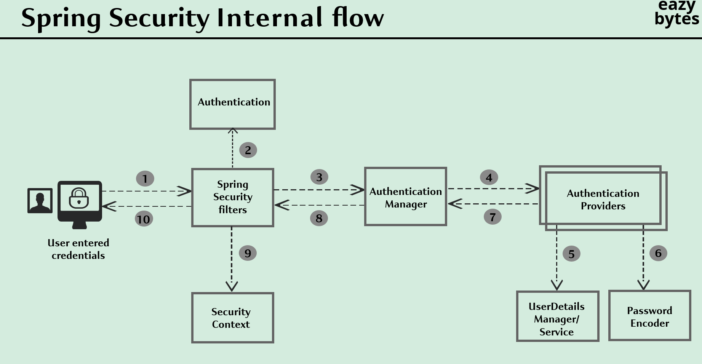
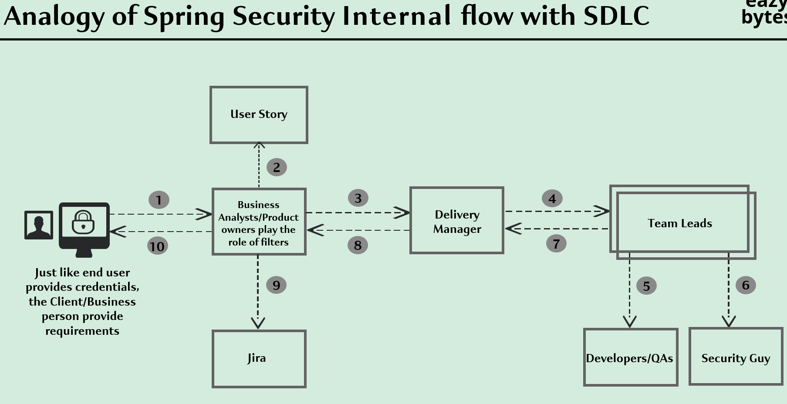
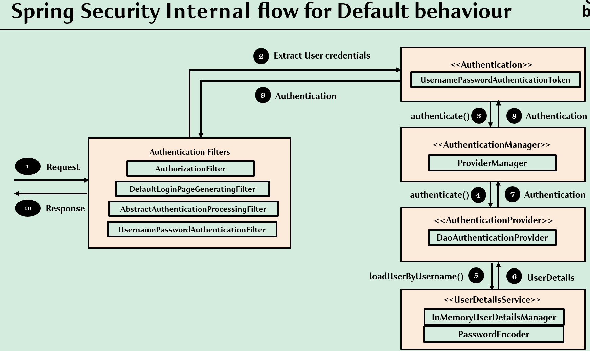
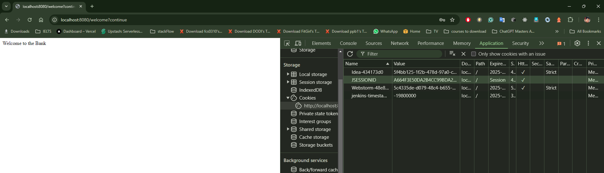

# 01 - Getting Started 


- [01 - Getting Started](#01---getting-started)
  - [001 Course Introduction](#001-course-introduction)
  - [003 Creating a simple Spring Boot app with out security - Part 1](#003-creating-a-simple-spring-boot-app-with-out-security---part-1)
    - [1. **Basic Project Information**](#1-basic-project-information)
    - [2. **Parent Project: Spring Boot Starter Parent**](#2-parent-project-spring-boot-starter-parent)
    - [3. **Project Coordinates and Metadata**](#3-project-coordinates-and-metadata)
    - [4. **Java Version**](#4-java-version)
    - [5. **Dependencies**](#5-dependencies)
      - [5.1 **Spring Boot Starter Web**](#51-spring-boot-starter-web)
      - [5.2 **Spring Boot DevTools**](#52-spring-boot-devtools)
      - [5.3 **Spring Boot Starter Test**](#53-spring-boot-starter-test)
    - [6. **Build Section**](#6-build-section)
    - [Example Use Case: A Simple Spring Boot Application](#example-use-case-a-simple-spring-boot-application)
    - [Conclusion](#conclusion)
  - [004 Creating a simple Spring Boot app with out security - Part 2](#004-creating-a-simple-spring-boot-app-with-out-security---part-2)
    - [1. **`spring.application.name=${SPRING_APP_ID:bank}`**](#1-springapplicationnamespring_app_idbank)
      - [Example:](#example)
    - [2. **`logging.pattern.console=${LOG_PATTERN_CONSOLE:%green(%d{HH:mm:ss.SSS}) %blue(%-5level) %red([%thread]) %yellow(%logger{15}) - %msg%n}`**](#2-loggingpatternconsolelog_pattern_consolegreendhhmmsssss-blue-5level-redthread-yellowlogger15---msgn)
      - [Detailed Breakdown of the Log Pattern:](#detailed-breakdown-of-the-log-pattern)
      - [Example of Console Output:](#example-of-console-output)
    - [**Why Customize the Log Pattern?**](#why-customize-the-log-pattern)
      - [Example Use Case:](#example-use-case)
    - [**Summary**](#summary)
    - [1. **Controller Class**](#1-controller-class)
    - [2. **`@GetMapping("/welcome")`**](#2-getmappingwelcome)
    - [3. **Method: `welcome()`**](#3-method-welcome)
    - [4. **How It Works in a Spring Boot Application**](#4-how-it-works-in-a-spring-boot-application)
    - [5. **Example Scenarios**](#5-example-scenarios)
      - [Example 1: Accessing the Endpoint via Web Browser](#example-1-accessing-the-endpoint-via-web-browser)
      - [Example 2: Accessing the Endpoint via cURL (Command Line)](#example-2-accessing-the-endpoint-via-curl-command-line)
      - [Example 3: Using Postman to Access the Endpoint](#example-3-using-postman-to-access-the-endpoint)
    - [6. **How Spring Boot Handles the Request**](#6-how-spring-boot-handles-the-request)
    - [7. **Expanding the Example: JSON Response**](#7-expanding-the-example-json-response)
    - [8. **Securing the Endpoint**](#8-securing-the-endpoint)
    - [Conclusion](#conclusion-1)
  - [005 Securing Spring Boot basic app using Spring Security \& static credentials](#005-securing-spring-boot-basic-app-using-spring-security--static-credentials)
    - [1. **Spring Boot Security Dependency**](#1-spring-boot-security-dependency)
      - [**Purpose**](#purpose)
      - [**Example Use Cases**](#example-use-cases)
        - [1. **Securing Endpoints**](#1-securing-endpoints)
        - [2. **Customizing Security Configurations**](#2-customizing-security-configurations)
    - [2. **Spring Security Test Dependency**](#2-spring-security-test-dependency)
      - [**Purpose**](#purpose-1)
      - [**Example Use Cases**](#example-use-cases-1)
        - [1. **Testing with `@WithMockUser`**](#1-testing-with-withmockuser)
        - [2. **Testing JWT Authentication**](#2-testing-jwt-authentication)
    - [**Summary**](#summary-1)
    - [**1. `@ConfigurationProperties(prefix = "spring.security")` Annotation**](#1-configurationpropertiesprefix--springsecurity-annotation)
    - [**2. Default Constants in the Class**](#2-default-constants-in-the-class)
    - [**3. `Filter` Inner Class**](#3-filter-inner-class)
      - [**Key Properties**:](#key-properties)
      - [**Example Configuration**:](#example-configuration)
    - [**4. `User` Inner Class**](#4-user-inner-class)
      - [**Key Properties**:](#key-properties-1)
      - [**Password Behavior**:](#password-behavior)
      - [**Example Configuration**:](#example-configuration-1)
      - [**Default Behavior**:](#default-behavior)
    - [**5. Methods and Getters**](#5-methods-and-getters)
      - [**Password Generation Logic**:](#password-generation-logic)
      - [**Example Programmatic Use**:](#example-programmatic-use)
    - [**6. How It Works in Spring Boot**](#6-how-it-works-in-spring-boot)
    - [**Summary**](#summary-2)
    - [Breakdown of Each Property:](#breakdown-of-each-property)
    - [**Use Case and Benefits**](#use-case-and-benefits)
    - [**How Environment Variables Work with Spring Boot**](#how-environment-variables-work-with-spring-boot)
    - [**Examples**](#examples)
      - [1. **Basic Example of Configuring Username and Password**](#1-basic-example-of-configuring-username-and-password)
      - [2. **Setting Environment Variables in Docker**](#2-setting-environment-variables-in-docker)
      - [3. **Providing Default Values in Case Environment Variables are Not Set**](#3-providing-default-values-in-case-environment-variables-are-not-set)
    - [**Advanced Use Cases**](#advanced-use-cases)
      - [1. **Kubernetes Secrets**](#1-kubernetes-secrets)
      - [2. **Using Profiles for Different Environments**](#2-using-profiles-for-different-environments)
    - [**Summary**](#summary-3)
  - [006 Funny memes on Security](#006-funny-memes-on-security)
    - [**1. Why We Need Security**](#1-why-we-need-security)
      - [Key Reasons We Need Security:](#key-reasons-we-need-security)
    - [**2. Types of Security**](#2-types-of-security)
    - [**3. Security Principles**](#3-security-principles)
      - [**1. Defense in Depth**:](#1-defense-in-depth)
      - [**2. Least Privilege**:](#2-least-privilege)
      - [**3. Security by Design**:](#3-security-by-design)
      - [**4. Fail-Safe Defaults**:](#4-fail-safe-defaults)
      - [**5. Separation of Duties**:](#5-separation-of-duties)
    - [**4. Common Threats and Attacks**](#4-common-threats-and-attacks)
      - [**1. Malware**:](#1-malware)
      - [**2. Phishing**:](#2-phishing)
      - [**3. Man-in-the-Middle (MitM) Attack**:](#3-man-in-the-middle-mitm-attack)
      - [**4. SQL Injection**:](#4-sql-injection)
      - [**5. Denial of Service (DoS) and Distributed Denial of Service (DDoS)**:](#5-denial-of-service-dos-and-distributed-denial-of-service-ddos)
    - [**5. Examples of Security in Action**](#5-examples-of-security-in-action)
      - [**Example 1: Online Banking**](#example-1-online-banking)
      - [**Example 2: E-Commerce Website**](#example-2-e-commerce-website)
    - [**Conclusion**](#conclusion-2)
  - [007 What is Security \& Why it is important](#007-what-is-security--why-it-is-important)
    - [1. **Central Metaphor: Bank as a Symbol of Security**](#1-central-metaphor-bank-as-a-symbol-of-security)
      - [Why Banks Are Used as a Metaphor for Security:](#why-banks-are-used-as-a-metaphor-for-security)
    - [2. **Symbols Representing Security Measures**](#2-symbols-representing-security-measures)
    - [3. **Supporting Text in the Image**](#3-supporting-text-in-the-image)
    - [**Real-World Examples of Security Needs**](#real-world-examples-of-security-needs)
    - [**Conclusion**](#conclusion-3)
    - [**1. Central Metaphor: Web Applications as Valuable Assets**](#1-central-metaphor-web-applications-as-valuable-assets)
      - [Why Web Applications Hold Valuable Data:](#why-web-applications-hold-valuable-data)
    - [**2. Symbols and Illustrations**](#2-symbols-and-illustrations)
      - [**Real-World Example**:](#real-world-example)
      - [**Importance of Protecting Databases**:](#importance-of-protecting-databases)
      - [**How Hackers Exploit Web Application Vulnerabilities**:](#how-hackers-exploit-web-application-vulnerabilities)
      - [**Real-World Example**:](#real-world-example-1)
    - [**3. Importance of Web Application Security**](#3-importance-of-web-application-security)
    - [**4. Key Measures to Secure Web Applications**](#4-key-measures-to-secure-web-applications)
      - [**1. Implement HTTPS (TLS/SSL)**:](#1-implement-https-tlsssl)
      - [**2. Regular Security Audits and Penetration Testing**:](#2-regular-security-audits-and-penetration-testing)
      - [**3. Use Strong Authentication Mechanisms**:](#3-use-strong-authentication-mechanisms)
      - [**4. Input Validation**:](#4-input-validation)
      - [**5. Keep Software and Libraries Updated**:](#5-keep-software-and-libraries-updated)
    - [**Conclusion**](#conclusion-4)
    - [**1. WHAT IS SECURITY?**](#1-what-is-security)
      - [**Example**:](#example-1)
    - [**2. DIFFERENT TYPES OF SECURITY**](#2-different-types-of-security)
      - [**Key Security Methods**:](#key-security-methods)
    - [**3. SECURITY IS A NON-FUNCTIONAL REQUIREMENT**](#3-security-is-a-non-functional-requirement)
      - [**Example**:](#example-2)
    - [**4. WHY IS SECURITY IMPORTANT?**](#4-why-is-security-important)
      - [**Example**:](#example-3)
    - [**5. SECURITY FROM DEV PHASE**](#5-security-from-dev-phase)
      - [**Example**:](#example-4)
    - [**6. AVOIDING MOST COMMON ATTACKS**](#6-avoiding-most-common-attacks)
      - [**Common Attacks**:](#common-attacks)
    - [**Conclusion**](#conclusion-5)
    - [**1. Cloud Environment**](#1-cloud-environment)
    - [**2. Virtual Machines**](#2-virtual-machines)
    - [**3. Operating System**](#3-operating-system)
    - [**4. Containers**](#4-containers)
    - [**5. Web/App Servers**](#5-webapp-servers)
    - [**6. Web Apps/Services**](#6-web-appsservices)
    - [**7. HTTPS**](#7-https)
    - [**Conclusion**](#conclusion-6)
    - [Why DevSecOps is Important](#why-devsecops-is-important)
    - [How DevSecOps Works](#how-devsecops-works)
      - [1. **Planning**:](#1-planning)
      - [2. **Development**:](#2-development)
      - [3. **Build**:](#3-build)
      - [4. **Testing**:](#4-testing)
      - [5. **Deployment**:](#5-deployment)
      - [6. **Operations**:](#6-operations)
      - [7. **Feedback and Improvement**:](#7-feedback-and-improvement)
    - [Key Benefits of DevSecOps](#key-benefits-of-devsecops)
    - [Tools Commonly Used in DevSecOps](#tools-commonly-used-in-devsecops)
    - [DevSecOps Example in Practice](#devsecops-example-in-practice)
    - [Conclusion](#conclusion-7)
    - [1. **Application Security is Challenging Without a Framework**](#1-application-security-is-challenging-without-a-framework)
      - [**Example**:](#example-5)
    - [2. **Spring Security is Built by Security Experts**](#2-spring-security-is-built-by-security-experts)
      - [**Example**:](#example-6)
    - [3. **Spring Security Addresses Common Vulnerabilities**](#3-spring-security-addresses-common-vulnerabilities)
      - [**Example of CSRF Protection**:](#example-of-csrf-protection)
    - [4. **Easy Security Configuration for APIs, Roles, and Permissions**](#4-easy-security-configuration-for-apis-roles-and-permissions)
      - [**Example: Securing API Endpoints**:](#example-securing-api-endpoints)
    - [5. **Built-in Support for Authentication and Standards**](#5-built-in-support-for-authentication-and-standards)
      - [**Example: Using OAuth2 for Authentication**:](#example-using-oauth2-for-authentication)
      - [**Example: Using JWT for Stateless Authentication**:](#example-using-jwt-for-stateless-authentication)
    - [**Conclusion: Why Spring Security?**](#conclusion-why-spring-security)
  - [008 Quick introduction to Servlets \& Filters](#008-quick-introduction-to-servlets--filters)
    - [**1. Typical Scenario Inside a Web Application**](#1-typical-scenario-inside-a-web-application)
      - [**Servlet Container:**](#servlet-container)
      - [**How Servlet Containers Work**:](#how-servlet-containers-work)
      - [**Example**:](#example-7)
    - [**2. Role of Servlets**](#2-role-of-servlets)
      - [**Example: Basic Servlet Code**:](#example-basic-servlet-code)
    - [**3. Role of Filters**](#3-role-of-filters)
      - [**How Filters Work**:](#how-filters-work)
      - [**Example: Logging Filter**:](#example-logging-filter)
    - [**4. Filters in Security (Spring Security)**](#4-filters-in-security-spring-security)
      - [**Spring Security Filter Chain**:](#spring-security-filter-chain)
      - [**Example: Security Filter**:](#example-security-filter)
      - [**Spring Security Filters in Action**:](#spring-security-filters-in-action)
    - [**Conclusion**](#conclusion-8)
  - [009 Introduction to Spring Security Internal flow - Theory](#009-introduction-to-spring-security-internal-flow---theory)
    - [**1. User Enters Credentials**](#1-user-enters-credentials)
      - [**Example**:](#example-8)
    - [**2. Request Passes Through Spring Security Filters**](#2-request-passes-through-spring-security-filters)
      - [**Example**:](#example-9)
    - [**3. Spring Security Filters Send the Request to the Authentication Manager**](#3-spring-security-filters-send-the-request-to-the-authentication-manager)
      - [**Example**:](#example-10)
    - [**4. Authentication Manager Delegates to Authentication Providers**](#4-authentication-manager-delegates-to-authentication-providers)
      - [**Example**:](#example-11)
    - [**5. Authentication Provider Calls UserDetailsService**](#5-authentication-provider-calls-userdetailsservice)
      - [**Example**:](#example-12)
    - [**6. Password Encoder is Used to Match Passwords**](#6-password-encoder-is-used-to-match-passwords)
      - [**Example**:](#example-13)
    - [**7. Authentication Provider Returns Authentication Object**](#7-authentication-provider-returns-authentication-object)
      - [**Example**:](#example-14)
    - [**8. Authentication Object is Sent Back to Filters**](#8-authentication-object-is-sent-back-to-filters)
    - [**9. Security Context is Updated**](#9-security-context-is-updated)
      - [**Example**:](#example-15)
    - [**10. Request Proceeds with Authenticated User**](#10-request-proceeds-with-authenticated-user)
      - [**Example**:](#example-16)
    - [**Conclusion**](#conclusion-9)
  - [010 Demo of Spring Security internal flow - Part 1](#010-demo-of-spring-security-internal-flow---part-1)
    - [**Step 1: User Tries to Access a Secure Page**](#step-1-user-tries-to-access-a-secure-page)
      - [**Example**:](#example-17)
    - [**Step 2: Filters Detect that the User is Not Logged In**](#step-2-filters-detect-that-the-user-is-not-logged-in)
      - [**Example**:](#example-18)
    - [**Step 3: User Enters Credentials**](#step-3-user-enters-credentials)
      - [**Example**:](#example-19)
    - [**Step 4: Filters Process the Credentials**](#step-4-filters-process-the-credentials)
      - [**Example**:](#example-20)
    - [**Step 5: Authentication Manager Delegates to Authentication Provider**](#step-5-authentication-manager-delegates-to-authentication-provider)
      - [**Example**:](#example-21)
    - [**Step 6: Authentication Provider Loads User Details**](#step-6-authentication-provider-loads-user-details)
      - [**Example**:](#example-22)
    - [**Step 7: Authentication Provider Returns Authentication Object**](#step-7-authentication-provider-returns-authentication-object)
      - [**Example**:](#example-23)
    - [**Step 8: Provider Manager Returns Authentication to Filters**](#step-8-provider-manager-returns-authentication-to-filters)
    - [**Step 9: Storing Authentication in Security Context**](#step-9-storing-authentication-in-security-context)
      - [**Example**:](#example-24)
    - [**Conclusion**](#conclusion-10)
    - [Explanation of the Configuration](#explanation-of-the-configuration)
    - [**Logging Levels in Spring Boot**](#logging-levels-in-spring-boot)
    - [**Effect of Setting TRACE Level for Spring Security**](#effect-of-setting-trace-level-for-spring-security)
      - [Example of TRACE Logs in Spring Security](#example-of-trace-logs-in-spring-security)
    - [**Use Cases for TRACE Logging in Spring Security**](#use-cases-for-trace-logging-in-spring-security)
    - [**How to Override the Default Value**](#how-to-override-the-default-value)
      - [Example in `application.properties`:](#example-in-applicationproperties)
      - [Example in `application.yml`:](#example-in-applicationyml)
    - [**Conclusion**](#conclusion-11)
  - [011 Demo of Spring Security internal flow - Part 2](#011-demo-of-spring-security-internal-flow---part-2)
  - [012 Sequence flow of the Spring Security default behaviour](#012-sequence-flow-of-the-spring-security-default-behaviour)
    - [**1. User Provides Credentials / Client Provides Requirements**](#1-user-provides-credentials--client-provides-requirements)
      - [**Example**:](#example-25)
    - [**2. Spring Security Filters / Business Analysts Play the Role of Filters**](#2-spring-security-filters--business-analysts-play-the-role-of-filters)
      - [**Example**:](#example-26)
    - [**3. Authentication Manager / Delivery Manager**](#3-authentication-manager--delivery-manager)
      - [**Example**:](#example-27)
    - [**4. Authentication Providers / Team Leads**](#4-authentication-providers--team-leads)
      - [**Example**:](#example-28)
    - [**5. UserDetails Manager / Developers \& QA**](#5-userdetails-manager--developers--qa)
      - [**Example**:](#example-29)
    - [**6. Password Encoder / Security Team**](#6-password-encoder--security-team)
      - [**Example**:](#example-30)
    - [**7. Returning Response to the Authentication Manager / Team Leads Reporting to Delivery Manager**](#7-returning-response-to-the-authentication-manager--team-leads-reporting-to-delivery-manager)
      - [**Example**:](#example-31)
    - [**8. Returning Result to Filters / Business Analysts or Product Owners Validating the Solution**](#8-returning-result-to-filters--business-analysts-or-product-owners-validating-the-solution)
      - [**Example**:](#example-32)
    - [**9. Writing to Security Context / Logging Requirements in Jira**](#9-writing-to-security-context--logging-requirements-in-jira)
      - [**Example**:](#example-33)
    - [**10. Request Proceeds / Final Product Delivered to Client**](#10-request-proceeds--final-product-delivered-to-client)
      - [**Example**:](#example-34)
    - [**Conclusion**](#conclusion-12)
    - [**Step 1: Incoming Request**](#step-1-incoming-request)
      - [**Example**:](#example-35)
    - [**Step 2: Extract User Credentials**](#step-2-extract-user-credentials)
      - [**Example**:](#example-36)
    - [**Step 3: Send Token to AuthenticationManager**](#step-3-send-token-to-authenticationmanager)
      - [**Example**:](#example-37)
    - [**Step 4: AuthenticationManager Delegates to AuthenticationProvider**](#step-4-authenticationmanager-delegates-to-authenticationprovider)
      - [**Example**:](#example-38)
    - [**Step 5: AuthenticationProvider Retrieves User Details**](#step-5-authenticationprovider-retrieves-user-details)
      - [**Example**:](#example-39)
    - [**Step 6: Password Validation**](#step-6-password-validation)
      - [**Example**:](#example-40)
    - [**Step 7: Return Authentication Object**](#step-7-return-authentication-object)
      - [**Example**:](#example-41)
    - [**Step 8: AuthenticationManager Returns Authentication Result**](#step-8-authenticationmanager-returns-authentication-result)
      - [**Example**:](#example-42)
    - [**Step 9: Store Authentication in SecurityContext**](#step-9-store-authentication-in-securitycontext)
      - [**Example**:](#example-43)
    - [**Step 10: Return Response to User**](#step-10-return-response-to-user)
      - [**Example**:](#example-44)
    - [**Conclusion**](#conclusion-13)
  - [013 Understanding on how multiple requests work with out credentials](#013-understanding-on-how-multiple-requests-work-with-out-credentials)


## 001 Course Introduction


## 003 Creating a simple Spring Boot app with out security - Part 1


```xml
<?xml version="1.0" encoding="UTF-8"?>
<project xmlns="http://maven.apache.org/POM/4.0.0" xmlns:xsi="http://www.w3.org/2001/XMLSchema-instance"
         xsi:schemaLocation="http://maven.apache.org/POM/4.0.0 https://maven.apache.org/xsd/maven-4.0.0.xsd">
    <modelVersion>4.0.0</modelVersion>
    <parent>
        <groupId>org.springframework.boot</groupId>
        <artifactId>spring-boot-starter-parent</artifactId>
        <version>3.3.3</version>
        <relativePath/> <!-- lookup parent from repository -->
    </parent>
    <groupId>com.wchamara</groupId>
    <artifactId>springsecurity</artifactId>
    <version>0.0.1-SNAPSHOT</version>
    <name>springsecurity</name>
    <description>springsecurity</description>
    <url/>
    <licenses>
        <license/>
    </licenses>
    <developers>
        <developer/>
    </developers>
    <scm>
        <connection/>
        <developerConnection/>
        <tag/>
        <url/>
    </scm>
    <properties>
        <java.version>21</java.version>
    </properties>
    <dependencies>
        <dependency>
            <groupId>org.springframework.boot</groupId>
            <artifactId>spring-boot-starter-web</artifactId>
        </dependency>

        <dependency>
            <groupId>org.springframework.boot</groupId>
            <artifactId>spring-boot-devtools</artifactId>
            <scope>runtime</scope>
            <optional>true</optional>
        </dependency>
        <dependency>
            <groupId>org.springframework.boot</groupId>
            <artifactId>spring-boot-starter-test</artifactId>
            <scope>test</scope>
        </dependency>
    </dependencies>

    <build>
        <plugins>
            <plugin>
                <groupId>org.springframework.boot</groupId>
                <artifactId>spring-boot-maven-plugin</artifactId>
            </plugin>
        </plugins>
    </build>

</project>

```
The file you've provided is a **Maven Project Object Model (POM)** file, which is used to define the configuration of a **Maven project**. In this case, it defines a **Spring Boot application** that uses **Java 21**. The POM includes project metadata, dependencies, and build configuration.

Let’s break down the key sections and explain each part in detail with examples.

---

### 1. **Basic Project Information**

```xml
<project xmlns="http://maven.apache.org/POM/4.0.0" xmlns:xsi="http://www.w3.org/2001/XMLSchema-instance"
         xsi:schemaLocation="http://maven.apache.org/POM/4.0.0 https://maven.apache.org/xsd/maven-4.0.0.xsd">
    <modelVersion>4.0.0</modelVersion>
```

- **POM Version (`modelVersion`)**: Specifies the version of the POM format. For Maven 3.x, this should always be `4.0.0`.
- **XML Namespace and Schema**: This defines the XML schema for the POM file, ensuring that the XML adheres to the proper format.

---

### 2. **Parent Project: Spring Boot Starter Parent**

```xml
<parent>
    <groupId>org.springframework.boot</groupId>
    <artifactId>spring-boot-starter-parent</artifactId>
    <version>3.3.3</version>
    <relativePath/>
</parent>
```

- **`spring-boot-starter-parent`**: This specifies that the project uses **Spring Boot** as its base. The parent POM provides common configuration and dependency management for Spring Boot applications.
- **Version `3.3.3`**: This is the version of **Spring Boot** used in your project.

**What the Parent Provides**:
1. **Dependency Management**: Spring Boot handles dependency versions, so you don’t have to manually specify versions for Spring-related dependencies.
2. **Plugin Management**: Common plugins like the Spring Boot Maven Plugin are pre-configured.
3. **Default Build Settings**: It provides default Maven settings such as encoding, source compatibility, and testing tools.

**Example**:
Instead of specifying each version for dependencies like `spring-boot-starter-web`, the parent POM will automatically manage the appropriate versions. This reduces the need to manage many dependencies manually.

---

### 3. **Project Coordinates and Metadata**

```xml
<groupId>com.wchamara</groupId>
<artifactId>springsecurity</artifactId>
<version>0.0.1-SNAPSHOT</version>
<name>springsecurity</name>
<description>springsecurity</description>
```

- **`groupId`**: The group identifier for your project, typically representing the organization or team. In this case, it’s `"com.wchamara"`.
- **`artifactId`**: The name of your project or artifact. This is `"springsecurity"` in this example, indicating it’s a Spring Security-related project.
- **`version`**: The current version of the project. In this case, it’s `"0.0.1-SNAPSHOT"`, which is a development version. `SNAPSHOT` indicates that the version is not a final release and is subject to change.
- **`name` and `description`**: Metadata describing the project.

**Example**:
If this project is built as a JAR or WAR file, it will have the following coordinates:
- `com.wchamara:springsecurity:0.0.1-SNAPSHOT`

---

### 4. **Java Version**

```xml
<properties>
    <java.version>21</java.version>
</properties>
```

- **`java.version`**: Specifies the Java version for the project. In this case, it’s **Java 21**, which is a newer version of the Java programming language.

**Purpose**:
This property ensures that the project is compiled and run with Java 21. Maven will use this property in the build lifecycle to ensure compatibility with this version.

---

### 5. **Dependencies**

The `<dependencies>` section defines the libraries (dependencies) the project needs to compile and run. Maven will download these libraries from a central repository and include them in the project.

#### 5.1 **Spring Boot Starter Web**

```xml
<dependency>
    <groupId>org.springframework.boot</groupId>
    <artifactId>spring-boot-starter-web</artifactId>
</dependency>
```

- **`spring-boot-starter-web`**: This is a Spring Boot starter for building **web applications**, including REST APIs. It includes several important modules:
  - **Spring MVC**: For building web and RESTful services.
  - **Embedded Tomcat**: An embedded servlet container for running the application.
  - **Jackson**: For JSON serialization and deserialization.

**Example Use Case**:
If you are building a REST API or a web-based application, this dependency gives you everything you need. For example, you can create a REST controller like this:

```java
@RestController
public class HelloController {
    @GetMapping("/hello")
    public String sayHello() {
        return "Hello, World!";
    }
}
```

By using `spring-boot-starter-web`, you can quickly set up endpoints like this without needing to configure many web-related dependencies manually.

#### 5.2 **Spring Boot DevTools**

```xml
<dependency>
    <groupId>org.springframework.boot</groupId>
    <artifactId>spring-boot-devtools</artifactId>
    <scope>runtime</scope>
    <optional>true</optional>
</dependency>
```

- **`spring-boot-devtools`**: This dependency provides tools to help with the development of Spring Boot applications. Its key feature is **hot reloading**, which automatically reloads the application when code changes are detected, allowing faster development.

- **`scope="runtime"`**: The dependency is only included at runtime and not part of the compile-time classpath.
- **`optional="true"`**: Marks the dependency as optional, meaning that other projects depending on this project won’t automatically inherit this dependency.

**Example**:
When developing a Spring Boot application, any changes you make to the code will trigger a restart of the application automatically. This improves productivity by reducing the time required to manually restart the application.

#### 5.3 **Spring Boot Starter Test**

```xml
<dependency>
    <groupId>org.springframework.boot</groupId>
    <artifactId>spring-boot-starter-test</artifactId>
    <scope>test</scope>
</dependency>
```

- **`spring-boot-starter-test`**: This is a starter dependency that provides everything you need for testing Spring Boot applications, including:
  - **JUnit 5**: For writing unit tests.
  - **Mockito**: For mocking dependencies in tests.
  - **Spring Test**: Tools to test Spring components, like controllers and services.
  - **Hamcrest** and **AssertJ**: For more expressive assertions.

- **`scope="test"`**: This dependency is only required for testing, so it will only be included in the classpath during the testing phase.

**Example**:
You can write unit tests for your Spring Boot components like this:

```java
@SpringBootTest
public class HelloControllerTest {
  
    @Autowired
    private MockMvc mockMvc;

    @Test
    public void testSayHello() throws Exception {
        mockMvc.perform(get("/hello"))
               .andExpect(status().isOk())
               .andExpect(content().string("Hello, World!"));
    }
}
```

---

### 6. **Build Section**

```xml
<build>
    <plugins>
        <plugin>
            <groupId>org.springframework.boot</groupId>
            <artifactId>spring-boot-maven-plugin</artifactId>
        </plugin>
    </plugins>
</build>
```

- **`spring-boot-maven-plugin`**: This plugin is necessary to package your Spring Boot application as a **JAR** or **WAR** file. It allows you to:
  - **Package** the application with `mvn package`.
  - **Run** the application with `mvn spring-boot:run`.
  - **Build executable JARs**: Spring Boot applications can be packaged as self-contained, executable JARs with an embedded Tomcat server.

**Example Use Case**:
When you run `mvn package`, this plugin will package your application into a single executable JAR file that can be run with:
```bash
java -jar target/springsecurity-0.0.1-SNAPSHOT.jar
```

This JAR will contain everything needed to run the application, including all dependencies, configuration, and an embedded web server.

---

### Example Use Case: A Simple Spring Boot Application

1. **Create a REST API**:
   With the dependencies for **`spring-boot-starter-web`**, you can create a basic REST controller like this:
   
   ```java
   @RestController
   public class GreetingController {
   
       @GetMapping("/greeting")
       public String greet() {
           return "Hello, World!";
       }
   }
   ```
   Running the application (`mvn spring-boot:run`) will expose a REST endpoint at `/greeting` that returns a simple message.

2. **Testing**:
   With **`spring-boot-starter-test`**, you can write unit tests for the controller:
   
   ```java
   @SpringBootTest
   public class GreetingControllerTest {
   
       @Autowired
       private MockMvc mockMvc;
   
       @Test
       public void testGreeting() throws Exception

 
           mockMvc.perform(get("/greeting"))
                  .andExpect(status().isOk())
                  .andExpect(content().string("Hello, World!"));
       }
   }
   
   ```

   This test verifies that the `/greeting` endpoint behaves as expected.

---

### Conclusion

This POM file defines a basic Spring Boot project with dependencies for web development and testing. It uses Spring Boot 3.3.3 and is configured to support Java 21. The key features include support for building REST APIs (`spring-boot-starter-web`), automatic hot-reloading during development (`spring-boot-devtools`), and comprehensive testing tools (`spring-boot-starter-test`). The **build** section ensures that you can package the application into a runnable JAR file with the **Spring Boot Maven Plugin**.

## 004 Creating a simple Spring Boot app with out security - Part 2

```properties
spring.application.name=${SPRING_APP_ID:bank}
logging.pattern.console=${LOG_PATTERN_CONSOLE:%green(%d{HH:mm:ss.SSS}) %blue(%-5level) %red([%thread]) %yellow(%logger{15}) - %msg%n}
```

This configuration snippet is part of a **Spring Boot** application's configuration file, likely from `application.properties` or `application.yml`. These two properties define the application's name and configure the console log pattern.

Let’s break down each part to understand what they do and how they are used with examples:

---

### 1. **`spring.application.name=${SPRING_APP_ID:bank}`**

This property sets the name of the Spring Boot application, which is important for logging, monitoring, and management purposes. It uses a **placeholder** with an environment variable fallback.

- **`spring.application.name`**: This property defines the name of the Spring Boot application. It’s a key property used for identifying the application in different Spring features such as **Spring Cloud**, **Spring Boot Admin**, and **logging**.

- **`${SPRING_APP_ID:bank}`**: This part indicates that the value of `spring.application.name` will be set in the following manner:
  - **`${SPRING_APP_ID}`**: This refers to an **environment variable** named `SPRING_APP_ID`. If this environment variable is set in the operating system or the application's deployment environment, the application name will be set to the value of `SPRING_APP_ID`.
  - **`:bank`**: If the `SPRING_APP_ID` environment variable is **not set**, the application name will default to `"bank"`. This is a fallback value.

#### Example:

- **Scenario 1: `SPRING_APP_ID` is set in the environment**:
  If you have an environment variable like this:
  ```bash
  export SPRING_APP_ID=my-custom-app
  ```

  The application name will be set to `my-custom-app` in this case. This can be used for differentiating instances in a cloud environment, for example:
  ```yaml
  spring:
    application:
      name: ${SPRING_APP_ID:bank}
  ```

  When you start your Spring Boot application, the following logs will include `my-custom-app`:
  ```bash
  2024-09-05 12:45:12.123 INFO [my-custom-app] - Application started
  ```

- **Scenario 2: `SPRING_APP_ID` is not set**:
  If the `SPRING_APP_ID` environment variable is **not set**, the application name defaults to `bank`:
  ```bash
  2024-09-05 12:45:12.123 INFO [bank] - Application started
  ```

**Use Case**:
This feature is useful when you need to set different names for the application based on the environment. For example, in **production**, you might use a name like `"bank-production"`, while in **development**, it could be `"bank-development"`. This helps in monitoring and distinguishing between different instances of the application.

---

### 2. **`logging.pattern.console=${LOG_PATTERN_CONSOLE:%green(%d{HH:mm:ss.SSS}) %blue(%-5level) %red([%thread]) %yellow(%logger{15}) - %msg%n}`**

This property defines the **log pattern** that Spring Boot uses when writing logs to the console. It uses placeholders and ANSI color codes to customize the log output.

- **`logging.pattern.console`**: This property sets the **format of log messages** in the console. You can customize the format using **placeholders** for various log elements, such as the timestamp, log level, thread name, logger name, and the actual log message.

- **`${LOG_PATTERN_CONSOLE:%green(...)}%blue(...)...`**: This uses a placeholder with a default value. Let’s break it down:
  - **`${LOG_PATTERN_CONSOLE}`**: This references an external environment variable or system property. If it’s defined, its value will be used to set the log pattern.
  - **`:%green(... %msg%n)`**: If `LOG_PATTERN_CONSOLE` is **not set**, this default value is used, which specifies a **colored log pattern**. This pattern uses **ANSI colors** to make the logs easier to read in the console.

#### Detailed Breakdown of the Log Pattern:

```java
%green(%d{HH:mm:ss.SSS}) %blue(%-5level) %red([%thread]) %yellow(%logger{15}) - %msg%n
```

- **`%green(...)`**: This makes the enclosed content **green** in the console using ANSI color codes. You can use different colors for different parts of the log to highlight important information.
  
- **`%d{HH:mm:ss.SSS}`**: This represents the **timestamp** of the log entry in the format **hours:minutes:seconds.milliseconds**.
  - Example: `12:45:12.123`.

- **`%blue(%-5level)`**: This prints the **log level** (e.g., INFO, DEBUG, ERROR) in **blue**. The `%-5level` ensures that the log level is left-aligned and takes up 5 characters, providing consistent alignment.
  - Example: `INFO`, `ERROR`.

- **`%red([%thread])`**: This prints the **name of the thread** in **red**, enclosed in square brackets.
  - Example: `[main]`.

- **`%yellow(%logger{15})`**: This prints the **logger name** (the class or package generating the log message) in **yellow**. The `{15}` means that the logger name is truncated to a maximum of 15 characters.
  - Example: `com.example.Controller`.

- **`- %msg`**: This prints the actual **log message**. The log message can be anything the application logs, such as error messages or information about the application's behavior.
  - Example: `Application started`.

- **`%n`**: This inserts a **newline character** at the end of the log message.

#### Example of Console Output:

With the log pattern configured as above, a typical log message might look like this:

```bash
12:45:12.123 INFO  [main]  com.example.Service - Application started
```

- **Green** timestamp: `12:45:12.123`
- **Blue** log level: `INFO`
- **Red** thread: `[main]`
- **Yellow** logger name: `com.example.Service`
- Log message: `Application started`

---

### **Why Customize the Log Pattern?**

Customizing the log pattern is useful for making logs more readable, especially when troubleshooting or debugging. For example:
1. **Coloring**: By color-coding different parts of the log, you can easily distinguish between timestamps, log levels, threads, and messages.
2. **Alignment**: The `%5level` ensures that log levels are aligned, which can make reading large log files easier.
3. **Truncated Logger Names**: Limiting the length of logger names prevents long class or package names from making logs harder to read, especially in complex applications.

#### Example Use Case:

In a **microservice architecture**, different services log information concurrently. By using a custom log pattern, such as coloring by log level or thread name, you can easily differentiate logs for different threads or services. For example, `ERROR` messages might stand out in **red**, while `INFO` messages could be in **blue**, helping you quickly identify issues.

---

### **Summary**

1. **`spring.application.name=${SPRING_APP_ID:bank}`**:
   - Sets the Spring Boot application's name.
   - If the `SPRING_APP_ID` environment variable is defined, its value is used; otherwise, the name defaults to `"bank"`.
   - Helps in identifying the application in logs, monitoring systems, and microservices environments.

2. **`logging.pattern.console=${LOG_PATTERN_CONSOLE:%green(%d{HH:mm:ss.SSS}) %blue(%-5level) %red([%thread]) %yellow(%logger{15}) - %msg%n}`**:
   - Customizes the console log output format.
   - Uses color coding and formatting to improve readability.
   - Defines elements like the timestamp, log level, thread name, logger, and log message.
   - Makes it easier to distinguish important log entries, such as errors, in a multi-threaded or multi-service environment.

By customizing these configurations, you make your Spring Boot application more manageable and its logs easier to analyze, especially in production environments where quick troubleshooting and monitoring are critical.


```java
package com.wchamara.springsecurity.controller;


import org.springframework.web.bind.annotation.GetMapping;
import org.springframework.web.bind.annotation.RestController;

@RestController
public class WelcomeController {

    @GetMapping("/welcome")
    public String welcome() {
        return "Welcome to the Bank";
    }
}

```

This Java class defines a simple REST API using Spring Boot. The **WelcomeController** contains a single endpoint (`/welcome`) that returns a message when accessed. Let’s break down the structure and purpose of this controller, its components, and how it works in a Spring Boot application, including example usage.

---

### 1. **Controller Class**

```java
@RestController
public class WelcomeController {
```

- **`@RestController`**: This annotation is a **Spring stereotype** that marks the class as a RESTful controller. It indicates that the class will handle incoming HTTP requests and return data (typically as JSON or plain text) to the client.
  - Combines two annotations:
    - **`@Controller`**: Marks the class as a Spring MVC controller that can handle HTTP requests.
    - **`@ResponseBody`**: Automatically serializes the return value of methods into the HTTP response body. In this case, it will return a plain text response.

- **Purpose**: The `WelcomeController` class defines the behavior for an endpoint that clients can access via HTTP requests.

---

### 2. **`@GetMapping("/welcome")`**

```java
@GetMapping("/welcome")
public String welcome() {
    return "Welcome to the Bank";
}
```

- **`@GetMapping("/welcome")`**: This annotation maps **HTTP GET requests** to the `welcome()` method. It defines an endpoint accessible via the `/welcome` URL path.
  - **`/welcome`**: When a client sends a GET request to `/welcome`, this method is executed.
  - **`@GetMapping`**: This is a specialized version of the **`@RequestMapping`** annotation for handling **GET** requests specifically. GET requests are typically used to retrieve data from the server.

**Example**:
- **URL**: `http://localhost:8080/welcome`
- **HTTP Method**: `GET`
- **Response**: `"Welcome to the Bank"`

**Real-World Use Case**:
This could be the entry point to a banking application, where users are greeted with this message when they visit the main page.

---

### 3. **Method: `welcome()`**

```java
public String welcome() {
    return "Welcome to the Bank";
}
```

- **Return Type**: `String`
  - The method returns a **plain text string** (`"Welcome to the Bank"`), which will be sent back to the client as the response body.
  
- **Response**: The string `"Welcome to the Bank"` is the HTTP response that the client receives when they access the `/welcome` endpoint.

---

### 4. **How It Works in a Spring Boot Application**

1. **Spring Boot Setup**:
   - In a typical Spring Boot application, this controller is part of the web layer.
   - When the application starts, Spring Boot automatically detects this controller because of the `@RestController` annotation and registers it as a request handler for the `/welcome` endpoint.

2. **Client Requests**:
   - When a client (such as a web browser or a REST client like Postman) sends an HTTP GET request to `/welcome`, Spring Boot forwards the request to the `welcome()` method.
   - The `welcome()` method processes the request and returns the plain text response `"Welcome to the Bank"`.

---

### 5. **Example Scenarios**

#### Example 1: Accessing the Endpoint via Web Browser

When you run the Spring Boot application, the server starts at a default port (e.g., `8080`). If you open a browser and navigate to the following URL:

```plaintext
http://localhost:8080/welcome
```

The browser will display the message:

```plaintext
Welcome to the Bank
```

This means that the browser made an HTTP GET request to the `/welcome` endpoint, and the `WelcomeController` responded with the plain text message.

#### Example 2: Accessing the Endpoint via cURL (Command Line)

You can also access the endpoint via **cURL**, a command-line tool for making HTTP requests. Running the following command:

```bash
curl http://localhost:8080/welcome
```

Will output:

```plaintext
Welcome to the Bank
```

This shows that the `WelcomeController` correctly handled the GET request and returned the appropriate response.

#### Example 3: Using Postman to Access the Endpoint

You can use **Postman** (or any other REST client) to test this endpoint as follows:

1. Open Postman.
2. Set the request type to `GET`.
3. Enter the URL `http://localhost:8080/welcome`.
4. Click **Send**.

The response from the server will be:

```plaintext
Welcome to the Bank
```

---

### 6. **How Spring Boot Handles the Request**

1. **Request Handling**:
   - When the client sends an HTTP GET request to `/welcome`, Spring Boot's **DispatcherServlet** receives the request and maps it to the appropriate controller method, in this case, `welcome()`.

2. **Method Execution**:
   - The `welcome()` method is executed, and the string `"Welcome to the Bank"` is returned.

3. **Response**:
   - Spring Boot automatically sends the returned string as the HTTP response body, with a `200 OK` status code.
   - Because the `@RestController` annotation includes `@ResponseBody`, Spring Boot automatically writes the string to the HTTP response.

---

### 7. **Expanding the Example: JSON Response**

While the current controller returns a **plain text** response, Spring Boot also allows controllers to return **JSON**. Here’s how you could modify the controller to return a **JSON** object instead of a plain string.

```java
@RestController
public class WelcomeController {

    @GetMapping("/welcome")
    public Map<String, String> welcome() {
        Map<String, String> response = new HashMap<>();
        response.put("message", "Welcome to the Bank");
        return response;
    }
}
```

- **Return Type**: The method now returns a **Map** (a simple key-value structure).
- **Response**: The response will now be in JSON format:

```json
{
  "message": "Welcome to the Bank"
}
```

This is useful when building REST APIs, where responses are typically formatted in JSON for easy parsing by clients.

---

### 8. **Securing the Endpoint**

In a real-world banking application, you’d likely want to protect this endpoint from unauthorized access. You can integrate **Spring Security** to require authentication before accessing this endpoint. Here’s a brief example:

1. Add Spring Security dependency in `pom.xml`:
   ```xml
   <dependency>
       <groupId>org.springframework.boot</groupId>
       <artifactId>spring-boot-starter-security</artifactId>
   </dependency>
   ```

2. Secure the `/welcome` endpoint:
   ```java
   @GetMapping("/welcome")
   @PreAuthorize("hasRole('USER')")
   public String welcome() {
       return "Welcome to the Bank";
   }
   ```

   This requires that the client making the request is authenticated and has the role `USER` before they can access the `/welcome` endpoint.

---

### Conclusion

The `WelcomeController` is a simple example of a **REST controller** in Spring Boot that handles HTTP GET requests. It demonstrates the basic setup for exposing an API endpoint using `@RestController` and `@GetMapping`. This example is extendable to more complex use cases, such as returning JSON data, securing endpoints with authentication, or integrating with other services to perform business logic. 

By using Spring Boot’s simplified annotations and defaults, you can quickly create powerful web services without extensive configuration.

## 005 Securing Spring Boot basic app using Spring Security & static credentials

```xml
        <dependency>
            <groupId>org.springframework.boot</groupId>
            <artifactId>spring-boot-starter-security</artifactId>
        </dependency>
        <dependency>
            <groupId>org.springframework.security</groupId>
            <artifactId>spring-security-test</artifactId>
            <scope>test</scope>
        </dependency>
```
These two Maven dependencies add **Spring Security** and **Spring Security testing** support to your **Spring Boot** application. Let's break down each dependency, its purpose, and how it is used in real-world scenarios with examples.

---

### 1. **Spring Boot Security Dependency**

```xml
<dependency>
    <groupId>org.springframework.boot</groupId>
    <artifactId>spring-boot-starter-security</artifactId>
</dependency>
```

#### **Purpose**

This dependency pulls in Spring Security, which provides authentication, authorization, and security-related features for your Spring Boot application. **Spring Boot Starter Security** includes:
- **Authentication mechanisms**: Username-password-based login, OAuth2, JWT, etc.
- **Authorization rules**: Role-based access control (RBAC) and method-level security.
- **Protection against common attacks**: Like Cross-Site Request Forgery (CSRF), session fixation, etc.
- **Preconfigured filters**: Security filters like `UsernamePasswordAuthenticationFilter`, `BasicAuthenticationFilter`, and `ExceptionTranslationFilter`.

By including this dependency, you enable Spring Boot to automatically configure many security features.

#### **Example Use Cases**

##### 1. **Securing Endpoints**

Once this dependency is added, **Spring Boot** automatically applies basic authentication to all routes in your application. By default, all endpoints will require authentication, and a basic login form will be displayed.

For example, before customizing security, when you access any endpoint, like:

```plaintext
http://localhost:8080/welcome
```

You’ll be redirected to a default login page where Spring Security prompts for credentials (username and password).

To access the endpoint, you would need to provide the default Spring Boot-generated credentials:
- Username: `user`
- Password: Automatically generated (found in the console logs when the application starts).

##### 2. **Customizing Security Configurations**

You can customize security settings by creating a configuration class:

```java
import org.springframework.context.annotation.Bean;
import org.springframework.context.annotation.Configuration;
import org.springframework.security.config.annotation.web.builders.HttpSecurity;
import org.springframework.security.web.SecurityFilterChain;

@Configuration
public class SecurityConfig {

    @Bean
    public SecurityFilterChain securityFilterChain(HttpSecurity http) throws Exception {
        http
            .authorizeHttpRequests(auth -> auth
                .antMatchers("/public/**").permitAll()  // Allow public access to these URLs
                .anyRequest().authenticated()  // All other URLs require authentication
            )
            .formLogin();  // Use form-based login
        return http.build();
    }
}
```

In this example:
- **`/public/**`**: Publicly accessible URLs.
- **Other URLs**: Require authentication.
- **`formLogin()`**: Enables a default login form.

With this configuration, requests to `/public/any-resource` will be accessible without authentication, but other routes (like `/welcome`) will prompt for credentials.

---

### 2. **Spring Security Test Dependency**

```xml
<dependency>
    <groupId>org.springframework.security</groupId>
    <artifactId>spring-security-test</artifactId>
    <scope>test</scope>
</dependency>
```

#### **Purpose**

This dependency provides tools for testing security-related functionality in your Spring Boot application. It includes test utilities such as:
- **`@WithMockUser`**: Simulate a logged-in user with specific roles or permissions.
- **`SecurityMockMvcRequestPostProcessors.jwt()`**: Simulate JWT-based authentication in tests.
- **`SecurityContextTestExecutionListener`**: Set up a security context during test execution.

This dependency is scoped for **testing only** (`<scope>test</scope>`), meaning it’s only included in the classpath during test execution and not in production builds.

#### **Example Use Cases**

##### 1. **Testing with `@WithMockUser`**

The `@WithMockUser` annotation allows you to simulate an authenticated user in a test. It’s useful when you need to test secured endpoints without going through the full authentication process.

Example: Testing a secured controller endpoint with a mock user.

```java
import org.junit.jupiter.api.Test;
import org.springframework.boot.test.autoconfigure.web.servlet.AutoConfigureMockMvc;
import org.springframework.boot.test.context.SpringBootTest;
import org.springframework.security.test.context.support.WithMockUser;
import org.springframework.test.web.servlet.MockMvc;
import org.springframework.beans.factory.annotation.Autowired;

import static org.springframework.test.web.servlet.request.MockMvcRequestBuilders.get;
import static org.springframework.test.web.servlet.result.MockMvcResultMatchers.status;

@SpringBootTest
@AutoConfigureMockMvc
public class WelcomeControllerTest {

    @Autowired
    private MockMvc mockMvc;

    @Test
    @WithMockUser(username = "user", roles = {"USER"})
    void testWelcomeEndpoint_withAuthentication() throws Exception {
        mockMvc.perform(get("/welcome"))
                .andExpect(status().isOk());  // Expect 200 OK because the user is authenticated
    }

    @Test
    void testWelcomeEndpoint_withoutAuthentication() throws Exception {
        mockMvc.perform(get("/welcome"))
                .andExpect(status().isUnauthorized());  // Expect 401 Unauthorized because no authentication is provided
    }
}
```

In this example:
- **`@WithMockUser(username = "user", roles = {"USER"})`**: This simulates a user with the username `"user"` and the role `"USER"` making the request.
- **`testWelcomeEndpoint_withAuthentication()`**: This test checks if an authenticated user can access the `/welcome` endpoint.
- **`testWelcomeEndpoint_withoutAuthentication()`**: This test verifies that accessing the `/welcome` endpoint without authentication returns `401 Unauthorized`.

##### 2. **Testing JWT Authentication**

For applications using JWT-based authentication, the `spring-security-test` library provides utilities to simulate JWT tokens in tests.

Example: Testing an endpoint that requires a valid JWT token.

```java
import org.junit.jupiter.api.Test;
import org.springframework.boot.test.autoconfigure.web.servlet.AutoConfigureMockMvc;
import org.springframework.boot.test.context.SpringBootTest;
import org.springframework.security.test.web.servlet.request.SecurityMockMvcRequestPostProcessors.jwt;
import org.springframework.test.web.servlet.MockMvc;
import org.springframework.beans.factory.annotation.Autowired;

import static org.springframework.test.web.servlet.request.MockMvcRequestBuilders.get;
import static org.springframework.test.web.servlet.result.MockMvcResultMatchers.status;

@SpringBootTest
@AutoConfigureMockMvc
public class JwtSecuredEndpointTest {

    @Autowired
    private MockMvc mockMvc;

    @Test
    void testJwtSecuredEndpoint_withValidToken() throws Exception {
        mockMvc.perform(get("/secured-endpoint")
                        .with(jwt().jwt(jwt -> jwt.claim("scope", "read").subject("user123"))))
                .andExpect(status().isOk());
    }

    @Test
    void testJwtSecuredEndpoint_withoutToken() throws Exception {
        mockMvc.perform(get("/secured-endpoint"))
                .andExpect(status().isUnauthorized());
    }
}
```

In this example:
- **`with(jwt())`**: This utility simulates a JWT-based authentication by providing a mock JWT token.
- **JWT claims**: The token contains a subject (`"user123"`) and a scope claim (`"read"`).
- **`testJwtSecuredEndpoint_withValidToken()`**: This test ensures that the `/secured-endpoint` can be accessed with a valid JWT token.
- **`testJwtSecuredEndpoint_withoutToken()`**: This test verifies that accessing the endpoint without a JWT token returns a `401 Unauthorized` response.

---

### **Summary**

- **`spring-boot-starter-security`**: This dependency adds Spring Security to your application, providing robust security features like authentication, authorization, and protection against attacks. It automatically secures all endpoints by default and can be customized to allow specific access control rules, such as role-based access control.
  
- **`spring-security-test`**: This dependency helps you write unit and integration tests for your Spring Security configurations. It includes utilities like `@WithMockUser` to simulate authenticated users and `jwt()` for JWT token-based authentication testing, enabling you to test the security of your endpoints in various scenarios.

By combining these two dependencies, you can create secure applications and write comprehensive tests to ensure that your security configurations behave as expected.


```java
//
// Source code recreated from a .class file by IntelliJ IDEA
// (powered by FernFlower decompiler)
//

package org.springframework.boot.autoconfigure.security;

import java.util.ArrayList;
import java.util.EnumSet;
import java.util.List;
import java.util.Set;
import java.util.UUID;
import org.springframework.boot.context.properties.ConfigurationProperties;
import org.springframework.boot.web.servlet.DispatcherType;
import org.springframework.util.StringUtils;

@ConfigurationProperties(
    prefix = "spring.security"
)
public class SecurityProperties {
    public static final int BASIC_AUTH_ORDER = 2147483642;
    public static final int IGNORED_ORDER = Integer.MIN_VALUE;
    public static final int DEFAULT_FILTER_ORDER = -100;
    private final Filter filter = new Filter();
    private final User user = new User();

    public SecurityProperties() {
    }

    public User getUser() {
        return this.user;
    }

    public Filter getFilter() {
        return this.filter;
    }

    public static class Filter {
        private int order = -100;
        private Set<DispatcherType> dispatcherTypes = EnumSet.allOf(DispatcherType.class);

        public Filter() {
        }

        public int getOrder() {
            return this.order;
        }

        public void setOrder(int order) {
            this.order = order;
        }

        public Set<DispatcherType> getDispatcherTypes() {
            return this.dispatcherTypes;
        }

        public void setDispatcherTypes(Set<DispatcherType> dispatcherTypes) {
            this.dispatcherTypes = dispatcherTypes;
        }
    }

    public static class User {
        private String name = "user";
        private String password = UUID.randomUUID().toString();
        private List<String> roles = new ArrayList();
        private boolean passwordGenerated = true;

        public User() {
        }

        public String getName() {
            return this.name;
        }

        public void setName(String name) {
            this.name = name;
        }

        public String getPassword() {
            return this.password;
        }

        public void setPassword(String password) {
            if (StringUtils.hasLength(password)) {
                this.passwordGenerated = false;
                this.password = password;
            }
        }

        public List<String> getRoles() {
            return this.roles;
        }

        public void setRoles(List<String> roles) {
            this.roles = new ArrayList(roles);
        }

        public boolean isPasswordGenerated() {
            return this.passwordGenerated;
        }
    }
}

```
The provided `SecurityProperties` class is part of the **Spring Boot** auto-configuration framework and defines security-related properties for configuring the application’s security behavior. This class is annotated with `@ConfigurationProperties`, meaning it binds properties from the `application.properties` or `application.yml` file (with a `spring.security` prefix) to its fields. 

It handles key aspects of **security configuration**, such as **filter ordering** and **user authentication settings** (e.g., default username and password). Let’s go through this class step by step, providing explanations and examples where appropriate.

---

### **1. `@ConfigurationProperties(prefix = "spring.security")` Annotation**

```java
@ConfigurationProperties(prefix = "spring.security")
public class SecurityProperties
```

- **Purpose**: This annotation tells Spring Boot to map configuration properties (prefixed with `spring.security`) from the `application.properties` or `application.yml` file to the fields in the `SecurityProperties` class. For example, properties like `spring.security.user.name` or `spring.security.filter.order` will be mapped to the respective fields.

- **Example**: If you have the following in your `application.properties` file:
  
  ```properties
  spring.security.user.name=admin
  spring.security.user.password=adminpass
  ```

  Spring Boot will map these properties to the `name` and `password` fields in the `User` class.

---

### **2. Default Constants in the Class**

```java
public static final int BASIC_AUTH_ORDER = 2147483642;
public static final int IGNORED_ORDER = Integer.MIN_VALUE;
public static final int DEFAULT_FILTER_ORDER = -100;
```

These constants are default values used internally by Spring Boot to configure security-related filters and authentication mechanisms:

- **`BASIC_AUTH_ORDER`**: Defines the order in which the basic authentication filter is applied (value `2147483642`, close to the maximum value of an integer). The higher the number, the later the filter is executed.
- **`IGNORED_ORDER`**: This is the lowest possible order (`Integer.MIN_VALUE`), likely used to specify ignored security settings.
- **`DEFAULT_FILTER_ORDER`**: The default order for the Spring Security filter chain (`-100`), which dictates the position of the security filter relative to others.

**Example Use Case**: These constants define the execution order of security filters in the filter chain. You can change the order of filters using properties in your configuration file.

---

### **3. `Filter` Inner Class**

```java
public static class Filter {
    private int order = -100;
    private Set<DispatcherType> dispatcherTypes = EnumSet.allOf(DispatcherType.class);

    // Getters and setters...
}
```

The `Filter` class defines properties related to the security filter configuration.

#### **Key Properties**:
- **`order`**: This controls the order in which the security filter is applied. It defaults to `-100` (as defined by `DEFAULT_FILTER_ORDER`).
- **`dispatcherTypes`**: This defines the types of requests (or dispatchers) the filter will handle. `DispatcherType` is an enum used in Java Servlet-based applications to represent different stages of request processing (like `REQUEST`, `FORWARD`, `INCLUDE`, etc.).

#### **Example Configuration**:
You can configure the filter’s order and dispatcher types in `application.properties`:

```properties
spring.security.filter.order=-50  # Change the filter order
```

---

### **4. `User` Inner Class**

```java
public static class User {
    private String name = "user";
    private String password = UUID.randomUUID().toString();
    private List<String> roles = new ArrayList();
    private boolean passwordGenerated = true;

    // Getters and setters...
}
```

The `User` class handles the default user details for Spring Security, specifically related to **basic authentication**.

#### **Key Properties**:
- **`name`**: This is the username used for authentication. It defaults to `"user"`, but can be customized in `application.properties`.
- **`password`**: This is the password for the default user. It is randomly generated using `UUID` by default, but can also be explicitly set through configuration.
- **`roles`**: A list of roles assigned to the default user. This is empty by default but can be populated with roles like `"USER"`, `"ADMIN"`, etc.
- **`passwordGenerated`**: A flag that indicates whether the password was automatically generated (`true`) or explicitly set by the user (`false`).

#### **Password Behavior**:
- If you don’t explicitly set a password in your configuration, Spring Boot generates a random password and prints it to the console when the application starts.
  
#### **Example Configuration**:
You can override these properties in your `application.properties`:

```properties
spring.security.user.name=admin
spring.security.user.password=adminpassword
spring.security.user.roles=USER,ADMIN
```

#### **Default Behavior**:
If no properties are set, Spring Boot will generate a random password for the user:

- Default username: `user`
- Generated password: Printed in the console on application startup.

---

### **5. Methods and Getters**

The methods and getters in both the `User` and `Filter` classes allow you to retrieve or set the properties defined in these classes.

- **Getters for Filter Properties**:
  
  ```java
  public int getOrder() {
      return this.order;
  }

  public Set<DispatcherType> getDispatcherTypes() {
      return this.dispatcherTypes;
  }
  ```

  These methods retrieve the order and dispatcher types for the security filter. You can use these methods to programmatically check the current security filter settings.

- **Getters and Setters for User Properties**:

  ```java
  public String getName() {
      return this.name;
  }

  public void setName(String name) {
      this.name = name;
  }

  public String getPassword() {
      return this.password;
  }

  public void setPassword(String password) {
      if (StringUtils.hasLength(password)) {
          this.passwordGenerated = false;
          this.password = password;
      }
  }
  ```

  These methods retrieve and set user-related properties such as `name`, `password`, and `roles`. The `setPassword()` method also updates the `passwordGenerated` flag based on whether the password is explicitly set or generated randomly.

#### **Password Generation Logic**:
- If `StringUtils.hasLength(password)` returns `true` (i.e., if a password is explicitly provided), the `passwordGenerated` flag is set to `false` to indicate that the password was not auto-generated.
  
#### **Example Programmatic Use**:
If you are working in Java code, you can use the `SecurityProperties.User` class to manage user credentials:

```java
@Autowired
private SecurityProperties securityProperties;

public void printUserDetails() {
    System.out.println("Username: " + securityProperties.getUser().getName());
    System.out.println("Password: " + securityProperties.getUser().getPassword());
}
```

This will print the current username and password configured in the application, either from the configuration file or from the default values.

---

### **6. How It Works in Spring Boot**

- When you start a **Spring Boot** application, the `SecurityProperties` class loads and initializes with the values defined in your `application.properties` (or `.yml`) file under the `spring.security` prefix.
- If no properties are set, the default user (`user`) and a random password are generated and printed in the logs.
- These properties can be accessed throughout the application for configuring or adjusting the security settings dynamically.

---

### **Summary**

- The `SecurityProperties` class is part of Spring Boot's auto-configuration mechanism that handles the basic security configuration for the application.
- It defines default settings such as the username and password for basic authentication, the filter order, and dispatcher types.
- These properties can be easily customized in `application.properties` under the `spring.security` prefix.
- Spring Boot automatically provides a randomly generated password for the user if not explicitly set, making it easier to secure applications during development.

By providing sensible defaults and an easy-to-configure approach, `SecurityProperties` simplifies security setup in Spring Boot applications while allowing custom behavior as needed.

[username](https://docs.spring.io/spring-boot/appendix/application-properties/index.html#application-properties.security.spring.security.user.name)

[password](https://docs.spring.io/spring-boot/appendix/application-properties/index.html#application-properties.security.spring.security.user.passwords)

```properties
spring.security.user.name=admin
spring.security.user.password=adminpassword
```
The two lines of configuration you’ve provided are used in a **Spring Boot** application to configure the **username** and **password** for basic authentication. These properties, `spring.security.user.name` and `spring.security.user.password`, are mapped to environment variables, allowing dynamic configuration of the security credentials at runtime.

### Breakdown of Each Property:

```properties
spring.security.user.name=${SPRING_SECURITY_USER_NAME}
spring.security.user.password=${SPRING_SECURITY_USER_PASSWORD}
```

These two lines make use of **Spring’s property placeholder syntax** (`${...}`) to refer to environment variables (`SPRING_SECURITY_USER_NAME` and `SPRING_SECURITY_USER_PASSWORD`). Here’s how it works:

- **`spring.security.user.name=${SPRING_SECURITY_USER_NAME}`**:
  - This sets the username for basic authentication. The value is not hard-coded but instead references an environment variable (`SPRING_SECURITY_USER_NAME`).
  - At runtime, Spring Boot will attempt to retrieve the value of `SPRING_SECURITY_USER_NAME` from the system environment. If it is set, the username will be assigned to that value.
  
- **`spring.security.user.password=${SPRING_SECURITY_USER_PASSWORD}`**:
  - Similar to the username, this sets the password for basic authentication based on the value of the environment variable `SPRING_SECURITY_USER_PASSWORD`.
  - At runtime, the application will look for this environment variable and use its value as the authentication password.

---

### **Use Case and Benefits**

1. **Environment-Specific Configuration**:
   - Instead of hardcoding sensitive credentials like the username and password in your `application.properties` or `application.yml` files, referencing environment variables allows you to configure different credentials depending on the environment (development, staging, production).
   - This is especially useful in **cloud** or **containerized** environments (like Docker, Kubernetes) where environment variables are a common way to pass sensitive data.

2. **Security**:
   - Storing passwords in code or configuration files can be insecure. By using environment variables, you avoid storing sensitive data in version control systems like Git, which reduces the risk of exposing passwords.

---

### **How Environment Variables Work with Spring Boot**

When you use the placeholder syntax `${...}` in Spring Boot configuration, the application tries to resolve the value in the following order:
1. **Environment Variables**: It first looks for system environment variables.
2. **JVM System Properties**: If the environment variable isn’t found, it checks for system properties passed via the JVM.
3. **Application Properties/Configuration Files**: It falls back to values defined in `application.properties` or `application.yml`.
4. **Default Values**: If no environment variable or property is found, and no default value is provided in the configuration, the application will throw an exception at startup.

---

### **Examples**

#### 1. **Basic Example of Configuring Username and Password**

**1.1. Setting Environment Variables**:
   In a Linux or macOS system, you can set environment variables as follows:

   ```bash
   export SPRING_SECURITY_USER_NAME=admin
   export SPRING_SECURITY_USER_PASSWORD=adminpass
   ```

   On Windows, use:

   ```bash
   set SPRING_SECURITY_USER_NAME=admin
   set SPRING_SECURITY_USER_PASSWORD=adminpass
   ```

**1.2. Spring Boot Configuration** (`application.properties`):

```properties
spring.security.user.name=${SPRING_SECURITY_USER_NAME}
spring.security.user.password=${SPRING_SECURITY_USER_PASSWORD}
```

**1.3. Running the Application**:

When you start your Spring Boot application, it will read the `SPRING_SECURITY_USER_NAME` and `SPRING_SECURITY_USER_PASSWORD` environment variables to set the authentication credentials.

- Username: `admin`
- Password: `adminpass`

When you try to access any secured endpoint, Spring Boot will prompt for credentials. You can now log in using the username `admin` and password `adminpass`.

---

#### 2. **Setting Environment Variables in Docker**

If you are deploying your Spring Boot application in a **Docker** container, you can pass environment variables directly when running the container:

```bash
docker run -e SPRING_SECURITY_USER_NAME=admin -e SPRING_SECURITY_USER_PASSWORD=adminpass your-image
```

- **`-e` option**: This passes environment variables into the container.
- Inside the container, the application will resolve `${SPRING_SECURITY_USER_NAME}` and `${SPRING_SECURITY_USER_PASSWORD}` using these values.

---

#### 3. **Providing Default Values in Case Environment Variables are Not Set**

You can provide a default value for these properties in case the environment variables are not defined. This ensures the application has a fallback in case of misconfiguration.

```properties
spring.security.user.name=${SPRING_SECURITY_USER_NAME:defaultuser}
spring.security.user.password=${SPRING_SECURITY_USER_PASSWORD:defaultpassword}
```

In this case:
- If the `SPRING_SECURITY_USER_NAME` environment variable is not set, Spring will default to `"defaultuser"`.
- If the `SPRING_SECURITY_USER_PASSWORD` environment variable is not set, it will default to `"defaultpassword"`.

**Example**: If you forget to set `SPRING_SECURITY_USER_NAME` and `SPRING_SECURITY_USER_PASSWORD`, the default credentials (`defaultuser` and `defaultpassword`) will be used.

---

### **Advanced Use Cases**

#### 1. **Kubernetes Secrets**

In Kubernetes, you can inject environment variables through **secrets** for even better security. Here’s how you can use Kubernetes secrets to pass credentials securely:

1. **Create a Kubernetes Secret**:

   ```yaml
   apiVersion: v1
   kind: Secret
   metadata:
     name: security-credentials
   type: Opaque
   data:
     SPRING_SECURITY_USER_NAME: YWRtaW4=    # admin (base64 encoded)
     SPRING_SECURITY_USER_PASSWORD: YWRtaW5wYXNz  # adminpass (base64 encoded)
   ```

2. **Inject Secret into Pod as Environment Variables**:

   ```yaml
   apiVersion: v1
   kind: Pod
   metadata:
     name: spring-boot-app
   spec:
     containers:
     - name: spring-boot-container
       image: your-docker-image
       env:
       - name: SPRING_SECURITY_USER_NAME
         valueFrom:
           secretKeyRef:
             name: security-credentials
             key: SPRING_SECURITY_USER_NAME
       - name: SPRING_SECURITY_USER_PASSWORD
         valueFrom:
           secretKeyRef:
             name: security-credentials
             key: SPRING_SECURITY_USER_PASSWORD
   ```

In this setup, Kubernetes will inject the secret values into the environment variables `SPRING_SECURITY_USER_NAME` and `SPRING_SECURITY_USER_PASSWORD`, and Spring Boot will use them for authentication.

---

#### 2. **Using Profiles for Different Environments**

You can also use Spring Boot **profiles** to set different credentials for different environments, such as **dev**, **staging**, and **production**.

Example:

1. **application-dev.properties**:
   ```properties
   spring.security.user.name=devuser
   spring.security.user.password=devpass
   ```

2. **application-prod.properties**:
   ```properties
   spring.security.user.name=${SPRING_SECURITY_USER_NAME}
   spring.security.user.password=${SPRING_SECURITY_USER_PASSWORD}
   ```

You can then activate the profile depending on the environment:
- For development, use `devuser` and `devpass`.
- For production, use environment variables to avoid hardcoding sensitive information.

---

### **Summary**

- **Dynamic Configuration**: By using environment variables (`${SPRING_SECURITY_USER_NAME}` and `${SPRING_SECURITY_USER_PASSWORD}`), you enable dynamic configuration of security credentials. This is useful in different environments (e.g., local, staging, production) without hardcoding sensitive values.
- **Security**: Using environment variables to configure sensitive data (like passwords) avoids exposing sensitive data in source code or configuration files.
- **Use Cases**: It’s ideal for cloud-based and containerized applications where environment variables are commonly used for configuration. It also integrates well with secret management tools such as Kubernetes Secrets, AWS Secrets Manager, etc.
- **Fallback Options**: You can set default values for these environment variables in case they are not provided, making the application more resilient to configuration errors.

```java
package com.wchamara.springsecurity;

import org.junit.jupiter.api.Test;
import org.springframework.beans.factory.annotation.Autowired;
import org.springframework.boot.test.autoconfigure.web.servlet.AutoConfigureMockMvc;
import org.springframework.boot.test.context.SpringBootTest;
import org.springframework.security.test.context.support.WithMockUser;
import org.springframework.test.web.servlet.MockMvc;

import static org.springframework.test.web.servlet.request.MockMvcRequestBuilders.get;
import static org.springframework.test.web.servlet.result.MockMvcResultMatchers.status;

@SpringBootTest
@AutoConfigureMockMvc
class BankApplicationTests {

    @Autowired
    private MockMvc mockMvc;

    @Test
    @WithMockUser(username = "user")
    void testWelcomeEndpoint_withAuthentication() throws Exception {
        mockMvc.perform(get("/welcome")).andExpect(status().isOk());
    }

    @Test
    void testWelcomeEndpoint_withoutAuthentication() throws Exception {
        mockMvc.perform(get("/welcome"))
                .andExpect(status().isUnauthorized());  // Expect 401 Unauthorized because no authentication is provided
    }

}

```

## 006 Funny memes on Security


**Security** refers to the measures and practices taken to protect systems, data, and information from unauthorized access, malicious attacks, theft, or damage. In the context of computing, security ensures the confidentiality, integrity, and availability of data and systems. 

To understand security deeply, we must look at it from various perspectives, such as **why it's important**, **how it's implemented**, and **examples of real-world scenarios** where security measures are critical.

---

### **1. Why We Need Security**

The need for security arises from various threats and vulnerabilities that can compromise the operation of systems, privacy, and data integrity. Without security measures, systems and applications become vulnerable to attacks, leading to various issues such as data breaches, system downtime, financial loss, and reputational damage.

#### Key Reasons We Need Security:

1. **Confidentiality**:
   - Ensures that data is accessible only to authorized users or systems.
   - Example: In an online banking system, only the account holder should be able to access their bank details, preventing unauthorized parties from accessing sensitive financial information.

2. **Integrity**:
   - Ensures that data is not altered or tampered with, either during transmission or storage.
   - Example: In an e-commerce transaction, it is crucial that the amount of a purchase is not altered by a hacker intercepting the communication.

3. **Availability**:
   - Ensures that systems, services, and data are available and accessible to authorized users when needed.
   - Example: A healthcare system needs to ensure that patient records are always accessible to medical staff, even in case of a denial-of-service (DoS) attack.

4. **Authentication**:
   - Ensures that only authorized users are who they claim to be by verifying their identity.
   - Example: When logging into an email service, users must enter their credentials (username and password), which are verified by the system to allow access.

5. **Authorization**:
   - Ensures that users only have access to resources or functionalities they are allowed to use.
   - Example: In a company, an employee may have access to internal tools, but not administrative functions like user management.

6. **Non-repudiation**:
   - Ensures that actions taken by a user or system cannot be denied later.
   - Example: Digital signatures are used in legal contracts to ensure that the signer cannot later deny having signed the document.

7. **Auditability**:
   - Ensures that there is a way to track actions taken within a system for compliance, investigation, and accountability.
   - Example: A logging system can track who accessed certain data and when, providing an audit trail in case of a security incident.

---

### **2. Types of Security**

Security can be categorized into several different types, depending on what is being secured:

1. **Physical Security**:
   - Refers to the protection of physical systems (hardware, buildings, etc.) from unauthorized access.
   - Example: Securing data centers with biometric access controls, surveillance systems, and security personnel.

2. **Network Security**:
   - Involves securing the network infrastructure from unauthorized access, attacks, and misuse.
   - Example: Firewalls and intrusion detection systems (IDS) monitor and block unauthorized traffic to and from a network.

3. **Application Security**:
   - Focuses on securing applications from vulnerabilities such as injection attacks, cross-site scripting (XSS), and others.
   - Example: A web application implements input validation to prevent SQL injection attacks, ensuring that malicious input doesn't alter database queries.

4. **Data Security**:
   - Involves protecting data at rest, in use, and in transit from unauthorized access, corruption, or theft.
   - Example: Encrypting sensitive data, such as credit card information, ensures that it cannot be accessed or modified by unauthorized users.

5. **Identity and Access Management (IAM)**:
   - Manages how users are identified, authenticated, and authorized to access resources.
   - Example: Multi-factor authentication (MFA) requires a user to provide two or more verification methods to gain access to a system, making it harder for unauthorized individuals to access the system.

6. **Cloud Security**:
   - Focuses on securing data, applications, and services hosted in the cloud.
   - Example: Cloud services like AWS offer security features such as encryption, firewalls, and secure access management to ensure data stored in the cloud is secure.

---

### **3. Security Principles**

To achieve effective security, several principles must be followed:

#### **1. Defense in Depth**:
   - This principle advocates for multiple layers of security controls to protect data and systems. If one layer fails, additional layers can still provide protection.
   - Example: In a bank, security involves not only strong doors and locks but also surveillance systems, security personnel, and vaults. Similarly, in cybersecurity, a company might have firewalls, encryption, anti-virus software, and regular security audits to protect its systems.

#### **2. Least Privilege**:
   - Users or systems should only have the minimum level of access necessary to perform their tasks.
   - Example: A database administrator may only have access to database systems, while a regular employee might only have access to their personal files and no access to critical systems.

#### **3. Security by Design**:
   - Security should be considered from the initial design stages of a system, rather than added as an afterthought.
   - Example: When building a web application, developers should incorporate security features such as encryption and authentication mechanisms from the beginning, not as an afterthought when the app is already live.

#### **4. Fail-Safe Defaults**:
   - Systems should default to a secure state when failures occur.
   - Example: If a network switch malfunctions, it should block all traffic until it's repaired, rather than leaving all ports open.

#### **5. Separation of Duties**:
   - This principle ensures that no single individual has control over all aspects of a system or operation.
   - Example: In financial systems, one employee might initiate payments, while another employee is required to approve the transaction.

---

### **4. Common Threats and Attacks**

Security is essential because there are many threats that systems can face:

#### **1. Malware**:
   - Malicious software such as viruses, worms, and ransomware can infect a system, leading to data loss, theft, or corruption.
   - Example: Ransomware attacks encrypt an organization's data, demanding payment for the decryption key. This can lead to loss of access to critical systems and data.

#### **2. Phishing**:
   - A social engineering attack where attackers trick individuals into providing sensitive information by masquerading as legitimate entities.
   - Example: A user receives an email that looks like it’s from their bank, asking them to click a link and enter their login credentials. The attacker then captures these credentials.

#### **3. Man-in-the-Middle (MitM) Attack**:
   - Attackers intercept and potentially alter communication between two parties without their knowledge.
   - Example: An attacker intercepts communication between a user and a bank's website, potentially altering transaction data.

#### **4. SQL Injection**:
   - A type of attack where an attacker injects malicious SQL queries into input fields to manipulate databases.
   - Example: A web form that does not sanitize input allows an attacker to input SQL commands that retrieve sensitive information, such as usernames and passwords.

#### **5. Denial of Service (DoS) and Distributed Denial of Service (DDoS)**:
   - Attackers overwhelm a system or network with a flood of traffic, making it unavailable to legitimate users.
   - Example: Attackers send an overwhelming number of requests to a website, crashing the server and preventing users from accessing it.

---

### **5. Examples of Security in Action**

#### **Example 1: Online Banking**
- **Confidentiality**: Encryption (e.g., SSL/TLS) ensures that communication between the user’s browser and the bank’s server cannot be intercepted and read by unauthorized individuals.
- **Integrity**: Digital signatures verify that data sent between the user and the bank has not been tampered with during transmission.
- **Authentication**: Users must provide credentials, such as a username, password, and sometimes a second factor (like an OTP), to access their accounts.

#### **Example 2: E-Commerce Website**
- **Security by Design**: An e-commerce platform is designed with security features, including HTTPS for secure communication, input validation to prevent SQL injection, and user authentication to secure access to sensitive information (e.g., payment details).
- **Authorization**: Customers can view their own orders, but only admins can modify the product catalog.

---

### **Conclusion**

Security is vital in today’s digital world, where personal data, financial transactions, and critical systems are constantly at risk. By implementing robust security measures—such as encryption, authentication, and access control—organizations can protect their systems from unauthorized access, data breaches, and attacks. Additionally, adhering to security principles like **least privilege** and **defense in depth** ensures that systems remain secure even in the face of ever-evolving threats.
## 007 What is Security & Why it is important


The image you've provided gives a metaphorical representation of **security** by comparing it to how banks are protected. Let's break it down deeply:

### 1. **Central Metaphor: Bank as a Symbol of Security**
In the center of the image, there's an illustration of a bank surrounded by protective symbols, such as chains, locks, security guards, vaults, and surveillance cameras. This metaphor is a visual representation of the core idea that **security** is essential for protecting valuable assets, just like a bank does.

#### Why Banks Are Used as a Metaphor for Security:
- **Valuable Assets**: Banks store valuable assets like money, financial information, and other precious items. Similarly, in digital security, we protect **valuable data**, **systems**, and **information**.
- **Multiple Layers of Protection**: A bank doesn't rely on just one method of protection; it uses multiple layers of defense such as vaults, alarms, cameras, guards, and more. This represents the **Defense in Depth** principle, where multiple layers of security measures are applied to protect valuable digital assets.

### 2. **Symbols Representing Security Measures**

- **Security Guard**:
  - The security guard represents **physical security** in the real world. In the digital world, this translates to various forms of **access control** and **authentication mechanisms** (e.g., passwords, biometric scans, etc.).
  - **Example**: In a system, authentication ensures that only authorized users can access certain resources, just like how a guard ensures only authorized personnel enter a bank.

- **Chains and Locks**:
  - The chain and lock symbolize **access restriction** and **control**. In a cybersecurity context, this can refer to measures like **firewalls** and **encryption**.
  - **Example**: A firewall in a computer system acts like a lock, allowing only authorized traffic (just like a lock prevents unauthorized access).

- **Vault**:
  - The vault represents **data encryption** and **secure storage**. Just as a bank vault protects physical assets from theft, encryption protects sensitive data from unauthorized access.
  - **Example**: Encrypting personal information, such as credit card data, ensures that even if unauthorized users gain access to the system, they cannot read or misuse the data.

- **CCTV Camera**:
  - The CCTV camera symbolizes **monitoring and surveillance**. In cybersecurity, this corresponds to **monitoring tools** like **Intrusion Detection Systems (IDS)**, which continuously watch for suspicious activity.
  - **Example**: Just as a CCTV camera helps detect intrusions in real-time, an IDS in a computer network detects unauthorized access or suspicious behavior, allowing security teams to respond before damage occurs.

- **24-Hour Surveillance Sign**:
  - This sign emphasizes the importance of **continuous monitoring** and **proactive security measures**. In the context of cybersecurity, this can be thought of as **real-time security monitoring systems** that track user activities and system behavior around the clock.
  - **Example**: In an e-commerce application, continuous monitoring helps ensure that attackers don't exploit vulnerabilities when security teams aren't watching. Real-time alerts can notify administrators of potential threats.

### 3. **Supporting Text in the Image**

- **"Have you ever observed how well banks are protected?"**
  - This text prompts the viewer to consider the high level of security measures applied to banks. Banks use **comprehensive protection** because they store valuable assets.
  - **Lesson for Cybersecurity**: Just as banks use multiple protective measures for high-value assets, systems storing sensitive data must employ **layers of security** to protect from various threats, both internal and external.

- **"Why banks are well secured? Because they hold valuable assets inside it."**
  - This highlights the core idea of **value-driven security**: systems and assets that are more valuable or sensitive require higher levels of security.
  - **Application in Cybersecurity**: For example, financial institutions, healthcare providers, and government agencies hold extremely sensitive data (personal information, financial records, etc.), so they require stronger security measures such as **multi-factor authentication**, **advanced encryption**, and **intrusion detection systems**.

---

### **Real-World Examples of Security Needs**

1. **Online Banking**:
   - **Confidentiality**: Transactions need to be encrypted to protect users’ sensitive information (like bank account numbers and personal identification).
   - **Authentication**: Users need to authenticate themselves using multi-factor authentication (passwords, biometrics, OTPs) to ensure the rightful account owner is accessing the service.
   - **Real-Time Monitoring**: Banks need continuous monitoring to detect any fraudulent or unusual activities, just like CCTV surveillance.

2. **E-Commerce Websites**:
   - **Data Encryption**: Personal data like credit card information needs to be encrypted both in transit and at rest to prevent theft.
   - **Firewall and Access Control**: Firewalls and access controls ensure that only authorized traffic (e.g., legitimate customers) can interact with the website, while unauthorized attempts are blocked.
   - **Security Logging and Auditing**: Continuous logging of user behavior, including login attempts and transactions, helps detect and prevent fraud or data breaches.

3. **Corporate Networks**:
   - **Role-Based Access Control (RBAC)**: Employees should only have access to systems and information relevant to their role in the company. Just as banks restrict access to vaults or safes, organizations must restrict access to sensitive internal systems.
   - **Data Backup and Recovery**: A well-secured organization will also have **data backup** systems to ensure data integrity and availability even if an attack occurs. In banks, this is similar to having duplicate records stored in secure locations.

---

### **Conclusion**

The image uses the metaphor of a bank to illustrate why security is necessary and the multiple layers of protection needed to safeguard valuable assets. In both physical and digital contexts, security ensures that important assets—whether it's money in a bank or sensitive data in a system—are protected from theft, unauthorized access, and destruction. By employing a combination of security measures (such as encryption, monitoring, and authentication), systems can prevent, detect, and respond to various threats.

In cybersecurity, as in bank security, the goal is to ensure **confidentiality**, **integrity**, and **availability** while minimizing the risk of breaches and attacks. The symbols in the image (guards, locks, chains, vaults, and cameras) serve as metaphors for the different types of cybersecurity measures that work together to protect systems and data.


The image provided explains the importance of **security in web applications** and why securing them is critical. The visual metaphor compares securing web applications to securing valuable assets in a bank and highlights the dangers of not doing so—primarily being vulnerable to hackers stealing sensitive data.

Let’s break down the key elements in the image and provide detailed explanations along with practical examples.

---

### **1. Central Metaphor: Web Applications as Valuable Assets**
The image draws a direct comparison between **banks** and **web applications**:
- **Banks** hold valuable physical assets such as money, precious documents, and other financial assets.
- **Web Applications** hold valuable **digital assets** such as user data, financial transactions, personal information, and business intelligence.

This comparison is meant to highlight the idea that **just as banks need high levels of security**, web applications also need robust security measures to protect the valuable data they store and process.

#### Why Web Applications Hold Valuable Data:
- **User Information**: Personal Identifiable Information (PII) like names, addresses, and contact details.
- **Financial Transactions**: Payment information, transaction details, and account balances.
- **Business Data**: Internal business data, customer relationships, and sensitive communications.

---

### **2. Symbols and Illustrations**

- **Person Thinking (on the Left)**:
   - Represents a developer or business owner contemplating the value of their web applications and questioning whether they should secure them.
   - **Message**: "Similar to Banks, our web apps also hold valuable data. Then why not secure them?"
   - This emphasizes the question of why we should bother securing web applications. If banks go to great lengths to protect money, businesses should invest the same effort in securing their digital assets.

#### **Real-World Example**:
Consider a **social media platform** that stores millions of users’ personal information. This data is highly valuable not just to users, but also to attackers. If this platform isn’t secured properly, attackers can:
- Steal user information for identity theft.
- Sell sensitive data on the black market.
- Use compromised accounts to launch further attacks.

---

- **Devices (Web Application and Database)**:
   - The icons representing a web application (a monitor and a mobile device) and a database emphasize that the application not only holds important **front-end information** (user interfaces, login portals) but also has access to **back-end databases** where the most sensitive information is stored.
   - The dotted line indicates a connection between the web application and a hacker, symbolizing how vulnerabilities in the web application can lead to unauthorized access by attackers.

#### **Importance of Protecting Databases**:
Many data breaches occur because of vulnerabilities in web applications that allow attackers to access the underlying databases. A **SQL injection attack**, for instance, can allow attackers to query sensitive data directly from the database if input fields are not properly secured.

---

- **Hacker (on the Right)**:
   - This icon represents a malicious actor or hacker trying to gain unauthorized access to the web application and steal data.
   - **Message**: "Don’t you think all hackers will steal the data if web app is not properly secured?"
   - This rhetorical question suggests that failing to secure a web application is an invitation for hackers to exploit vulnerabilities and steal sensitive information.

#### **How Hackers Exploit Web Application Vulnerabilities**:
Hackers are constantly scanning the internet for insecure applications that they can exploit. Some common attack techniques include:
- **Cross-Site Scripting (XSS)**: Injecting malicious scripts into web pages viewed by other users, allowing attackers to steal session cookies, impersonate users, or execute arbitrary code.
- **SQL Injection**: Manipulating input fields (e.g., search boxes, login forms) to execute unauthorized database queries, which can reveal or modify data.
- **Brute Force Attacks**: Repeatedly trying different passwords or encryption keys to gain access to accounts or systems.
- **Man-in-the-Middle Attacks (MitM)**: Intercepting communications between a user and a web application to steal sensitive information such as login credentials or financial details.

#### **Real-World Example**:
In 2017, the **Equifax breach** exposed the personal data of 147 million people due to a vulnerability in a web application framework (Apache Struts). Attackers exploited this vulnerability to access sensitive data, including names, social security numbers, and financial records.

---

### **3. Importance of Web Application Security**

Web applications are a key part of many businesses today, serving millions of users across the globe. However, their accessibility also makes them a primary target for attackers. Security is essential to:
1. **Prevent Data Breaches**:
   - Attackers often target web applications to steal user data, including passwords, credit card numbers, and other sensitive information.
   - Example: A weak password policy on a web application could lead to hackers brute-forcing their way into user accounts.

2. **Maintain User Trust**:
   - Users expect their data to be handled securely. If a breach occurs, users lose trust in the business.
   - Example: If an e-commerce website is hacked and user credit card information is stolen, customers may lose trust and stop using the service.

3. **Comply with Regulations**:
   - Laws such as **GDPR** and **HIPAA** require businesses to take certain security measures to protect user data. Failing to secure a web application can lead to significant fines and legal consequences.
   - Example: A healthcare provider that fails to secure patient data could face penalties under HIPAA for not safeguarding medical records.

---

### **4. Key Measures to Secure Web Applications**

#### **1. Implement HTTPS (TLS/SSL)**:
   - Use HTTPS to ensure that all communication between the user and the server is encrypted. This prevents attackers from eavesdropping on or tampering with the data in transit.
   - **Example**: E-commerce websites encrypt customer payment information during checkout to prevent it from being intercepted.

#### **2. Regular Security Audits and Penetration Testing**:
   - Conduct regular audits and penetration tests to identify and patch vulnerabilities before hackers can exploit them.
   - **Example**: A financial services company might hire ethical hackers to perform penetration tests on their online banking system, identifying any weaknesses that could allow unauthorized access.

#### **3. Use Strong Authentication Mechanisms**:
   - Implement **multi-factor authentication (MFA)** to add an extra layer of security beyond simple usernames and passwords.
   - **Example**: Requiring users to verify their identity through a second factor (like a text message or authentication app) prevents unauthorized access even if a password is compromised.

#### **4. Input Validation**:
   - Ensure all user inputs are validated and sanitized to prevent injection attacks such as SQL injection and XSS.
   - **Example**: In a login form, ensure that inputs are validated to prevent malicious code from being injected into the database query.

#### **5. Keep Software and Libraries Updated**:
   - Ensure that all frameworks, libraries, and server software are kept up to date with the latest security patches.
   - **Example**: The Equifax breach could have been prevented if the company had patched the vulnerability in the Apache Struts framework that attackers exploited.

---

### **Conclusion**

The image effectively communicates that web applications, like banks, contain valuable assets that must be protected from attackers. Insecure web applications are vulnerable to data breaches, theft, and malicious exploitation, leading to potentially severe consequences for both businesses and users. By implementing key security measures such as HTTPS, multi-factor authentication, and regular security audits, businesses can safeguard their applications against the ever-present threat of hackers. 

Just as banks invest heavily in physical security to protect assets, businesses need to invest in **cybersecurity** to protect valuable data in web applications, ensuring that their systems are safe from attackers seeking to exploit vulnerabilities.


The image breaks down the key aspects of **security** and why it is crucial for web applications. It touches on several fundamental topics such as different types of security, why it is important, and how security should be integrated during development. Let's explore each section of the image deeply with examples to understand the significance of security in the context of web applications.

---

### **1. WHAT IS SECURITY?**
> "Security is for protecting your data and business logic inside your web applications."

Security ensures that the data processed, transmitted, and stored by a web application remains protected from unauthorized access or malicious manipulation. It involves protecting sensitive information like personal user data, financial transactions, and proprietary business logic from hackers and other threats.

#### **Example**:
- A **banking application** handles users’ sensitive data, such as account numbers, balances, and transaction history. If this data isn’t secured, it could be exposed to attackers who could misuse it for financial fraud.
- **Security measures** like encryption, firewalls, and secure authentication help ensure that sensitive data is accessed only by authorized users.

---

### **2. DIFFERENT TYPES OF SECURITY**
> "Security for a web application will be implemented in different ways like using firewalls, HTTPS, SSL, Authentication, Authorization, etc."

This section lists several techniques used to secure web applications. These methods work together to protect various layers of the system from potential attacks.

#### **Key Security Methods**:
- **Firewalls**: Protect the application from unauthorized network traffic. Firewalls block or permit network traffic based on security rules.
  - **Example**: A company’s web server might block any incoming traffic that isn’t from trusted IP addresses.
  
- **HTTPS & SSL**: Secure communications between the client (browser) and the server by encrypting the data in transit.
  - **Example**: An e-commerce website uses HTTPS to secure the transmission of credit card information during checkout.

- **Authentication**: Ensures that only legitimate users can access the system by verifying their identity.
  - **Example**: A user logging into a social media platform must enter a username and password (or use multi-factor authentication) to verify their identity.

- **Authorization**: After authentication, authorization controls what actions the user can perform and which resources they can access.
  - **Example**: In an organization’s internal system, an employee might have access to view their own profile, but only an HR administrator can modify employment records.

---

### **3. SECURITY IS A NON-FUNCTIONAL REQUIREMENT**
> "Security is very important similar to scalability, performance, and availability. No client will specifically ask that I need security."

Security is considered a **non-functional requirement (NFR)**, which means it is an underlying necessity rather than a visible feature. Although clients may not explicitly ask for security, it is expected by default, similar to other NFRs like performance and scalability.

#### **Example**:
- When building a **social networking application**, a client may specify functional requirements such as creating profiles, posting updates, and connecting with friends. While they might not explicitly request security measures, the application must protect user data from unauthorized access or breaches.
- In the development process, security features such as **session management**, **input validation**, and **data encryption** should be integrated even though they may not be part of the functional requirements.

---

### **4. WHY IS SECURITY IMPORTANT?**
> "Security doesn’t mean only losing data or money but also the brand and trust from your users which you have built over years."

Security isn’t just about avoiding financial losses; it’s about protecting your brand's reputation and the trust that users have in your service. If a company experiences a data breach, the loss of user trust can be devastating and difficult to recover from.

#### **Example**:
- In 2018, **Facebook** faced a massive data breach that compromised 50 million user accounts. This breach caused significant damage to Facebook's reputation, eroded user trust, and led to legal scrutiny.
- When users entrust a company with their data (e.g., personal details, financial records), they expect the company to protect that data. Failing to do so not only risks financial loss but also risks losing loyal customers.

---

### **5. SECURITY FROM DEV PHASE**
> "Security should be considered right from the development phase itself along with business logic."

Security must be an integral part of the **software development life cycle (SDLC)**, starting from the initial design phase rather than being added as an afterthought. This ensures that security flaws are minimized and that the application is built on a secure foundation.

#### **Example**:
- During the **development of an e-commerce platform**, developers should implement secure coding practices, such as validating user inputs to prevent **SQL injection** or **Cross-Site Scripting (XSS)** attacks. By considering security from the start, the system becomes more robust against these common vulnerabilities.
- **Secure DevOps** (DevSecOps) is an approach that integrates security practices throughout the development and operations process. This includes **continuous integration/continuous deployment (CI/CD)** pipelines that automatically run security tests as part of code deployment.

---

### **6. AVOIDING MOST COMMON ATTACKS**
> "Using Security we should also avoid most common security attacks like CSRF, Session Fixation, XSS, CORS, etc. inside our application."

Web applications are frequently targeted by attackers using well-known attack vectors. By implementing best security practices, most of these attacks can be mitigated.

#### **Common Attacks**:
- **Cross-Site Request Forgery (CSRF)**: An attacker tricks a user into performing an unwanted action on a web application where the user is authenticated.
  - **Example**: A user is logged into their banking website. The attacker sends the user a malicious link that, when clicked, initiates an unauthorized transfer of funds from the user’s account.
  - **Prevention**: Use **CSRF tokens** to validate requests made by the authenticated user.
  
- **Session Fixation**: An attacker hijacks a user’s session by setting or guessing their session ID.
  - **Example**: The attacker tricks the user into using a session ID that the attacker already knows, allowing the attacker to impersonate the user.
  - **Prevention**: Regenerate session IDs after login and use secure, random session identifiers.
  
- **Cross-Site Scripting (XSS)**: An attacker injects malicious scripts into web pages viewed by other users.
  - **Example**: In a comment section of a website, an attacker injects a malicious JavaScript snippet. When other users view the page, the script runs in their browsers, potentially stealing their session cookies.
  - **Prevention**: Use input sanitization and encoding to prevent malicious scripts from being injected into the page.

- **CORS (Cross-Origin Resource Sharing)**: Misconfigured CORS policies can expose web applications to attacks that bypass the same-origin policy, allowing attackers to access sensitive resources.
  - **Prevention**: Implement strict CORS policies to ensure that only trusted domains can make requests to the web application.

---

### **Conclusion**

The image provides an overview of the importance of security in web applications, emphasizing that it is not merely a feature but a fundamental necessity. By implementing a variety of security measures, including encryption, firewalls, authentication, and regular security checks, businesses can protect their data, maintain user trust, and safeguard their brand’s reputation.

Security should be integrated throughout the development process, from design to deployment, to avoid common vulnerabilities and attacks such as CSRF, XSS, and session fixation. This ensures that the application is robust and capable of defending against the constantly evolving landscape of cyber threats. 

Ultimately, **security is about more than just preventing data breaches**—it’s about preserving the trust and confidence that users place in your application and your business.


The image illustrates **typical security measures for an application** by visualizing multiple layers of security. These layers include everything from the cloud environment to web applications and services, showcasing how security needs to be applied at every stage. The diagram shows how security is maintained across different layers such as the cloud, virtual machines, operating systems, containers, web servers, and web applications.

Let’s explore each layer deeply, with examples, to understand how they contribute to a secure application environment.

---

### **1. Cloud Environment**
> **Security Measures**: Handle DDoS Attacks, Firewalls

The cloud environment is the outermost layer in this model. If your application is hosted on a cloud platform (e.g., AWS, Azure, Google Cloud), you rely on the cloud provider for certain aspects of security. Cloud providers offer security features that protect infrastructure and networking.

- **DDoS Protection**: Cloud providers offer tools and services to mitigate **Distributed Denial of Service (DDoS)** attacks. DDoS attacks overwhelm your network or servers with traffic, rendering your application inaccessible.
  - **Example**: AWS provides **AWS Shield**, a service that protects applications from DDoS attacks by automatically detecting and blocking malicious traffic.

- **Firewalls**: Firewalls act as the first line of defense, blocking unauthorized access while allowing legitimate traffic through. In cloud environments, firewalls can be configured at various levels (e.g., virtual private cloud level, instance level).
  - **Example**: Google Cloud uses **VPC firewall rules** to block unauthorized access and restrict communication between cloud resources.

---

### **2. Virtual Machines**
> **Security Measures**: Secure Access, Network Security

In many cloud environments, applications run on **virtual machines (VMs)**. VMs must be secured to prevent unauthorized access, and network communication between VMs needs to be protected.

- **Secure Access**: Access to virtual machines should be restricted using techniques like **SSH key pairs** (rather than passwords) and **multi-factor authentication (MFA)**.
  - **Example**: Instead of allowing password-based SSH access to virtual machines, AWS EC2 instances use SSH key pairs to authenticate users securely.

- **Network Security**: Securing the network layer involves configuring **virtual private clouds (VPCs)**, setting up **network firewalls**, and restricting communication between VMs using **security groups**.
  - **Example**: In Microsoft Azure, **Network Security Groups (NSGs)** filter network traffic to and from Azure resources, allowing only specific IP addresses or ports to communicate with the VM.

---

### **3. Operating System**
> **Security Measures**: Regular Updates and Patching, Antivirus & Malware Protection

Operating systems (OS) running on virtual machines or containers must be secured to reduce the risk of vulnerabilities being exploited.

- **Regular Updates and Patching**: Unpatched operating systems are vulnerable to exploitation. Security patches fix known vulnerabilities in the OS and need to be applied promptly.
  - **Example**: The **WannaCry ransomware** attack in 2017 exploited a vulnerability in unpatched Windows systems, affecting over 200,000 computers. Regular patching would have mitigated this attack.

- **Antivirus & Malware Protection**: Antivirus software detects and removes malicious software that may compromise the system. It is essential for preventing malware infections.
  - **Example**: **ClamAV** is an open-source antivirus engine used to detect viruses, malware, and other threats on operating systems.

---

### **4. Containers**
> **Security Measures**: Use Trusted Images, Minimize Attack Surface, Implement Container Isolation

Applications running inside **containers** (e.g., Docker) must be secured to avoid introducing vulnerabilities into the system.

- **Use Trusted Images**: When deploying containers, it is important to use **trusted and verified base images** to avoid introducing malware or insecure libraries.
  - **Example**: Instead of pulling a random Docker image from the Docker Hub, it’s better to use official or signed images that come with security assurances.

- **Minimize Attack Surface**: A minimal container image should contain only the essential components required to run the application. This reduces the number of potential vulnerabilities.
  - **Example**: Using minimal base images like **Alpine Linux** ensures that only the necessary dependencies are included, reducing the attack surface.

- **Implement Container Isolation**: Containers should be isolated from each other using tools like **namespaces** and **cgroups** to prevent one compromised container from affecting others.
  - **Example**: Kubernetes implements **Pod Security Policies** to enforce security controls on containers running within the cluster, ensuring isolation between workloads.

---

### **5. Web/App Servers**
> **Security Measures**: Regular Security Updates, Access Control, Web Application Firewall (WAF)

Web and application servers host the business logic and services that power the web application. Securing these servers is critical as they are often exposed to the internet.

- **Regular Security Updates**: Just like the operating system, web/app servers (e.g., Apache Tomcat, Nginx) need to be regularly updated to patch security vulnerabilities.
  - **Example**: Apache Tomcat regularly releases security patches to address vulnerabilities such as **directory traversal** or **session hijacking**.

- **Access Control**: Restrict access to sensitive areas of the server (e.g., configuration files) by implementing **role-based access control (RBAC)** and restricting SSH access.
  - **Example**: SSH access to a production web server should be limited to specific users, using **RBAC** policies.

- **Web Application Firewall (WAF)**: A WAF inspects and filters HTTP traffic between the web server and users, blocking malicious requests (e.g., SQL injection, XSS attacks).
  - **Example**: **AWS WAF** provides protection against common web exploits like SQL injection and cross-site scripting by inspecting incoming web requests.

---

### **6. Web Apps/Services**
> **Security Measures**: Authentication, Authorization, Protection from Exploits like CSRF, CORS

At the application layer, developers need to implement security features that ensure only authorized users can access the web application and that common vulnerabilities are mitigated.

- **Authentication**: Verifying the identity of users through secure login systems (e.g., password-based, OAuth2, MFA).
  - **Example**: An e-commerce website requires users to log in with a username and password. MFA adds an extra layer of security by requiring a one-time code sent to the user’s phone.

- **Authorization**: Controlling what actions authenticated users are allowed to perform within the application (e.g., role-based permissions).
  - **Example**: In a content management system (CMS), editors can create and modify content, while only administrators can delete content or manage user accounts.

- **Protection from Common Exploits**:
  - **CSRF (Cross-Site Request Forgery)**: Prevent unauthorized commands from being executed on behalf of authenticated users by requiring **CSRF tokens**.
    - **Example**: To prevent CSRF attacks, an online banking application adds a hidden token to each form submission, which is verified on the server side.
  - **CORS (Cross-Origin Resource Sharing)**: Control which domains are allowed to access your web resources to prevent unauthorized cross-origin requests.
    - **Example**: An API sets CORS headers to allow requests only from specific trusted domains, such as `https://example.com`, and block others.

---

### **7. HTTPS**
> **Security Measure**: Encrypted Communication

At the top-left corner of the diagram, HTTPS is illustrated as the protocol for securing communication between the web client (e.g., browser) and the web server. HTTPS uses **SSL/TLS encryption** to protect data in transit, ensuring confidentiality and integrity.

- **Example**: When a user logs into a bank's website, HTTPS encrypts their username, password, and other sensitive data during transmission, preventing attackers from intercepting the information.

---

### **Conclusion**

The image provides a comprehensive view of the security layers required to protect a modern web application. Each layer—from the cloud environment to the application itself—requires specific security measures to prevent unauthorized access, data breaches, and attacks. By implementing these security controls across different layers, organizations can reduce their attack surface and create a more resilient application infrastructure.

Security is not just about protecting individual components (e.g., the application or server), but about ensuring that **all layers** are fortified, as vulnerabilities in any layer could lead to security breaches. Therefore, applying a **defense-in-depth** strategy, where multiple layers of security controls are in place, is essential for modern applications running in complex environments such as the cloud.

**DevSecOps** is a development methodology that integrates **security practices** into the **DevOps** process, ensuring that security is considered at every stage of the software development lifecycle (SDLC). It is a combination of **development (Dev)**, **security (Sec)**, and **operations (Ops)**, aiming to build a culture where security is everyone's responsibility, rather than being an afterthought.

Traditionally, security was often handled separately at the end of the development cycle, just before deployment. This could result in significant delays and missed vulnerabilities. In contrast, **DevSecOps** shifts security to the left, meaning security is integrated early in the development process and continuously throughout. This ensures that security vulnerabilities are addressed as soon as they are discovered, improving both the quality and security of the application.

### Why DevSecOps is Important

1. **Shift Left Security**:
   - Security is applied early in the development lifecycle, during coding, building, and testing, as opposed to waiting until the final stages.
   - This approach helps developers detect and fix security issues much earlier, reducing the cost and time associated with fixing vulnerabilities after release.
   
2. **Continuous Security**:
   - In a traditional model, security testing might only happen at predefined points. In DevSecOps, security testing happens continuously as part of the DevOps pipeline.
   - Security checks, such as static analysis, vulnerability scans, and compliance audits, are automated and integrated into the CI/CD (Continuous Integration/Continuous Deployment) pipelines.

3. **Collaboration and Shared Responsibility**:
   - DevSecOps breaks down the silos between development, security, and operations teams. Developers, security professionals, and IT operations all work together to ensure that security is baked into the entire SDLC.
   - Everyone in the organization becomes accountable for security.

4. **Automation**:
   - A key enabler of DevSecOps is automation. Security tools and processes (such as code analysis, vulnerability scanning, configuration audits, and patch management) are automated to fit into the DevOps CI/CD pipeline.
   - Automated security testing allows for faster feedback and reduces the risk of human error.

### How DevSecOps Works

DevSecOps involves a combination of **cultural change**, **automation**, and **security tools** to ensure that security is part of every phase of the development process. Below is how security is integrated into different phases of DevOps:

#### 1. **Planning**:
   - In the planning phase, security requirements are discussed alongside functional and performance requirements.
   - **Threat modeling** may be performed to identify and mitigate potential security risks at the design stage.

#### 2. **Development**:
   - **Secure coding practices** are followed by developers to reduce vulnerabilities (e.g., input validation, proper error handling, least privilege).
   - Developers use **Static Application Security Testing (SAST)** tools that analyze code for vulnerabilities before it's even committed to the repository.
   - Tools like **linting** ensure the code adheres to best security practices.

#### 3. **Build**:
   - During the build phase, **automated security testing** is performed as part of the CI pipeline.
   - **Dependency scanning tools** (e.g., Snyk, OWASP Dependency-Check) are used to ensure third-party libraries or packages do not contain known vulnerabilities.
   - Container images (if used) are scanned to ensure there are no security flaws in base images.

#### 4. **Testing**:
   - Continuous integration processes include **dynamic application security testing (DAST)** and **fuzz testing** to simulate real-world attacks on a running application.
   - **Security unit tests** are written to ensure that key security functions (such as authentication and authorization) work as expected.
   
#### 5. **Deployment**:
   - Before deployment, security configurations are validated. This could include checking that secure protocols (like HTTPS) are enabled and misconfigurations are avoided (e.g., leaving sensitive ports open).
   - **Infrastructure as Code (IaC)** security tools (e.g., Terraform and AWS CloudFormation) are used to ensure infrastructure configurations are secure.
   
#### 6. **Operations**:
   - Once the application is live, security doesn't stop. **Continuous monitoring** tools like **Security Information and Event Management (SIEM)** systems monitor the application for potential threats.
   - **Incident response plans** are in place to react quickly to any breaches or vulnerabilities detected post-deployment.
   - Patching and updating are automated to ensure that both applications and infrastructure are kept up-to-date with the latest security fixes.

#### 7. **Feedback and Improvement**:
   - Feedback from security testing, monitoring, and audits is continuously looped back into the development process. 
   - Vulnerabilities discovered in production environments are analyzed to prevent similar issues in future development.

### Key Benefits of DevSecOps

1. **Early Detection of Security Issues**:
   - By integrating security early into the development process, vulnerabilities are identified sooner, reducing the cost and complexity of fixes.
   - Security is no longer a bottleneck but a continuous process.

2. **Faster Delivery**:
   - Security testing is automated and integrated into the CI/CD pipeline, enabling faster releases without compromising security.
   
3. **Improved Security Posture**:
   - The culture of shared responsibility ensures that everyone is accountable for security, reducing the likelihood of vulnerabilities slipping through.
   
4. **Compliance**:
   - DevSecOps can help ensure that security controls are compliant with industry standards (e.g., PCI-DSS, HIPAA, GDPR), as security processes are enforced consistently.

### Tools Commonly Used in DevSecOps

- **Static Application Security Testing (SAST)**: Tools like **SonarQube**, **Checkmarx**, and **Fortify** help identify vulnerabilities in the source code before deployment.
  
- **Dynamic Application Security Testing (DAST)**: Tools like **OWASP ZAP**, **Burp Suite**, and **Arachni** perform tests on a running application to detect vulnerabilities such as SQL injection or cross-site scripting (XSS).
  
- **Container Security**: Tools like **Aqua Security**, **Anchore**, and **Twistlock** scan container images for vulnerabilities and enforce container security policies.

- **Configuration Management**: Tools like **Terraform** or **Ansible** are used to enforce security best practices when provisioning infrastructure. These tools can be combined with **TFSec** or **CloudSploit** to scan Infrastructure-as-Code (IaC) for security misconfigurations.

- **Vulnerability Management**: Tools like **Snyk**, **WhiteSource**, and **Black Duck** help ensure that third-party dependencies used in the application are free of known vulnerabilities.

- **CI/CD Pipelines**: Tools like **Jenkins**, **GitLab CI**, **CircleCI**, and **Travis CI** can be configured to run automated security tests as part of the CI/CD pipeline.

### DevSecOps Example in Practice

Let's imagine a **financial technology (FinTech)** company that needs to ensure its applications remain secure throughout the development process. Here’s how DevSecOps would look in practice:

1. **Development**:
   - Developers write code following secure coding practices.
   - SAST tools (e.g., **SonarQube**) automatically scan the code for vulnerabilities when it's committed to the repository.

2. **Continuous Integration**:
   - As part of the CI pipeline, DAST tools (e.g., **OWASP ZAP**) run automated security tests against the running application, ensuring no common vulnerabilities like XSS or SQL injection are present.
   - Dependency checks using tools like **Snyk** are performed to ensure that any third-party libraries are free of known vulnerabilities.

3. **Deployment**:
   - Before deploying the application to production, container security tools (e.g., **Aqua Security**) scan the Docker images to ensure the base images are secure.
   - Infrastructure as Code (IaC) security tools scan for misconfigurations that could expose the infrastructure to attacks (e.g., open ports or weak IAM permissions).

4. **Monitoring and Response**:
   - In production, security monitoring tools like **Splunk** or **ELK** stack monitor application logs and network traffic to detect any abnormal behavior, such as attempted unauthorized access or unusual API usage.

5. **Feedback**:
   - Any vulnerabilities found during production monitoring are immediately looped back to the development team for future patches, and the DevSecOps pipeline is continuously improved to address the changing threat landscape.

---

### Conclusion

DevSecOps is a comprehensive approach to integrating security into every phase of the software development lifecycle, ensuring that applications are not only delivered quickly but are also secure from the ground up. By automating security tests, fostering collaboration between development, security, and operations teams, and ensuring continuous monitoring, DevSecOps enables organizations to reduce risks while maintaining agility and speed in their software development processes.


The image provides several reasons why **Spring Security** is essential for securing web applications. Let's break down the content deeply, with examples, to understand the benefits of using **Spring Security** in modern web applications.

### 1. **Application Security is Challenging Without a Framework**
> "Application security is not fun and challenging to implement with our custom code/framework."

Implementing security from scratch can be difficult, error-prone, and time-consuming. It requires expertise to address all potential vulnerabilities. Creating custom security solutions might introduce flaws that attackers can exploit if not handled carefully.

#### **Example**:
- Imagine you are building a **custom authentication system**. You would need to handle password hashing, user roles, secure session management, and more. If you overlook something (e.g., weak password encryption or improper session handling), attackers can exploit these weaknesses.
- **Spring Security** simplifies this by providing built-in, battle-tested solutions for user authentication, password encryption, and access control.

---

### 2. **Spring Security is Built by Security Experts**
> "Spring Security is built by a team at Spring who are good at security by considering all the security scenarios. Using Spring Security, we can secure web apps with minimal configurations. So there is no need to re-invent the wheel here."

Spring Security is maintained by experienced developers who follow security best practices. It provides pre-configured solutions that cover common security needs, such as authentication and authorization, with minimal setup.

#### **Example**:
- Instead of writing complex code to handle **role-based access control (RBAC)**, you can simply configure it using Spring Security annotations. For instance:
  
  ```java
  @PreAuthorize("hasRole('ADMIN')")
  public String adminOnly() {
      return "This is for admins only";
  }
  ```

- Spring Security handles the configuration and enforcement of roles, so developers don't have to build this logic themselves.

---

### 3. **Spring Security Addresses Common Vulnerabilities**
> "Spring Security handles common security vulnerabilities like CSRF, CORS, etc. For any security vulnerabilities identified, the framework will be patched immediately as it is being used by many organizations."

One of the key strengths of Spring Security is that it protects applications from **common web vulnerabilities**, such as:

- **Cross-Site Request Forgery (CSRF)**: Attackers trick users into making unauthorized actions on websites where they are authenticated.
- **Cross-Origin Resource Sharing (CORS)**: Ensures that only trusted domains can make cross-origin requests, reducing the risk of unauthorized access to resources.

#### **Example of CSRF Protection**:
By default, Spring Security automatically includes **CSRF protection** for forms in web applications. You don't have to manually add tokens or write custom validation code. Spring will handle this for you.

```html
<form action="/transfer" method="POST">
  <input type="hidden" name="${_csrf.parameterName}" value="${_csrf.token}"/>
  <!-- other form fields -->
</form>
```

If a vulnerability like this is found in Spring Security itself, the team quickly patches it, and organizations using the framework can update their dependencies to protect their applications.

---

### 4. **Easy Security Configuration for APIs, Roles, and Permissions**
> "Using Spring Security, we can secure our pages/API paths, enforce roles, method-level security, etc., with minimum configurations easily."

With minimal configuration, Spring Security allows developers to secure their **API paths**, enforce role-based access controls, and even apply security checks at the method level.

#### **Example: Securing API Endpoints**:
You can easily secure API endpoints using simple configurations in Spring Security:

```java
@Configuration
public class SecurityConfig extends WebSecurityConfigurerAdapter {
    
    @Override
    protected void configure(HttpSecurity http) throws Exception {
        http
          .authorizeRequests()
          .antMatchers("/admin/**").hasRole("ADMIN") // Admin-specific paths
          .antMatchers("/user/**").hasRole("USER") // User-specific paths
          .anyRequest().authenticated() // All other paths require authentication
          .and()
          .httpBasic(); // Use basic authentication for simplicity
    }
}
```

This allows you to specify which parts of your application are accessible to certain roles or authenticated users with minimal coding effort.

---

### 5. **Built-in Support for Authentication and Standards**
> "Spring Security supports various standards of security to implement authentication, like using username/password authentication, JWT tokens, OAuth2, OpenID, etc."

Spring Security provides support for modern authentication mechanisms like **JWT (JSON Web Tokens)**, **OAuth2**, and **OpenID Connect**. This allows you to implement secure authentication without building it from scratch.

#### **Example: Using OAuth2 for Authentication**:
With Spring Security, you can configure OAuth2 easily to integrate with identity providers like Google, GitHub, or Facebook:

```yaml
spring:
  security:
    oauth2:
      client:
        registration:
          google:
            client-id: google-client-id
            client-secret: google-client-secret
            scope: profile, email
            redirect-uri: "{baseUrl}/login/oauth2/code/google"
```

With this configuration, users can authenticate using their Google accounts, and you don’t have to handle passwords, which improves security.

#### **Example: Using JWT for Stateless Authentication**:
Spring Security also supports JWT for token-based stateless authentication. This is especially useful for securing APIs. You can configure Spring to generate and validate JWT tokens:

```java
http
  .authorizeRequests()
  .antMatchers("/api/**").authenticated()
  .and()
  .oauth2ResourceServer()
  .jwt(); // Enable JWT-based authentication
```

The JWT token contains user information and roles, and Spring Security validates it to authorize users for API access.

---

### **Conclusion: Why Spring Security?**

Spring Security offers a **comprehensive solution** to the security challenges faced by modern web applications. It provides built-in protections against common vulnerabilities like CSRF and CORS, along with support for modern authentication mechanisms like JWT and OAuth2. By using Spring Security, developers can focus on building business logic without worrying about reinventing security features.

Furthermore, Spring Security is actively maintained and widely adopted, meaning that new security vulnerabilities are addressed quickly, and you can rely on it for up-to-date security features. This makes it a robust, trusted, and highly configurable framework for handling application security with minimal effort, offering peace of mind for both developers and businesses.
## 008 Quick introduction to Servlets & Filters


The image provided explains the role of **Servlets** and **Filters** in a **Java Web Application**. It describes how requests are processed inside a web server using servlets and how filters can intercept requests and responses to perform tasks like security enforcement.

Let's break down the key concepts from the image, along with real-world examples, to understand how **Servlets** and **Filters** work in web applications, and how they integrate with **Spring Security**.

---

### **1. Typical Scenario Inside a Web Application**
> **In Java apps, the Servlet Container (Web Server) takes care of translating HTTP messages into Java code for the application to understand.**

#### **Servlet Container:**
A **Servlet Container** is a part of a **Java Web Server** (e.g., Apache Tomcat, Jetty) that manages the lifecycle of servlets and handles incoming HTTP requests from clients. The container converts the raw HTTP request into a format (e.g., `HttpServletRequest`) that Java code can process.

- **Request Handling**: 
  - A client sends an HTTP request to the web server.
  - The servlet container translates the request into a `ServletRequest` object and forwards it to the appropriate servlet for processing.
  - Once the servlet processes the request (e.g., retrieving data, performing calculations), it sends a `ServletResponse` back to the client through the container.

#### **How Servlet Containers Work**:
- When a client sends a request (e.g., "GET /products"), the servlet container intercepts this request and translates it into a `ServletRequest` object. It passes the object to a servlet that handles this route (e.g., a servlet responsible for fetching product data).
- After processing the request, the servlet returns a response (e.g., a list of products), which the servlet container translates back into an HTTP response and sends it to the client.

#### **Example**:
Consider a **web application** that retrieves user information:
- **Client Request**: 
  - `GET /user/123`
  - The servlet container receives this HTTP request and maps it to the appropriate servlet (e.g., `UserServlet`).
- **Servlet Request**: 
  - The `UserServlet` processes the `GET` request by fetching user data from the database.
- **Servlet Response**: 
  - The servlet returns the user data as a JSON object, and the container sends it back to the client.

---

### **2. Role of Servlets**
Servlets are Java classes that handle incoming requests and send responses. A servlet can process HTTP requests like **GET**, **POST**, **PUT**, or **DELETE**. 

In modern web applications, servlets are often the backbone that handles various routes/endpoints.

#### **Example: Basic Servlet Code**:

```java
@WebServlet("/hello")
public class HelloServlet extends HttpServlet {
    protected void doGet(HttpServletRequest request, HttpServletResponse response) throws ServletException, IOException {
        // Set response type to text
        response.setContentType("text/plain");
        // Write response data
        response.getWriter().write("Hello, World!");
    }
}
```
- In this example, the `HelloServlet` responds to GET requests made to the `/hello` endpoint. When a client visits this URL, the servlet responds with "Hello, World!"

---

### **3. Role of Filters**
> **Filters inside Java web applications can intercept each request/response and perform some pre-work before our business logic.**

A **filter** is a reusable piece of code that sits between the client and the servlet. Filters are used to process requests and responses before they reach the servlet or after the servlet has processed them. Filters can:
- **Modify the request or response**: E.g., add or remove headers.
- **Log the request or response**: E.g., log information for auditing purposes.
- **Enforce security**: E.g., ensure that the user is authenticated before accessing certain resources.

Filters are commonly used to handle **cross-cutting concerns**, such as authentication, authorization, logging, and compression.

#### **How Filters Work**:
- A client sends a request to the web application.
- Before the request reaches the servlet, filters intercept the request and process it (e.g., by checking if the user is authenticated).
- If the request passes the filter checks, it is passed to the servlet for further processing. The response from the servlet can also pass through filters before reaching the client.

#### **Example: Logging Filter**:

```java
@WebFilter("/api/*")
public class LoggingFilter implements Filter {
    public void doFilter(ServletRequest request, ServletResponse response, FilterChain chain) throws IOException, ServletException {
        HttpServletRequest req = (HttpServletRequest) request;
        System.out.println("Incoming request: " + req.getRequestURI());
        
        // Pass the request along the filter chain
        chain.doFilter(request, response);
        
        // After the servlet has processed the request
        System.out.println("Outgoing response: " + response.getContentType());
    }
}
```
- In this example, the `LoggingFilter` logs the URI of incoming requests and the content type of outgoing responses for all requests to `/api/*` endpoints.
  
---

### **4. Filters in Security (Spring Security)**
> **Using the same filters, Spring Security enforces security based on our configurations inside a web application.**

In the context of **Spring Security**, filters play a crucial role in securing a web application. Spring Security uses filters to enforce authentication and authorization at different stages of the request lifecycle.

#### **Spring Security Filter Chain**:
- Spring Security's core feature is its **filter chain**, which consists of multiple security filters that enforce different aspects of security, such as authentication and access control.
- These filters can check if a user is authenticated, verify the JWT tokens in requests, or ensure that the request is allowed to proceed based on roles.

#### **Example: Security Filter**:
When using Spring Security, filters are automatically applied to ensure that requests are handled securely:

```java
@Configuration
public class SecurityConfig extends WebSecurityConfigurerAdapter {
    @Override
    protected void configure(HttpSecurity http) throws Exception {
        http
          .authorizeRequests()
          .antMatchers("/admin/**").hasRole("ADMIN")
          .anyRequest().authenticated()
          .and()
          .formLogin();
    }
}
```

- In this configuration, a filter is automatically applied to check if the user is authenticated before accessing `/admin/**` routes.
- If the user is not authenticated, the filter will redirect the request to a login page before the servlet processes the request.

#### **Spring Security Filters in Action**:
- **Authentication Filter**: Checks if the request contains valid authentication credentials (e.g., a session ID or a JWT token).
- **Authorization Filter**: Ensures that the authenticated user has the correct permissions to access the resource.

---

### **Conclusion**

**Servlets** and **Filters** are essential building blocks in Java web applications. Servlets handle client requests and generate responses, while filters allow for intercepting and processing requests/responses before or after they reach the servlets.

- **Servlets**: These are core components that process business logic (like querying a database or returning HTML/JSON).
- **Filters**: These act as intermediaries that can modify requests or enforce security before they are passed to servlets. Filters are powerful in handling cross-cutting concerns like logging, authentication, or request modification.

When integrated with **Spring Security**, filters provide robust mechanisms for securing web applications, enforcing authentication, and ensuring that only authorized users can access certain parts of the application.


## 009 Introduction to Spring Security Internal flow - Theory


The image illustrates the **internal flow of Spring Security** during the authentication process. This flow describes how Spring Security handles a user's credentials, authenticates them, and sets up a security context for further requests. Let's break down each step in detail to understand the process better.

### **1. User Enters Credentials**
The user submits their credentials (e.g., username and password) via a login form or an API request.

#### **Example**:
- A user enters their **username** as "user123" and **password** as "password123" on the login page.

### **2. Request Passes Through Spring Security Filters**
Spring Security uses a **filter chain** to intercept HTTP requests, especially those related to authentication. The user's login request is intercepted by these filters before reaching the target servlet.

#### **Example**:
- One of the key filters is the **UsernamePasswordAuthenticationFilter**, which processes form-based authentication requests. This filter extracts the credentials from the login request and passes them along for further processing.

```java
http
    .formLogin()
    .loginProcessingUrl("/login") // The URL for form login submission
    .permitAll();
```

### **3. Spring Security Filters Send the Request to the Authentication Manager**
Once the filter extracts the credentials, it forwards them to the **AuthenticationManager**. This manager acts as the primary entry point for the authentication process.

#### **Example**:
- The **UsernamePasswordAuthenticationToken** object is created with the user's credentials and passed to the `AuthenticationManager` for verification.

```java
Authentication authentication = authenticationManager.authenticate(new UsernamePasswordAuthenticationToken(username, password));
```

### **4. Authentication Manager Delegates to Authentication Providers**
The **AuthenticationManager** delegates the authentication process to one or more **AuthenticationProviders**. These providers contain the actual logic for verifying user credentials. Spring Security supports multiple providers like:
- **DaoAuthenticationProvider**: For database-backed authentication.
- **JwtAuthenticationProvider**: For token-based authentication.

#### **Example**:
- In a typical scenario, the **DaoAuthenticationProvider** is used to verify the username and password against the database.

```java
@Autowired
AuthenticationManager authenticationManager;

@Override
public void configure(AuthenticationManagerBuilder auth) throws Exception {
    auth
      .authenticationProvider(daoAuthenticationProvider());
}
```

### **5. Authentication Provider Calls UserDetailsService**
The **AuthenticationProvider** interacts with **UserDetailsService**, which is responsible for fetching the user's information from a data source (e.g., a database). The **UserDetails** object is returned, containing details like the username, password (hashed), and roles.

#### **Example**:
- The `UserDetailsService` interface is used to load user-specific data based on the username.

```java
public class MyUserDetailsService implements UserDetailsService {
    @Override
    public UserDetails loadUserByUsername(String username) throws UsernameNotFoundException {
        return new User(username, "password123", new ArrayList<>()); // Dummy data
    }
}
```

### **6. Password Encoder is Used to Match Passwords**
Once the user details are fetched, the **PasswordEncoder** is used to match the provided password (from the login request) with the stored password (hashed in the database). The encoder is critical for securely comparing passwords without exposing sensitive information.

#### **Example**:
- **BCryptPasswordEncoder** is commonly used for hashing passwords. If the stored hashed password matches the encoded version of the entered password, the authentication succeeds.

```java
@Bean
public PasswordEncoder passwordEncoder() {
    return new BCryptPasswordEncoder();
}
```

### **7. Authentication Provider Returns Authentication Object**
If the authentication is successful (i.e., the credentials match), the **AuthenticationProvider** returns a fully populated **Authentication** object. This object contains details like the user's roles, authorities, and other information needed for access control.

#### **Example**:
- If authentication is successful, the `Authentication` object contains details such as the user's identity and granted authorities.

```java
Authentication authentication = new UsernamePasswordAuthenticationToken(userDetails, password, authorities);
```

### **8. Authentication Object is Sent Back to Filters**
The **AuthenticationManager** sends the `Authentication` object back through the filter chain. At this point, Spring Security knows that the user is authenticated, and the request can proceed to its target (e.g., accessing a protected resource).

### **9. Security Context is Updated**
Spring Security updates the **SecurityContext** with the authenticated user's details. This **SecurityContext** holds the authentication information for the current session and is used by Spring Security to check whether the user has the necessary permissions for future requests.

#### **Example**:
- The `SecurityContextHolder` stores the `Authentication` object in the `SecurityContext`. This context will be used in subsequent requests to identify the user.

```java
SecurityContextHolder.getContext().setAuthentication(authentication);
```

### **10. Request Proceeds with Authenticated User**
After the **SecurityContext** is updated, the request can proceed. The user is now considered authenticated, and Spring Security can use the authentication details to authorize access to various resources or APIs within the application.

#### **Example**:
- If the user has been authenticated successfully, they are granted access to protected pages, such as `/dashboard` or `/admin`.

```java
@GetMapping("/dashboard")
@PreAuthorize("hasRole('USER')")
public String dashboard() {
    return "User Dashboard";
}
```

---

### **Conclusion**

The internal flow of **Spring Security** is a well-organized process that ensures the authentication of users is handled securely and efficiently. The major steps involve:
1. Extracting user credentials through filters.
2. Passing these credentials to an **AuthenticationManager**.
3. Validating them through various **AuthenticationProviders** (e.g., against a database).
4. Storing the authenticated user's details in the **SecurityContext** for future authorization checks.

This design provides flexibility by allowing Spring Security to support various authentication mechanisms (e.g., database-backed, token-based, OAuth2) while maintaining a high level of security. With this setup, developers don't have to manually manage authentication logic, and they can rely on a secure, battle-tested framework to handle critical aspects of application security.


## 010 Demo of Spring Security internal flow - Part 1

```java
/*
 * Copyright 2002-2023 the original author or authors.
 *
 * Licensed under the Apache License, Version 2.0 (the "License");
 * you may not use this file except in compliance with the License.
 * You may obtain a copy of the License at
 *
 *      https://www.apache.org/licenses/LICENSE-2.0
 *
 * Unless required by applicable law or agreed to in writing, software
 * distributed under the License is distributed on an "AS IS" BASIS,
 * WITHOUT WARRANTIES OR CONDITIONS OF ANY KIND, either express or implied.
 * See the License for the specific language governing permissions and
 * limitations under the License.
 */

package org.springframework.security.web.access.intercept;

import java.io.IOException;
import java.util.function.Supplier;

import jakarta.servlet.DispatcherType;
import jakarta.servlet.FilterChain;
import jakarta.servlet.ServletException;
import jakarta.servlet.ServletRequest;
import jakarta.servlet.ServletResponse;
import jakarta.servlet.http.HttpServletRequest;
import jakarta.servlet.http.HttpServletResponse;

import org.springframework.context.ApplicationEventPublisher;
import org.springframework.security.access.AccessDeniedException;
import org.springframework.security.authentication.AuthenticationCredentialsNotFoundException;
import org.springframework.security.authorization.AuthorizationDecision;
import org.springframework.security.authorization.AuthorizationEventPublisher;
import org.springframework.security.authorization.AuthorizationManager;
import org.springframework.security.authorization.event.AuthorizationDeniedEvent;
import org.springframework.security.authorization.event.AuthorizationGrantedEvent;
import org.springframework.security.core.Authentication;
import org.springframework.security.core.context.SecurityContextHolder;
import org.springframework.security.core.context.SecurityContextHolderStrategy;
import org.springframework.util.Assert;
import org.springframework.web.filter.GenericFilterBean;

/**
 * An authorization filter that restricts access to the URL using
 * {@link AuthorizationManager}.
 *
 * @author Evgeniy Cheban
 * @since 5.5
 */
public class AuthorizationFilter extends GenericFilterBean {

	private SecurityContextHolderStrategy securityContextHolderStrategy = SecurityContextHolder
		.getContextHolderStrategy();

	private final AuthorizationManager<HttpServletRequest> authorizationManager;

	private AuthorizationEventPublisher eventPublisher = AuthorizationFilter::noPublish;

	private boolean observeOncePerRequest = false;

	private boolean filterErrorDispatch = true;

	private boolean filterAsyncDispatch = true;

	/**
	 * Creates an instance.
	 * @param authorizationManager the {@link AuthorizationManager} to use
	 */
	public AuthorizationFilter(AuthorizationManager<HttpServletRequest> authorizationManager) {
		Assert.notNull(authorizationManager, "authorizationManager cannot be null");
		this.authorizationManager = authorizationManager;
	}

	@Override
	public void doFilter(ServletRequest servletRequest, ServletResponse servletResponse, FilterChain chain)
			throws ServletException, IOException {

		HttpServletRequest request = (HttpServletRequest) servletRequest;
		HttpServletResponse response = (HttpServletResponse) servletResponse;

		if (this.observeOncePerRequest && isApplied(request)) {
			chain.doFilter(request, response);
			return;
		}

		if (skipDispatch(request)) {
			chain.doFilter(request, response);
			return;
		}

		String alreadyFilteredAttributeName = getAlreadyFilteredAttributeName();
		request.setAttribute(alreadyFilteredAttributeName, Boolean.TRUE);
		try {
			AuthorizationDecision decision = this.authorizationManager.check(this::getAuthentication, request);
			this.eventPublisher.publishAuthorizationEvent(this::getAuthentication, request, decision);
			if (decision != null && !decision.isGranted()) {
				throw new AccessDeniedException("Access Denied");
			}
			chain.doFilter(request, response);
		}
		finally {
			request.removeAttribute(alreadyFilteredAttributeName);
		}
	}

	private boolean skipDispatch(HttpServletRequest request) {
		if (DispatcherType.ERROR.equals(request.getDispatcherType()) && !this.filterErrorDispatch) {
			return true;
		}
		if (DispatcherType.ASYNC.equals(request.getDispatcherType()) && !this.filterAsyncDispatch) {
			return true;
		}
		return false;
	}

	private boolean isApplied(HttpServletRequest request) {
		return request.getAttribute(getAlreadyFilteredAttributeName()) != null;
	}

	private String getAlreadyFilteredAttributeName() {
		String name = getFilterName();
		if (name == null) {
			name = getClass().getName();
		}
		return name + ".APPLIED";
	}

	/**
	 * Sets the {@link SecurityContextHolderStrategy} to use. The default action is to use
	 * the {@link SecurityContextHolderStrategy} stored in {@link SecurityContextHolder}.
	 *
	 * @since 5.8
	 */
	public void setSecurityContextHolderStrategy(SecurityContextHolderStrategy securityContextHolderStrategy) {
		Assert.notNull(securityContextHolderStrategy, "securityContextHolderStrategy cannot be null");
		this.securityContextHolderStrategy = securityContextHolderStrategy;
	}

	private Authentication getAuthentication() {
		Authentication authentication = this.securityContextHolderStrategy.getContext().getAuthentication();
		if (authentication == null) {
			throw new AuthenticationCredentialsNotFoundException(
					"An Authentication object was not found in the SecurityContext");
		}
		return authentication;
	}

	/**
	 * Use this {@link AuthorizationEventPublisher} to publish
	 * {@link AuthorizationDeniedEvent}s and {@link AuthorizationGrantedEvent}s.
	 * @param eventPublisher the {@link ApplicationEventPublisher} to use
	 * @since 5.7
	 */
	public void setAuthorizationEventPublisher(AuthorizationEventPublisher eventPublisher) {
		Assert.notNull(eventPublisher, "eventPublisher cannot be null");
		this.eventPublisher = eventPublisher;
	}

	/**
	 * Gets the {@link AuthorizationManager} used by this filter
	 * @return the {@link AuthorizationManager}
	 */
	public AuthorizationManager<HttpServletRequest> getAuthorizationManager() {
		return this.authorizationManager;
	}

	/**
	 * Sets whether to filter all dispatcher types.
	 * @param shouldFilterAllDispatcherTypes should filter all dispatcher types. Default
	 * is {@code true}
	 * @since 5.7
	 * @deprecated Permit access to the {@link jakarta.servlet.DispatcherType} instead.
	 * <pre>
	 * &#064;Configuration
	 * &#064;EnableWebSecurity
	 * public class SecurityConfig {
	 *
	 * 	&#064;Bean
	 * 	public SecurityFilterChain securityFilterChain(HttpSecurity http) throws Exception {
	 * 		http
	 * 		 	.authorizeHttpRequests((authorize) -&gt; authorize
	 * 				.dispatcherTypeMatchers(DispatcherType.ERROR).permitAll()
	 * 			 	// ...
	 * 		 	);
	 * 		return http.build();
	 * 	}
	 * }
	 * </pre>
	 */
	@Deprecated(since = "6.1", forRemoval = true)
	public void setShouldFilterAllDispatcherTypes(boolean shouldFilterAllDispatcherTypes) {
		this.observeOncePerRequest = !shouldFilterAllDispatcherTypes;
		this.filterErrorDispatch = shouldFilterAllDispatcherTypes;
		this.filterAsyncDispatch = shouldFilterAllDispatcherTypes;
	}

	private static <T> void noPublish(Supplier<Authentication> authentication, T object,
			AuthorizationDecision decision) {

	}

	public boolean isObserveOncePerRequest() {
		return this.observeOncePerRequest;
	}

	/**
	 * Sets whether this filter apply only once per request. By default, this is
	 * <code>false</code>, meaning the filter will execute on every request. Sometimes
	 * users may wish it to execute more than once per request, such as when JSP forwards
	 * are being used and filter security is desired on each included fragment of the HTTP
	 * request.
	 * @param observeOncePerRequest whether the filter should only be applied once per
	 * request
	 */
	public void setObserveOncePerRequest(boolean observeOncePerRequest) {
		this.observeOncePerRequest = observeOncePerRequest;
	}

	/**
	 * If set to true, the filter will be applied to error dispatcher. Defaults to
	 * {@code true}.
	 * @param filterErrorDispatch whether the filter should be applied to error dispatcher
	 */
	public void setFilterErrorDispatch(boolean filterErrorDispatch) {
		this.filterErrorDispatch = filterErrorDispatch;
	}

	/**
	 * If set to true, the filter will be applied to the async dispatcher. Defaults to
	 * {@code true}.
	 * @param filterAsyncDispatch whether the filter should be applied to async dispatch
	 */
	public void setFilterAsyncDispatch(boolean filterAsyncDispatch) {
		this.filterAsyncDispatch = filterAsyncDispatch;
	}

}

```
```java
/*
 * Copyright 2002-2023 the original author or authors.
 *
 * Licensed under the Apache License, Version 2.0 (the "License");
 * you may not use this file except in compliance with the License.
 * You may obtain a copy of the License at
 *
 *      https://www.apache.org/licenses/LICENSE-2.0
 *
 * Unless required by applicable law or agreed to in writing, software
 * distributed under the License is distributed on an "AS IS" BASIS,
 * WITHOUT WARRANTIES OR CONDITIONS OF ANY KIND, either express or implied.
 * See the License for the specific language governing permissions and
 * limitations under the License.
 */

package org.springframework.security.web.authentication.ui;

import java.io.IOException;
import java.nio.charset.StandardCharsets;
import java.util.Collections;
import java.util.Map;
import java.util.function.Function;

import jakarta.servlet.FilterChain;
import jakarta.servlet.ServletException;
import jakarta.servlet.ServletRequest;
import jakarta.servlet.ServletResponse;
import jakarta.servlet.http.HttpServletRequest;
import jakarta.servlet.http.HttpServletResponse;
import jakarta.servlet.http.HttpSession;

import org.springframework.security.core.AuthenticationException;
import org.springframework.security.web.WebAttributes;
import org.springframework.security.web.authentication.UsernamePasswordAuthenticationFilter;
import org.springframework.security.web.authentication.rememberme.AbstractRememberMeServices;
import org.springframework.util.Assert;
import org.springframework.util.StringUtils;
import org.springframework.web.filter.GenericFilterBean;
import org.springframework.web.util.HtmlUtils;

/**
 * For internal use with namespace configuration in the case where a user doesn't
 * configure a login page. The configuration code will insert this filter in the chain
 * instead.
 *
 * Will only work if a redirect is used to the login page.
 *
 * @author Luke Taylor
 * @since 2.0
 */
public class DefaultLoginPageGeneratingFilter extends GenericFilterBean {

	public static final String DEFAULT_LOGIN_PAGE_URL = "/login";

	public static final String ERROR_PARAMETER_NAME = "error";

	private String loginPageUrl;

	private String logoutSuccessUrl;

	private String failureUrl;

	private boolean formLoginEnabled;

	private boolean oauth2LoginEnabled;

	private boolean saml2LoginEnabled;

	private String authenticationUrl;

	private String usernameParameter;

	private String passwordParameter;

	private String rememberMeParameter;

	private Map<String, String> oauth2AuthenticationUrlToClientName;

	private Map<String, String> saml2AuthenticationUrlToProviderName;

	private Function<HttpServletRequest, Map<String, String>> resolveHiddenInputs = (request) -> Collections.emptyMap();

	public DefaultLoginPageGeneratingFilter() {
	}

	public DefaultLoginPageGeneratingFilter(UsernamePasswordAuthenticationFilter authFilter) {
		this.loginPageUrl = DEFAULT_LOGIN_PAGE_URL;
		this.logoutSuccessUrl = DEFAULT_LOGIN_PAGE_URL + "?logout";
		this.failureUrl = DEFAULT_LOGIN_PAGE_URL + "?" + ERROR_PARAMETER_NAME;
		if (authFilter != null) {
			initAuthFilter(authFilter);
		}
	}

	private void initAuthFilter(UsernamePasswordAuthenticationFilter authFilter) {
		this.formLoginEnabled = true;
		this.usernameParameter = authFilter.getUsernameParameter();
		this.passwordParameter = authFilter.getPasswordParameter();
		if (authFilter.getRememberMeServices() instanceof AbstractRememberMeServices rememberMeServices) {
			this.rememberMeParameter = rememberMeServices.getParameter();
		}
	}

	/**
	 * Sets a Function used to resolve a Map of the hidden inputs where the key is the
	 * name of the input and the value is the value of the input. Typically this is used
	 * to resolve the CSRF token.
	 * @param resolveHiddenInputs the function to resolve the inputs
	 */
	public void setResolveHiddenInputs(Function<HttpServletRequest, Map<String, String>> resolveHiddenInputs) {
		Assert.notNull(resolveHiddenInputs, "resolveHiddenInputs cannot be null");
		this.resolveHiddenInputs = resolveHiddenInputs;
	}

	public boolean isEnabled() {
		return this.formLoginEnabled || this.oauth2LoginEnabled || this.saml2LoginEnabled;
	}

	public void setLogoutSuccessUrl(String logoutSuccessUrl) {
		this.logoutSuccessUrl = logoutSuccessUrl;
	}

	public String getLoginPageUrl() {
		return this.loginPageUrl;
	}

	public void setLoginPageUrl(String loginPageUrl) {
		this.loginPageUrl = loginPageUrl;
	}

	public void setFailureUrl(String failureUrl) {
		this.failureUrl = failureUrl;
	}

	public void setFormLoginEnabled(boolean formLoginEnabled) {
		this.formLoginEnabled = formLoginEnabled;
	}

	public void setOauth2LoginEnabled(boolean oauth2LoginEnabled) {
		this.oauth2LoginEnabled = oauth2LoginEnabled;
	}

	public void setSaml2LoginEnabled(boolean saml2LoginEnabled) {
		this.saml2LoginEnabled = saml2LoginEnabled;
	}

	public void setAuthenticationUrl(String authenticationUrl) {
		this.authenticationUrl = authenticationUrl;
	}

	public void setUsernameParameter(String usernameParameter) {
		this.usernameParameter = usernameParameter;
	}

	public void setPasswordParameter(String passwordParameter) {
		this.passwordParameter = passwordParameter;
	}

	public void setRememberMeParameter(String rememberMeParameter) {
		this.rememberMeParameter = rememberMeParameter;
	}

	public void setOauth2AuthenticationUrlToClientName(Map<String, String> oauth2AuthenticationUrlToClientName) {
		this.oauth2AuthenticationUrlToClientName = oauth2AuthenticationUrlToClientName;
	}

	public void setSaml2AuthenticationUrlToProviderName(Map<String, String> saml2AuthenticationUrlToProviderName) {
		this.saml2AuthenticationUrlToProviderName = saml2AuthenticationUrlToProviderName;
	}

	@Override
	public void doFilter(ServletRequest request, ServletResponse response, FilterChain chain)
			throws IOException, ServletException {
		doFilter((HttpServletRequest) request, (HttpServletResponse) response, chain);
	}

	private void doFilter(HttpServletRequest request, HttpServletResponse response, FilterChain chain)
			throws IOException, ServletException {
		boolean loginError = isErrorPage(request);
		boolean logoutSuccess = isLogoutSuccess(request);
		if (isLoginUrlRequest(request) || loginError || logoutSuccess) {
			String loginPageHtml = generateLoginPageHtml(request, loginError, logoutSuccess);
			response.setContentType("text/html;charset=UTF-8");
			response.setContentLength(loginPageHtml.getBytes(StandardCharsets.UTF_8).length);
			response.getWriter().write(loginPageHtml);
			return;
		}
		chain.doFilter(request, response);
	}

	private String generateLoginPageHtml(HttpServletRequest request, boolean loginError, boolean logoutSuccess) {
		String errorMsg = loginError ? getLoginErrorMessage(request) : "Invalid credentials";
		String contextPath = request.getContextPath();
		StringBuilder sb = new StringBuilder();
		sb.append("<!DOCTYPE html>\n");
		sb.append("<html lang=\"en\">\n");
		sb.append("  <head>\n");
		sb.append("    <meta charset=\"utf-8\">\n");
		sb.append("    <meta name=\"viewport\" content=\"width=device-width, initial-scale=1, shrink-to-fit=no\">\n");
		sb.append("    <meta name=\"description\" content=\"\">\n");
		sb.append("    <meta name=\"author\" content=\"\">\n");
		sb.append("    <title>Please sign in</title>\n");
		sb.append("    <link href=\"https://maxcdn.bootstrapcdn.com/bootstrap/4.0.0-beta/css/bootstrap.min.css\" "
				+ "rel=\"stylesheet\" integrity=\"sha384-/Y6pD6FV/Vv2HJnA6t+vslU6fwYXjCFtcEpHbNJ0lyAFsXTsjBbfaDjzALeQsN6M\" crossorigin=\"anonymous\">\n");
		sb.append("    <link href=\"https://getbootstrap.com/docs/4.0/examples/signin/signin.css\" "
				+ "rel=\"stylesheet\" integrity=\"sha384-oOE/3m0LUMPub4kaC09mrdEhIc+e3exm4xOGxAmuFXhBNF4hcg/6MiAXAf5p0P56\" crossorigin=\"anonymous\"/>\n");
		sb.append("  </head>\n");
		sb.append("  <body>\n");
		sb.append("     <div class=\"container\">\n");
		if (this.formLoginEnabled) {
			sb.append("      <form class=\"form-signin\" method=\"post\" action=\"" + contextPath
					+ this.authenticationUrl + "\">\n");
			sb.append("        <h2 class=\"form-signin-heading\">Please sign in</h2>\n");
			sb.append(createError(loginError, errorMsg) + createLogoutSuccess(logoutSuccess) + "        <p>\n");
			sb.append("          <label for=\"username\" class=\"sr-only\">Username</label>\n");
			sb.append("          <input type=\"text\" id=\"username\" name=\"" + this.usernameParameter
					+ "\" class=\"form-control\" placeholder=\"Username\" required autofocus>\n");
			sb.append("        </p>\n");
			sb.append("        <p>\n");
			sb.append("          <label for=\"password\" class=\"sr-only\">Password</label>\n");
			sb.append("          <input type=\"password\" id=\"password\" name=\"" + this.passwordParameter
					+ "\" class=\"form-control\" placeholder=\"Password\" required>\n");
			sb.append("        </p>\n");
			sb.append(createRememberMe(this.rememberMeParameter) + renderHiddenInputs(request));
			sb.append("        <button class=\"btn btn-lg btn-primary btn-block\" type=\"submit\">Sign in</button>\n");
			sb.append("      </form>\n");
		}
		if (this.oauth2LoginEnabled) {
			sb.append("<h2 class=\"form-signin-heading\">Login with OAuth 2.0</h2>");
			sb.append(createError(loginError, errorMsg));
			sb.append(createLogoutSuccess(logoutSuccess));
			sb.append("<table class=\"table table-striped\">\n");
			for (Map.Entry<String, String> clientAuthenticationUrlToClientName : this.oauth2AuthenticationUrlToClientName
				.entrySet()) {
				sb.append(" <tr><td>");
				String url = clientAuthenticationUrlToClientName.getKey();
				sb.append("<a href=\"").append(contextPath).append(url).append("\">");
				String clientName = HtmlUtils.htmlEscape(clientAuthenticationUrlToClientName.getValue());
				sb.append(clientName);
				sb.append("</a>");
				sb.append("</td></tr>\n");
			}
			sb.append("</table>\n");
		}
		if (this.saml2LoginEnabled) {
			sb.append("<h2 class=\"form-signin-heading\">Login with SAML 2.0</h2>");
			sb.append(createError(loginError, errorMsg));
			sb.append(createLogoutSuccess(logoutSuccess));
			sb.append("<table class=\"table table-striped\">\n");
			for (Map.Entry<String, String> relyingPartyUrlToName : this.saml2AuthenticationUrlToProviderName
				.entrySet()) {
				sb.append(" <tr><td>");
				String url = relyingPartyUrlToName.getKey();
				sb.append("<a href=\"").append(contextPath).append(url).append("\">");
				String partyName = HtmlUtils.htmlEscape(relyingPartyUrlToName.getValue());
				sb.append(partyName);
				sb.append("</a>");
				sb.append("</td></tr>\n");
			}
			sb.append("</table>\n");
		}
		sb.append("</div>\n");
		sb.append("</body></html>");
		return sb.toString();
	}

	private String getLoginErrorMessage(HttpServletRequest request) {
		HttpSession session = request.getSession(false);
		if (session == null) {
			return "Invalid credentials";
		}
		if (!(session
			.getAttribute(WebAttributes.AUTHENTICATION_EXCEPTION) instanceof AuthenticationException exception)) {
			return "Invalid credentials";
		}
		if (!StringUtils.hasText(exception.getMessage())) {
			return "Invalid credentials";
		}
		return exception.getMessage();
	}

	private String renderHiddenInputs(HttpServletRequest request) {
		StringBuilder sb = new StringBuilder();
		for (Map.Entry<String, String> input : this.resolveHiddenInputs.apply(request).entrySet()) {
			sb.append("<input name=\"");
			sb.append(input.getKey());
			sb.append("\" type=\"hidden\" value=\"");
			sb.append(input.getValue());
			sb.append("\" />\n");
		}
		return sb.toString();
	}

	private String createRememberMe(String paramName) {
		if (paramName == null) {
			return "";
		}
		return "<p><input type='checkbox' name='" + paramName + "'/> Remember me on this computer.</p>\n";
	}

	private boolean isLogoutSuccess(HttpServletRequest request) {
		return this.logoutSuccessUrl != null && matches(request, this.logoutSuccessUrl);
	}

	private boolean isLoginUrlRequest(HttpServletRequest request) {
		return matches(request, this.loginPageUrl);
	}

	private boolean isErrorPage(HttpServletRequest request) {
		return matches(request, this.failureUrl);
	}

	private String createError(boolean isError, String message) {
		if (!isError) {
			return "";
		}
		return "<div class=\"alert alert-danger\" role=\"alert\">" + HtmlUtils.htmlEscape(message) + "</div>";
	}

	private String createLogoutSuccess(boolean isLogoutSuccess) {
		if (!isLogoutSuccess) {
			return "";
		}
		return "<div class=\"alert alert-success\" role=\"alert\">You have been signed out</div>";
	}

	private boolean matches(HttpServletRequest request, String url) {
		if (!"GET".equals(request.getMethod()) || url == null) {
			return false;
		}
		String uri = request.getRequestURI();
		int pathParamIndex = uri.indexOf(';');
		if (pathParamIndex > 0) {
			// strip everything after the first semi-colon
			uri = uri.substring(0, pathParamIndex);
		}
		if (request.getQueryString() != null) {
			uri += "?" + request.getQueryString();
		}
		if ("".equals(request.getContextPath())) {
			return uri.equals(url);
		}
		return uri.equals(request.getContextPath() + url);
	}

}

```
```java

```


The image provides a detailed look at the **internal flow of Spring Security** when using its **default behavior**. It illustrates the steps that occur when a user tries to access a secure page in a Spring Security-enabled application for the first time, focusing on the interaction between the various components such as **filters**, **AuthenticationManager**, **AuthenticationProvider**, and **UserDetailsService**.

Let’s break down each step deeply with examples to understand how the flow works in real-world applications.

---

### **Step 1: User Tries to Access a Secure Page**
- **Scenario**: A user attempts to access a protected resource (e.g., `/dashboard`) without being authenticated.
  
#### **Example**:
- A user visits `http://example.com/dashboard` without being logged in. This page is secured, meaning only authenticated users can access it.

---

### **Step 2: Filters Detect that the User is Not Logged In**
- Behind the scenes, Spring Security's filters (like **AuthorizationFilter**, **AbstractAuthenticationProcessingFilter**, **DefaultLoginPageGeneratingFilter**) intercept the request. They identify that the user is not authenticated and needs to log in.

#### **Example**:
- **AbstractAuthenticationProcessingFilter** checks the `SecurityContext` to see if the user is already authenticated. If the `SecurityContext` is empty, it redirects the user to the login page.

```java
http
  .authorizeRequests()
  .antMatchers("/dashboard").authenticated()  // Only authenticated users can access
  .and()
  .formLogin();  // Enable form-based login
```

In this case, Spring Security redirects the user to the login page.

---

### **Step 3: User Enters Credentials**
- The user is redirected to the login page, where they submit their credentials (e.g., username and password). The request, containing these credentials, is intercepted by Spring Security filters.

#### **Example**:
- The user enters their **username** as `user123` and **password** as `password123` on the login page. This request is sent as an HTTP POST request to `/login`.

```html
<form action="/login" method="POST">
    <input type="text" name="username" placeholder="Username"/>
    <input type="password" name="password" placeholder="Password"/>
    <button type="submit">Login</button>
</form>
```

---

### **Step 4: Filters Process the Credentials**
- Filters like **UsernamePasswordAuthenticationFilter** extract the submitted credentials (username and password) and create an instance of **UsernamePasswordAuthenticationToken**. This token contains the username and password and is passed to the **AuthenticationManager** for further processing.

#### **Example**:
- The **UsernamePasswordAuthenticationFilter** creates a `UsernamePasswordAuthenticationToken` object with the user’s credentials.

```java
Authentication authRequest = new UsernamePasswordAuthenticationToken("user123", "password123");
```

- The token is then passed to the `authenticate()` method of the **ProviderManager** (which implements **AuthenticationManager**) for validation.

---

### **Step 5: Authentication Manager Delegates to Authentication Provider**
- The **ProviderManager**, which is the default implementation of **AuthenticationManager**, identifies the list of **AuthenticationProviders** available in the application. The **DaoAuthenticationProvider** is typically used to authenticate against a database.

#### **Example**:
- In this step, the `ProviderManager` will iterate over its list of available providers and pass the `UsernamePasswordAuthenticationToken` to the appropriate **AuthenticationProvider**, such as **DaoAuthenticationProvider**.

```java
ProviderManager providerManager = new ProviderManager(Arrays.asList(daoAuthenticationProvider));
```

---

### **Step 6: Authentication Provider Loads User Details**
- The **DaoAuthenticationProvider** invokes the `loadUserByUsername()` method of **UserDetailsService** (e.g., **InMemoryUserDetailsManager**) to retrieve the user's details from the data source (such as an in-memory store or a database). The **PasswordEncoder** is then used to validate whether the provided password matches the stored password (which is usually hashed).

#### **Example**:
- **InMemoryUserDetailsManager** returns a `UserDetails` object containing the user's information, such as the username, password hash, and authorities.

```java
@Override
public UserDetails loadUserByUsername(String username) throws UsernameNotFoundException {
    return new User("user123", passwordEncoder().encode("password123"), new ArrayList<>());
}
```

- The **PasswordEncoder** then compares the provided password (`password123`) with the stored hash.

```java
if (passwordEncoder.matches(providedPassword, storedPasswordHash)) {
    // Password matches
}
```

---

### **Step 7: Authentication Provider Returns Authentication Object**
- If the password matches, the **DaoAuthenticationProvider** returns a fully populated **Authentication** object containing details about the authenticated user (username, roles, etc.). This object is passed back to the **ProviderManager**.

#### **Example**:
- If authentication succeeds, the `Authentication` object might look like this:

```java
Authentication auth = new UsernamePasswordAuthenticationToken(userDetails, password, authorities);
```

- This object is then passed back to the `ProviderManager`.

---

### **Step 8: Provider Manager Returns Authentication to Filters**
- The **ProviderManager** returns the `Authentication` object to the filter that initially requested authentication (e.g., **UsernamePasswordAuthenticationFilter**). This indicates that the user has been successfully authenticated.

---

### **Step 9: Storing Authentication in Security Context**
- The **Authentication** object is then stored in the **SecurityContext**. This allows Spring Security to recognize that the user is authenticated for future requests. The user is redirected back to the originally requested resource (e.g., `/dashboard`), and the request proceeds.

#### **Example**:
- Spring Security stores the authenticated user’s details in the **SecurityContext**:

```java
SecurityContextHolder.getContext().setAuthentication(authentication);
```

- This allows Spring Security to remember that the user is authenticated for subsequent requests.

---

### **Conclusion**

In Spring Security's **default behavior**, when a user tries to access a protected resource for the first time, they are redirected to a login page, where they submit their credentials. The process flows through several components:
1. **Spring Security Filters** intercept the request.
2. **AuthenticationManager** delegates authentication to the appropriate **AuthenticationProvider**.
3. The **DaoAuthenticationProvider** interacts with **UserDetailsService** to retrieve user information and validate the password using a **PasswordEncoder**.
4. Once authenticated, the user’s details are stored in the **SecurityContext**, allowing them to access protected resources in future requests.

This flow ensures that authentication is handled securely and efficiently, with minimal configuration needed for default use cases.

```properties
logging.level.org.springframework.security=${SPRING_LOG_LEVEL_SECURITY:TRACE}
```

The configuration you provided, `logging.level.org.springframework.security=${SPRING_LOG_LEVEL_SECURITY:TRACE}`, defines the **logging level** for **Spring Security** in a Spring Boot application. Let’s break it down in detail:

### Explanation of the Configuration

1. **`logging.level.org.springframework.security`**:
   - This property controls the **logging level** for the Spring Security package. Spring Boot uses **SLF4J** as its logging framework, which allows you to set different levels of logging for different packages or classes.
   - The value specified here applies to any classes within the `org.springframework.security` package.

2. **`${SPRING_LOG_LEVEL_SECURITY:TRACE}`**:
   - This part is a **Spring Boot property placeholder**. The `SPRING_LOG_LEVEL_SECURITY` is an environment variable or property that you can define elsewhere in your application's configuration.
   - The `:` in `${SPRING_LOG_LEVEL_SECURITY:TRACE}` means that **`TRACE`** is the **default value** if `SPRING_LOG_LEVEL_SECURITY` is not defined anywhere else in your environment or configuration. In other words, if you don’t explicitly set `SPRING_LOG_LEVEL_SECURITY` in your environment or application properties, the logging level will default to `TRACE`.
   
### **Logging Levels in Spring Boot**
Spring Boot supports the following **logging levels**, ordered from least to most verbose:

- **ERROR**: Only logs error messages.
- **WARN**: Logs warnings and errors.
- **INFO**: Logs informational messages, warnings, and errors.
- **DEBUG**: Logs detailed debug information along with all the above.
- **TRACE**: The most verbose level, which logs all events in extreme detail, including very low-level operations.

### **Effect of Setting TRACE Level for Spring Security**

Setting the logging level for **Spring Security** to `TRACE` means that **detailed logs** will be generated for all security-related actions in your application. This includes:

- Authentication attempts (successful and failed)
- Authorization decisions
- Security filters applied during request processing
- Role-based access control checks
- Session management details
- CSRF token generation and validation
- Details about the HTTP security context

This level of logging is particularly useful when debugging security issues or trying to understand how Spring Security is interacting with requests, roles, and permissions.

#### Example of TRACE Logs in Spring Security

If you set the logging level to `TRACE`, you may see logs like:

```
2023-09-15 15:00:45.123 TRACE 12345 --- [nio-8080-exec-1] o.s.s.web.FilterChainProxy               : /login at position 1 of 10 in additional filter chain; firing Filter: 'WebAsyncManagerIntegrationFilter'
2023-09-15 15:00:45.123 TRACE 12345 --- [nio-8080-exec-1] o.s.s.web.FilterChainProxy               : /login at position 2 of 10 in additional filter chain; firing Filter: 'SecurityContextPersistenceFilter'
2023-09-15 15:00:45.124 TRACE 12345 --- [nio-8080-exec-1] o.s.s.w.c.SecurityContextPersistenceFilter : SecurityContext is empty or has no authentication, proceeding with creating an empty SecurityContext.
```

### **Use Cases for TRACE Logging in Spring Security**
- **Debugging Authentication Issues**: If users are unable to authenticate properly, setting the logging level to `TRACE` will give you insights into what might be going wrong.
- **Authorization Debugging**: If users are seeing access denied errors unexpectedly, TRACE logs can help you understand which roles or permissions are being checked.
- **Development Environment**: In development, setting TRACE can help you verify how Spring Security is working. However, it's not recommended in production due to performance overhead and log size.

### **How to Override the Default Value**

If you don't want to hardcode `TRACE` as the logging level in your configuration, you can define `SPRING_LOG_LEVEL_SECURITY` as an environment variable or in your application properties file (`application.properties` or `application.yml`).

#### Example in `application.properties`:
```properties
SPRING_LOG_LEVEL_SECURITY=DEBUG
```

#### Example in `application.yml`:
```yaml
SPRING_LOG_LEVEL_SECURITY: DEBUG
```

By doing this, the log level for Spring Security will be set to `DEBUG` (or whatever value you choose), and the default of `TRACE` will not be used.

### **Conclusion**

- The `logging.level.org.springframework.security=${SPRING_LOG_LEVEL_SECURITY:TRACE}` configuration ensures that detailed Spring Security logs are available, either by setting a default logging level of `TRACE` or by allowing it to be overridden with the `SPRING_LOG_LEVEL_SECURITY` environment variable.
- **TRACE** logging is particularly useful for debugging but should be used cautiously in production environments due to its verbosity.

Would you like assistance in applying this configuration or understanding specific log entries?

## 011 Demo of Spring Security internal flow - Part 2
```java
/*
 * Copyright 2004, 2005, 2006 Acegi Technology Pty Limited
 *
 * Licensed under the Apache License, Version 2.0 (the "License");
 * you may not use this file except in compliance with the License.
 * You may obtain a copy of the License at
 *
 *      https://www.apache.org/licenses/LICENSE-2.0
 *
 * Unless required by applicable law or agreed to in writing, software
 * distributed under the License is distributed on an "AS IS" BASIS,
 * WITHOUT WARRANTIES OR CONDITIONS OF ANY KIND, either express or implied.
 * See the License for the specific language governing permissions and
 * limitations under the License.
 */

package org.springframework.security.web.authentication;

import jakarta.servlet.http.HttpServletRequest;
import jakarta.servlet.http.HttpServletResponse;

import org.springframework.lang.Nullable;
import org.springframework.security.authentication.AuthenticationManager;
import org.springframework.security.authentication.AuthenticationServiceException;
import org.springframework.security.authentication.UsernamePasswordAuthenticationToken;
import org.springframework.security.core.Authentication;
import org.springframework.security.core.AuthenticationException;
import org.springframework.security.web.util.matcher.AntPathRequestMatcher;
import org.springframework.util.Assert;

/**
 * Processes an authentication form submission. Called
 * {@code AuthenticationProcessingFilter} prior to Spring Security 3.0.
 * <p>
 * Login forms must present two parameters to this filter: a username and password. The
 * default parameter names to use are contained in the static fields
 * {@link #SPRING_SECURITY_FORM_USERNAME_KEY} and
 * {@link #SPRING_SECURITY_FORM_PASSWORD_KEY}. The parameter names can also be changed by
 * setting the {@code usernameParameter} and {@code passwordParameter} properties.
 * <p>
 * This filter by default responds to the URL {@code /login}.
 *
 * @author Ben Alex
 * @author Colin Sampaleanu
 * @author Luke Taylor
 * @since 3.0
 */
public class UsernamePasswordAuthenticationFilter extends AbstractAuthenticationProcessingFilter {

	public static final String SPRING_SECURITY_FORM_USERNAME_KEY = "username";

	public static final String SPRING_SECURITY_FORM_PASSWORD_KEY = "password";

	private static final AntPathRequestMatcher DEFAULT_ANT_PATH_REQUEST_MATCHER = new AntPathRequestMatcher("/login",
			"POST");

	private String usernameParameter = SPRING_SECURITY_FORM_USERNAME_KEY;

	private String passwordParameter = SPRING_SECURITY_FORM_PASSWORD_KEY;

	private boolean postOnly = true;

	public UsernamePasswordAuthenticationFilter() {
		super(DEFAULT_ANT_PATH_REQUEST_MATCHER);
	}

	public UsernamePasswordAuthenticationFilter(AuthenticationManager authenticationManager) {
		super(DEFAULT_ANT_PATH_REQUEST_MATCHER, authenticationManager);
	}

	@Override
	public Authentication attemptAuthentication(HttpServletRequest request, HttpServletResponse response)
			throws AuthenticationException {
		if (this.postOnly && !request.getMethod().equals("POST")) {
			throw new AuthenticationServiceException("Authentication method not supported: " + request.getMethod());
		}
		String username = obtainUsername(request);
		username = (username != null) ? username.trim() : "";
		String password = obtainPassword(request);
		password = (password != null) ? password : "";
		UsernamePasswordAuthenticationToken authRequest = UsernamePasswordAuthenticationToken.unauthenticated(username,
				password);
		// Allow subclasses to set the "details" property
		setDetails(request, authRequest);
		return this.getAuthenticationManager().authenticate(authRequest);
	}

	/**
	 * Enables subclasses to override the composition of the password, such as by
	 * including additional values and a separator.
	 * <p>
	 * This might be used for example if a postcode/zipcode was required in addition to
	 * the password. A delimiter such as a pipe (|) should be used to separate the
	 * password and extended value(s). The <code>AuthenticationDao</code> will need to
	 * generate the expected password in a corresponding manner.
	 * </p>
	 * @param request so that request attributes can be retrieved
	 * @return the password that will be presented in the <code>Authentication</code>
	 * request token to the <code>AuthenticationManager</code>
	 */
	@Nullable
	protected String obtainPassword(HttpServletRequest request) {
		return request.getParameter(this.passwordParameter);
	}

	/**
	 * Enables subclasses to override the composition of the username, such as by
	 * including additional values and a separator.
	 * @param request so that request attributes can be retrieved
	 * @return the username that will be presented in the <code>Authentication</code>
	 * request token to the <code>AuthenticationManager</code>
	 */
	@Nullable
	protected String obtainUsername(HttpServletRequest request) {
		return request.getParameter(this.usernameParameter);
	}

	/**
	 * Provided so that subclasses may configure what is put into the authentication
	 * request's details property.
	 * @param request that an authentication request is being created for
	 * @param authRequest the authentication request object that should have its details
	 * set
	 */
	protected void setDetails(HttpServletRequest request, UsernamePasswordAuthenticationToken authRequest) {
		authRequest.setDetails(this.authenticationDetailsSource.buildDetails(request));
	}

	/**
	 * Sets the parameter name which will be used to obtain the username from the login
	 * request.
	 * @param usernameParameter the parameter name. Defaults to "username".
	 */
	public void setUsernameParameter(String usernameParameter) {
		Assert.hasText(usernameParameter, "Username parameter must not be empty or null");
		this.usernameParameter = usernameParameter;
	}

	/**
	 * Sets the parameter name which will be used to obtain the password from the login
	 * request..
	 * @param passwordParameter the parameter name. Defaults to "password".
	 */
	public void setPasswordParameter(String passwordParameter) {
		Assert.hasText(passwordParameter, "Password parameter must not be empty or null");
		this.passwordParameter = passwordParameter;
	}

	/**
	 * Defines whether only HTTP POST requests will be allowed by this filter. If set to
	 * true, and an authentication request is received which is not a POST request, an
	 * exception will be raised immediately and authentication will not be attempted. The
	 * <tt>unsuccessfulAuthentication()</tt> method will be called as if handling a failed
	 * authentication.
	 * <p>
	 * Defaults to <tt>true</tt> but may be overridden by subclasses.
	 */
	public void setPostOnly(boolean postOnly) {
		this.postOnly = postOnly;
	}

	public final String getUsernameParameter() {
		return this.usernameParameter;
	}

	public final String getPasswordParameter() {
		return this.passwordParameter;
	}

}

```

```java
/*
 * Copyright 2004, 2005, 2006 Acegi Technology Pty Limited
 *
 * Licensed under the Apache License, Version 2.0 (the "License");
 * you may not use this file except in compliance with the License.
 * You may obtain a copy of the License at
 *
 *      https://www.apache.org/licenses/LICENSE-2.0
 *
 * Unless required by applicable law or agreed to in writing, software
 * distributed under the License is distributed on an "AS IS" BASIS,
 * WITHOUT WARRANTIES OR CONDITIONS OF ANY KIND, either express or implied.
 * See the License for the specific language governing permissions and
 * limitations under the License.
 */

package org.springframework.security.web.authentication;

import java.io.IOException;

import jakarta.servlet.FilterChain;
import jakarta.servlet.ServletException;
import jakarta.servlet.ServletRequest;
import jakarta.servlet.ServletResponse;
import jakarta.servlet.http.HttpServletRequest;
import jakarta.servlet.http.HttpServletResponse;

import org.springframework.context.ApplicationEventPublisher;
import org.springframework.context.ApplicationEventPublisherAware;
import org.springframework.context.MessageSource;
import org.springframework.context.MessageSourceAware;
import org.springframework.context.support.MessageSourceAccessor;
import org.springframework.core.log.LogMessage;
import org.springframework.security.authentication.AuthenticationDetailsSource;
import org.springframework.security.authentication.AuthenticationManager;
import org.springframework.security.authentication.InternalAuthenticationServiceException;
import org.springframework.security.authentication.event.InteractiveAuthenticationSuccessEvent;
import org.springframework.security.core.Authentication;
import org.springframework.security.core.AuthenticationException;
import org.springframework.security.core.SpringSecurityMessageSource;
import org.springframework.security.core.context.SecurityContext;
import org.springframework.security.core.context.SecurityContextHolder;
import org.springframework.security.core.context.SecurityContextHolderStrategy;
import org.springframework.security.web.authentication.session.NullAuthenticatedSessionStrategy;
import org.springframework.security.web.authentication.session.SessionAuthenticationStrategy;
import org.springframework.security.web.context.RequestAttributeSecurityContextRepository;
import org.springframework.security.web.context.SecurityContextRepository;
import org.springframework.security.web.util.matcher.AntPathRequestMatcher;
import org.springframework.security.web.util.matcher.RequestMatcher;
import org.springframework.util.Assert;
import org.springframework.web.filter.GenericFilterBean;

/**
 * Abstract processor of browser-based HTTP-based authentication requests.
 *
 * <h3>Authentication Process</h3>
 *
 * The filter requires that you set the <tt>authenticationManager</tt> property. An
 * <tt>AuthenticationManager</tt> is required to process the authentication request tokens
 * created by implementing classes.
 * <p>
 * This filter will intercept a request and attempt to perform authentication from that
 * request if the request matches the
 * {@link #setRequiresAuthenticationRequestMatcher(RequestMatcher)}.
 * <p>
 * Authentication is performed by the
 * {@link #attemptAuthentication(HttpServletRequest, HttpServletResponse)
 * attemptAuthentication} method, which must be implemented by subclasses.
 *
 * <h4>Authentication Success</h4>
 *
 * If authentication is successful, the resulting {@link Authentication} object will be
 * placed into the <code>SecurityContext</code> for the current thread, which is
 * guaranteed to have already been created by an earlier filter.
 * <p>
 * The configured {@link #setAuthenticationSuccessHandler(AuthenticationSuccessHandler)
 * AuthenticationSuccessHandler} will then be called to take the redirect to the
 * appropriate destination after a successful login. The default behaviour is implemented
 * in a {@link SavedRequestAwareAuthenticationSuccessHandler} which will make use of any
 * <tt>DefaultSavedRequest</tt> set by the <tt>ExceptionTranslationFilter</tt> and
 * redirect the user to the URL contained therein. Otherwise it will redirect to the
 * webapp root "/". You can customize this behaviour by injecting a differently configured
 * instance of this class, or by using a different implementation.
 * <p>
 * See the
 * {@link #successfulAuthentication(HttpServletRequest, HttpServletResponse, FilterChain, Authentication)}
 * method for more information.
 *
 * <h4>Authentication Failure</h4>
 *
 * If authentication fails, it will delegate to the configured
 * {@link AuthenticationFailureHandler} to allow the failure information to be conveyed to
 * the client. The default implementation is {@link SimpleUrlAuthenticationFailureHandler}
 * , which sends a 401 error code to the client. It may also be configured with a failure
 * URL as an alternative. Again you can inject whatever behaviour you require here.
 *
 * <h4>Event Publication</h4>
 *
 * If authentication is successful, an {@link InteractiveAuthenticationSuccessEvent} will
 * be published via the application context. No events will be published if authentication
 * was unsuccessful, because this would generally be recorded via an
 * {@code AuthenticationManager}-specific application event.
 *
 * <h4>Session Authentication</h4>
 *
 * The class has an optional {@link SessionAuthenticationStrategy} which will be invoked
 * immediately after a successful call to {@code attemptAuthentication()}. Different
 * implementations {@link #setSessionAuthenticationStrategy(SessionAuthenticationStrategy)
 * can be injected} to enable things like session-fixation attack prevention or to control
 * the number of simultaneous sessions a principal may have.
 *
 * @author Ben Alex
 * @author Luke Taylor
 */
public abstract class AbstractAuthenticationProcessingFilter extends GenericFilterBean
		implements ApplicationEventPublisherAware, MessageSourceAware {

	private SecurityContextHolderStrategy securityContextHolderStrategy = SecurityContextHolder
		.getContextHolderStrategy();

	protected ApplicationEventPublisher eventPublisher;

	protected AuthenticationDetailsSource<HttpServletRequest, ?> authenticationDetailsSource = new WebAuthenticationDetailsSource();

	private AuthenticationManager authenticationManager;

	protected MessageSourceAccessor messages = SpringSecurityMessageSource.getAccessor();

	private RememberMeServices rememberMeServices = new NullRememberMeServices();

	private RequestMatcher requiresAuthenticationRequestMatcher;

	private boolean continueChainBeforeSuccessfulAuthentication = false;

	private SessionAuthenticationStrategy sessionStrategy = new NullAuthenticatedSessionStrategy();

	private boolean allowSessionCreation = true;

	private AuthenticationSuccessHandler successHandler = new SavedRequestAwareAuthenticationSuccessHandler();

	private AuthenticationFailureHandler failureHandler = new SimpleUrlAuthenticationFailureHandler();

	private SecurityContextRepository securityContextRepository = new RequestAttributeSecurityContextRepository();

	/**
	 * @param defaultFilterProcessesUrl the default value for <tt>filterProcessesUrl</tt>.
	 */
	protected AbstractAuthenticationProcessingFilter(String defaultFilterProcessesUrl) {
		setFilterProcessesUrl(defaultFilterProcessesUrl);
	}

	/**
	 * Creates a new instance
	 * @param requiresAuthenticationRequestMatcher the {@link RequestMatcher} used to
	 * determine if authentication is required. Cannot be null.
	 */
	protected AbstractAuthenticationProcessingFilter(RequestMatcher requiresAuthenticationRequestMatcher) {
		Assert.notNull(requiresAuthenticationRequestMatcher, "requiresAuthenticationRequestMatcher cannot be null");
		this.requiresAuthenticationRequestMatcher = requiresAuthenticationRequestMatcher;
	}

	/**
	 * Creates a new instance with a default filterProcessesUrl and an
	 * {@link AuthenticationManager}
	 * @param defaultFilterProcessesUrl the default value for <tt>filterProcessesUrl</tt>.
	 * @param authenticationManager the {@link AuthenticationManager} used to authenticate
	 * an {@link Authentication} object. Cannot be null.
	 */
	protected AbstractAuthenticationProcessingFilter(String defaultFilterProcessesUrl,
			AuthenticationManager authenticationManager) {
		setFilterProcessesUrl(defaultFilterProcessesUrl);
		setAuthenticationManager(authenticationManager);
	}

	/**
	 * Creates a new instance with a {@link RequestMatcher} and an
	 * {@link AuthenticationManager}
	 * @param requiresAuthenticationRequestMatcher the {@link RequestMatcher} used to
	 * determine if authentication is required. Cannot be null.
	 * @param authenticationManager the {@link AuthenticationManager} used to authenticate
	 * an {@link Authentication} object. Cannot be null.
	 */
	protected AbstractAuthenticationProcessingFilter(RequestMatcher requiresAuthenticationRequestMatcher,
			AuthenticationManager authenticationManager) {
		setRequiresAuthenticationRequestMatcher(requiresAuthenticationRequestMatcher);
		setAuthenticationManager(authenticationManager);
	}

	@Override
	public void afterPropertiesSet() {
		Assert.notNull(this.authenticationManager, "authenticationManager must be specified");
	}

	/**
	 * Invokes the {@link #requiresAuthentication(HttpServletRequest, HttpServletResponse)
	 * requiresAuthentication} method to determine whether the request is for
	 * authentication and should be handled by this filter. If it is an authentication
	 * request, the {@link #attemptAuthentication(HttpServletRequest, HttpServletResponse)
	 * attemptAuthentication} will be invoked to perform the authentication. There are
	 * then three possible outcomes:
	 * <ol>
	 * <li>An <tt>Authentication</tt> object is returned. The configured
	 * {@link SessionAuthenticationStrategy} will be invoked (to handle any
	 * session-related behaviour such as creating a new session to protect against
	 * session-fixation attacks) followed by the invocation of
	 * {@link #successfulAuthentication(HttpServletRequest, HttpServletResponse, FilterChain, Authentication)}
	 * method</li>
	 * <li>An <tt>AuthenticationException</tt> occurs during authentication. The
	 * {@link #unsuccessfulAuthentication(HttpServletRequest, HttpServletResponse, AuthenticationException)
	 * unsuccessfulAuthentication} method will be invoked</li>
	 * <li>Null is returned, indicating that the authentication process is incomplete. The
	 * method will then return immediately, assuming that the subclass has done any
	 * necessary work (such as redirects) to continue the authentication process. The
	 * assumption is that a later request will be received by this method where the
	 * returned <tt>Authentication</tt> object is not null.
	 * </ol>
	 */
	@Override
	public void doFilter(ServletRequest request, ServletResponse response, FilterChain chain)
			throws IOException, ServletException {
		doFilter((HttpServletRequest) request, (HttpServletResponse) response, chain);
	}

	private void doFilter(HttpServletRequest request, HttpServletResponse response, FilterChain chain)
			throws IOException, ServletException {
		if (!requiresAuthentication(request, response)) {
			chain.doFilter(request, response);
			return;
		}
		try {
			Authentication authenticationResult = attemptAuthentication(request, response);
			if (authenticationResult == null) {
				// return immediately as subclass has indicated that it hasn't completed
				return;
			}
			this.sessionStrategy.onAuthentication(authenticationResult, request, response);
			// Authentication success
			if (this.continueChainBeforeSuccessfulAuthentication) {
				chain.doFilter(request, response);
			}
			successfulAuthentication(request, response, chain, authenticationResult);
		}
		catch (InternalAuthenticationServiceException failed) {
			this.logger.error("An internal error occurred while trying to authenticate the user.", failed);
			unsuccessfulAuthentication(request, response, failed);
		}
		catch (AuthenticationException ex) {
			// Authentication failed
			unsuccessfulAuthentication(request, response, ex);
		}
	}

	/**
	 * Indicates whether this filter should attempt to process a login request for the
	 * current invocation.
	 * <p>
	 * It strips any parameters from the "path" section of the request URL (such as the
	 * jsessionid parameter in <em>https://host/myapp/index.html;jsessionid=blah</em>)
	 * before matching against the <code>filterProcessesUrl</code> property.
	 * <p>
	 * Subclasses may override for special requirements, such as Tapestry integration.
	 * @return <code>true</code> if the filter should attempt authentication,
	 * <code>false</code> otherwise.
	 */
	protected boolean requiresAuthentication(HttpServletRequest request, HttpServletResponse response) {
		if (this.requiresAuthenticationRequestMatcher.matches(request)) {
			return true;
		}
		if (this.logger.isTraceEnabled()) {
			this.logger
				.trace(LogMessage.format("Did not match request to %s", this.requiresAuthenticationRequestMatcher));
		}
		return false;
	}

	/**
	 * Performs actual authentication.
	 * <p>
	 * The implementation should do one of the following:
	 * <ol>
	 * <li>Return a populated authentication token for the authenticated user, indicating
	 * successful authentication</li>
	 * <li>Return null, indicating that the authentication process is still in progress.
	 * Before returning, the implementation should perform any additional work required to
	 * complete the process.</li>
	 * <li>Throw an <tt>AuthenticationException</tt> if the authentication process
	 * fails</li>
	 * </ol>
	 * @param request from which to extract parameters and perform the authentication
	 * @param response the response, which may be needed if the implementation has to do a
	 * redirect as part of a multi-stage authentication process (such as OIDC).
	 * @return the authenticated user token, or null if authentication is incomplete.
	 * @throws AuthenticationException if authentication fails.
	 */
	public abstract Authentication attemptAuthentication(HttpServletRequest request, HttpServletResponse response)
			throws AuthenticationException, IOException, ServletException;

	/**
	 * Default behaviour for successful authentication.
	 * <ol>
	 * <li>Sets the successful <tt>Authentication</tt> object on the
	 * {@link SecurityContextHolder}</li>
	 * <li>Informs the configured <tt>RememberMeServices</tt> of the successful login</li>
	 * <li>Fires an {@link InteractiveAuthenticationSuccessEvent} via the configured
	 * <tt>ApplicationEventPublisher</tt></li>
	 * <li>Delegates additional behaviour to the
	 * {@link AuthenticationSuccessHandler}.</li>
	 * </ol>
	 *
	 * Subclasses can override this method to continue the {@link FilterChain} after
	 * successful authentication.
	 * @param request
	 * @param response
	 * @param chain
	 * @param authResult the object returned from the <tt>attemptAuthentication</tt>
	 * method.
	 * @throws IOException
	 * @throws ServletException
	 */
	protected void successfulAuthentication(HttpServletRequest request, HttpServletResponse response, FilterChain chain,
			Authentication authResult) throws IOException, ServletException {
		SecurityContext context = this.securityContextHolderStrategy.createEmptyContext();
		context.setAuthentication(authResult);
		this.securityContextHolderStrategy.setContext(context);
		this.securityContextRepository.saveContext(context, request, response);
		if (this.logger.isDebugEnabled()) {
			this.logger.debug(LogMessage.format("Set SecurityContextHolder to %s", authResult));
		}
		this.rememberMeServices.loginSuccess(request, response, authResult);
		if (this.eventPublisher != null) {
			this.eventPublisher.publishEvent(new InteractiveAuthenticationSuccessEvent(authResult, this.getClass()));
		}
		this.successHandler.onAuthenticationSuccess(request, response, authResult);
	}

	/**
	 * Default behaviour for unsuccessful authentication.
	 * <ol>
	 * <li>Clears the {@link SecurityContextHolder}</li>
	 * <li>Stores the exception in the session (if it exists or
	 * <tt>allowSesssionCreation</tt> is set to <tt>true</tt>)</li>
	 * <li>Informs the configured <tt>RememberMeServices</tt> of the failed login</li>
	 * <li>Delegates additional behaviour to the
	 * {@link AuthenticationFailureHandler}.</li>
	 * </ol>
	 */
	protected void unsuccessfulAuthentication(HttpServletRequest request, HttpServletResponse response,
			AuthenticationException failed) throws IOException, ServletException {
		this.securityContextHolderStrategy.clearContext();
		this.logger.trace("Failed to process authentication request", failed);
		this.logger.trace("Cleared SecurityContextHolder");
		this.logger.trace("Handling authentication failure");
		this.rememberMeServices.loginFail(request, response);
		this.failureHandler.onAuthenticationFailure(request, response, failed);
	}

	protected AuthenticationManager getAuthenticationManager() {
		return this.authenticationManager;
	}

	public void setAuthenticationManager(AuthenticationManager authenticationManager) {
		this.authenticationManager = authenticationManager;
	}

	/**
	 * Sets the URL that determines if authentication is required
	 * @param filterProcessesUrl
	 */
	public void setFilterProcessesUrl(String filterProcessesUrl) {
		setRequiresAuthenticationRequestMatcher(new AntPathRequestMatcher(filterProcessesUrl));
	}

	public final void setRequiresAuthenticationRequestMatcher(RequestMatcher requestMatcher) {
		Assert.notNull(requestMatcher, "requestMatcher cannot be null");
		this.requiresAuthenticationRequestMatcher = requestMatcher;
	}

	public RememberMeServices getRememberMeServices() {
		return this.rememberMeServices;
	}

	public void setRememberMeServices(RememberMeServices rememberMeServices) {
		Assert.notNull(rememberMeServices, "rememberMeServices cannot be null");
		this.rememberMeServices = rememberMeServices;
	}

	/**
	 * Indicates if the filter chain should be continued prior to delegation to
	 * {@link #successfulAuthentication(HttpServletRequest, HttpServletResponse, FilterChain, Authentication)}
	 * , which may be useful in certain environment (such as Tapestry applications).
	 * Defaults to <code>false</code>.
	 */
	public void setContinueChainBeforeSuccessfulAuthentication(boolean continueChainBeforeSuccessfulAuthentication) {
		this.continueChainBeforeSuccessfulAuthentication = continueChainBeforeSuccessfulAuthentication;
	}

	@Override
	public void setApplicationEventPublisher(ApplicationEventPublisher eventPublisher) {
		this.eventPublisher = eventPublisher;
	}

	public void setAuthenticationDetailsSource(
			AuthenticationDetailsSource<HttpServletRequest, ?> authenticationDetailsSource) {
		Assert.notNull(authenticationDetailsSource, "AuthenticationDetailsSource required");
		this.authenticationDetailsSource = authenticationDetailsSource;
	}

	@Override
	public void setMessageSource(MessageSource messageSource) {
		this.messages = new MessageSourceAccessor(messageSource);
	}

	protected boolean getAllowSessionCreation() {
		return this.allowSessionCreation;
	}

	public void setAllowSessionCreation(boolean allowSessionCreation) {
		this.allowSessionCreation = allowSessionCreation;
	}

	/**
	 * The session handling strategy which will be invoked immediately after an
	 * authentication request is successfully processed by the
	 * <tt>AuthenticationManager</tt>. Used, for example, to handle changing of the
	 * session identifier to prevent session fixation attacks.
	 * @param sessionStrategy the implementation to use. If not set a null implementation
	 * is used.
	 */
	public void setSessionAuthenticationStrategy(SessionAuthenticationStrategy sessionStrategy) {
		this.sessionStrategy = sessionStrategy;
	}

	/**
	 * Sets the strategy used to handle a successful authentication. By default a
	 * {@link SavedRequestAwareAuthenticationSuccessHandler} is used.
	 */
	public void setAuthenticationSuccessHandler(AuthenticationSuccessHandler successHandler) {
		Assert.notNull(successHandler, "successHandler cannot be null");
		this.successHandler = successHandler;
	}

	public void setAuthenticationFailureHandler(AuthenticationFailureHandler failureHandler) {
		Assert.notNull(failureHandler, "failureHandler cannot be null");
		this.failureHandler = failureHandler;
	}

	/**
	 * Sets the {@link SecurityContextRepository} to save the {@link SecurityContext} on
	 * authentication success. The default action is not to save the
	 * {@link SecurityContext}.
	 * @param securityContextRepository the {@link SecurityContextRepository} to use.
	 * Cannot be null.
	 */
	public void setSecurityContextRepository(SecurityContextRepository securityContextRepository) {
		Assert.notNull(securityContextRepository, "securityContextRepository cannot be null");
		this.securityContextRepository = securityContextRepository;
	}

	/**
	 * Sets the {@link SecurityContextHolderStrategy} to use. The default action is to use
	 * the {@link SecurityContextHolderStrategy} stored in {@link SecurityContextHolder}.
	 *
	 * @since 5.8
	 */
	public void setSecurityContextHolderStrategy(SecurityContextHolderStrategy securityContextHolderStrategy) {
		Assert.notNull(securityContextHolderStrategy, "securityContextHolderStrategy cannot be null");
		this.securityContextHolderStrategy = securityContextHolderStrategy;
	}

	protected AuthenticationSuccessHandler getSuccessHandler() {
		return this.successHandler;
	}

	protected AuthenticationFailureHandler getFailureHandler() {
		return this.failureHandler;
	}

}

```


## 012 Sequence flow of the Spring Security default behaviour



The image draws an **analogy between the internal flow of Spring Security** and the **Software Development Life Cycle (SDLC)** process, mapping key actors and actions in SDLC to components of the Spring Security flow. By comparing the two processes, it highlights how similar roles and functions are carried out in both contexts, whether securing an application or developing software.

Let’s explore the analogy step by step, explaining each element deeply with real-world examples.

---

### **1. User Provides Credentials / Client Provides Requirements**
- **Spring Security Flow**: The user provides their credentials (e.g., username and password) to authenticate themselves to access the system.
- **SDLC Analogy**: In SDLC, the **Client** or **Business Person** provides the software requirements, which act as the starting point for development. These requirements are essentially the "credentials" needed for the team to begin their work.

#### **Example**:
- In Spring Security, a user submits their login form with a username and password.
- In SDLC, a client submits requirements for a new feature, such as "Create a user registration form."

---

### **2. Spring Security Filters / Business Analysts Play the Role of Filters**
- **Spring Security Flow**: After receiving the user’s credentials, the **filters** process the request. Filters validate, modify, or allow the request to proceed based on authentication and authorization rules.
- **SDLC Analogy**: **Business Analysts (BAs)** or **Product Owners** play the role of filters by reviewing the requirements from the client. They clarify, validate, and refine the requirements before passing them to the development team.

#### **Example**:
- In Spring Security, filters such as `UsernamePasswordAuthenticationFilter` intercept the login request and validate the credentials.
- In SDLC, the Business Analyst reviews the client's requirement to create a registration form, ensuring all necessary details are captured (e.g., fields like email, password, and phone number).

---

### **3. Authentication Manager / Delivery Manager**
- **Spring Security Flow**: The **Authentication Manager** is responsible for processing the authentication request. It either grants or denies access based on the credentials provided.
- **SDLC Analogy**: The **Delivery Manager** oversees the entire development process. They are responsible for managing the flow of requirements, ensuring the right tasks are assigned, and keeping the project on track.

#### **Example**:
- In Spring Security, the Authentication Manager processes the user credentials and interacts with various authentication providers (like LDAP or database-based authentication) to verify the user’s identity.
- In SDLC, the Delivery Manager receives the refined requirements and ensures they are assigned to the appropriate teams for execution.

---

### **4. Authentication Providers / Team Leads**
- **Spring Security Flow**: The **Authentication Providers** (like **DaoAuthenticationProvider**) handle the actual logic of verifying credentials. They interact with **UserDetailsService** to retrieve user data and **PasswordEncoder** to validate the password.
- **SDLC Analogy**: **Team Leads** manage specific teams (like developers, quality assurance engineers) and ensure that the tasks are assigned correctly. They play a crucial role in executing the requirements and delivering solutions.

#### **Example**:
- In Spring Security, the DaoAuthenticationProvider checks the database for the user’s credentials.
- In SDLC, the Team Lead assigns tasks to the development team to implement the user registration form and to QA for testing.

---

### **5. UserDetails Manager / Developers & QA**
- **Spring Security Flow**: The **UserDetailsService** is responsible for retrieving user information from the database or another source of truth (like an LDAP server). This service provides the user details to the Authentication Provider for validation.
- **SDLC Analogy**: **Developers and QA Engineers** are responsible for implementing and testing the features. Developers write code to meet the requirements, while QA ensures the code works as expected.

#### **Example**:
- In Spring Security, the UserDetailsService retrieves the user’s information, such as username, password (hashed), and roles.
- In SDLC, the developers write the code for the registration form, and the QA team tests it to ensure it meets the requirements.

---

### **6. Password Encoder / Security Team**
- **Spring Security Flow**: The **Password Encoder** ensures that the user’s password is securely hashed and matches the stored password hash.
- **SDLC Analogy**: The **Security Team** plays a critical role in ensuring that the developed solution adheres to security standards. They ensure that features like password encryption, CSRF protection, and authentication are properly implemented.

#### **Example**:
- In Spring Security, **BCryptPasswordEncoder** is commonly used to hash passwords and validate password matches.
- In SDLC, the Security Team reviews the user registration form implementation to ensure the password is hashed before being stored in the database.

---

### **7. Returning Response to the Authentication Manager / Team Leads Reporting to Delivery Manager**
- **Spring Security Flow**: After validation, the **Authentication Provider** returns the authentication result to the **Authentication Manager**. The result could either be a successful authentication or a failure.
- **SDLC Analogy**: **Team Leads** report back to the **Delivery Manager** with the status of the development tasks, whether completed, in progress, or facing challenges.

#### **Example**:
- In Spring Security, if the credentials match, an `Authentication` object is returned to the Authentication Manager, confirming the user's authentication.
- In SDLC, the Team Lead informs the Delivery Manager that the registration form has been successfully developed and tested.

---

### **8. Returning Result to Filters / Business Analysts or Product Owners Validating the Solution**
- **Spring Security Flow**: The **Authentication Manager** returns the result of the authentication to the filters. If successful, the filters allow the request to proceed.
- **SDLC Analogy**: **Business Analysts** or **Product Owners** review the completed solution to ensure it meets the client's requirements. They validate that the functionality matches the initial requirements.

#### **Example**:
- In Spring Security, after successful authentication, the request is forwarded to the secured page or API.
- In SDLC, the Business Analyst reviews the developed registration form to ensure all required fields and functionalities are in place.

---

### **9. Writing to Security Context / Logging Requirements in Jira**
- **Spring Security Flow**: If authentication is successful, Spring Security writes the authentication details to the **Security Context**, which stores the authenticated user’s information for subsequent requests.
- **SDLC Analogy**: In the SDLC, the project management system (e.g., **Jira**) is updated with the progress or completion of the tasks. The completed feature or user story is logged, so the team can track what has been delivered.

#### **Example**:
- In Spring Security, after authentication, the user’s details (like roles) are stored in the Security Context, allowing them to access other secured areas of the application without re-authentication.
- In SDLC, the Jira ticket for the registration form is marked as complete and closed, indicating that the development and testing phases are finished.

---

### **10. Request Proceeds / Final Product Delivered to Client**
- **Spring Security Flow**: After successful authentication, the user’s request proceeds, allowing access to the secured resource.
- **SDLC Analogy**: The **final product or feature** (e.g., the registration form) is delivered to the client or business person for their approval or use.

#### **Example**:
- In Spring Security, the user can now access the dashboard after being successfully authenticated.
- In SDLC, the developed registration form is delivered to the client, ready to be used in the production environment.

---

### **Conclusion**

This analogy effectively maps out the Spring Security authentication flow and compares it to a real-world SDLC scenario. In both processes:
- The input (whether credentials or requirements) passes through various layers of checks (filters, managers, providers).
- The system authenticates or validates the input, allowing or denying further progress.
- The final result is either granting access or delivering the final product to the client.

By comparing these processes, it's clear that both involve structured workflows with well-defined roles and responsibilities, ensuring secure, efficient, and accurate outcomes for both software development and application security.



The image explains the **internal flow of Spring Security for its default behavior** when a user tries to authenticate and access a protected resource in the application. Let’s walk through each step deeply with examples, mapping it to how Spring Security handles the authentication process.

---

### **Step 1: Incoming Request**
- **Scenario**: A user sends a request to access a secure page (e.g., `/dashboard`).
- **What Happens**: The request enters the **Spring Security filter chain**, which intercepts and processes all incoming requests. These filters are responsible for enforcing security rules, including authentication and authorization.

#### **Example**:
- A user accesses `http://example.com/dashboard`. Since the page is protected, Spring Security will intercept this request and check whether the user is authenticated.

---

### **Step 2: Extract User Credentials**
- **What Happens**: The filters, particularly the **UsernamePasswordAuthenticationFilter**, extract the user’s credentials (username and password) from the login request.
  
- **UsernamePasswordAuthenticationToken** is created to hold these credentials.

#### **Example**:
- The user submits their login credentials (e.g., **username = user1** and **password = pass123**) on the login form.

```html
<form action="/login" method="POST">
    <input type="text" name="username" placeholder="Username"/>
    <input type="password" name="password" placeholder="Password"/>
    <button type="submit">Login</button>
</form>
```

The `UsernamePasswordAuthenticationFilter` extracts these credentials and creates a `UsernamePasswordAuthenticationToken`.

```java
Authentication authRequest = new UsernamePasswordAuthenticationToken("user1", "pass123");
```

---

### **Step 3: Send Token to AuthenticationManager**
- **What Happens**: The **UsernamePasswordAuthenticationFilter** passes the `UsernamePasswordAuthenticationToken` to the **AuthenticationManager** (typically an instance of **ProviderManager**) for authentication.

- **AuthenticationManager** acts as a coordinator, passing the token to the correct **AuthenticationProvider** to verify the credentials.

#### **Example**:
- The `AuthenticationManager` receives the `UsernamePasswordAuthenticationToken` and looks for a suitable **AuthenticationProvider** to handle the authentication.

```java
Authentication authResult = authenticationManager.authenticate(authRequest);
```

---

### **Step 4: AuthenticationManager Delegates to AuthenticationProvider**
- **What Happens**: The **AuthenticationManager** (i.e., **ProviderManager**) checks the available **AuthenticationProviders** (such as **DaoAuthenticationProvider**) and delegates the authentication task to the correct provider.

#### **Example**:
- The **ProviderManager** sends the `UsernamePasswordAuthenticationToken` to **DaoAuthenticationProvider** for further processing.

---

### **Step 5: AuthenticationProvider Retrieves User Details**
- **What Happens**: The **DaoAuthenticationProvider** uses the `loadUserByUsername()` method of **UserDetailsService** (such as **InMemoryUserDetailsManager**) to retrieve the user’s details from the data store (in-memory, database, LDAP, etc.).

- The **UserDetailsService** fetches user details such as the username, hashed password, and granted authorities (roles).

#### **Example**:
- The `InMemoryUserDetailsManager` looks up the user with the username "user1" and returns the corresponding `UserDetails` object.

```java
@Override
public UserDetails loadUserByUsername(String username) throws UsernameNotFoundException {
    if ("user1".equals(username)) {
        return new User("user1", passwordEncoder().encode("pass123"), new ArrayList<>());
    }
    throw new UsernameNotFoundException("User not found");
}
```

---

### **Step 6: Password Validation**
- **What Happens**: Once the user’s details are retrieved, the **PasswordEncoder** (e.g., **BCryptPasswordEncoder**) compares the submitted password with the stored password hash.

- If the passwords match, the user is authenticated. If not, the authentication fails.

#### **Example**:
- **BCryptPasswordEncoder** checks whether the password "pass123" matches the stored hashed password.

```java
if (passwordEncoder.matches("pass123", storedPasswordHash)) {
    // Password matches
}
```

If the password is valid, the user is successfully authenticated.

---

### **Step 7: Return Authentication Object**
- **What Happens**: If authentication succeeds, the **DaoAuthenticationProvider** returns an **Authentication** object containing the user's details (username, authorities, etc.) to the **AuthenticationManager**.

#### **Example**:
- The **DaoAuthenticationProvider** returns an `Authentication` object to the **ProviderManager**.

```java
Authentication auth = new UsernamePasswordAuthenticationToken(userDetails, password, authorities);
return auth;
```

---

### **Step 8: AuthenticationManager Returns Authentication Result**
- **What Happens**: The **AuthenticationManager** returns the authenticated `Authentication` object to the calling filter (e.g., **UsernamePasswordAuthenticationFilter**).

#### **Example**:
- The `AuthenticationManager` passes the authenticated object back to the filter for further processing.

```java
return authenticationManager.authenticate(authRequest);
```

---

### **Step 9: Store Authentication in SecurityContext**
- **What Happens**: The **Authentication** object is stored in the **SecurityContext** so that the user’s authentication status is maintained across requests. This allows Spring Security to recognize the authenticated user for subsequent requests.

#### **Example**:
- The authenticated user is stored in the `SecurityContextHolder`.

```java
SecurityContextHolder.getContext().setAuthentication(authentication);
```

---

### **Step 10: Return Response to User**
- **What Happens**: After successful authentication, the user is granted access to the requested resource (e.g., `/dashboard`). The response is returned to the user, allowing them to access the protected resource.

#### **Example**:
- The user is redirected to the `/dashboard` page after successful login.

```java
return "redirect:/dashboard";
```

---

### **Conclusion**

This flow outlines the default behavior of Spring Security during the authentication process:
1. **Filters** intercept the user’s request and extract the credentials.
2. The credentials are passed to the **AuthenticationManager**, which delegates to an **AuthenticationProvider** like **DaoAuthenticationProvider**.
3. The **UserDetailsService** retrieves user information, and the **PasswordEncoder** verifies the password.
4. If authentication is successful, the user is authenticated, and their details are stored in the **SecurityContext**, allowing them to access protected resources.

This flow ensures secure authentication and simplifies the process of validating users in a Spring Boot application with minimal configuration.

## 013 Understanding on how multiple requests work with out credentials
