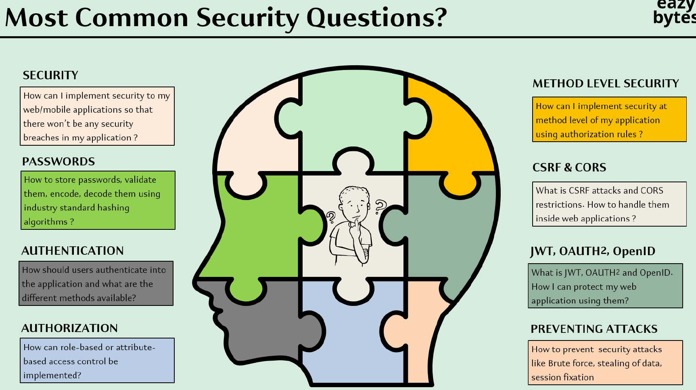

# 

## 001 Course Introduction

## 003 Creating a simple Spring Boot app with out security - Part 1

## 004 Creating a simple Spring Boot app with out security - Part 2
## 005 Securing Spring Boot basic app using Spring Security & static credentials
## 006 Funny memes on Security
## 007 What is Security & Why it is important
## 008 Quick introduction to Servlets & Filters
## 009 Introduction to Spring Security Internal flow - Theory
## 010 Demo of Spring Security internal flow - Part 1
## 011 Demo of Spring Security internal flow - Part 2
## 012 Sequence flow of the Spring Security default behaviour
## 013 Understanding on how multiple requests work with out credentials
