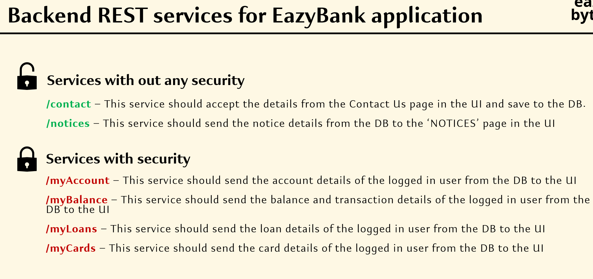
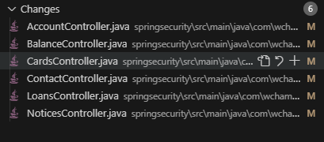
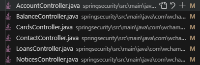

# 02 - Changing the default security configurations

- [02 - Changing the default security configurations](#02---changing-the-default-security-configurations)
  - [001 Understanding about UI part of the EazyBank application](#001-understanding-about-ui-part-of-the-eazybank-application)
  - [002 Creating backend services needed for the EazyBank application](#002-creating-backend-services-needed-for-the-eazybank-application)
  - [003 Checking the default configuration inside the spring security framework](#003-checking-the-default-configuration-inside-the-spring-security-framework)
  - [004 Modifying the security config code as per our custom requirements](#004-modifying-the-security-config-code-as-per-our-custom-requirements)
  - [005 How to disable formLogin and httpBasic authentication](#005-how-to-disable-formlogin-and-httpbasic-authentication)
  - [006 httpBasic authentication testing using postman](#006-httpbasic-authentication-testing-using-postman)


## 001 Understanding about UI part of the EazyBank application



## 002 Creating backend services needed for the EazyBank application




```java
package com.wchamara.springsecurity.controller;


import org.springframework.web.bind.annotation.GetMapping;
import org.springframework.web.bind.annotation.RestController;

@RestController
public class AccountController {

    @GetMapping("/myAccount")
    public String accountDetails() {
        return "Here are your account details";
    }
}

```

other controller follows the same pattern


## 003 Checking the default configuration inside the spring security framework


## 004 Modifying the security config code as per our custom requirements


## 005 How to disable formLogin and httpBasic authentication


## 006 httpBasic authentication testing using postman
