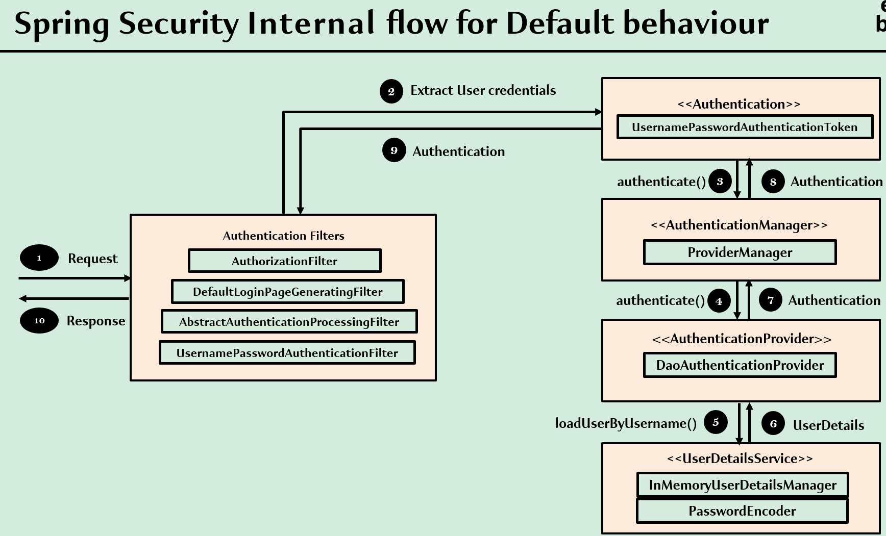
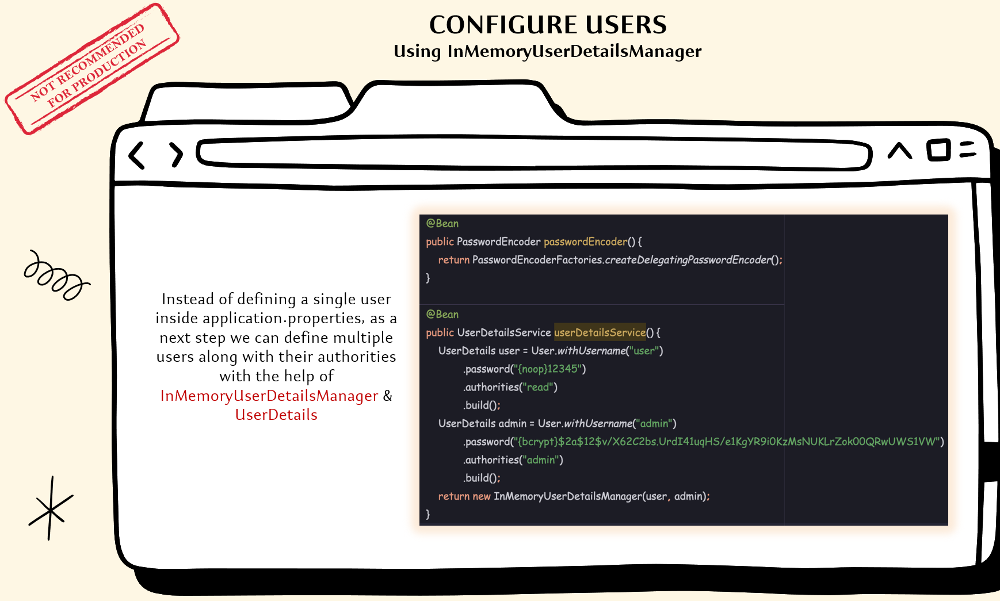
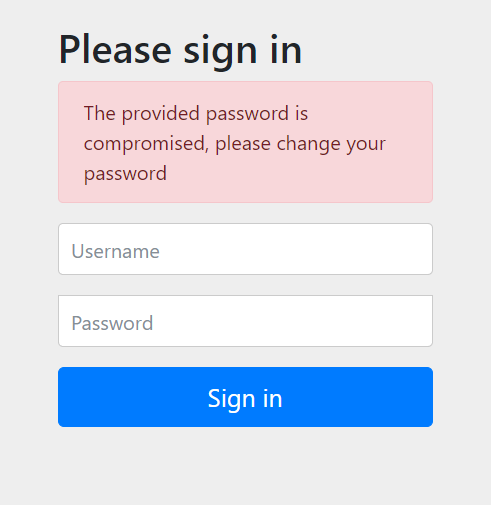
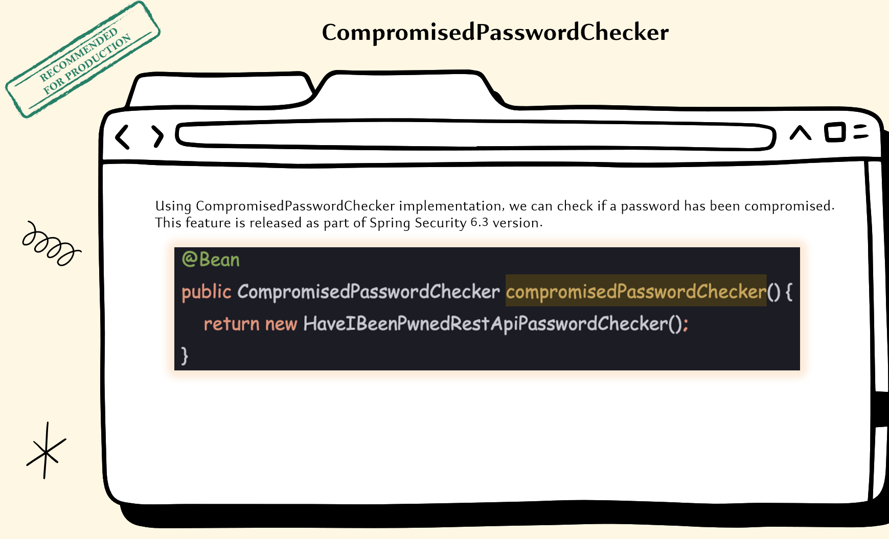

# 03 - Defining & Managing Users using InMemoryUserDetailsManager

## 001 Configuring users using InMemoryUserDetailsManager
let's remove username and password from application.properties and configure users using InMemoryUserDetailsManager

```properties
spring.application.name=${SPRING_APP_ID:bank}
logging.pattern.console=${LOG_PATTERN_CONSOLE:%green(%d{HH:mm:ss.SSS}) %blue(%-5level) %red([%thread]) %yellow(%logger{15}) - %msg%n}
logging.level.org.springframework.security=${SPRING_LOG_LEVEL_SECURITY:TRACE}
```

```java
package com.wchamara.springsecurity.config;

import org.springframework.context.annotation.Bean;
import org.springframework.context.annotation.Configuration;
import org.springframework.security.config.Customizer;
import org.springframework.security.config.annotation.web.builders.HttpSecurity;
import org.springframework.security.config.annotation.web.configuration.EnableWebSecurity;
import org.springframework.security.core.userdetails.User;
import org.springframework.security.core.userdetails.UserDetails;
import org.springframework.security.core.userdetails.UserDetailsService;
import org.springframework.security.provisioning.InMemoryUserDetailsManager;
import org.springframework.security.web.SecurityFilterChain;

@Configuration
@EnableWebSecurity
public class ProjectSecurityConfig {


    @Bean
    SecurityFilterChain defaultSecurityFilterChain(HttpSecurity http) throws Exception {
//        http.authorizeHttpRequests((requests) -> requests.anyRequest().denyAll());
//        http.authorizeHttpRequests((requests) -> requests.anyRequest().permitAll());
        http.authorizeHttpRequests((requests) -> requests
                .requestMatchers("myAccount", "myBalance", "myCards", "myLoans").authenticated()
                .requestMatchers("notices", "welcome", "contact", "error").permitAll()
        );
        http.formLogin(Customizer.withDefaults());
        http.httpBasic(Customizer.withDefaults());
//        http.formLogin(AbstractHttpConfigurer::disable);
//        http.httpBasic(AbstractHttpConfigurer::disable);
        return http.build();
    }

    @Bean
    public UserDetailsService userDetailsService() {
        UserDetails user = User.withUsername("user").password("{noop}password").authorities("read").build();
        UserDetails admin = User.withUsername("admin").password("{noop}54321").authorities("admin").build();

        return new InMemoryUserDetailsManager(user, admin);

    }


}

```

The method:

```java
@Bean
public UserDetailsService userDetailsService() {
    UserDetails user = User.withUsername("user").password("{noop}password").authorities("read").build();
    UserDetails admin = User.withUsername("admin").password("{noop}54321").authorities("admin").build();

    return new InMemoryUserDetailsManager(user, admin);
}
```

is responsible for defining an in-memory user store (called `InMemoryUserDetailsManager`) that Spring Security will use for authentication. Let’s break this down deeply with examples and explain the components involved.

---

### **1. What is `UserDetailsService`?**

- **`UserDetailsService`** is a core interface in Spring Security used to retrieve user information such as username, password, and authorities (roles or permissions).
- **`InMemoryUserDetailsManager`** is an implementation of `UserDetailsService` that stores user details **in memory** (i.e., it doesn’t rely on a database or external storage).

This method provides two in-memory users: `user` and `admin`, each with different credentials and authorities.

### **2. Defining UserDetails for `user` and `admin`**

```java
UserDetails user = User.withUsername("user").password("{noop}password").authorities("read").build();
UserDetails admin = User.withUsername("admin").password("{noop}54321").authorities("admin").build();
```

#### **UserDetails**:
- **`UserDetails`** is an interface that represents a user's credentials and authorities.
- The static **`User.withUsername()`** method is a convenient way to build `UserDetails` objects.

#### **User Creation**:
1. **User**:
   - Username: `"user"`
   - Password: `"password"` (with `{noop}` indicating that the password is stored without hashing).
   - Authorities: `"read"` (this user has a `read` authority, meaning they can perform operations that require this permission).

   ```java
   UserDetails user = User.withUsername("user").password("{noop}password").authorities("read").build();
   ```

   This creates a user object with the username `"user"`, a plain-text password `"password"`, and an authority `"read"`.

2. **Admin**:
   - Username: `"admin"`
   - Password: `"54321"` (again stored without encryption, indicated by `{noop}`).
   - Authorities: `"admin"` (the admin has an `admin` authority, typically used to differentiate user roles and permissions).

   ```java
   UserDetails admin = User.withUsername("admin").password("{noop}54321").authorities("admin").build();
   ```

---

### **3. Password Encoding with `{noop}`**

- **`{noop}`** is a password encoder ID that tells Spring Security to **not encode** the password. It means that the passwords `"password"` and `"54321"` are stored in plain text, which is usually **not recommended for production** but can be useful for testing or demo purposes.

- **Password Encoding**: Spring Security allows you to use different password encoders to store passwords securely. By using `{noop}`, you are bypassing any encoding, but you can easily change this to use encoding methods like BCrypt.

#### **Example** of using `BCryptPasswordEncoder` instead of `{noop}`:

```java
UserDetails user = User.withUsername("user").password(passwordEncoder().encode("password")).authorities("read").build();
```

Where `passwordEncoder()` would return a `BCryptPasswordEncoder`.

---

### **4. Authorities**

```java
.authorities("read")
```

- **Authorities** represent permissions or roles that a user has. In this case, the user `user` has the `"read"` authority, which could allow them to perform certain operations like reading data or accessing resources that require `read` permissions.
- Similarly, the `admin` user has the `"admin"` authority, giving them a different set of permissions. Typically, admin users have more privileges.

#### **Example**:
If your application defines endpoints like:
- `/viewData` that requires `read` authority
- `/adminPanel` that requires `admin` authority

Then:
- The user `user` will only be able to access `/viewData`.
- The user `admin` will be able to access both `/viewData` and `/adminPanel`.

### **5. InMemoryUserDetailsManager**

```java
return new InMemoryUserDetailsManager(user, admin);
```

- **`InMemoryUserDetailsManager`**: This is an implementation of `UserDetailsService` that stores user credentials in memory. It takes the `user` and `admin` objects created above and manages their credentials for authentication purposes.

- Spring Security will use this in-memory manager to look up the user’s credentials when they attempt to log in. If a user’s credentials match one of the `UserDetails` objects (`user` or `admin`), they will be authenticated and granted access according to their authorities.

---

### **How This Works in Practice**

1. **Authentication Flow**:
   - A user tries to access a protected resource.
   - Spring Security intercepts the request and prompts for credentials (either through a login form or basic authentication, depending on your setup).
   - The user submits a username and password (e.g., `user` with `password`).
   - **`InMemoryUserDetailsManager`** checks the submitted credentials against the stored `UserDetails` for `user` and `admin`.
   - If the credentials match one of the users (`user` or `admin`), the user is authenticated and granted the authorities associated with their account.

2. **Authorization**:
   - Once authenticated, Spring Security uses the **authorities** (e.g., `"read"` for `user` or `"admin"` for `admin`) to control which resources the user can access.
   - If a resource is protected by an authority that the user doesn’t have, access will be denied.

---

### **Example Scenario**

Let’s say you have two endpoints in your application:

- `/viewData` (only users with the `"read"` authority can access this endpoint)
- `/adminPanel` (only users with the `"admin"` authority can access this endpoint)

The configuration in `ProjectSecurityConfig` will manage access to these resources as follows:

1. **User logs in as `user`**:
   - Username: `user`
   - Password: `password`
   - Authorities: `read`

   If the user `user` tries to access `/viewData`, they will be allowed because they have the `"read"` authority. However, if they try to access `/adminPanel`, they will be denied because they do not have the `"admin"` authority.

2. **User logs in as `admin`**:
   - Username: `admin`
   - Password: `54321`
   - Authorities: `admin`

   If the `admin` user logs in, they will have access to both `/viewData` and `/adminPanel` because they have a higher privilege (`admin` authority).

---

### **Summary**

This code defines two users (`user` and `admin`) in memory using Spring Security's `InMemoryUserDetailsManager`. Each user has a specific set of authorities (permissions) and plain-text passwords (indicated by `{noop}`). Spring Security uses these details to authenticate and authorize users as they attempt to access different resources in the application.

- **`UserDetailsService`**: Manages user data.
- **`InMemoryUserDetailsManager`**: Stores user data in memory.
- **Authorities**: Control which resources each user can access based on their assigned roles or permissions.

This is a typical setup for simple applications or testing environments, where user credentials are stored in memory rather than in a database. In real-world applications, you'd likely use a database to store user credentials and a password encoder like `BCryptPasswordEncoder` to secure passwords.


## 002 Configuring PasswordEncoder using PasswordEncoderFactories
```java
package com.wchamara.springsecurity.config;

import org.springframework.context.annotation.Bean;
import org.springframework.context.annotation.Configuration;
import org.springframework.security.config.Customizer;
import org.springframework.security.config.annotation.web.builders.HttpSecurity;
import org.springframework.security.config.annotation.web.configuration.EnableWebSecurity;
import org.springframework.security.core.userdetails.User;
import org.springframework.security.core.userdetails.UserDetails;
import org.springframework.security.core.userdetails.UserDetailsService;
import org.springframework.security.crypto.factory.PasswordEncoderFactories;
import org.springframework.security.crypto.password.PasswordEncoder;
import org.springframework.security.provisioning.InMemoryUserDetailsManager;
import org.springframework.security.web.SecurityFilterChain;

@Configuration
@EnableWebSecurity
public class ProjectSecurityConfig {


    @Bean
    SecurityFilterChain defaultSecurityFilterChain(HttpSecurity http) throws Exception {
//        http.authorizeHttpRequests((requests) -> requests.anyRequest().denyAll());
//        http.authorizeHttpRequests((requests) -> requests.anyRequest().permitAll());
        http.authorizeHttpRequests((requests) -> requests
                .requestMatchers("myAccount", "myBalance", "myCards", "myLoans").authenticated()
                .requestMatchers("notices", "welcome", "contact", "error").permitAll()
        );
        http.formLogin(Customizer.withDefaults());
        http.httpBasic(Customizer.withDefaults());
//        http.formLogin(AbstractHttpConfigurer::disable);
//        http.httpBasic(AbstractHttpConfigurer::disable);
        return http.build();
    }

    @Bean
    public UserDetailsService userDetailsService() {
        UserDetails user = User.withUsername("user").password("{noop}password").authorities("read").build();
        UserDetails admin = User.withUsername("admin").password("{bcrypt}$2y$14$nwzTHZGwOOO7t9Eei0K00eBebzkhc4WHGh9UBgef5.F5PxtB7gnsK").authorities("admin").build();

        return new InMemoryUserDetailsManager(user, admin);

    }

    @Bean
    public PasswordEncoder passwordEncoder() {
        return PasswordEncoderFactories.createDelegatingPasswordEncoder();
    }


}

```
In the provided code, we have two key components to explain:

1. **UserDetailsService**: This manages user credentials and authorities in memory.
2. **PasswordEncoder**: This is responsible for encoding passwords and verifying password matches during authentication.

Let’s break down each part of the code deeply with examples.

---

### **1. UserDetailsService and User Definitions**

The **`UserDetailsService`** defines two users (`user` and `admin`) in memory, each with specific roles (authorities) and passwords.

```java
@Bean
public UserDetailsService userDetailsService() {
    UserDetails user = User.withUsername("user").password("{noop}password").authorities("read").build();
    UserDetails admin = User.withUsername("admin").password("{bcrypt}$2y$14$nwzTHZGwOOO7t9Eei0K00eBebzkhc4WHGh9UBgef5.F5PxtB7gnsK").authorities("admin").build();

    return new InMemoryUserDetailsManager(user, admin);
}
```

#### **Explanation of the Users**:

1. **UserDetails for `user`**:
   - Username: `"user"`
   - Password: `"password"` (stored without encryption using `{noop}`)
   - Authority: `"read"`

   This user has minimal privileges and is only assigned the `"read"` authority. The password is stored in plaintext (due to the `{noop}` prefix). In real-world applications, this is not recommended, but it is useful for development or demo purposes.

   ```java
   UserDetails user = User.withUsername("user").password("{noop}password").authorities("read").build();
   ```

2. **UserDetails for `admin`**:
   - Username: `"admin"`
   - Password: A **bcrypt-encoded** password (`$2y$14$nwzTHZGwOOO7t9Eei0K00eBebzkhc4WHGh9UBgef5.F5PxtB7gnsK`)
   - Authority: `"admin"`

   This user has a more privileged role, assigned the `"admin"` authority. The password is **bcrypt-encoded**, meaning it has been hashed using the bcrypt algorithm, which is a secure, industry-standard algorithm for storing passwords. The password is more secure than the one for the `user` since it's encoded.

   ```java
   UserDetails admin = User.withUsername("admin").password("{bcrypt}$2y$14$nwzTHZGwOOO7t9Eei0K00eBebzkhc4WHGh9UBgef5.F5PxtB7gnsK").authorities("admin").build();
   ```

   - **`$2y$14$`** indicates the use of bcrypt with a cost factor of 14. This cost factor increases the computational complexity of encoding and verifying passwords, improving security by making brute-force attacks more difficult.
   - The rest of the string (`nwzTHZ...`) is the hashed version of the original password (let's assume the plaintext password was something like `54321` before hashing).

#### **Authorities**:

The users are assigned **authorities**, which represent permissions or roles in the system:

- `"read"`: This could be used to grant read-only access to specific resources or endpoints.
- `"admin"`: This could provide full administrative access to all resources.

**Example of How Authorities Are Used**:
- If your application has different routes for admin and general users, Spring Security will enforce these roles when users access various endpoints.
  - A user with the `"read"` role may only be able to access resources that involve viewing information.
  - An admin with the `"admin"` role will likely have broader access to all resources, including those requiring administrative control.

---

### **2. Password Encoding with PasswordEncoder**

```java
@Bean
public PasswordEncoder passwordEncoder() {
    return PasswordEncoderFactories.createDelegatingPasswordEncoder();
}
```

#### **What is Password Encoding?**

Password encoding is the process of transforming a plaintext password into a more secure, non-reversible format using cryptographic algorithms (like bcrypt, PBKDF2, etc.).

- **Why Password Encoding?** Passwords should never be stored in plaintext for security reasons. If a database is compromised, an attacker could retrieve the plaintext passwords. Encoding adds an extra layer of protection by storing a hashed version of the password, which is difficult to reverse-engineer.

#### **PasswordEncoderFactories.createDelegatingPasswordEncoder()**

This line creates a **delegating password encoder**. The delegating password encoder allows for different password encoding strategies, such as bcrypt, noop (no encoding), PBKDF2, etc.

- **Delegating**: It means that the encoder can handle multiple types of password encodings, and it will automatically delegate the encoding process to the appropriate encoder based on the prefix (like `{bcrypt}`, `{noop}`, etc.).
- **Prefixes**: Each password is stored with a prefix that indicates the encoding type, so Spring Security knows how to verify the password when a user tries to log in.

##### **Example Password Prefixes**:

- **`{bcrypt}`**: Indicates that the password is stored using bcrypt encoding.
- **`{noop}`**: No encoding is applied (i.e., plaintext password).
- **`{pbkdf2}`**: Indicates PBKDF2 encoding.
- **`{argon2}`**: Indicates Argon2 encoding.

**How Does This Work in Practice?**
- When Spring Security verifies a user’s password during login, it looks at the prefix to determine which password encoder to use.
  - If the password starts with `{noop}`, it compares the plaintext password directly.
  - If the password starts with `{bcrypt}`, it uses the bcrypt algorithm to verify the password.
  
```java
UserDetails admin = User.withUsername("admin").password("{bcrypt}$2y$14$nwzTHZGwOOO7t9Eei0K00eBebzkhc4WHGh9UBgef5.F5PxtB7gnsK").authorities("admin").build();
```

Here, Spring Security will use bcrypt to decode and verify the password for the `admin` user.

---

### **Example of How Password Encoding Works**

#### **User Authentication Flow**:

1. A user tries to log in with their credentials (username and password).
2. Spring Security retrieves the stored user details (username, password, authorities) from the `InMemoryUserDetailsManager`.
3. Spring Security checks the **password prefix** (e.g., `{noop}`, `{bcrypt}`):
   - If `{noop}`, it compares the raw (plaintext) password.
   - If `{bcrypt}`, it applies the bcrypt algorithm to the provided password and compares it to the stored hash.
4. If the passwords match, the user is authenticated and granted the appropriate authorities (e.g., `"read"` for a general user or `"admin"` for an admin).

#### **Flow Example**:

- **User login as `user`**:
   - Username: `user`
   - Password: `password`

   Since the password is stored with `{noop}` (i.e., no encoding), Spring Security directly compares the provided password `"password"` with the stored password.

```http
POST /login
{
  "username": "user",
  "password": "password"
}
```

If the credentials match, the user is authenticated and given access.

---

- **User login as `admin`**:
   - Username: `admin`
   - Password: (let’s assume it was `54321` before encoding with bcrypt)

   Spring Security uses the bcrypt encoder to hash the provided password (`54321`) and compares it with the stored hash `$2y$14$nwzTHZ...`. If they match, the user is authenticated.

```http
POST /login
{
  "username": "admin",
  "password": "54321"
}
```

---

### **Summary**

- **`UserDetailsService`**: Manages users (`user` and `admin`) stored in memory. The `user` has a plain-text password (using `{noop}`), while the `admin` has a bcrypt-encoded password (using `{bcrypt}`). The users are granted authorities based on their roles (`read` for `user`, `admin` for `admin`).
  
- **Password Encoding**: The `PasswordEncoder` ensures that passwords are stored securely using a delegating mechanism. It can handle different types of password encodings (like bcrypt, noop, etc.), and Spring Security uses the encoding prefix (e.g., `{noop}`, `{bcrypt}`) to determine how to verify passwords during login.

This configuration ensures that even though one user’s password is stored in plaintext (`noop`), the other user (`admin`) has a more secure bcrypt-encoded password. This demonstrates how Spring Security can handle different password encoding strategies while ensuring authentication security.



## 003 Demo of CompromisedPasswordChecker




```java
package com.wchamara.springsecurity.config;

import org.springframework.context.annotation.Bean;
import org.springframework.context.annotation.Configuration;
import org.springframework.security.authentication.password.CompromisedPasswordChecker;
import org.springframework.security.config.Customizer;
import org.springframework.security.config.annotation.web.builders.HttpSecurity;
import org.springframework.security.config.annotation.web.configuration.EnableWebSecurity;
import org.springframework.security.core.userdetails.User;
import org.springframework.security.core.userdetails.UserDetails;
import org.springframework.security.core.userdetails.UserDetailsService;
import org.springframework.security.crypto.factory.PasswordEncoderFactories;
import org.springframework.security.crypto.password.PasswordEncoder;
import org.springframework.security.provisioning.InMemoryUserDetailsManager;
import org.springframework.security.web.SecurityFilterChain;
import org.springframework.security.web.authentication.password.HaveIBeenPwnedRestApiPasswordChecker;

@Configuration
@EnableWebSecurity
public class ProjectSecurityConfig {


    @Bean
    SecurityFilterChain defaultSecurityFilterChain(HttpSecurity http) throws Exception {
//        http.authorizeHttpRequests((requests) -> requests.anyRequest().denyAll());
//        http.authorizeHttpRequests((requests) -> requests.anyRequest().permitAll());
        http.authorizeHttpRequests((requests) -> requests
                .requestMatchers("myAccount", "myBalance", "myCards", "myLoans").authenticated()
                .requestMatchers("notices", "welcome", "contact", "error").permitAll()
        );
        http.formLogin(Customizer.withDefaults());
        http.httpBasic(Customizer.withDefaults());
//        http.formLogin(AbstractHttpConfigurer::disable);
//        http.httpBasic(AbstractHttpConfigurer::disable);
        return http.build();
    }

    @Bean
    public UserDetailsService userDetailsService() {
        UserDetails user = User.withUsername("user").password("{noop}password").authorities("read").build();
        UserDetails admin = User.withUsername("admin").password("{bcrypt}$2y$14$OPivb1UNmmrSYTo5OQWDnuAZ78cS9DBCV5S9SsuWroQ10.wtm9JH6").authorities("admin").build();

        return new InMemoryUserDetailsManager(user, admin);

    }

    @Bean
    public PasswordEncoder passwordEncoder() {
        return PasswordEncoderFactories.createDelegatingPasswordEncoder();
    }

    @Bean
    public CompromisedPasswordChecker compromisedPasswordChecker() {
        return new HaveIBeenPwnedRestApiPasswordChecker();
    }


}

```

The method:

```java
@Bean
public CompromisedPasswordChecker compromisedPasswordChecker() {
    return new HaveIBeenPwnedRestApiPasswordChecker();
}
```

is introducing a mechanism to **check if a user's password has been compromised** by comparing it against a database of known compromised passwords. This is a common feature in security-conscious applications, helping to enhance the protection of user accounts by preventing users from using passwords that have already been exposed in data breaches.

### **1. What is a Compromised Password Checker?**

A **compromised password checker** is a service or utility that verifies if a password has been involved in known data breaches. The goal is to protect users from using insecure, compromised passwords that attackers could easily guess or exploit.

- **Why Check for Compromised Passwords?**  
  Over time, many passwords are leaked in data breaches and end up in lists circulated on the dark web. Attackers can use these lists for credential stuffing attacks, where they try commonly used or compromised passwords against multiple accounts. Checking for compromised passwords helps mitigate this risk by preventing users from using passwords that are already publicly known.

### **2. The `HaveIBeenPwnedRestApiPasswordChecker`**

In the code above, you’re using the `HaveIBeenPwnedRestApiPasswordChecker`. This class integrates with the **Have I Been Pwned (HIBP)** API to check if a password has appeared in known breaches.

- **Have I Been Pwned** is a popular online service that provides a large database of passwords that have been leaked in various breaches. It allows applications to query their API and determine whether a password has been compromised in any data breaches.

By using `HaveIBeenPwnedRestApiPasswordChecker`, your Spring Security application will check the passwords of users during certain operations (like registration or password change) and alert if the password has been involved in a breach.

### **3. How Does the Have I Been Pwned API Work?**

The HIBP API works in a **privacy-preserving** manner using a technique called **k-anonymity**. Here’s how it works:

1. **Password Hashing**: The password that needs to be checked is hashed using the SHA-1 algorithm (the hashing is done on the client-side).
2. **Prefix Matching**: The first five characters of the hash are sent to the HIBP API.
3. **Result Lookup**: The API returns a list of all hash suffixes that match the given prefix (along with how many times the hash has been seen in breaches).
4. **Comparison**: The client compares the full password hash with the returned list to determine if the password has been compromised.

### **4. Example Scenario**

Let’s say a user tries to register or change their password in your application. During that process, Spring Security checks if the password has been compromised.

1. **User Registration**:
   - A user enters a password during the registration process.
   - Before storing the password, Spring Security uses the `HaveIBeenPwnedRestApiPasswordChecker` to check if the password has appeared in a data breach.

2. **Compromised Password**:
   - If the password exists in the HIBP database, an error is returned, instructing the user to choose a different password.

3. **Safe Password**:
   - If the password has not been compromised, the registration process continues, and the password is safely stored (using bcrypt encoding, for instance).

#### Example Flow:

1. User tries to register with the password `123456`.
2. The password is hashed using SHA-1.
3. The first five characters of the hash are sent to the HIBP API.
4. The API returns a list of hashes that match the prefix.
5. The application checks the full hash against the returned results.
6. If a match is found (indicating that the password `123456` has been compromised), the registration is blocked with an error message like:
   ```plaintext
   "This password has been involved in a data breach. Please choose a different password."
   ```

### **5. How the Checker Fits into the Application**

By adding this method to the configuration:

```java
@Bean
public CompromisedPasswordChecker compromisedPasswordChecker() {
    return new HaveIBeenPwnedRestApiPasswordChecker();
}
```

You are essentially plugging in a service that will:

- **Automatically validate passwords** when a user sets or changes a password.
- **Block compromised passwords** from being used in your application.

This increases the security of your application by ensuring that even if a user chooses a weak or commonly used password, they will be warned and required to choose a more secure password.

### **6. Customizing the Password Checker**

The default implementation checks against the HIBP service, but you could customize this to use a different API or a local database of known compromised passwords if needed. In more advanced configurations, you might:
- **Cache results** locally to reduce API calls.
- **Throttle API requests** to avoid hitting rate limits from HIBP.
- **Integrate with other password validation strategies** like length and complexity requirements.

### **Example of How it Works in Your Application**

Assuming your `ProjectSecurityConfig` class is configured like this:

```java
@Bean
public UserDetailsService userDetailsService() {
    UserDetails user = User.withUsername("user").password("{noop}password").authorities("read").build();
    UserDetails admin = User.withUsername("admin").password("{bcrypt}$2y$14$OPivb1UNmmrSYTo5OQWDnuAZ78cS9DBCV5S9SsuWroQ10.wtm9JH6").authorities("admin").build();

    return new InMemoryUserDetailsManager(user, admin);
}
```

1. A new user tries to register with the password `"123456"`.
2. The **`HaveIBeenPwnedRestApiPasswordChecker`** checks if `"123456"` is in the HIBP database.
3. Since `"123456"` is a known compromised password (it’s one of the most common passwords ever), the API returns a match.
4. The user receives an error message asking them to pick a different password.
5. The user changes the password to a more secure one, like `"Passw0rd!123"`.
6. The API checks the new password, finds no match, and allows the user to proceed with registration.

---

### **7. Conclusion**

The `CompromisedPasswordChecker` using `HaveIBeenPwnedRestApiPasswordChecker` is a valuable addition to your security setup. It ensures that users do not choose passwords that have been exposed in data breaches, significantly reducing the risk of account compromise due to weak or common passwords.

By integrating this into your Spring Security application:
- You’re enhancing the security posture by checking passwords against a large dataset of known compromised passwords.
- You’re automatically preventing users from setting unsafe passwords.
- The implementation uses the **Have I Been Pwned API**, which is known for its reliability and security-focused approach to password validation.

This is an important step toward providing robust protection for user accounts in your application.

## 004 Deep Dive of UserDetailsService & UserDetailsManager Interfaces
```java

```

```java

```
## 005 Deep Dive of UserDetails & Authentication interfaces

```java

```
```java

```