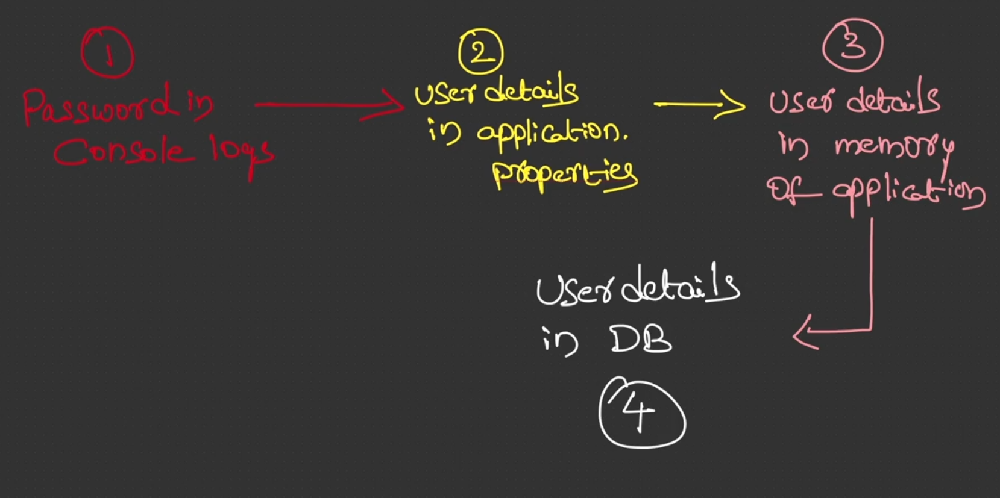

# 04 - Defining & Managing Users using a database

## 001 Quick revision of enhancements done so far


The image provides a flow that illustrates different ways user details and credentials can be managed within a Spring Security context in a Spring Boot application. Let's break down the four stages depicted in the diagram and explain each one with examples:

---

### 1. **Password in Console Logs**

This likely refers to the **default behavior** of Spring Boot applications that include Spring Security but haven't configured custom security settings. When Spring Security is enabled but no users are defined, Spring Boot auto-generates a default password and prints it in the console logs.

- **Example**:
  When you start a Spring Boot application with Spring Security, you may see something like this in the console:
  
  ```plaintext
  Using default security password: b3a1d5e4-6f7a-4d9a-83de-0f7a71b39d12
  ```
  
  This behavior is for quick setup during development but is insecure for production environments. The password in the console is meant to be changed as soon as you configure users.

---

### 2. **User Details in application.properties**

The next stage illustrates user credentials being defined in the `application.properties` file. This is an easy, lightweight way to store user information, especially during development or testing.

- **Example**:
  You can configure the username and password in `application.properties` like this:
  
  ```properties
  spring.security.user.name=user1
  spring.security.user.password=secret
  ```

- **How it works**:
  Spring Boot will read these values and create a basic in-memory user with the specified credentials. This is useful for quick setups but should not be used in production as it lacks flexibility, especially with roles, and storing plain-text passwords in properties is not secure.

---

### 3. **User Details in Memory of the Application**

At this stage, we are moving towards a more flexible and common approach: storing user credentials in memory using the `InMemoryUserDetailsManager`. This approach is configured programmatically inside your Spring Security configuration file.

- **Example**:
  
  ```java
  @Bean
  public UserDetailsService userDetailsService() {
      UserDetails user = User.withUsername("user")
                             .password("{noop}password") // No encoding, just for testing
                             .authorities("ROLE_USER")
                             .build();
                             
      return new InMemoryUserDetailsManager(user);
  }
  ```

- **Explanation**:
  Here, the `InMemoryUserDetailsManager` stores user details in memory (inside the application's runtime). This means you can add multiple users and configure their roles/authorities, but once the application is restarted, these details are lost. This approach is useful for testing but not recommended for production.

---

### 4. **User Details in DB (Database)**

The final stage shows a more production-ready setup where user details are stored in a **database** (DB). This approach is the most secure and scalable, allowing you to store, update, and manage user credentials persistently.

- **Example**:

  To store user details in a database, you typically use the `JdbcUserDetailsManager` or a custom `UserDetailsService` that fetches data from a relational database.

  ```java
  @Autowired
  DataSource dataSource;

  @Bean
  public UserDetailsManager userDetailsManager() {
      return new JdbcUserDetailsManager(dataSource);
  }
  ```

  **Table Structure**:
  You would need to create specific tables for users and authorities (roles). An example structure is:

  ```sql
  CREATE TABLE users (
      username VARCHAR(50) PRIMARY KEY,
      password VARCHAR(100),
      enabled BOOLEAN
  );

  CREATE TABLE authorities (
      username VARCHAR(50),
      authority VARCHAR(50),
      FOREIGN KEY (username) REFERENCES users(username)
  );
  ```

- **Explanation**:
  Storing user details in a database provides persistence, scalability, and security. You can easily add, update, or delete users, manage roles, and ensure passwords are hashed (using password encoders such as BCrypt). This method is widely used in production environments for web applications that require user authentication.

---

### **Summary:**

1. **Password in Console Logs**: The default password generated by Spring Security for development use.
2. **User Details in application.properties**: Quick setup for storing a single user in `application.properties`, useful for testing.
3. **User Details in Memory**: Using `InMemoryUserDetailsManager` for in-memory user storage, convenient for testing but not persistent.
4. **User Details in DB**: Storing user details in a database for production-level security, flexibility, and persistence. This method involves using `JdbcUserDetailsManager` or implementing a custom `UserDetailsService` that fetches data from the database.

Each of these methods offers increasing levels of flexibility and security, with database storage being the most robust and recommended for production environments.


## 002 Creating MySQL Database using Docker

```yaml
version: '3.8'  # This specifies the version of Docker Compose, 3.8 is compatible with the latest versions.

services:
  mysql:
    image: mysql:latest  # Pulls the latest version of MySQL.
    container_name: springsecurity
    environment:
      MYSQL_ROOT_PASSWORD: root  # Root password for MySQL.
      MYSQL_DATABASE: bankdb     # The database that will be created.
    ports:
      - "3306:3306"  # Exposes MySQL on port 3306 to the host.
    volumes:
      - mysql_data:/var/lib/mysql  # Persists MySQL data even if the container is destroyed.
    networks:
      - springsecurity-network

volumes:
  mysql_data:  # Volume to persist data.

networks:
  springsecurity-network:
    driver: bridge  # Creates an isolated network for the MySQL container.

```

The dependency you provided:

```xml
<dependency>
    <groupId>org.springframework.boot</groupId>
    <artifactId>spring-boot-docker-compose</artifactId>
    <scope>runtime</scope>
</dependency>
```

### **Explanation of this Dependency:**

The `spring-boot-docker-compose` dependency is part of the Spring Boot ecosystem and is specifically designed to integrate Docker Compose with Spring Boot applications. When you add this dependency, Spring Boot becomes aware of Docker Compose and can automatically manage and orchestrate Docker Compose services as part of your application startup.

**Key Concepts:**

1. **`groupId` and `artifactId`:**
   - The `groupId` is `org.springframework.boot`, which means it's a Spring Boot-specific module.
   - The `artifactId` is `spring-boot-docker-compose`, which signifies that it's used for Docker Compose integration.

2. **`scope`:**
   - The `scope` is `runtime`, meaning that this dependency is only required at runtime, not at compile-time. This is because the dependency interacts with Docker Compose, which is part of the application's deployment, not the build process.

### **How It Works:**

When you include this dependency in your project, Spring Boot can automatically start Docker Compose services defined in your `docker-compose.yml` when the application starts. This makes it easier to manage dependent services like databases, messaging queues, or any other services defined in the Docker Compose file.

#### **Example Scenario:**

Imagine you have a Spring Boot application that depends on a MySQL database and a Redis instance. You typically define those services in a `docker-compose.yml` file. With the `spring-boot-docker-compose` dependency:

- Spring Boot will detect the `docker-compose.yml` file in the root of your project or in standard locations.
- It will automatically start the services (MySQL, Redis) when your Spring Boot application starts, ensuring that all required services are available before the application begins execution.
- It simplifies managing external services for local development or testing environments without needing to manually run `docker-compose up`.

### **Example Setup:**

#### **1. Docker Compose File (`docker-compose.yml`):**

```yaml
version: '3.8'
services:
  db:
    image: mysql:latest
    environment:
      MYSQL_ROOT_PASSWORD: password
      MYSQL_DATABASE: testdb
    ports:
      - "3306:3306"
  redis:
    image: redis:latest
    ports:
      - "6379:6379"
```

#### **2. Spring Boot Application:**

```java
@SpringBootApplication
public class MyApplication {

    public static void main(String[] args) {
        SpringApplication.run(MyApplication.class, args);
    }
}
```

When you run this application, thanks to the `spring-boot-docker-compose` dependency, Spring Boot will automatically start the MySQL and Redis services defined in `docker-compose.yml`.

### **Benefits:**

1. **Automatic Service Management**: You no longer need to manually start Docker Compose services before running your application. Spring Boot will handle that for you.
   
2. **Improved Local Development**: For local development, it makes handling dependencies (such as databases or message brokers) easier, as they will start automatically alongside your application.

3. **Service Coordination**: If your application depends on multiple services (e.g., databases, caches, queues), `spring-boot-docker-compose` ensures that these services are started in the correct order and that they are running before your application begins.

### **Use Cases:**

- **Microservices**: When you're working with microservices architecture, and your Spring Boot service relies on other services (e.g., a discovery server, configuration server, databases, etc.), `spring-boot-docker-compose` helps manage these service dependencies.

- **Testing**: In integration testing environments, where your application needs external services like databases or caching systems, this dependency ensures that those services are available before tests are executed.

### **Summary:**

The `spring-boot-docker-compose` dependency integrates Docker Compose into your Spring Boot application's runtime, allowing for the automatic orchestration of Docker Compose services. It simplifies the management of external services required by your application during development or runtime by automatically starting and stopping them as needed.

## 003 Understanding JdbcUserDetailsManager & creating Users inside the DB

The SQL statements you provided create two tables: `users` and `authorities`. These tables are commonly used in Spring Security or similar authentication/authorization systems. Let’s break down the structure and purpose of each statement, with examples, to deeply understand how they work together.

### **1. Table Creation: `users`**

```sql
create table users
(
    username varchar(50) not null primary key,
    password varchar(500) not null,
    enabled boolean not null
);
```

#### **Explanation:**
- **`username`**: This column stores the unique username of the user. It is defined as `varchar(50)`, meaning it can store up to 50 characters. This field cannot be null (`not null`) and is also set as the **primary key**, ensuring each username is unique.
  
- **`password`**: This column stores the user's password. It is defined as `varchar(500)`, allowing up to 500 characters. The length of 500 is typically large to accommodate hashed passwords, which can be lengthy, especially when bcrypt or other strong hashing algorithms are used.
  
- **`enabled`**: This column stores a boolean value indicating whether the user is active or inactive. This is often used to disable accounts temporarily (e.g., locking accounts after multiple failed login attempts).

#### **Example:**
Imagine you have a user named `john_doe` with a password stored as a bcrypt hash and the user is currently active (enabled = `true`).

```sql
INSERT INTO users (username, password, enabled)
VALUES ('john_doe', '$2a$10$CwTycUXWue0Thq9StjUM0uJ8rzn3yRUaTflIcXZoFZJG8bJFm3uUm', true);
```
- The **username** is `john_doe`.
- The **password** is a bcrypt hash (the actual password could be something like `password123` before hashing).
- The **enabled** field is `true`, meaning the user can log in.

---

### **2. Table Creation: `authorities`**

```sql
create table authorities
(
    username varchar(50) not null,
    authority varchar(50) not null,
    constraint fk_authorities_users foreign key (username) references users (username)
);
```

#### **Explanation:**
- **`username`**: This column stores the username, and it must exist in the `users` table. It is defined as `varchar(50)` to match the `username` field from the `users` table. It is also marked as `not null`, ensuring that every row has a valid username.

- **`authority`**: This column stores the authority (or role) associated with the user. It is defined as `varchar(50)`, allowing a role name like `ROLE_USER`, `ROLE_ADMIN`, etc. It is also marked as `not null`.

- **Foreign Key Constraint (`fk_authorities_users`)**: This constraint ensures that the `username` in the `authorities` table must exist in the `users` table. In other words, you cannot assign an authority to a user that does not exist in the `users` table.

#### **Example:**
For example, assigning the role `ROLE_ADMIN` to `john_doe` would look like this:

```sql
INSERT INTO authorities (username, authority)
VALUES ('john_doe', 'ROLE_ADMIN');
```

In this case:
- `john_doe` is the user (referenced from the `users` table).
- `ROLE_ADMIN` is the authority or role being assigned to this user.

---

### **3. Unique Index Creation:**

```sql
create unique index ix_auth_username on authorities (username, authority);
```

#### **Explanation:**
- **Unique Index (`ix_auth_username`)**: This index ensures that each combination of `username` and `authority` in the `authorities` table is unique. This means a user can have multiple authorities (e.g., `ROLE_USER` and `ROLE_ADMIN`), but they cannot be assigned the same authority more than once.

- **Purpose of Index**: Indexes improve the performance of queries, especially when searching by `username` and `authority`. The unique constraint here enforces that there are no duplicate authority entries for the same user.

#### **Example:**
The following scenario would **not** be allowed due to the unique constraint on `username` and `authority`:

```sql
INSERT INTO authorities (username, authority)
VALUES ('john_doe', 'ROLE_ADMIN');
```

If `john_doe` already has `ROLE_ADMIN`, this insertion would fail, preventing duplicate role assignments for the same user.

---

### **Putting It All Together:**

The `users` and `authorities` tables are used to manage users and their roles (or authorities) in many applications, particularly those using **Spring Security**.

#### **How These Tables Work Together:**
1. **`users` table**: Contains all the users and their basic information such as username, password, and whether the user is enabled or disabled.
  
2. **`authorities` table**: Contains the authorities (roles) for each user. Multiple authorities can be associated with a single user, allowing for fine-grained control over user permissions.

#### **Example Use Case in an Authentication System**:
1. A user tries to log in with a username (`john_doe`) and password.
2. The system verifies the password by fetching the hashed password from the `users` table.
3. If the password matches and the user is enabled, the system looks up the roles (authorities) for that user in the `authorities` table (e.g., `ROLE_ADMIN`, `ROLE_USER`).
4. The user is authenticated and given access to resources based on the authorities (roles) assigned.

---

### **Full Example:**

```sql
-- Create the users table
CREATE TABLE users (
    username VARCHAR(50) NOT NULL PRIMARY KEY,
    password VARCHAR(500) NOT NULL,
    enabled BOOLEAN NOT NULL
);

-- Create the authorities table
CREATE TABLE authorities (
    username VARCHAR(50) NOT NULL,
    authority VARCHAR(50) NOT NULL,
    CONSTRAINT fk_authorities_users FOREIGN KEY (username) REFERENCES users (username)
);

-- Create unique index to ensure no duplicate authorities for the same user
CREATE UNIQUE INDEX ix_auth_username ON authorities (username, authority);

-- Insert a user into the users table
INSERT INTO users (username, password, enabled) 
VALUES ('john_doe', '$2a$10$CwTycUXWue0Thq9StjUM0uJ8rzn3yRUaTflIcXZoFZJG8bJFm3uUm', true);

-- Assign roles to the user
INSERT INTO authorities (username, authority)
VALUES ('john_doe', 'ROLE_USER');

INSERT INTO authorities (username, authority)
VALUES ('john_doe', 'ROLE_ADMIN');
```

### **Summary:**
- **`users` table**: Stores user details like `username`, `password`, and whether the user is enabled.
- **`authorities` table**: Stores the roles/authorities assigned to users.
- **Foreign key constraint**: Ensures that the `username` in `authorities` references an existing user in `users`.
- **Unique index**: Prevents duplicate role entries for the same user.

## 004 Using JdbcUserDetailsManager to perform authentication

```xml
        <dependency>
            <groupId>org.springframework.boot</groupId>
            <artifactId>spring-boot-starter-data-jpa</artifactId>
        </dependency>
        <dependency>
            <groupId>org.springframework.boot</groupId>
            <artifactId>spring-boot-starter-jdbc</artifactId>
        </dependency>
        <dependency>
            <groupId>com.mysql</groupId>
            <artifactId>mysql-connector-j</artifactId>
            <scope>runtime</scope>
        </dependency>
```

Let's break down the Spring Boot dependencies you've included in your `pom.xml` file and explain what each of them brings to the application, with examples:

### 1. **Spring Boot Starter Data JPA**

```xml
<dependency>
    <groupId>org.springframework.boot</groupId>
    <artifactId>spring-boot-starter-data-jpa</artifactId>
</dependency>
```

#### **Explanation:**

- **Spring Boot Starter Data JPA** is a starter dependency that simplifies the use of **Java Persistence API (JPA)** with **Spring Data**. JPA is the Java specification for managing relational data in Java applications, and Spring Data JPA provides a layer to easily integrate JPA with Spring applications.

- This dependency automatically brings in Hibernate (as the default JPA provider) and other necessary libraries for interacting with a relational database using JPA.

#### **What it Provides:**
1. **Repository Support**: You can define repositories as interfaces that extend `JpaRepository` and have CRUD (Create, Read, Update, Delete) functionality without writing any SQL queries.
   
2. **Entity Mapping**: JPA allows you to map Java objects (called entities) to database tables.
   
3. **Transaction Management**: Provides out-of-the-box transaction management.

#### **Example:**

1. **Entity Class (Mapping to Database Table)**:

```java
import javax.persistence.Entity;
import javax.persistence.Id;

@Entity
public class User {
    @Id
    private String username;
    private String password;
    private Boolean enabled;

    // Getters and Setters
}
```

2. **Repository Interface**:

```java
import org.springframework.data.jpa.repository.JpaRepository;

public interface UserRepository extends JpaRepository<User, String> {
    // Custom query methods can be added here if necessary
}
```

3. **Service Layer Example**:

```java
import org.springframework.beans.factory.annotation.Autowired;
import org.springframework.stereotype.Service;

@Service
public class UserService {
    @Autowired
    private UserRepository userRepository;

    public User findUserByUsername(String username) {
        return userRepository.findById(username).orElse(null);
    }

    public User saveUser(User user) {
        return userRepository.save(user);
    }
}
```

### 2. **Spring Boot Starter JDBC**

```xml
<dependency>
    <groupId>org.springframework.boot</groupId>
    <artifactId>spring-boot-starter-jdbc</artifactId>
</dependency>
```

#### **Explanation:**

- **Spring Boot Starter JDBC** provides support for accessing relational databases through **JDBC (Java Database Connectivity)**. It includes **Spring's JDBC support**, which provides utilities to simplify database interaction.

- Unlike JPA, JDBC works directly with SQL queries, giving you more control over the SQL but also requiring you to write more boilerplate code for handling result sets, transactions, etc.

#### **What it Provides:**
1. **JdbcTemplate**: A Spring utility class that helps you perform common JDBC operations (e.g., querying, updating) in a more simplified and consistent way.

2. **Connection Pooling**: It integrates well with popular connection pools like **HikariCP** for efficient connection management.

#### **Example:**

1. **JdbcTemplate Usage**:

```java
import org.springframework.jdbc.core.JdbcTemplate;
import org.springframework.stereotype.Repository;

import java.util.List;

@Repository
public class UserJdbcRepository {
    private final JdbcTemplate jdbcTemplate;

    public UserJdbcRepository(JdbcTemplate jdbcTemplate) {
        this.jdbcTemplate = jdbcTemplate;
    }

    public List<User> findAllUsers() {
        String sql = "SELECT * FROM users";
        return jdbcTemplate.query(sql, (rs, rowNum) -> new User(
                rs.getString("username"),
                rs.getString("password"),
                rs.getBoolean("enabled")
        ));
    }
}
```

In this example, **JdbcTemplate** is used to query the database directly using SQL. It maps the result set to a `User` object.

### 3. **MySQL Connector-J**

```xml
<dependency>
    <groupId>com.mysql</groupId>
    <artifactId>mysql-connector-j</artifactId>
    <scope>runtime</scope>
</dependency>
```

#### **Explanation:**

- **MySQL Connector-J** is the official JDBC driver for MySQL. It allows your Spring Boot application to interact with a **MySQL database** using the JDBC API.

- With this driver, your application can run SQL queries against a MySQL database, insert, update, or delete data.

#### **What it Provides:**

1. **JDBC Driver**: Enables your application to connect to a MySQL database at runtime using JDBC. Without this driver, your application wouldn’t know how to communicate with a MySQL database.

2. **Seamless Integration with Spring Data JPA or Spring JDBC**: When using Spring Data JPA or Spring JDBC, you can use this driver to connect to a MySQL database with minimal configuration.

#### **Example Configuration in `application.properties`:**

To connect the application to a MySQL database, you would configure the database connection properties like this:

```properties
spring.datasource.url=jdbc:mysql://localhost:3306/bankdb
spring.datasource.username=root
spring.datasource.password=root
spring.datasource.driver-class-name=com.mysql.cj.jdbc.Driver
spring.jpa.hibernate.ddl-auto=update
spring.jpa.show-sql=true
```

#### **Example:**

Once the dependencies are in place and the configuration is done, Spring Boot will automatically:
- Connect to the MySQL database.
- Handle database migrations (if needed) using JPA or custom SQL scripts.

```java
// Your repository (e.g., UserRepository) will use MySQL in the background.
```

### **Conclusion:**
- The **Spring Boot Starter Data JPA** dependency is perfect for working with relational databases using JPA (object-relational mapping), providing repository interfaces for easy CRUD operations without writing SQL.
  
- The **Spring Boot Starter JDBC** dependency gives you direct access to the database through SQL with the help of Spring's JdbcTemplate for database interactions.

- The **MySQL Connector-J** dependency is required to enable your Spring Boot application to communicate with MySQL through JDBC. It acts as a driver to allow database operations against the MySQL database.

These dependencies combined allow you to choose between high-level database abstraction (Spring Data JPA) or low-level database operations (JDBC), while ensuring that the application can communicate with MySQL.

## 005 Creating our own custom tables for Authentication

The configuration properties provided in your example are for connecting a **Spring Boot** application to a **MySQL** database and controlling how **JPA** (Java Persistence API) and **Hibernate** interact with the database. These properties are externalized, meaning they can be defined dynamically using environment variables. Let’s break down each property and explain it with examples.

---

### 1. **`spring.datasource.url`**
```properties
spring.datasource.url=jdbc:mysql://${MY_SQL_HOST:localhost}:${MY_SQL_PORT:3306}/${MY_SQL_DATABASE_NAME:bankdb}
```

#### **Explanation:**

This property defines the **URL** for connecting to the MySQL database. Let’s break down the components:

- **`${MY_SQL_HOST:localhost}`**: This means that the `MY_SQL_HOST` environment variable is expected to hold the MySQL database's hostname or IP address. If the environment variable is not provided, it defaults to `localhost`. This is helpful when deploying the app in different environments (development, staging, production) with different database hosts.
  
- **`${MY_SQL_PORT:3306}`**: This part refers to the MySQL database's port number. By default, it is set to `3306` (which is the default MySQL port), but you can change it by setting the `MY_SQL_PORT` environment variable.

- **`${MY_SQL_DATABASE_NAME:bankdb}`**: This is the name of the MySQL database. By default, it's set to `bankdb`, but you can override it using the `MY_SQL_DATABASE_NAME` environment variable.

#### **Practical Example:**
If you are running the Spring Boot app locally with the default settings, this URL will resolve to:
```
jdbc:mysql://localhost:3306/bankdb
```

If you are running the app on a remote server, you can define these environment variables to point to a different host or database, like this:
```bash
export MY_SQL_HOST=remotedb.mydomain.com
export MY_SQL_PORT=3307
export MY_SQL_DATABASE_NAME=prod_db
```

Then, the URL will resolve to:
```
jdbc:mysql://remotedb.mydomain.com:3307/prod_db
```

---

### 2. **`spring.datasource.username`**
```properties
spring.datasource.username=${MYSQL_USERNAME:root}
```

#### **Explanation:**

This property defines the **username** used to authenticate with the MySQL database. 

- **`${MYSQL_USERNAME:root}`**: It tries to fetch the `MYSQL_USERNAME` environment variable. If it's not set, it defaults to `root`. 

This is useful because in development, you might use `root` as the default username, but in production, you will likely want a different username.

#### **Practical Example:**

If you don't provide any environment variable, it defaults to `root`. But if you are connecting to a production database, you can set a different username:
```bash
export MYSQL_USERNAME=prod_user
```

---

### 3. **`spring.datasource.password`**
```properties
spring.datasource.password=${MYSQL_PASSWORD:root}
```

#### **Explanation:**

This property defines the **password** used to authenticate with the MySQL database.

- **`${MYSQL_PASSWORD:root}`**: It tries to fetch the `MYSQL_PASSWORD` environment variable. If not set, it defaults to `root`.

#### **Practical Example:**

For local development, the default `root` password might be fine, but for production, you need to set a stronger password:
```bash
export MYSQL_PASSWORD=supersecretpassword
```

This externalization allows for better security, as sensitive information like passwords should not be hardcoded.

---

### 4. **`spring.jpa.show-sql`**
```properties
spring.jpa.show-sql=${JPA_SHOW_SQL:true}
```

#### **Explanation:**

This property controls whether **Hibernate** (the default JPA provider for Spring Boot) will log the SQL statements it generates. 

- **`${JPA_SHOW_SQL:true}`**: If the `JPA_SHOW_SQL` environment variable is set, it will take that value (either `true` or `false`). If the environment variable is not set, it defaults to `true`.

#### **Practical Example:**

When this property is `true`, you will see SQL queries logged in the console, like this:
```sql
Hibernate: 
    select
        user0_.username as username1_0_0_,
        user0_.password as password2_0_0_,
        user0_.enabled as enabled3_0_0_ 
    from
        users user0_ 
    where
        user0_.username=?
```

In production, you might want to disable SQL logging for performance reasons and to avoid exposing sensitive SQL statements:
```bash
export JPA_SHOW_SQL=false
```

---

### 5. **`spring.jpa.properties.hibernate.format_sql`**
```properties
spring.jpa.properties.hibernate.format_sql=${HIBERNATE_FORMAT_SQL:true}
```

#### **Explanation:**

This property controls whether the SQL queries printed by Hibernate are **formatted** (i.e., pretty-printed with line breaks and indentation).

- **`${HIBERNATE_FORMAT_SQL:true}`**: It fetches the `HIBERNATE_FORMAT_SQL` environment variable. If it is not set, the default value is `true`.

#### **Practical Example:**

If `format_sql` is enabled, your SQL output will look like this:

```sql
select
    user0_.username as username1_0_0_,
    user0_.password as password2_0_0_,
    user0_.enabled as enabled3_0_0_
from
    users user0_
where
    user0_.username=?
```

If `format_sql` is disabled, it would print the SQL in a single line, which is more compact but harder to read:
```sql
select user0_.username as username1_0_0_, user0_.password as password2_0_0_, user0_.enabled as enabled3_0_0_ from users user0_ where user0_.username=?
```

For development purposes, it's useful to have pretty-printed SQL, but for production, you might want to disable it for performance reasons.

---

### **Benefits of Using Externalized Configuration**

1. **Flexibility**: You can deploy the same application in multiple environments (development, staging, production) without changing the code. You only need to configure different environment variables for each environment.

2. **Security**: Sensitive information like passwords, database URLs, and usernames are not hardcoded into the application. Instead, they can be provided as environment variables, making it easier to manage securely.

3. **Maintainability**: Externalizing these properties into environment variables or a `properties` file makes the code cleaner and more maintainable, as you don’t have to modify it for every environment-specific change.

---

### **Complete Example Configuration**

Here's how your full configuration might look in the `application.properties` file:
```properties
spring.datasource.url=jdbc:mysql://${MY_SQL_HOST:localhost}:${MY_SQL_PORT:3306}/${MY_SQL_DATABASE_NAME:bankdb}
spring.datasource.username=${MYSQL_USERNAME:root}
spring.datasource.password=${MYSQL_PASSWORD:root}
spring.jpa.show-sql=${JPA_SHOW_SQL:true}
spring.jpa.properties.hibernate.format_sql=${HIBERNATE_FORMAT_SQL:true}
```

For local development, it will default to connecting to a MySQL database at `localhost:3306` with the `bankdb` database, `root` username, and `root` password. In production, you can override these settings by providing environment variables for the `MYSQL_USERNAME`, `MYSQL_PASSWORD`, and database host.

This approach allows for flexibility and security while ensuring that the application can easily switch between different environments without code changes.

```java
package com.wchamara.springsecurity.config;

import org.springframework.context.annotation.Bean;
import org.springframework.context.annotation.Configuration;
import org.springframework.security.authentication.password.CompromisedPasswordChecker;
import org.springframework.security.config.Customizer;
import org.springframework.security.config.annotation.web.builders.HttpSecurity;
import org.springframework.security.config.annotation.web.configuration.EnableWebSecurity;
import org.springframework.security.core.userdetails.UserDetailsService;
import org.springframework.security.crypto.factory.PasswordEncoderFactories;
import org.springframework.security.crypto.password.PasswordEncoder;
import org.springframework.security.provisioning.JdbcUserDetailsManager;
import org.springframework.security.web.SecurityFilterChain;
import org.springframework.security.web.authentication.password.HaveIBeenPwnedRestApiPasswordChecker;

import javax.sql.DataSource;

@Configuration
@EnableWebSecurity
public class ProjectSecurityConfig {


    @Bean
    SecurityFilterChain defaultSecurityFilterChain(HttpSecurity http) throws Exception {
//        http.authorizeHttpRequests((requests) -> requests.anyRequest().denyAll());
//        http.authorizeHttpRequests((requests) -> requests.anyRequest().permitAll());
        http.authorizeHttpRequests((requests) -> requests
                .requestMatchers("myAccount", "myBalance", "myCards", "myLoans").authenticated()
                .requestMatchers("notices", "welcome", "contact", "error").permitAll()
        );
        http.formLogin(Customizer.withDefaults());
        http.httpBasic(Customizer.withDefaults());
//        http.formLogin(AbstractHttpConfigurer::disable);
//        http.httpBasic(AbstractHttpConfigurer::disable);
        return http.build();
    }

    @Bean
    public UserDetailsService userDetailsService(DataSource dataSource) {
        return new JdbcUserDetailsManager(dataSource);
    }

    @Bean
    public PasswordEncoder passwordEncoder() {
        return PasswordEncoderFactories.createDelegatingPasswordEncoder();
    }

    @Bean
    public CompromisedPasswordChecker compromisedPasswordChecker() {
        return new HaveIBeenPwnedRestApiPasswordChecker();
    }


}

```

The method:

```java
@Bean
public UserDetailsService userDetailsService(DataSource dataSource) {
    return new JdbcUserDetailsManager(dataSource);
}
```

is responsible for defining a `UserDetailsService` bean in a Spring Security application. This service is used to retrieve user details from a relational database (usually for authentication and authorization purposes). Here's a deeper explanation of how it works:

### 1. **What is `UserDetailsService`?**
`UserDetailsService` is an interface in Spring Security that provides a method to load user-specific data (i.e., a user’s credentials and authorities) from a data source. It is used to retrieve user details that Spring Security requires to perform authentication and role-based access control.

### 2. **What is `JdbcUserDetailsManager`?**
`JdbcUserDetailsManager` is a class that implements `UserDetailsService` and provides JDBC-based functionality. It retrieves user details (such as username, password, and authorities) from a relational database using SQL queries. It also has methods to manage user records, such as creating, updating, and deleting users.

### 3. **What Does `DataSource` Do?**
`DataSource` is a standard interface used to establish a connection to a relational database. The `JdbcUserDetailsManager` class uses the `DataSource` to run SQL queries against the database, allowing Spring Security to load user details (e.g., usernames, passwords, roles) during authentication.

The `DataSource` can be configured to connect to a variety of databases, such as MySQL, PostgreSQL, or H2 (an in-memory database), depending on your application setup.

### 4. **How Does `JdbcUserDetailsManager` Work?**
`JdbcUserDetailsManager` executes specific SQL queries to retrieve and manage user details from the database. It expects the user-related data to be stored in specific tables. Here’s a basic structure of how the database tables are expected to look:

#### a) **Users Table**
This table holds user credentials like username and password. A common structure for the `users` table might look like this:

```sql
CREATE TABLE users (
    username VARCHAR(50) NOT NULL PRIMARY KEY,
    password VARCHAR(100) NOT NULL,
    enabled BOOLEAN NOT NULL
);
```

- **username**: The user's unique identifier.
- **password**: The hashed password (stored in the database in a secure format).
- **enabled**: A flag that indicates whether the user is active or not (true = enabled, false = disabled).

#### b) **Authorities Table**
This table holds the roles or authorities assigned to users. A common structure for the `authorities` table might look like this:

```sql
CREATE TABLE authorities (
    username VARCHAR(50) NOT NULL,
    authority VARCHAR(50) NOT NULL,
    CONSTRAINT fk_authorities_users FOREIGN KEY(username) REFERENCES users(username)
);
```

- **username**: The same username used in the `users` table (foreign key).
- **authority**: The authority or role assigned to the user (e.g., `ROLE_USER`, `ROLE_ADMIN`).

### 5. **How the `userDetailsService` Method Works**
This method configures Spring Security to load user details from a relational database using JDBC. Here’s how it works step by step:

1. **Injecting DataSource**: The `DataSource` object is injected as a parameter. This object provides the database connection details required for the `JdbcUserDetailsManager` to interact with the database.

2. **Returning `JdbcUserDetailsManager`**: The `JdbcUserDetailsManager` is returned, which is Spring Security's implementation of `UserDetailsService` using JDBC. It will be used by Spring Security to authenticate users and manage user details like their roles and credentials.

### 6. **Authentication Flow Example**

#### Step 1: User Login
A user attempts to log in with their username and password. For example:
- Username: `john`
- Password: `password123`

#### Step 2: Spring Security Uses `UserDetailsService`
Spring Security, using the `JdbcUserDetailsManager`, performs the following:
1. It queries the `users` table using SQL like this:

    ```sql
    SELECT username, password, enabled FROM users WHERE username = 'john';
    ```

    It checks if the username exists and if the user is enabled.

2. If the username is found, it compares the provided password with the stored password in the database.

#### Step 3: Roles and Authorities
If authentication is successful, Spring Security queries the `authorities` table to retrieve the user’s roles or authorities:

```sql
SELECT authority FROM authorities WHERE username = 'john';
```

For example, if the user `john` has the role `ROLE_USER`, Spring Security will load this role and use it to manage access to various parts of the application.

### 7. **Example Database Setup**

Here’s an example of inserting a user and their role into the database:

```sql
-- Insert user
INSERT INTO users (username, password, enabled) 
VALUES ('john', '{bcrypt}$2a$10$uV3bpaTkZ8syZKpE.zQWZuuVLEO1Fh17XLRQf6SpY3mCEZa/2YwWS', true);

-- Insert role/authority
INSERT INTO authorities (username, authority) 
VALUES ('john', 'ROLE_USER');
```

### 8. **Password Storage and Encoding**
Note that the password in the `users` table is stored in a secure (hashed) format using an encoder like BCrypt. Spring Security, as configured by the `PasswordEncoder` bean in your configuration, will automatically hash passwords and check them securely during authentication.

For example, the password `password123` might be hashed as:

```
$2a$10$uV3bpaTkZ8syZKpE.zQWZuuVLEO1Fh17XLRQf6SpY3mCEZa/2YwWS
```

### Conclusion
This method sets up a `JdbcUserDetailsManager`, allowing your Spring Security application to load user details and roles from a relational database via JDBC. The `DataSource` object provides the connection details for the database, and Spring Security will use predefined SQL queries to authenticate users, retrieve their roles, and manage security within the application.

```sql
create table `customer`
(
    `id`    int          not null auto_increment primary key,
    `email` varchar(45)  not null,
    `pwd`   varchar(200) not null,
    `role`  varchar(45)  not null
);


insert into customer (email, pwd, role)
values ('user@abcbank.com', '{noop}Sliit123!@#qq11zsa@fd', 'read');
insert into customer (email, pwd, role)
values ('admin@abcbank.com', '{bcrypt}$2y$14$OPivb1UNmmrSYTo5OQWDnuAZ78cS9DBCV5S9SsuWroQ10.wtm9JH6', 'admin');
```

Let's break down your SQL `CREATE TABLE` and `INSERT` statements to understand how they work in the context of your Spring Security project. This will help explain how these entries fit into a security mechanism like the one you're using with `JdbcUserDetailsManager`.

### 1. **CREATE TABLE `customer`**

```sql
CREATE TABLE `customer`
(
    `id`    int          not null auto_increment primary key,
    `email` varchar(45)  not null,
    `pwd`   varchar(200) not null,
    `role`  varchar(45)  not null
);
```

#### Breakdown:

- **`id` int not null auto_increment primary key**:
  - `id` is the primary key and will be automatically incremented for each new record.
  - It ensures that each customer entry has a unique identifier.

- **`email` varchar(45) not null**:
  - The `email` field stores the customer’s email address and serves as their login username.
  - `varchar(45)` means the maximum length is 45 characters, and it cannot be null (`not null`).

- **`pwd` varchar(200) not null**:
  - The `pwd` field stores the customer's password, and it will be hashed (except when using `{noop}` which leaves it unhashed for testing).
  - The length of `varchar(200)` means it can store up to 200 characters. A password stored as a hash (e.g., using BCrypt) requires more space than a plaintext password.
  
- **`role` varchar(45) not null**:
  - The `role` field defines the user’s role or authority, like "admin" or "read". This role is crucial for role-based access control in the application.
  - `varchar(45)` means it can store up to 45 characters.

#### Example:

This table will store customer records with an `id`, their `email` (used as the username), a hashed or plain password (`pwd`), and their `role`.

### 2. **INSERT Statements**

These `INSERT` statements add specific users (customers) to the `customer` table with email, password, and role.

#### Inserting a Regular User (No Password Hashing)

```sql
insert into customer (email, pwd, role)
values ('user@abcbank.com', '{noop}Sliit123!@#qq11zsa@fd', 'read');
```

- **`user@abcbank.com`**:
  - This is the user’s email, which is used as the username for logging into the system.
  
- **`{noop}Sliit123!@#qq11zsa@fd`**:
  - This value represents the password, where `{noop}` indicates that Spring Security should treat it as plain text without applying any encoding. 
  - `noop` (short for "no operation") is used for testing purposes, and it's not recommended for production environments, as it doesn't protect the password.
  
- **`'read'`**:
  - This is the user’s role. The role `"read"` will allow this user to access only certain parts of the system, as defined by the security configuration.

#### Inserting an Admin User (Password is Hashed with BCrypt)

```sql
insert into customer (email, pwd, role)
values ('admin@abcbank.com', '{bcrypt}$2y$14$OPivb1UNmmrSYTo5OQWDnuAZ78cS9DBCV5S9SsuWroQ10.wtm9JH6', 'admin');
```

- **`admin@abcbank.com`**:
  - This is the admin user's email address, which will serve as the username for logging in.
  
- **`{bcrypt}$2y$14$OPivb1UNmmrSYTo5OQWDnuAZ78cS9DBCV5S9SsuWroQ10.wtm9JH6`**:
  - The password here is stored using BCrypt, a strong password hashing algorithm. The `{bcrypt}` prefix tells Spring Security that the password is hashed using BCrypt, and it should validate the login using BCrypt when the user logs in.
  - BCrypt generates a 60-character hash, and the string `"$2y$14$OPivb1UNmmrSYTo5OQWDnuAZ78cS9DBCV5S9SsuWroQ10.wtm9JH6"` represents a hash of the actual password.
    - `$2y$` is the version identifier.
    - `14` indicates the computational cost of the hashing algorithm.
    - The rest is the actual hashed password.
    
- **`'admin'`**:
  - The admin role allows this user to access admin-specific features or areas of the system. Typically, users with this role have higher privileges, such as managing users, configuring settings, etc.

### 3. **How Does Spring Security Use This Information?**

In your security configuration, you are using `JdbcUserDetailsManager` with a database as the data source. Here’s how Spring Security will interact with this table for authentication and authorization:

#### Authentication Process (Logging In):

1. **User Logs In**: 
   - When a user tries to log in (e.g., with `user@abcbank.com` and the password `Sliit123!@#qq11zsa@fd`), Spring Security will use the `email` field as the username.

2. **Password Validation**:
   - For the user `user@abcbank.com`, Spring Security sees `{noop}Sliit123!@#qq11zsa@fd` in the database, so it knows to treat the password as plaintext and compares it directly with the entered password.
   - For the user `admin@abcbank.com`, Spring Security uses BCrypt to validate the password. The user will enter the password, and Spring Security will apply BCrypt to it before comparing it with the hashed value in the database.

3. **Role-Based Access Control**:
   - Once the user’s credentials are validated, Spring Security checks the `role` field.
   - If the role is `'admin'`, the user is granted admin privileges as per the configuration in your `SecurityFilterChain` bean.
   - If the role is `'read'`, the user has limited access and is only permitted to view specific areas of the application (defined in your security configuration).

### 4. **Security Configuration Example: How Roles Are Applied**

In your security configuration, you are restricting access based on roles:

```java
http.authorizeHttpRequests((requests) -> requests
    .requestMatchers("myAccount", "myBalance", "myCards", "myLoans").authenticated()
    .requestMatchers("notices", "welcome", "contact", "error").permitAll()
);
```

- **Authenticated Endpoints**: `myAccount`, `myBalance`, `myCards`, `myLoans` require the user to be authenticated. Based on their role (`read`, `admin`), further restrictions can be applied.
- **Public Endpoints**: `notices`, `welcome`, `contact`, and `error` pages are accessible to everyone without authentication.

### 5. **Important Considerations**:
- **Password Hashing in Production**: It’s critical to always use password hashing mechanisms like BCrypt in production environments for security. The `{noop}` encoder should only be used in non-production environments for quick testing or demonstration purposes.
- **Managing Roles**: By using different roles (like `'admin'`, `'read'`), you can control what different users can access within the system. Roles should be enforced in the security configuration to prevent unauthorized access.

### Conclusion:

Your database and `INSERT` statements define two users in the `customer` table:
- A regular user with the role of `'read'` and an unhashed password.
- An admin user with the role of `'admin'` and a BCrypt-hashed password.

Spring Security, when integrated with your database through `JdbcUserDetailsManager`, will authenticate these users based on their stored credentials and assign appropriate permissions according to their roles.

## 006 Creating JPA Entity and repository classes for new table

The Maven dependency for Lombok with the `annotationProcessor` scope is used in Java projects to enable annotation processing, which is essential for generating code at compile-time. Let's break down the specific elements of this dependency and explain its function.

### Lombok Dependency Breakdown

```xml
<dependency>
    <groupId>org.projectlombok</groupId>
    <artifactId>lombok</artifactId>
    <scope>annotationProcessor</scope>
</dependency>
```

- **`<groupId>`**: `org.projectlombok`
  - This specifies the group or organization that maintains the Lombok library. In this case, it's "Project Lombok."
  
- **`<artifactId>`**: `lombok`
  - This specifies the specific artifact, or library, you're importing from the group. In this case, it's the Lombok library.
  
- **`<scope>`: `annotationProcessor`**
  - This is the most crucial part of the dependency configuration. By setting the scope to `annotationProcessor`, you are instructing Maven to use Lombok only during the compile phase of the project. 
  - Lombok's annotations like `@Data`, `@Getter`, `@Setter`, `@NoArgsConstructor`, etc., generate code (such as methods and constructors) at compile-time. Lombok uses a feature called *annotation processing* to generate this code.

### What is `annotationProcessor`?

In Java, **annotation processing** is a mechanism that allows libraries (like Lombok) to interact with Java’s compiler. It lets tools process annotations (like `@Data`, `@Getter`, etc.) and generate new code based on these annotations during the compile phase, without having to write it manually.

By setting the scope as `annotationProcessor`, Lombok will only act as an annotation processor, generating code for you at compile time. The scope ensures that Lombok doesn’t become part of your final packaged code (e.g., JAR, WAR), reducing unnecessary overhead.

### How It Works:

When you use a Lombok annotation like `@Data` in a Java class, here's what happens:

1. **You write the class**:

    ```java
    import lombok.Data;

    @Data
    public class Customer {
        private String name;
        private String email;
    }
    ```

2. **Compile-time code generation**:
    - When you compile your project, Lombok processes the annotations on the class (like `@Data`), and at compile time, it generates the corresponding code.
    - For `@Data`, Lombok generates the following code for you:
    
    ```java
    public class Customer {
        private String name;
        private String email;

        // Generated constructor
        public Customer() {}

        // Generated getter for name
        public String getName() {
            return name;
        }

        // Generated setter for name
        public void setName(String name) {
            this.name = name;
        }

        // Generated getter for email
        public String getEmail() {
            return email;
        }

        // Generated setter for email
        public void setEmail(String email) {
            this.email = email;
        }

        // Generated equals, hashCode, and toString methods
    }
    ```

3. **The developer sees the final compiled result**:
   - You don't have to manually write the getters, setters, constructors, `toString()`, `equals()`, and `hashCode()` methods. Lombok handles this behind the scenes and adds these methods to the compiled `.class` file.
   
4. **Code remains clean and concise**:
   - Your Java code remains clean and concise without boilerplate, but the compiled code includes the generated methods.

### Example: Without Lombok vs. With Lombok

#### Without Lombok:

If you were to write a simple class without Lombok, you might do something like this:

```java
public class Customer {
    private String name;
    private String email;

    // Constructor
    public Customer(String name, String email) {
        this.name = name;
        this.email = email;
    }

    // Getters and Setters
    public String getName() {
        return name;
    }

    public void setName(String name) {
        this.name = name;
    }

    public String getEmail() {
        return email;
    }

    public void setEmail(String email) {
        this.email = email;
    }

    // toString Method
    @Override
    public String toString() {
        return "Customer{name='" + name + "', email='" + email + "'}";
    }

    // hashCode and equals methods
    @Override
    public boolean equals(Object o) {
        if (this == o) return true;
        if (o == null || getClass() != o.getClass()) return false;

        Customer customer = (Customer) o;

        if (!name.equals(customer.name)) return false;
        return email.equals(customer.email);
    }

    @Override
    public int hashCode() {
        int result = name.hashCode();
        result = 31 * result + email.hashCode();
        return result;
    }
}
```

This results in **a lot of boilerplate code**—getters, setters, constructors, `toString()`, `equals()`, and `hashCode()`—which makes the code longer and harder to maintain.

#### With Lombok:

With Lombok, you can drastically reduce the boilerplate:

```java
import lombok.Data;

@Data
public class Customer {
    private String name;
    private String email;
}
```

- The `@Data` annotation will automatically generate all the methods that were written manually in the "without Lombok" example, leaving the class much cleaner and easier to read.

### Why Use the `annotationProcessor` Scope?

The `annotationProcessor` scope ensures that Lombok is used **only** during the compile phase for code generation. This has the following benefits:

1. **No Lombok in the Runtime Classpath**:
   - Since Lombok is used only at compile time, it doesn't need to be present in the final JAR/WAR file. This reduces the size of the packaged application and avoids any potential dependency issues in runtime environments.
   
2. **Faster Compilation**:
   - By limiting Lombok to annotation processing, Maven optimizes the build process, ensuring that Lombok annotations are processed only when necessary (during compilation).

3. **Better IDE Support**:
   - IDEs like IntelliJ IDEA or Eclipse will use Lombok during compilation, and many IDEs have plugins for Lombok that allow them to recognize the generated code, helping with features like autocompletion and refactoring.
   
### Conclusion:

Using the `annotationProcessor` scope for Lombok in Maven ensures that it is only used at compile time to process annotations, generate code, and keep your project clean and efficient. It avoids runtime dependencies on Lombok, leading to a more lightweight final artifact and improving your build performance and maintainability.


Let's break down the provided code to understand its function in the context of a Spring Security application and how it interacts with your database.

### 1. **Package Declaration**

```java
package com.wchamara.springsecurity.repository;
```

This specifies that the `CustomerRepository` interface belongs to the `com.wchamara.springsecurity.repository` package. It’s a common practice to organize Spring Boot applications into separate packages such as `repository`, `model`, `controller`, etc., to keep the project well-structured and maintainable.

### 2. **Imports**

```java
import com.wchamara.springsecurity.model.Customer;
import org.springframework.data.repository.CrudRepository;
import org.springframework.stereotype.Repository;
```

- **`com.wchamara.springsecurity.model.Customer`**: This is the JPA entity class representing the `Customer` table in the database. The `Customer` class defines the structure of the customer, including fields like `id`, `email`, `pwd`, and `role`.

- **`org.springframework.data.repository.CrudRepository`**: This is an interface provided by Spring Data JPA. It provides basic CRUD (Create, Read, Update, Delete) operations for entities. By extending this interface, you gain access to several out-of-the-box methods to interact with the database, like saving an entity, finding an entity by its primary key, deleting an entity, etc.

- **`org.springframework.stereotype.Repository`**: The `@Repository` annotation is used to indicate that the interface is a repository component in Spring. It’s a specialization of `@Component` and indicates that this interface will be responsible for data access and interaction with the database. This annotation also helps Spring handle exceptions and translate them into Spring-specific data access exceptions.

### 3. **Repository Interface**

```java
@Repository
public interface CustomerRepository extends CrudRepository<Customer, Long> {
```

- **`@Repository`**: This marks the interface as a repository, allowing Spring to treat it as a Spring-managed component and handle database interactions. It's a stereotype annotation that indicates the class deals with data access.

- **`extends CrudRepository<Customer, Long>`**: 
  - **`CrudRepository`**: This is a generic interface provided by Spring Data JPA, which provides basic CRUD operations on an entity. By extending this, the `CustomerRepository` inherits these operations (e.g., `save`, `findById`, `delete`, `findAll`).
  - **`Customer`**: This is the entity type that the repository will manage, representing records in the `Customer` table.
  - **`Long`**: This is the type of the primary key (ID) for the `Customer` entity. In your case, the `Customer` entity’s `id` field is of type `Long`.

### 4. **Custom Query Method**

```java
<Optional> Customer findByEmail(String email);
```

This is a **custom query method** in Spring Data JPA. Let’s break it down:

- **`Optional`**: This generic wrapper is commonly used to indicate that the result might or might not be present. However, in your current code, the syntax is incorrect. It should be:

  ```java
  Optional<Customer> findByEmail(String email);
  ```

  This change would ensure that the method returns an `Optional<Customer>`, which means that the result can either be:
  - **Present**: When a customer with the given email is found.
  - **Empty**: When no customer with the given email is found.

  Using `Optional` helps avoid `NullPointerException` and encourages better error handling.

- **`Customer findByEmail(String email)`**: This is a **derived query method** provided by Spring Data JPA. Spring Data can automatically generate the SQL query based on the method name. It infers the SQL query from the method signature.

#### Spring Data JPA Derived Queries:

In this case, `findByEmail` tells Spring Data JPA to:
- **`find`**: Retrieve data from the database.
- **`ByEmail`**: The query should look for a customer by the `email` field, as defined in the `Customer` entity class.

For example, Spring Data will automatically generate the equivalent of the following SQL:

```sql
SELECT * FROM customer WHERE email = ?;
```

The `email` parameter is passed into the method, and Spring Data handles the query execution behind the scenes.

### 5. **Usage of the Repository**

#### Example 1: Find a Customer by Email

Assume you have a `CustomerService` class that needs to find a customer by their email address. The `CustomerRepository` can be used like this:

```java
import com.wchamara.springsecurity.model.Customer;
import com.wchamara.springsecurity.repository.CustomerRepository;
import org.springframework.beans.factory.annotation.Autowired;
import org.springframework.stereotype.Service;

import java.util.Optional;

@Service
public class CustomerService {

    @Autowired
    private CustomerRepository customerRepository;

    public Customer getCustomerByEmail(String email) {
        Optional<Customer> customerOptional = customerRepository.findByEmail(email);
        if (customerOptional.isPresent()) {
            return customerOptional.get();
        } else {
            throw new RuntimeException("Customer not found with email: " + email);
        }
    }
}
```

- **`findByEmail(email)`**: This calls the custom query method in `CustomerRepository`. Spring Data JPA translates the method name into a SQL query, retrieves the customer from the database, and returns it wrapped in an `Optional<Customer>`.
- **Handling Optional**: The method checks if a customer exists using `isPresent()` and retrieves the customer using `get()`. If no customer is found, it throws an exception.

#### Example 2: Storing a New Customer

You can also use the `CustomerRepository` to save a new customer to the database:

```java
import com.wchamara.springsecurity.model.Customer;
import com.wchamara.springsecurity.repository.CustomerRepository;
import org.springframework.beans.factory.annotation.Autowired;
import org.springframework.stereotype.Service;

@Service
public class CustomerService {

    @Autowired
    private CustomerRepository customerRepository;

    public Customer createCustomer(Customer customer) {
        return customerRepository.save(customer);
    }
}
```

Here’s what’s happening:
- **`save(customer)`**: This method comes from `CrudRepository`. It persists the customer entity into the database. If the customer already exists (determined by the `id` field), it updates the record; otherwise, it inserts a new record.

#### Example 3: Deleting a Customer

To delete a customer from the database by their ID:

```java
public void deleteCustomer(Long id) {
    customerRepository.deleteById(id);
}
```

This deletes the customer with the given `id`.

### Conclusion

- The `CustomerRepository` interface extends Spring Data JPA’s `CrudRepository`, providing built-in CRUD functionality for the `Customer` entity.
- The `findByEmail(String email)` method is a custom query method, where Spring Data JPA automatically generates the SQL query based on the method name.
- Using `Optional<Customer>` ensures safer handling of null values, avoiding potential `NullPointerException`s.
- This repository pattern promotes cleaner code by separating the data access layer from the business logic and allows for easier testing and maintenance.

## 007 Creating our own custom implementation of UserDetailsService
## 008 Building a new REST API to allow the registration of new User
