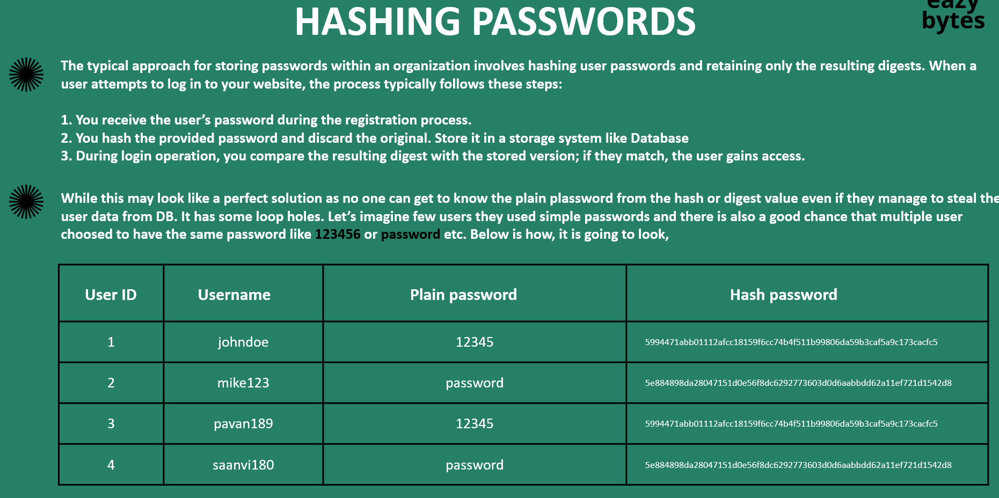
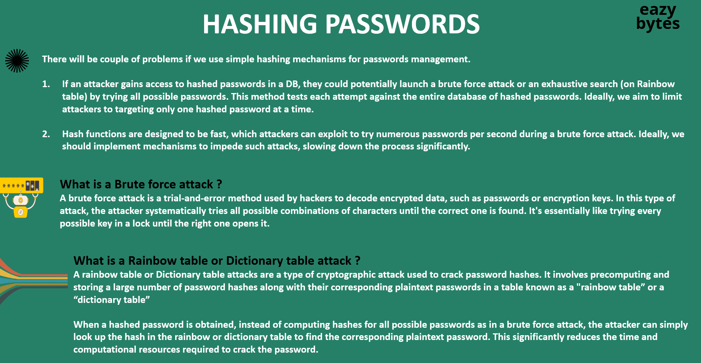
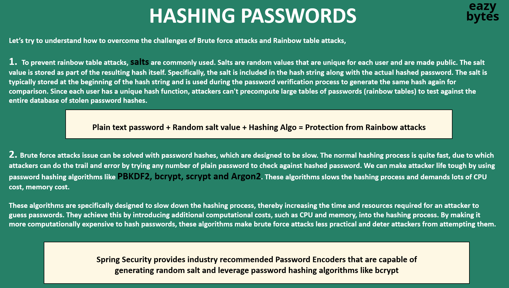
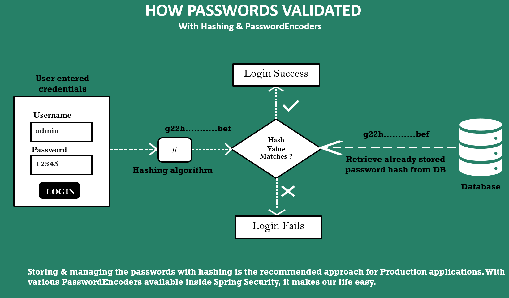
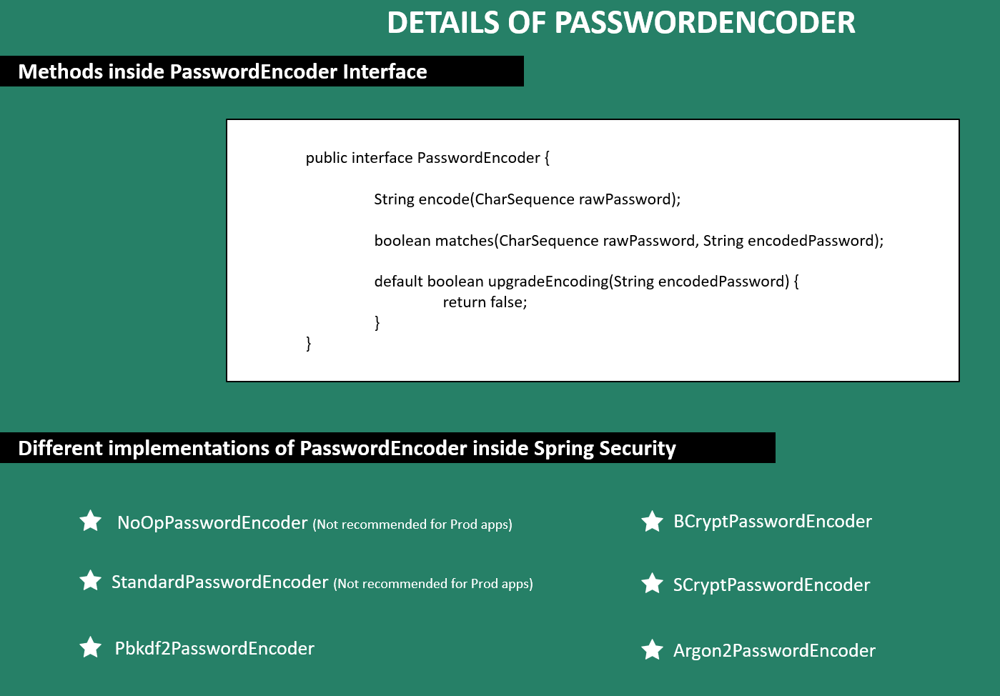
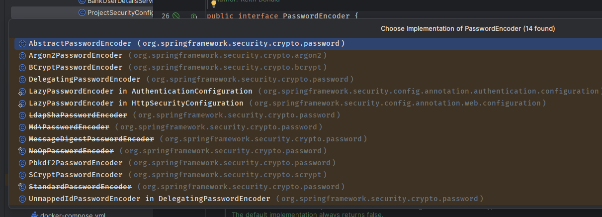
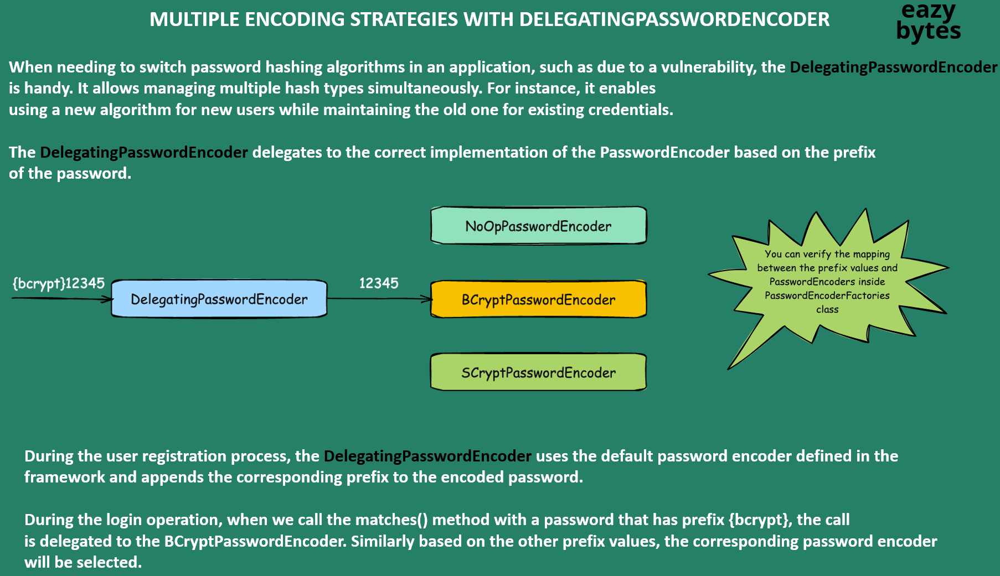

# 05 - Password Management with PasswordEncoders

- [05 - Password Management with PasswordEncoders](#05---password-management-with-passwordencoders)
  - [001 How our passwords validated with out PasswordEncoders](#001-how-our-passwords-validated-with-out-passwordencoders)
    - [1. **Overview of NoOpPasswordEncoder**](#1-overview-of-nooppasswordencoder)
      - [**Key Risk:**](#key-risk)
    - [2. **User Credentials Submission**](#2-user-credentials-submission)
    - [3. **Password Validation Process**](#3-password-validation-process)
    - [4. **NoOpPasswordEncoder is Not Recommended for Production**](#4-nooppasswordencoder-is-not-recommended-for-production)
      - [a) **Confidentiality Issues**:](#a-confidentiality-issues)
      - [b) **Integrity Issues**:](#b-integrity-issues)
    - [5. **Secure Alternatives to NoOpPasswordEncoder**](#5-secure-alternatives-to-nooppasswordencoder)
      - [a) **BCryptPasswordEncoder**](#a-bcryptpasswordencoder)
      - [b) **PBKDF2PasswordEncoder**](#b-pbkdf2passwordencoder)
    - [6. **How it Works with a Secure Encoder (Example)**](#6-how-it-works-with-a-secure-encoder-example)
      - [a) **User Registration (Secure Password Storage)**](#a-user-registration-secure-password-storage)
      - [b) **Login Process (Secure Password Validation)**](#b-login-process-secure-password-validation)
    - [7. **Conclusion: NoOpPasswordEncoder Use Case**](#7-conclusion-nooppasswordencoder-use-case)
  - [002 What is Encoding, Decoding \& why it is not suitable for passwords management](#002-what-is-encoding-decoding--why-it-is-not-suitable-for-passwords-management)
    - [1. **Encoding**](#1-encoding)
    - [2. **Encryption**](#2-encryption)
    - [3. **Hashing**](#3-hashing)
    - [Key Differences](#key-differences)
    - [Practical Example: Password Management in Applications](#practical-example-password-management-in-applications)
    - [Conclusion](#conclusion)
    - [1. **What is Encoding?**](#1-what-is-encoding)
    - [2. **The Encoding Process**](#2-the-encoding-process)
    - [3. **What is Decoding?**](#3-what-is-decoding)
    - [4. **The Decoding Process**](#4-the-decoding-process)
    - [5. **Real-World Examples**](#5-real-world-examples)
      - [a) **Base64 Encoding in Emails**](#a-base64-encoding-in-emails)
      - [b) **URL Encoding**](#b-url-encoding)
      - [c) **Encoding Data for Transmission**](#c-encoding-data-for-transmission)
    - [6. **Conclusion**](#6-conclusion)
  - [003 What is Encryption, Decryption \& why it is not suitable for passwords management](#003-what-is-encryption-decryption--why-it-is-not-suitable-for-passwords-management)
    - [1. **What is Encryption?**](#1-what-is-encryption)
    - [2. **Symmetric Encryption Overview**](#2-symmetric-encryption-overview)
      - [How Symmetric Encryption Works:](#how-symmetric-encryption-works)
    - [3. **Key Characteristics of Symmetric Encryption**](#3-key-characteristics-of-symmetric-encryption)
    - [4. **Famous Symmetric Encryption Algorithms**](#4-famous-symmetric-encryption-algorithms)
      - [a) **AES (Advanced Encryption Standard)**](#a-aes-advanced-encryption-standard)
      - [b) **Triple DES (3DES)**](#b-triple-des-3des)
      - [c) **Blowfish**](#c-blowfish)
    - [5. **Symmetric Encryption Use Cases**](#5-symmetric-encryption-use-cases)
      - [a) **File and Disk Encryption**](#a-file-and-disk-encryption)
      - [b) **Database Encryption**](#b-database-encryption)
      - [c) **Encrypting Network Communications**](#c-encrypting-network-communications)
    - [6. **Advantages and Disadvantages of Symmetric Encryption**](#6-advantages-and-disadvantages-of-symmetric-encryption)
      - [**Advantages**:](#advantages)
      - [**Disadvantages**:](#disadvantages)
    - [7. **Symmetric vs Asymmetric Encryption**](#7-symmetric-vs-asymmetric-encryption)
      - [Example of Combining Both:](#example-of-combining-both)
    - [8. **Conclusion**](#8-conclusion)
    - [1. **What is Asymmetric Encryption?**](#1-what-is-asymmetric-encryption)
      - [Key Concepts:](#key-concepts)
    - [2. **How Asymmetric Encryption Works**](#2-how-asymmetric-encryption-works)
    - [3. **Public and Private Key Pair**](#3-public-and-private-key-pair)
    - [4. **Examples of Asymmetric Encryption Algorithms**](#4-examples-of-asymmetric-encryption-algorithms)
      - [a) **RSA (Rivest-Shamir-Adleman)**](#a-rsa-rivest-shamir-adleman)
      - [b) **Diffie-Hellman Key Exchange**](#b-diffie-hellman-key-exchange)
      - [c) **Elliptic Curve Cryptography (ECC)**](#c-elliptic-curve-cryptography-ecc)
      - [d) **Pretty Good Privacy (PGP)**](#d-pretty-good-privacy-pgp)
    - [5. **Asymmetric Encryption Use Cases**](#5-asymmetric-encryption-use-cases)
      - [a) **Secure Web Traffic (HTTPS)**](#a-secure-web-traffic-https)
      - [b) **Email Encryption**](#b-email-encryption)
      - [c) **Digital Signatures**](#c-digital-signatures)
    - [6. **Advantages and Disadvantages of Asymmetric Encryption**](#6-advantages-and-disadvantages-of-asymmetric-encryption)
      - [**Advantages**:](#advantages-1)
      - [**Disadvantages**:](#disadvantages-1)
    - [7. **Combining Symmetric and Asymmetric Encryption (Hybrid Encryption)**](#7-combining-symmetric-and-asymmetric-encryption-hybrid-encryption)
    - [8. **Conclusion**](#8-conclusion-1)
  - [004 Demo of Encryption, Decryption](#004-demo-of-encryption-decryption)
    - [1. **Command Overview**](#1-command-overview)
    - [2. **How the Command Works**](#2-how-the-command-works)
    - [3. **Breaking Down the Process**](#3-breaking-down-the-process)
      - [a) **Encryption Algorithm (AES-256-CBC)**](#a-encryption-algorithm-aes-256-cbc)
      - [b) **Password-Based Key Derivation Function (PBKDF2)**](#b-password-based-key-derivation-function-pbkdf2)
      - [c) **Base64 Encoding**](#c-base64-encoding)
      - [d) **AES-256-CBC Encryption in Action**](#d-aes-256-cbc-encryption-in-action)
    - [4. **Example Workflow**](#4-example-workflow)
      - [a) **Input File (plain.txt)**:](#a-input-file-plaintxt)
      - [b) **Running the Command**:](#b-running-the-command)
      - [c) **Output File (encrypt.txt)**:](#c-output-file-encrypttxt)
    - [5. **Decrypting the File**](#5-decrypting-the-file)
    - [6. **Security Considerations**](#6-security-considerations)
    - [7. **Conclusion**](#7-conclusion)
    - [The Command](#the-command)
    - [Detailed Explanation of Each Part](#detailed-explanation-of-each-part)
      - [1. **`openssl`**](#1-openssl)
      - [2. **`enc`**](#2-enc)
      - [3. **`-aes-256-cbc`**](#3--aes-256-cbc)
      - [4. **`-base64`**](#4--base64)
      - [5. **`-pass pass:12345`**](#5--pass-pass12345)
      - [6. **`-d`**](#6--d)
      - [7. **`-pbkdf2`**](#7--pbkdf2)
      - [8. **`-in encrypt.txt`**](#8--in-encrypttxt)
      - [9. **`-out decrypt.txt`**](#9--out-decrypttxt)
    - [What Happens During Decryption?](#what-happens-during-decryption)
    - [Example Scenario](#example-scenario)
      - [a) **Encrypting a File**](#a-encrypting-a-file)
      - [b) **Decrypting the File**](#b-decrypting-the-file)
    - [Key Concepts in Encryption and Decryption](#key-concepts-in-encryption-and-decryption)
      - [1. **AES-256-CBC**:](#1-aes-256-cbc)
      - [2. **PBKDF2**:](#2-pbkdf2)
      - [3. **Base64 Encoding**:](#3-base64-encoding)
    - [Conclusion](#conclusion-1)
  - [005 Introduction to Hashing](#005-introduction-to-hashing)
    - [1. **What is Hashing?**](#1-what-is-hashing)
      - [Example of a Hashing Process:](#example-of-a-hashing-process)
      - [Key Characteristics of a Hash:](#key-characteristics-of-a-hash)
    - [2. **Irreversibility (One-Way Function)**](#2-irreversibility-one-way-function)
      - [Why Is Hashing One-Way?](#why-is-hashing-one-way)
    - [3. **Hash Functions and Their Use Cases**](#3-hash-functions-and-their-use-cases)
      - [a) **Data Integrity**](#a-data-integrity)
      - [b) **Password Hashing**](#b-password-hashing)
      - [c) **Digital Signatures and Certificates**](#c-digital-signatures-and-certificates)
    - [4. **Collision Resistance**](#4-collision-resistance)
      - [Why Is Collision Resistance Important?](#why-is-collision-resistance-important)
    - [5. **Popular Hash Functions**](#5-popular-hash-functions)
      - [a) **SHA-256 (Secure Hash Algorithm 256-bit)**](#a-sha-256-secure-hash-algorithm-256-bit)
      - [b) **MD5 (Message Digest Algorithm 5)**](#b-md5-message-digest-algorithm-5)
      - [c) **SHA-3 (Secure Hash Algorithm 3)**](#c-sha-3-secure-hash-algorithm-3)
    - [6. **Use Case: File Integrity Check**](#6-use-case-file-integrity-check)
    - [7. **Example of a Hashing Workflow**](#7-example-of-a-hashing-workflow)
      - [Input:](#input)
      - [Hash Function:](#hash-function)
      - [Output:](#output)
    - [8. **Irreversibility Example (Blender Analogy)**](#8-irreversibility-example-blender-analogy)
    - [9. **Conclusion**](#9-conclusion)
    - [Command:](#command)
    - [1. **`echo -n "EazyBytes@12345"`**](#1-echo--n-eazybytes12345)
    - [2. **`|` (Pipe Operator)**](#2--pipe-operator)
    - [3. **`openssl`**](#3-openssl)
    - [4. **`dgst`**](#4-dgst)
    - [5. **`-sha256`**](#5--sha256)
    - [How It Works:](#how-it-works)
    - [Example of Running the Command:](#example-of-running-the-command)
    - [6. **Understanding the Hash Output**](#6-understanding-the-hash-output)
    - [Why SHA-256 and Hashing Are Important:](#why-sha-256-and-hashing-are-important)
    - [Important Security Notes:](#important-security-notes)
    - [Conclusion:](#conclusion-2)
  - [006 Drawbacks of Hashing \& what are Brute force attacks, Dictionary or Rainbow tab](#006-drawbacks-of-hashing--what-are-brute-force-attacks-dictionary-or-rainbow-tab)
    - [1. **Typical Password Hashing Process**](#1-typical-password-hashing-process)
      - [Steps:](#steps)
    - [2. **Example of Password Hashing in Action**](#2-example-of-password-hashing-in-action)
      - [Insights from the Example:](#insights-from-the-example)
    - [3. **Vulnerabilities of Simple Hashing**](#3-vulnerabilities-of-simple-hashing)
      - [a) **Rainbow Table Attacks**](#a-rainbow-table-attacks)
      - [b) **Brute-Force Attacks**](#b-brute-force-attacks)
    - [4. **Limitations of Basic Hashing and How to Improve Security**](#4-limitations-of-basic-hashing-and-how-to-improve-security)
      - [a) **Adding Salt**](#a-adding-salt)
      - [b) **Using a Strong Hashing Algorithm with Salt**](#b-using-a-strong-hashing-algorithm-with-salt)
    - [5. **Best Practices for Hashing Passwords**](#5-best-practices-for-hashing-passwords)
      - [a) **Use Salt for Every Password**](#a-use-salt-for-every-password)
      - [b) **Use a Slow Hashing Algorithm (e.g., bcrypt, Argon2)**](#b-use-a-slow-hashing-algorithm-eg-bcrypt-argon2)
      - [c) **Avoid Weak Passwords**](#c-avoid-weak-passwords)
      - [d) **Implement Multi-Factor Authentication (MFA)**](#d-implement-multi-factor-authentication-mfa)
    - [6. **Conclusion**](#6-conclusion-1)
  - [007 How to overcome Hashing drawbacks, Brute force and Dictionary table attacks](#007-how-to-overcome-hashing-drawbacks-brute-force-and-dictionary-table-attacks)
    - [1. **Problems with Simple Hashing Mechanisms**](#1-problems-with-simple-hashing-mechanisms)
      - [a) **Brute Force Attacks**](#a-brute-force-attacks)
      - [b) **Rainbow Table or Dictionary Table Attacks**](#b-rainbow-table-or-dictionary-table-attacks)
    - [2. **What is a Brute Force Attack?**](#2-what-is-a-brute-force-attack)
    - [3. **What is a Rainbow Table Attack?**](#3-what-is-a-rainbow-table-attack)
      - [How to Mitigate These Attacks](#how-to-mitigate-these-attacks)
    - [4. **Mitigating Brute Force and Rainbow Table Attacks**](#4-mitigating-brute-force-and-rainbow-table-attacks)
      - [a) **Salting Passwords**](#a-salting-passwords)
      - [b) **Use Slow Hashing Algorithms (bcrypt, PBKDF2, Argon2)**](#b-use-slow-hashing-algorithms-bcrypt-pbkdf2-argon2)
      - [c) **Enforce Strong Password Policies**](#c-enforce-strong-password-policies)
      - [d) **Use Multi-Factor Authentication (MFA)**](#d-use-multi-factor-authentication-mfa)
    - [5. **Conclusion**](#5-conclusion)
    - [1. **Salting Passwords to Prevent Rainbow Table Attacks**](#1-salting-passwords-to-prevent-rainbow-table-attacks)
      - [a) **What is a Salt?**](#a-what-is-a-salt)
      - [b) **Protection from Rainbow Table Attacks**](#b-protection-from-rainbow-table-attacks)
      - [c) **Salting in Practice**](#c-salting-in-practice)
    - [2. **Using Slow Hashing Algorithms to Defeat Brute Force Attacks**](#2-using-slow-hashing-algorithms-to-defeat-brute-force-attacks)
      - [a) **Slow Hashing Algorithms**](#a-slow-hashing-algorithms)
      - [b) **How It Slows Down Brute Force Attacks**](#b-how-it-slows-down-brute-force-attacks)
      - [c) **Memory and CPU Costs**](#c-memory-and-cpu-costs)
      - [d) **Spring Security and Password Hashing**](#d-spring-security-and-password-hashing)
    - [3. **How Slow Hashing Algorithms Work in Practice**](#3-how-slow-hashing-algorithms-work-in-practice)
    - [4. **Conclusion**](#4-conclusion)
      - [Key Takeaways:](#key-takeaways)
  - [008 Introduction to PasswordEncoders in Spring Security](#008-introduction-to-passwordencoders-in-spring-security)
    - [1. **User Enters Credentials**](#1-user-enters-credentials)
    - [2. **Password Hashing**](#2-password-hashing)
    - [3. **Retrieve Stored Hash from Database**](#3-retrieve-stored-hash-from-database)
    - [4. **Comparing Hash Values**](#4-comparing-hash-values)
      - [**Why Hashing is Secure:**](#why-hashing-is-secure)
    - [5. **Login Success or Failure**](#5-login-success-or-failure)
    - [Example of the Entire Process:](#example-of-the-entire-process)
      - [a) **User Registration**:](#a-user-registration)
      - [b) **User Login**:](#b-user-login)
      - [c) **Login with Wrong Password**:](#c-login-with-wrong-password)
    - [6. **Why Hashing and PasswordEncoders are Essential**](#6-why-hashing-and-passwordencoders-are-essential)
      - [a) **Storing Plain-Text Passwords is Dangerous**:](#a-storing-plain-text-passwords-is-dangerous)
      - [b) **Hashing Protects Passwords**:](#b-hashing-protects-passwords)
      - [c) **PasswordEncoders Add Security Features**:](#c-passwordencoders-add-security-features)
    - [7. **Conclusion**](#7-conclusion-1)
    - [1. **PasswordEncoder Interface**](#1-passwordencoder-interface)
      - [a) **`encode(CharSequence rawPassword)`**](#a-encodecharsequence-rawpassword)
      - [b) **`matches(CharSequence rawPassword, String encodedPassword)`**](#b-matchescharsequence-rawpassword-string-encodedpassword)
      - [c) **`upgradeEncoding(String encodedPassword)`**](#c-upgradeencodingstring-encodedpassword)
    - [2. **Different Implementations of PasswordEncoder**](#2-different-implementations-of-passwordencoder)
      - [a) **NoOpPasswordEncoder**](#a-nooppasswordencoder)
      - [b) **BCryptPasswordEncoder**](#b-bcryptpasswordencoder)
      - [c) **StandardPasswordEncoder (SHA-256)**](#c-standardpasswordencoder-sha-256)
      - [d) **SCryptPasswordEncoder**](#d-scryptpasswordencoder)
      - [e) **PBKDF2PasswordEncoder**](#e-pbkdf2passwordencoder)
      - [f) **Argon2PasswordEncoder**](#f-argon2passwordencoder)
    - [3. **How to Choose the Right PasswordEncoder**](#3-how-to-choose-the-right-passwordencoder)
    - [4. **Conclusion**](#4-conclusion-1)
    - [1. **`encode(CharSequence rawPassword)`**](#1-encodecharsequence-rawpassword)
      - [How it works:](#how-it-works-1)
      - [Example:](#example)
    - [2. **`matches(CharSequence rawPassword, String encodedPassword)`**](#2-matchescharsequence-rawpassword-string-encodedpassword)
      - [How it works:](#how-it-works-2)
      - [Example:](#example-1)
      - [Key Points:](#key-points)
    - [3. **`upgradeEncoding(String encodedPassword)`**](#3-upgradeencodingstring-encodedpassword)
      - [How it works:](#how-it-works-3)
      - [Example Use Case:](#example-use-case)
    - [Example Workflow in a Real Application](#example-workflow-in-a-real-application)
    - [4. **PasswordEncoder Implementations**](#4-passwordencoder-implementations)
    - [Summary of Key Concepts](#summary-of-key-concepts)
  - [009 Deep dive of PasswordEncoder implementation classes](#009-deep-dive-of-passwordencoder-implementation-classes)
    - [1. **Purpose of NoOpPasswordEncoder**](#1-purpose-of-nooppasswordencoder)
      - [Key Points:](#key-points-1)
    - [2. **Class Overview**](#2-class-overview)
      - [Key Components:](#key-components)
    - [3. **Methods in NoOpPasswordEncoder**](#3-methods-in-nooppasswordencoder)
      - [a) **`encode(CharSequence rawPassword)`**](#a-encodecharsequence-rawpassword-1)
        - [Example:](#example-2)
      - [Why It’s Insecure:](#why-its-insecure)
      - [b) **`matches(CharSequence rawPassword, String encodedPassword)`**](#b-matchescharsequence-rawpassword-string-encodedpassword-1)
        - [Example:](#example-3)
      - [Why It’s Insecure:](#why-its-insecure-1)
    - [4. **Singleton Pattern**](#4-singleton-pattern)
      - [Example:](#example-4)
      - [Why the Singleton Pattern Works Here:](#why-the-singleton-pattern-works-here)
    - [5. **Security Warning**](#5-security-warning)
    - [6. **Example Use Case for NoOpPasswordEncoder**](#6-example-use-case-for-nooppasswordencoder)
      - [a) **Testing**:](#a-testing)
        - [Example Test:](#example-test)
      - [b) **Legacy Systems**:](#b-legacy-systems)
    - [7. **Conclusion**](#7-conclusion-2)
    - [1. **Overview of StandardPasswordEncoder**](#1-overview-of-standardpasswordencoder)
    - [2. **Key Components of the Class**](#2-key-components-of-the-class)
      - [a) **DEFAULT\_ITERATIONS**](#a-default_iterations)
      - [b) **Secret Key**](#b-secret-key)
      - [c) **Salting (Random Salt)**](#c-salting-random-salt)
      - [d) **Digester (SHA-256)**](#d-digester-sha-256)
    - [3. **Key Methods**](#3-key-methods)
      - [a) **`encode(CharSequence rawPassword)`**](#a-encodecharsequence-rawpassword-2)
        - [Example:](#example-5)
        - [Breakdown:](#breakdown)
      - [b) **`matches(CharSequence rawPassword, String encodedPassword)`**](#b-matchescharsequence-rawpassword-string-encodedpassword-2)
        - [Example:](#example-6)
        - [Security Issue:](#security-issue)
      - [c) **Private Helper Methods:**](#c-private-helper-methods)
    - [4. **How Encoding Works Internally**](#4-how-encoding-works-internally)
      - [Example Process:](#example-process)
    - [5. **Why This Approach is Deprecated**](#5-why-this-approach-is-deprecated)
    - [6. **Conclusion**](#6-conclusion-2)
    - [1. **Key Components of the `Pbkdf2PasswordEncoder`**](#1-key-components-of-the-pbkdf2passwordencoder)
      - [a) **Salt Length**](#a-salt-length)
      - [b) **Hash Width**](#b-hash-width)
      - [c) **Iterations**](#c-iterations)
      - [d) **Secret**](#d-secret)
      - [e) **Algorithm**](#e-algorithm)
      - [f) **Salt Generator**](#f-salt-generator)
    - [2. **Constructors**](#2-constructors)
      - [a) **Default Constructor**](#a-default-constructor)
      - [b) **Custom Constructor with Algorithm**](#b-custom-constructor-with-algorithm)
      - [Example:](#example-7)
    - [3. **Key Methods**](#3-key-methods-1)
      - [a) **`encode(CharSequence rawPassword)`**](#a-encodecharsequence-rawpassword-3)
        - [Example:](#example-8)
        - [How it Works:](#how-it-works-4)
        - [Breakdown:](#breakdown-1)
      - [b) **`matches(CharSequence rawPassword, String encodedPassword)`**](#b-matchescharsequence-rawpassword-string-encodedpassword-3)
        - [Example:](#example-9)
        - [How it Works:](#how-it-works-5)
        - [Security:](#security)
      - [c) **`setEncodeHashAsBase64(boolean encodeHashAsBase64)`**](#c-setencodehashasbase64boolean-encodehashasbase64)
        - [Example:](#example-10)
    - [4. **Customizing the Algorithm**](#4-customizing-the-algorithm)
        - [Example:](#example-11)
    - [5. **Why PBKDF2 is Secure**](#5-why-pbkdf2-is-secure)
    - [6. **Deprecation and Evolution**](#6-deprecation-and-evolution)
    - [Conclusion](#conclusion-3)
    - [Overview of BCrypt](#overview-of-bcrypt)
    - [1. **Key Components of `BCryptPasswordEncoder`**](#1-key-components-of-bcryptpasswordencoder)
      - [a) **BCrypt Version**](#a-bcrypt-version)
      - [Example:](#example-12)
      - [b) **Strength (Work Factor)**](#b-strength-work-factor)
      - [Example:](#example-13)
      - [c) **Secure Random**](#c-secure-random)
      - [Example:](#example-14)
    - [2. **Key Methods of `BCryptPasswordEncoder`**](#2-key-methods-of-bcryptpasswordencoder)
      - [a) **`encode(CharSequence rawPassword)`**](#a-encodecharsequence-rawpassword-4)
        - [Example:](#example-15)
      - [How it Works:](#how-it-works-6)
        - [Sample Output:](#sample-output)
      - [b) **`matches(CharSequence rawPassword, String encodedPassword)`**](#b-matchescharsequence-rawpassword-string-encodedpassword-4)
        - [Example:](#example-16)
      - [How it Works:](#how-it-works-7)
      - [Security:](#security-1)
      - [c) **`upgradeEncoding(String encodedPassword)`**](#c-upgradeencodingstring-encodedpassword-1)
        - [Example:](#example-17)
      - [How it Works:](#how-it-works-8)
    - [3. **BCrypt Hashing Process**](#3-bcrypt-hashing-process)
      - [Hashing Steps:](#hashing-steps)
    - [4. **BCrypt Pattern**](#4-bcrypt-pattern)
    - [5. **Example Usage in a Real Application**](#5-example-usage-in-a-real-application)
      - [User Registration:](#user-registration)
      - [User Login:](#user-login)
    - [6. **Conclusion**](#6-conclusion-3)
      - [Key Benefits:](#key-benefits)
      - [Use Cases:](#use-cases)
    - [1. **Overview of SCrypt**](#1-overview-of-scrypt)
      - [Key Parameters:](#key-parameters)
    - [2. **Key Components of `SCryptPasswordEncoder`**](#2-key-components-of-scryptpasswordencoder)
      - [a) **CPU Cost (N)**](#a-cpu-cost-n)
      - [Example:](#example-18)
      - [b) **Memory Cost (r)**](#b-memory-cost-r)
      - [c) **Parallelization (p)**](#c-parallelization-p)
      - [Example:](#example-19)
      - [d) **Key Length (dkLen)**](#d-key-length-dklen)
      - [Example:](#example-20)
      - [e) **Salt Length (S)**](#e-salt-length-s)
    - [3. **Key Methods of `SCryptPasswordEncoder`**](#3-key-methods-of-scryptpasswordencoder)
      - [a) **`encode(CharSequence rawPassword)`**](#a-encodecharsequence-rawpassword-5)
        - [Example:](#example-21)
      - [How it Works:](#how-it-works-9)
        - [Sample Output:](#sample-output-1)
      - [b) **`matches(CharSequence rawPassword, String encodedPassword)`**](#b-matchescharsequence-rawpassword-string-encodedpassword-5)
        - [Example:](#example-22)
      - [How it Works:](#how-it-works-10)
    - [4. **Security Benefits of SCrypt**](#4-security-benefits-of-scrypt)
      - [a) **Memory-Hardness**](#a-memory-hardness)
      - [b) **CPU Intensity**](#b-cpu-intensity)
      - [c) **Salting**](#c-salting)
    - [5. **Example Usage in a Real Application**](#5-example-usage-in-a-real-application-1)
      - [User Registration:](#user-registration-1)
      - [User Login:](#user-login-1)
    - [6. **Conclusion**](#6-conclusion-4)
      - [Key Benefits:](#key-benefits-1)
    - [Key Features of Argon2](#key-features-of-argon2)
    - [1. **Core Components of `Argon2PasswordEncoder`**](#1-core-components-of-argon2passwordencoder)
      - [a) **Salt Length (saltLength)**](#a-salt-length-saltlength)
      - [b) **Hash Length (hashLength)**](#b-hash-length-hashlength)
      - [c) **Parallelism**](#c-parallelism)
      - [d) **Memory Cost**](#d-memory-cost)
      - [e) **Iterations**](#e-iterations)
    - [2. **Key Methods of `Argon2PasswordEncoder`**](#2-key-methods-of-argon2passwordencoder)
      - [a) **`encode(CharSequence rawPassword)`**](#a-encodecharsequence-rawpassword-6)
        - [Example:](#example-23)
        - [Output:](#output-1)
      - [b) **`matches(CharSequence rawPassword, String encodedPassword)`**](#b-matchescharsequence-rawpassword-string-encodedpassword-6)
        - [Example:](#example-24)
      - [How It Works:](#how-it-works-11)
    - [3. **Security Aspects of Argon2PasswordEncoder**](#3-security-aspects-of-argon2passwordencoder)
      - [a) **Memory-Hardness**](#a-memory-hardness-1)
      - [b) **Salted Hashing**](#b-salted-hashing)
      - [c) **Configurable Parameters**](#c-configurable-parameters)
      - [d) **Constant Time Comparison**](#d-constant-time-comparison)
    - [4. **How to Tune Parameters for Security**](#4-how-to-tune-parameters-for-security)
      - [a) **Increasing Memory Cost**](#a-increasing-memory-cost)
      - [b) **Increasing Iterations**](#b-increasing-iterations)
      - [c) **Parallelism**](#c-parallelism-1)
    - [5. **Example in a Real-World Application**](#5-example-in-a-real-world-application)
      - [User Registration:](#user-registration-2)
      - [User Login:](#user-login-2)
    - [Conclusion](#conclusion-4)
  - [010 Demo of registration and login with Bcrypt password encoder](#010-demo-of-registration-and-login-with-bcrypt-password-encoder)
    - [Key Features of `DelegatingPasswordEncoder`](#key-features-of-delegatingpasswordencoder)
    - [1. **How `DelegatingPasswordEncoder` Works**](#1-how-delegatingpasswordencoder-works)
      - [Example Encoded Password:](#example-encoded-password)
    - [2. **Flow of `DelegatingPasswordEncoder`**](#2-flow-of-delegatingpasswordencoder)
    - [3. **Configuration of `DelegatingPasswordEncoder`**](#3-configuration-of-delegatingpasswordencoder)
    - [4. **Key Methods in `DelegatingPasswordEncoder`**](#4-key-methods-in-delegatingpasswordencoder)
      - [a) **encode(CharSequence rawPassword)**](#a-encodecharsequence-rawpassword-7)
        - [Example:](#example-25)
        - [Output:](#output-2)
      - [b) **matches(CharSequence rawPassword, String encodedPassword)**](#b-matchescharsequence-rawpassword-string-encodedpassword-7)
        - [Example:](#example-26)
    - [5. **Real-World Scenario: Migrating Passwords**](#5-real-world-scenario-migrating-passwords)
      - [Without `DelegatingPasswordEncoder`:](#without-delegatingpasswordencoder)
      - [With `DelegatingPasswordEncoder`:](#with-delegatingpasswordencoder)
    - [6. **Advantages of Using `DelegatingPasswordEncoder`**](#6-advantages-of-using-delegatingpasswordencoder)
    - [7. **Detailed Example**](#7-detailed-example)
      - [Old Password:](#old-password)
      - [New Password:](#new-password)
      - [Steps:](#steps-1)
    - [Conclusion](#conclusion-5)


## 001 How our passwords validated with out PasswordEncoders
```java
    @Bean
    public PasswordEncoder passwordEncoder() {
        return PasswordEncoderFactories.createDelegatingPasswordEncoder();
    }
```
```java
/*
 * Copyright 2002-2022 the original author or authors.
 *
 * Licensed under the Apache License, Version 2.0 (the "License");
 * you may not use this file except in compliance with the License.
 * You may obtain a copy of the License at
 *
 *      https://www.apache.org/licenses/LICENSE-2.0
 *
 * Unless required by applicable law or agreed to in writing, software
 * distributed under the License is distributed on an "AS IS" BASIS,
 * WITHOUT WARRANTIES OR CONDITIONS OF ANY KIND, either express or implied.
 * See the License for the specific language governing permissions and
 * limitations under the License.
 */

package org.springframework.security.crypto.factory;

import java.util.HashMap;
import java.util.Map;

import org.springframework.security.crypto.argon2.Argon2PasswordEncoder;
import org.springframework.security.crypto.bcrypt.BCryptPasswordEncoder;
import org.springframework.security.crypto.password.DelegatingPasswordEncoder;
import org.springframework.security.crypto.password.PasswordEncoder;
import org.springframework.security.crypto.password.Pbkdf2PasswordEncoder;
import org.springframework.security.crypto.scrypt.SCryptPasswordEncoder;

/**
 * Used for creating {@link PasswordEncoder} instances
 *
 * @author Rob Winch
 * @since 5.0
 */
public final class PasswordEncoderFactories {

	private PasswordEncoderFactories() {
	}

	/**
	 * Creates a {@link DelegatingPasswordEncoder} with default mappings. Additional
	 * mappings may be added and the encoding will be updated to conform with best
	 * practices. However, due to the nature of {@link DelegatingPasswordEncoder} the
	 * updates should not impact users. The mappings current are:
	 *
	 * <ul>
	 * <li>bcrypt - {@link BCryptPasswordEncoder} (Also used for encoding)</li>
	 * <li>ldap -
	 * {@link org.springframework.security.crypto.password.LdapShaPasswordEncoder}</li>
	 * <li>MD4 -
	 * {@link org.springframework.security.crypto.password.Md4PasswordEncoder}</li>
	 * <li>MD5 - {@code new MessageDigestPasswordEncoder("MD5")}</li>
	 * <li>noop -
	 * {@link org.springframework.security.crypto.password.NoOpPasswordEncoder}</li>
	 * <li>pbkdf2 - {@link Pbkdf2PasswordEncoder#defaultsForSpringSecurity_v5_5()}</li>
	 * <li>pbkdf2@SpringSecurity_v5_8 -
	 * {@link Pbkdf2PasswordEncoder#defaultsForSpringSecurity_v5_8()}</li>
	 * <li>scrypt - {@link SCryptPasswordEncoder#defaultsForSpringSecurity_v4_1()}</li>
	 * <li>scrypt@SpringSecurity_v5_8 -
	 * {@link SCryptPasswordEncoder#defaultsForSpringSecurity_v5_8()}</li>
	 * <li>SHA-1 - {@code new MessageDigestPasswordEncoder("SHA-1")}</li>
	 * <li>SHA-256 - {@code new MessageDigestPasswordEncoder("SHA-256")}</li>
	 * <li>sha256 -
	 * {@link org.springframework.security.crypto.password.StandardPasswordEncoder}</li>
	 * <li>argon2 - {@link Argon2PasswordEncoder#defaultsForSpringSecurity_v5_2()}</li>
	 * <li>argon2@SpringSecurity_v5_8 -
	 * {@link Argon2PasswordEncoder#defaultsForSpringSecurity_v5_8()}</li>
	 * </ul>
	 * @return the {@link PasswordEncoder} to use
	 */
	@SuppressWarnings("deprecation")
	public static PasswordEncoder createDelegatingPasswordEncoder() {
		String encodingId = "bcrypt";
		Map<String, PasswordEncoder> encoders = new HashMap<>();
		encoders.put(encodingId, new BCryptPasswordEncoder());
		encoders.put("ldap", new org.springframework.security.crypto.password.LdapShaPasswordEncoder());
		encoders.put("MD4", new org.springframework.security.crypto.password.Md4PasswordEncoder());
		encoders.put("MD5", new org.springframework.security.crypto.password.MessageDigestPasswordEncoder("MD5"));
		encoders.put("noop", org.springframework.security.crypto.password.NoOpPasswordEncoder.getInstance());
		encoders.put("pbkdf2", Pbkdf2PasswordEncoder.defaultsForSpringSecurity_v5_5());
		encoders.put("pbkdf2@SpringSecurity_v5_8", Pbkdf2PasswordEncoder.defaultsForSpringSecurity_v5_8());
		encoders.put("scrypt", SCryptPasswordEncoder.defaultsForSpringSecurity_v4_1());
		encoders.put("scrypt@SpringSecurity_v5_8", SCryptPasswordEncoder.defaultsForSpringSecurity_v5_8());
		encoders.put("SHA-1", new org.springframework.security.crypto.password.MessageDigestPasswordEncoder("SHA-1"));
		encoders.put("SHA-256",
				new org.springframework.security.crypto.password.MessageDigestPasswordEncoder("SHA-256"));
		encoders.put("sha256", new org.springframework.security.crypto.password.StandardPasswordEncoder());
		encoders.put("argon2", Argon2PasswordEncoder.defaultsForSpringSecurity_v5_2());
		encoders.put("argon2@SpringSecurity_v5_8", Argon2PasswordEncoder.defaultsForSpringSecurity_v5_8());
		return new DelegatingPasswordEncoder(encodingId, encoders);
	}

}

```
```java
/*
 * Copyright 2011-2016 the original author or authors.
 *
 * Licensed under the Apache License, Version 2.0 (the "License");
 * you may not use this file except in compliance with the License.
 * You may obtain a copy of the License at
 *
 *      https://www.apache.org/licenses/LICENSE-2.0
 *
 * Unless required by applicable law or agreed to in writing, software
 * distributed under the License is distributed on an "AS IS" BASIS,
 * WITHOUT WARRANTIES OR CONDITIONS OF ANY KIND, either express or implied.
 * See the License for the specific language governing permissions and
 * limitations under the License.
 */

package org.springframework.security.crypto.password;

/**
 * Service interface for encoding passwords.
 *
 * The preferred implementation is {@code BCryptPasswordEncoder}.
 *
 * @author Keith Donald
 */
public interface PasswordEncoder {

	/**
	 * Encode the raw password. Generally, a good encoding algorithm applies a SHA-1 or
	 * greater hash combined with an 8-byte or greater randomly generated salt.
	 */
	String encode(CharSequence rawPassword);

	/**
	 * Verify the encoded password obtained from storage matches the submitted raw
	 * password after it too is encoded. Returns true if the passwords match, false if
	 * they do not. The stored password itself is never decoded.
	 * @param rawPassword the raw password to encode and match
	 * @param encodedPassword the encoded password from storage to compare with
	 * @return true if the raw password, after encoding, matches the encoded password from
	 * storage
	 */
	boolean matches(CharSequence rawPassword, String encodedPassword);

	/**
	 * Returns true if the encoded password should be encoded again for better security,
	 * else false. The default implementation always returns false.
	 * @param encodedPassword the encoded password to check
	 * @return true if the encoded password should be encoded again for better security,
	 * else false.
	 */
	default boolean upgradeEncoding(String encodedPassword) {
		return false;
	}

}

```


This diagram explains how password validation works using Spring Security's `NoOpPasswordEncoder`, which does not apply any encryption or hashing to passwords, meaning the passwords are stored and processed in plain text. Let's go through each part of the diagram and explain it in detail with practical examples.

### 1. **Overview of NoOpPasswordEncoder**

`NoOpPasswordEncoder` is a class in Spring Security that performs no encoding or encryption of passwords. It is primarily used in development or testing environments when you want to avoid the complexity of password hashing. However, the use of `NoOpPasswordEncoder` is **not recommended for production** environments because it leaves passwords exposed in plain text, which compromises both **integrity** and **confidentiality**.

#### **Key Risk:**
When passwords are stored in plain text in a database, anyone with access to the database (e.g., an attacker who compromises the system) can see and use these passwords, which can lead to unauthorized access to user accounts.

### 2. **User Credentials Submission**

In the diagram, the user submits the following credentials through a login form:

- **Username**: `admin`
- **Password**: `12345`

These credentials are sent to the server as plain text (assuming no encryption like HTTPS is used, which introduces further security risks).

### 3. **Password Validation Process**

When a user submits their credentials, the following sequence of events occurs:

1. **Credentials Submission**: The user inputs their username and password (`admin` and `12345`), and clicks the "LOGIN" button.
   
2. **Loading User Details from Database**: The application receives the submitted credentials and calls the `loadUserByUsername()` method from the `UserDetailsService` implementation. This method retrieves the user details from the database. The query fetches the following data for the user with the username `admin`:
   - **Username**: `admin`
   - **Password**: `12345` (stored in plain text in the database)
   
3. **Password Comparison (Matching Process)**:
   - After retrieving the user details, Spring Security compares the password entered by the user (`12345`) with the password stored in the database (`12345`).
   - Since `NoOpPasswordEncoder` is being used, no hashing or encryption is performed on either the stored password or the submitted password, meaning the comparison is done directly in plain text.

4. **Decision Point: Does the Password Match?**
   - **Match**: If the submitted password matches the password stored in the database (in this case, `12345` matches `12345`), the user is successfully authenticated and granted access to the system (login success).
   - **No Match**: If the password does not match (for example, if the user entered `123456` instead of `12345`), authentication fails, and the user is denied access (login failure).

### 4. **NoOpPasswordEncoder is Not Recommended for Production**

At the bottom of the diagram, it clearly states that using `NoOpPasswordEncoder` is **not recommended for production**. Here’s why:

#### a) **Confidentiality Issues**:
- **Plain-text Passwords**: If passwords are stored in plain text in the database, they can be easily read by anyone with access to the database. This includes database administrators, attackers who gain unauthorized access, or even backups where passwords are not properly encrypted.
- **No Encryption**: Unlike more secure password encoders (e.g., `BCryptPasswordEncoder`, `PBKDF2PasswordEncoder`), `NoOpPasswordEncoder` does not perform any encryption or hashing. This means that even during transmission, the password is exposed unless the connection is encrypted (e.g., via HTTPS).

#### b) **Integrity Issues**:
- **Database Compromise**: If an attacker gains access to the database, they can easily read and use all passwords because they are stored in an easily accessible format (plain text).
- **Reused Passwords**: Many users tend to reuse passwords across different platforms. If your database is compromised, attackers can use the exposed plain-text passwords to gain access to other services where users have reused the same password.

### 5. **Secure Alternatives to NoOpPasswordEncoder**

In a production environment, it’s crucial to use password encoding to protect sensitive user data. Instead of `NoOpPasswordEncoder`, secure alternatives should be used, such as:

#### a) **BCryptPasswordEncoder**
This is one of the most commonly used password encoders in Spring Security. It hashes the password using the BCrypt hashing function, which includes a built-in salt and is resistant to rainbow table attacks.

**Example**:
- When the user registers with the password `12345`, `BCryptPasswordEncoder` hashes the password into a string like this:
  ```
  $2a$10$0VVyXaMOX7FdMhFVyxLfEu.Vex8pXjGlwQmZzmU9uSeOE5XfXoUdS
  ```
- The hash is stored in the database. When the user logs in, the submitted password is hashed again, and the hashes are compared.

**Code Example**:
```java
@Bean
public PasswordEncoder passwordEncoder() {
    return new BCryptPasswordEncoder();
}
```

#### b) **PBKDF2PasswordEncoder**
This is another secure password encoder that uses the PBKDF2 (Password-Based Key Derivation Function 2) algorithm, which applies a hash function multiple times to create a secure password hash.

**Code Example**:
```java
@Bean
public PasswordEncoder passwordEncoder() {
    return new Pbkdf2PasswordEncoder();
}
```

### 6. **How it Works with a Secure Encoder (Example)**

Let’s see how the process differs when a secure password encoder (e.g., `BCryptPasswordEncoder`) is used:

#### a) **User Registration (Secure Password Storage)**
- When the user registers with the password `12345`, Spring Security will use `BCryptPasswordEncoder` to hash the password before storing it in the database.
- The stored password will look something like this: `$2a$10$0VVyXaMOX7FdMhFVyxLfEu.Vex8pXjGlwQmZzmU9uSeOE5XfXoUdS`.

#### b) **Login Process (Secure Password Validation)**
1. **Credentials Submission**: The user submits their credentials (`admin`, `12345`).
2. **Password Retrieval**: The system retrieves the hashed password from the database.
3. **Password Comparison**: Instead of comparing plain-text passwords, Spring Security hashes the submitted password (`12345`) using the same algorithm (`BCryptPasswordEncoder`) and compares it with the stored hash.
4. **Result**:
   - If the hashes match, the user is authenticated.
   - If the hashes do not match, the user is denied access.

### 7. **Conclusion: NoOpPasswordEncoder Use Case**

`NoOpPasswordEncoder` is typically used in **development or testing environments** where:
- Password security is not the primary concern.
- You want to avoid the complexity of hashing while quickly testing functionality.
  
However, in a **production environment**, using a secure password encoding mechanism like `BCryptPasswordEncoder` or `PBKDF2PasswordEncoder` is essential to ensure the integrity and confidentiality of user passwords.

By using `NoOpPasswordEncoder`, you expose sensitive data (passwords) to a variety of security risks, and this practice is explicitly discouraged in real-world applications.

## 002 What is Encoding, Decoding & why it is not suitable for passwords management


The diagram presents a comparison between **Encoding**, **Encryption**, and **Hashing**—three distinct methods of processing data, each serving a unique purpose in the context of data privacy and security. Below is a deep explanation of each method, along with real-world examples, highlighting when and why these processes are used.

### 1. **Encoding**

- **Definition**: Encoding is the process of converting data from one format to another for the purpose of interoperability, storage, or transmission. It is not designed for security purposes and does not involve cryptographic techniques.

- **Purpose**: Encoding ensures that data is transformed into a format that can be understood by different systems (computers, software, or devices). The key point is that encoding is **reversible**—anyone with the proper decoder can retrieve the original data.

- **How it Works**:
  - A set of rules (or algorithms) is applied to transform the original data into a specific format.
  - Since encoding is not a security measure, the encoded data can be easily converted back to its original form without any special key or secret.

- **Examples**:
  - **ASCII (American Standard Code for Information Interchange)**: Transforms characters into numeric codes. For example, the letter "A" is represented by the number 65.
  - **Base64 Encoding**: Commonly used to encode binary data, such as images, so they can be transmitted over text-based protocols like HTTP. For instance, an image file can be encoded as Base64 to be embedded in HTML or XML.
    - Example: The string `"hello"` becomes `"aGVsbG8="` in Base64 encoding.
  - **UNICODE**: A standardized system to encode text in different languages and symbols. It assigns a unique code point to every character in the world’s writing systems.

- **Reversibility**: Because encoding is meant for data transformation and not security, it is completely reversible. The original data can be retrieved as long as you have the correct decoding method.

- **Use Case**: Encoding is commonly used in data transmission or storage where data needs to be transformed into a format compatible with different systems. For example:
  - Encoding an image in Base64 for transmission over an HTTP request.
  - Encoding URL parameters to ensure they are safely transmitted in a URL (URL encoding).

### 2. **Encryption**

- **Definition**: Encryption is the process of transforming data (plaintext) into an unreadable form (ciphertext) to ensure **confidentiality**. It relies on cryptographic techniques and involves a **key**. The goal is to ensure that only authorized parties with the correct key can decrypt and read the original data.

- **Purpose**: Encryption guarantees that sensitive data remains confidential. Even if someone intercepts the encrypted data, they cannot understand it without the decryption key.

- **How it Works**:
  - Data (plaintext) is encrypted using an encryption algorithm (such as AES, RSA) and a **key** (a secret shared between the sender and receiver or known only to the data owner).
  - The encrypted data (ciphertext) can only be decrypted back into plaintext by someone who possesses the correct decryption key.

- **Examples**:
  - **AES (Advanced Encryption Standard)**: A symmetric encryption algorithm used for securing sensitive data. For example, encrypting the string `"hello"` with AES would produce a ciphertext such as `"8N3yZTxsXGhtDSYz="`.
  - **RSA Encryption**: An asymmetric encryption algorithm that uses a pair of keys (public and private). Data encrypted with a public key can only be decrypted by the corresponding private key.
    - Example: A website might encrypt sensitive data such as credit card numbers using RSA encryption before transmitting it over the internet.

- **Reversibility**: Encryption is **reversible** as long as the decryption key is available. The original data can be restored by decrypting the ciphertext with the appropriate key.

- **Use Case**: Encryption is widely used to protect sensitive data such as:
  - **Banking**: Encrypting transaction data so only authorized users can access it.
  - **Communication**: Encrypting messages sent through messaging apps (e.g., WhatsApp) to ensure only the intended recipient can read them.
  - **Storage**: Encrypting files on a hard drive to protect them in case the device is stolen.

- **Security Warning**: If the key is compromised, the encrypted data is no longer secure.

### 3. **Hashing**

- **Definition**: Hashing is a process that converts data into a fixed-size hash value (digest) using a hashing algorithm. Unlike encoding or encryption, **hashing is not reversible**—you cannot retrieve the original data from the hash value.

- **Purpose**: Hashing is used to ensure **data integrity**. It allows systems to verify that data has not been altered by comparing hash values, without needing to reveal the original data.

- **How it Works**:
  - A hashing algorithm (such as SHA-256, MD5) takes an input (of any length) and produces a fixed-length output (hash).
  - The same input will always produce the same hash, but even a small change in the input will result in a completely different hash.

- **Examples**:
  - **SHA-256 (Secure Hash Algorithm 256-bit)**: Often used in blockchain and digital certificates. It converts any input into a 256-bit hash value.
    - Example: The string `"hello"` might be hashed into something like `"2cf24dba5fb0a30e26e83b2ac5b9e29e1b161e5c1fa7425e73043362938b9824"`.
  - **MD5 (Message Digest Algorithm)**: Though it’s now considered insecure, it was commonly used for checksums to verify file integrity.
    - Example: An MD5 hash of a file can be compared before and after transmission to ensure it hasn’t been tampered with.

- **Reversibility**: Hashing is a **one-way** process—once data is hashed, it cannot be reversed to its original form. This makes it ideal for storing sensitive data like passwords. Instead of storing the password, you store the hash, and during login, you hash the entered password and compare it with the stored hash.

- **Use Case**:
  - **Password Storage**: Instead of storing plain-text passwords, systems store hashed passwords. When a user logs in, the entered password is hashed and compared with the stored hash.
    - Example: A user’s password `"password123"` might be hashed and stored as `"ef92b779c0001fc10f2de6058e4340a7"`. When the user logs in, the system hashes the entered password and compares it to this value.
  - **File Integrity Verification**: When downloading large files, the publisher might provide a hash value (checksum). After downloading, you can hash the file and compare it with the provided hash to ensure that the file hasn’t been corrupted.

### Key Differences

- **Reversibility**:
  - **Encoding** is reversible (e.g., decoding a Base64-encoded image).
  - **Encryption** is reversible (if you have the key).
  - **Hashing** is not reversible.

- **Use Case**:
  - **Encoding** is for interoperability, not security. Example: encoding data to be safely transmitted over HTTP.
  - **Encryption** is for confidentiality. Example: encrypting credit card data during online transactions.
  - **Hashing** is for data integrity. Example: ensuring that a downloaded file has not been tampered with by comparing hashes.

### Practical Example: Password Management in Applications

When managing user passwords, systems typically follow this workflow:

1. **Hashing (Security Best Practice)**: Instead of storing a password as plain text, the system hashes the password (e.g., using bcrypt or SHA-256) and stores the hash. When a user logs in, the system hashes the input and compares it with the stored hash.
   - If the hashes match, authentication succeeds.
   
2. **Encryption (Sensitive Data)**: If the application needs to store sensitive data (like user credit card numbers), it encrypts the data using a symmetric or asymmetric algorithm. Only authorized entities can decrypt and access the data using the encryption key.

3. **Encoding (Data Transmission)**: If the data needs to be transmitted over networks, it might be encoded (e.g., Base64 encoding) to ensure it is in a format that can be safely transmitted over protocols like HTTP.

### Conclusion

- **Encoding** is about data transformation for compatibility and transmission.
- **Encryption** ensures confidentiality by converting plaintext into ciphertext using a key.
- **Hashing** ensures integrity by creating a non-reversible fixed-length digest of the original data.

Each process has its own purpose in securing data, and understanding when to use each is critical for maintaining privacy and security in software systems.


The diagram illustrates the process of **Encoding** and **Decoding**, showing how data is transformed from **plain text** into an **encoded format** and then back into **plain text** through decoding. Encoding is used to ensure data is in a suitable format for transmission or storage. Let’s explore this concept in-depth with examples.

### 1. **What is Encoding?**

**Encoding** is the process of converting data from one form to another. It is not designed to be secure but is used for purposes like compatibility, transmission, or storage. The key characteristic of encoding is that it is **reversible**—you can always decode the data back to its original form.

- **Key Characteristics**:
  - **Reversible**: The original data can be retrieved with the appropriate decoding algorithm.
  - **Purpose**: Typically used to ensure that data is safely transmitted or stored without being altered. 
  - **Not for Security**: Encoding is not meant for encryption or securing sensitive data.
  
- **Examples of Encoding**:
  - **ASCII (American Standard Code for Information Interchange)**: Translates characters into numeric codes. For example, the letter "A" is represented by the number `65`.
  - **Base64**: Commonly used to encode binary data, such as images, into a text-based format for transmission over text-based protocols like HTTP. For example, the string `"hello"` would be encoded in Base64 as `"aGVsbG8="`.
  - **URL Encoding**: Used to encode URLs so they can be safely transmitted over the internet. Special characters (such as spaces or punctuation) are replaced by a percent sign followed by two hexadecimal digits. For example, a space is encoded as `%20`.

### 2. **The Encoding Process**

The diagram depicts the following flow:

1. **Plain Text (Original Data)**: 
   - This is the original form of the data before encoding. It could be a string of characters, binary data, or any form of raw data.
   
2. **Encoding**: 
   - This process converts the plain text into an encoded format (or encoded text). The type of encoding algorithm (e.g., Base64, ASCII) determines how the data is transformed. The purpose is to make the data suitable for specific purposes, such as transmission over text-based protocols or ensuring it is stored in a standardized format.

   **Example**:
   - If you have a binary image that needs to be transmitted as part of an HTTP message, encoding it in Base64 makes it readable in text form, like this:
     - Original Image Data: `Binary data`
     - Base64 Encoded: `iVBORw0KGgoAAAANSUhEUgAAAOEAA...`
     
3. **Encoded Text**: 
   - This is the result of the encoding process. It is a transformed representation of the original data but remains in a format that is reversible through decoding.
   
   **Example**: 
   - Base64 encoding of the word `hello` would give you the encoded output: `"aGVsbG8="`.

### 3. **What is Decoding?**

**Decoding** is the reverse process of encoding. It converts the encoded data back into its original form. As long as the same encoding algorithm is used, decoding will perfectly retrieve the original data.

- **Key Characteristics**:
  - **Reversible**: The data is returned to its original form after decoding.
  - **Requirements**: The same algorithm that was used for encoding must be used for decoding.

### 4. **The Decoding Process**

1. **Encoded Text**: 
   - This is the data in its encoded form. It cannot be interpreted in its original meaning until it is decoded back to plain text.

2. **Decoding**:
   - Decoding takes the encoded data and applies the reverse algorithm to return it to its original form. 

   **Example**:
   - The Base64 string `"aGVsbG8="` can be decoded back into the plain text `"hello"`.
   
3. **Plain Text (Original Data)**:
   - This is the output after decoding, which matches the original input before encoding.

### 5. **Real-World Examples**

#### a) **Base64 Encoding in Emails**

When sending attachments in emails, Base64 encoding is used to encode binary files (such as images) into text format. Email protocols like SMTP are text-based, so converting binary files into Base64 ensures that they can be safely transmitted.

- **Original Data**: A binary image file.
- **Encoding**: The image file is encoded into Base64 format.
- **Decoding**: The recipient's email client decodes the Base64 back into the original image so that it can be displayed.

#### b) **URL Encoding**

Web browsers use URL encoding to convert characters in a URL that may otherwise be misinterpreted by web servers. For example, spaces in URLs are encoded as `%20`.

- **Original URL**: `https://example.com/my file.html`
- **Encoded URL**: `https://example.com/my%20file.html`
- **Decoded URL**: A web server decodes the `%20` back to a space to process the URL correctly.

#### c) **Encoding Data for Transmission**

Data that includes special or binary characters may need to be encoded to ensure it can be transmitted safely over networks. For example, JSON Web Tokens (JWT) are encoded in Base64 to ensure they are safely transmitted over HTTP.

- **Original JWT**: `{"alg": "HS256", "typ": "JWT"}`
- **Encoded JWT**: `eyJhbGciOiAiSFMyNTYiLCAidHlwIjogIkpXVCJ9`
- **Decoded JWT**: The encoded JWT is decoded back into its original form when it's received on the server for validation.

### 6. **Conclusion**

The diagram summarizes the process of **encoding** and **decoding** by showing how plain text (or any raw data) is transformed into an encoded format and then back into its original form. While encoding ensures that data can be transmitted or stored in a suitable format, it does not provide security or confidentiality, unlike encryption or hashing. For secure data storage or transmission, encryption should be used instead of encoding. 

Encoding is purely for compatibility and data integrity, where the goal is to ensure that the data can be safely transmitted, displayed, or interpreted by various systems and devices.
## 003 What is Encryption, Decryption & why it is not suitable for passwords management


The diagram provides an in-depth look into **Symmetric Encryption**, one of the two major types of encryption used in securing data. Let's break down the concepts, how symmetric encryption works, the algorithms involved, and practical use cases to better understand its significance in data protection.

### 1. **What is Encryption?**

Encryption is the process of converting plain, readable data (**Plain Text**) into a coded form (**Cipher Text**) to protect it from unauthorized access. Only those who have the necessary decryption key can convert it back into its original form.

Encryption ensures **confidentiality** by safeguarding sensitive information, such as messages on platforms like WhatsApp, or data entered on websites during transactions.

### 2. **Symmetric Encryption Overview**

In **symmetric encryption**, the **same key** is used for both encryption (converting plaintext to ciphertext) and decryption (converting ciphertext back to plaintext). 

- **Key**: This is a secret value known to both the sender and receiver. If someone else gains access to the key, they can decrypt the data.
- **Algorithm**: The mathematical procedure used to encrypt and decrypt the data.

#### How Symmetric Encryption Works:
1. **Plain Text**: Data is in its original readable form.
2. **Encryption**: The plain text is encrypted using an encryption algorithm (e.g., AES) and a secret key, transforming it into ciphertext.
3. **Cipher Text**: The encrypted data is now unreadable without the decryption key.
4. **Decryption**: The ciphertext is decrypted using the same secret key and algorithm to return it to its original plain text form.

### 3. **Key Characteristics of Symmetric Encryption**

- **Same Key for Encryption and Decryption**: This is the defining feature. Both the sender and receiver must share the same key securely.
- **Fast and Efficient**: Symmetric encryption algorithms are computationally efficient, making them suitable for encrypting large amounts of data.
- **Key Management Challenge**: The security of symmetric encryption relies on the secrecy of the key. Secure key exchange between parties is a challenge, especially over the internet, as the key itself must be protected from interception.

### 4. **Famous Symmetric Encryption Algorithms**

Several symmetric encryption algorithms are commonly used today, each with its own strengths:

#### a) **AES (Advanced Encryption Standard)**
- **Overview**: AES is one of the most secure and widely used symmetric encryption algorithms. It supports key sizes of 128, 192, and 256 bits.
- **Use Case**: AES is used in secure file encryption, network communication, VPNs, and securing classified information.
  - **Example**: Encrypting a file with AES-256 would produce a strong ciphertext that can only be decrypted with the correct 256-bit key.

#### b) **Triple DES (3DES)**
- **Overview**: Triple DES is an extension of the original DES (Data Encryption Standard) algorithm. It applies the DES algorithm three times to each data block, enhancing its security.
- **Use Case**: Though largely replaced by AES, Triple DES is still used in some financial services and legacy systems.
  - **Example**: Encrypting bank transactions in an older system using Triple DES ensures the data is encrypted with additional layers of security.

#### c) **Blowfish**
- **Overview**: Blowfish is known for its speed and flexibility, with key sizes ranging from 32 bits to 448 bits. It is considered secure and is widely used in various encryption applications.
- **Use Case**: Blowfish is often used in securing passwords, file encryption, and software protection.
  - **Example**: Some password management systems use Blowfish to encrypt passwords before storing them in a database.

### 5. **Symmetric Encryption Use Cases**

Symmetric encryption is commonly used for **data at rest**, which refers to stored data, such as files on a disk, databases, or backup tapes. Here are some specific examples:

#### a) **File and Disk Encryption**
- **Explanation**: Symmetric encryption is used to encrypt files and disks to protect them from unauthorized access. If a device is lost or stolen, the data remains secure because it is encrypted.
- **Example**: Full-disk encryption software like **BitLocker** (on Windows) or **FileVault** (on macOS) uses AES encryption to secure data on the entire hard drive.

#### b) **Database Encryption**
- **Explanation**: Symmetric encryption is used to encrypt sensitive data stored in databases, such as customer information or financial records.
- **Example**: A healthcare organization encrypts patient records stored in a database using AES encryption to comply with HIPAA regulations, ensuring that sensitive medical information is protected.

#### c) **Encrypting Network Communications**
- **Explanation**: Symmetric encryption is used to protect communication channels, such as secure web traffic (HTTPS) or VPN connections. It ensures that data sent over the internet cannot be intercepted and read by attackers.
- **Example**: A company sets up a **VPN** to secure the connection between remote employees and the corporate network using AES encryption. This protects the transmitted data from being intercepted by third parties.

### 6. **Advantages and Disadvantages of Symmetric Encryption**

#### **Advantages**:
- **Speed**: Symmetric encryption algorithms are faster than asymmetric ones, making them ideal for encrypting large amounts of data.
- **Simplicity**: The process of encrypting and decrypting data is straightforward and does not require complex key management when working within trusted environments.

#### **Disadvantages**:
- **Key Distribution**: The biggest challenge is securely sharing the key between parties. If the key is intercepted during transmission, the data becomes vulnerable.
- **Scalability**: In a large system with many users, managing and securely exchanging keys between all parties can become difficult.

### 7. **Symmetric vs Asymmetric Encryption**

Symmetric encryption is different from **asymmetric encryption**, which uses two different keys (a public key and a private key). In asymmetric encryption, the public key is used to encrypt the data, and only the corresponding private key can decrypt it.

- **Symmetric Encryption**:
  - Uses the same key for both encryption and decryption.
  - Faster and suitable for encrypting large volumes of data.
  - Key exchange is challenging.

- **Asymmetric Encryption**:
  - Uses two different keys (public and private).
  - Slower but eliminates the need to share a private key, as the public key can be freely distributed.

#### Example of Combining Both:
In practice, many systems use a combination of symmetric and asymmetric encryption. For example, in **HTTPS (SSL/TLS)**, asymmetric encryption is used to securely exchange a symmetric encryption key, which is then used to encrypt the data for the rest of the session.

### 8. **Conclusion**

**Symmetric Encryption** plays a critical role in securing sensitive data, especially when it is stored or at rest. It uses the same key for both encryption and decryption, making it efficient and fast, especially for large volumes of data. However, the biggest challenge lies in securely sharing and managing the secret key. Algorithms like AES, Triple DES, and Blowfish provide strong security for various applications, from file encryption to protecting network traffic. Understanding when and how to use symmetric encryption is key to maintaining data privacy in today's digital world.


The diagram provides a detailed explanation of **Asymmetric Encryption**, which is a type of encryption that uses two distinct keys: a **public key** for encryption and a **private key** for decryption. Asymmetric encryption is widely used for secure communication over the internet. Let's break it down, explain the process, and look at examples of how it works.

### 1. **What is Asymmetric Encryption?**

Asymmetric encryption, also known as **public-key encryption**, involves a pair of cryptographic keys:
- **Public Key**: This key is used to encrypt the data. It can be shared openly with anyone who needs to send you a secure message.
- **Private Key**: This key is used to decrypt the data. It is kept secret by the owner and is never shared with anyone.

The fundamental difference between asymmetric and symmetric encryption is that asymmetric encryption uses two keys (one public and one private) rather than a single key.

#### Key Concepts:
- **Encryption**: The process of converting plain text into ciphertext using the **public key**.
- **Decryption**: The process of converting ciphertext back into plain text using the **private key**.
- **Security**: The system relies on the mathematical relationship between the public and private keys, where only the private key can decrypt messages encrypted by the corresponding public key.

### 2. **How Asymmetric Encryption Works**

The diagram shows the flow of asymmetric encryption, highlighting how the two keys are used in combination for encryption and decryption. Here's how it works:

1. **Plain Text**: The original readable data, often a message or file.
2. **Encryption (Using the Public Key)**:
   - The sender encrypts the plain text using the recipient's **public key**. This produces **ciphertext**, which is unreadable unless decrypted.
   - The public key can be distributed openly, and anyone can use it to encrypt messages intended for the owner of the corresponding private key.
   
3. **Cipher Text**: The result of the encryption process, which is scrambled and unreadable.
4. **Decryption (Using the Private Key)**:
   - The recipient decrypts the ciphertext using their **private key**, restoring the original plain text.
   - Only the recipient, who holds the private key, can decrypt the message. This ensures that even if someone intercepts the encrypted message, they cannot read it without the private key.

### 3. **Public and Private Key Pair**

- **Public Key**: This key is meant to be shared. It is used to encrypt data that is sent to the owner of the corresponding private key.
- **Private Key**: This key is kept secret. It is used to decrypt the data that was encrypted with the corresponding public key. Only the owner of the private key can decrypt and read the message.

### 4. **Examples of Asymmetric Encryption Algorithms**

Several well-known encryption algorithms use asymmetric encryption:

#### a) **RSA (Rivest-Shamir-Adleman)**
- **Overview**: RSA is one of the most widely used public-key encryption algorithms. It uses large prime numbers to generate the public and private key pair.
- **Use Case**: RSA is used in SSL/TLS certificates to secure web communications (e.g., HTTPS), encrypt email messages, and more.
  - **Example**: When you connect to a secure website (like `https://example.com`), the website sends its public key to your browser. Your browser uses this public key to encrypt any sensitive data (e.g., your credit card information) before sending it to the server. Only the server, which holds the corresponding private key, can decrypt and read the data.

#### b) **Diffie-Hellman Key Exchange**
- **Overview**: Diffie-Hellman is a method of securely exchanging cryptographic keys over a public channel. It's often used in combination with other encryption methods.
- **Use Case**: It's primarily used for establishing a shared secret key over an insecure network.
  - **Example**: Two parties (e.g., a client and server) can use Diffie-Hellman to securely agree on a shared encryption key over the internet, which they will then use for symmetric encryption.

#### c) **Elliptic Curve Cryptography (ECC)**
- **Overview**: ECC is a newer approach that provides the same level of security as RSA but with smaller key sizes, making it more efficient and faster.
- **Use Case**: ECC is used in mobile devices, IoT devices, and other environments where computational power is limited.
  - **Example**: ECC is commonly used in cryptocurrencies like Bitcoin, where it secures transactions by generating digital signatures.

#### d) **Pretty Good Privacy (PGP)**
- **Overview**: PGP is used for encrypting and signing emails. It uses both symmetric and asymmetric encryption (a hybrid approach) to ensure security.
- **Use Case**: PGP is widely used for secure email communication.
  - **Example**: A sender can use the recipient’s public key to encrypt an email message. The recipient will then use their private key to decrypt and read the message.

### 5. **Asymmetric Encryption Use Cases**

Asymmetric encryption is ideal for situations where data needs to be encrypted **in transit**, or when secure communication must occur between two parties who have never exchanged encryption keys before.

#### a) **Secure Web Traffic (HTTPS)**
- **Explanation**: When you visit a secure website (e.g., `https://www.example.com`), your browser and the web server use asymmetric encryption to securely exchange keys. The server sends a public key to your browser, which uses it to encrypt data. Only the server's private key can decrypt this data.
- **Example**: During an online purchase, your payment details are encrypted using the server's public key, and only the server with the corresponding private key can decrypt and process the transaction.

#### b) **Email Encryption**
- **Explanation**: Asymmetric encryption can be used to ensure secure email communication. The sender uses the recipient’s public key to encrypt the email message, ensuring that only the recipient can decrypt and read it using their private key.
- **Example**: A journalist can send sensitive information to a source by encrypting the email with the source’s public key. Only the source, who has the private key, can decrypt and read the message.

#### c) **Digital Signatures**
- **Explanation**: Asymmetric encryption is also used to create **digital signatures**, which provide authentication, integrity, and non-repudiation for electronic communications. The sender signs the document with their private key, and anyone with the corresponding public key can verify the signature.
- **Example**: When you download software, it may come with a digital signature to verify that it was created by the official developer and hasn’t been tampered with. The signature can be verified using the developer's public key.

### 6. **Advantages and Disadvantages of Asymmetric Encryption**

#### **Advantages**:
- **Key Distribution**: One of the primary benefits is that you don't need to share the private key. You can freely distribute the public key to anyone, solving the key distribution problem associated with symmetric encryption.
- **Scalability**: Asymmetric encryption scales well in environments where multiple parties need to communicate securely without having to pre-exchange secret keys.

#### **Disadvantages**:
- **Performance**: Asymmetric encryption is slower compared to symmetric encryption, making it less suitable for encrypting large amounts of data.
- **Computational Complexity**: Due to its complex mathematical algorithms, asymmetric encryption requires more computational power, which can be a challenge in resource-constrained environments.

### 7. **Combining Symmetric and Asymmetric Encryption (Hybrid Encryption)**

In many real-world applications, symmetric and asymmetric encryption are combined to benefit from the advantages of both:

- **Example**: In SSL/TLS (which secures web traffic), asymmetric encryption is used to exchange a session key between the client and server. Once the session key is exchanged, symmetric encryption (like AES) is used to encrypt the actual data exchanged during the session. This approach ensures secure key exchange (using asymmetric encryption) while benefiting from the speed of symmetric encryption for bulk data transfer.

### 8. **Conclusion**

Asymmetric encryption is a critical component of modern security protocols, providing secure communication over the internet. By using a pair of keys (public and private), it ensures that sensitive data can be transmitted safely, even over insecure channels. The public key can be shared widely, while the private key remains confidential, allowing secure encryption and decryption. Common algorithms such as RSA, Diffie-Hellman, and ECC are used in a variety of applications, from securing websites (HTTPS) to encrypting emails and verifying digital signatures. Understanding how asymmetric encryption works is essential for building secure systems that protect data in transit.
## 004 Demo of Encryption, Decryption
This command is using **OpenSSL** to perform encryption of a file (`plain.txt`) using **AES-256-CBC** encryption with a password and key derivation, and then outputs the encrypted content in **Base64** encoding. Let’s break it down in detail.

### 1. **Command Overview**

```bash
openssl enc -aes-256-cbc -pass pass:12345 -pbkdf2 -in plain.txt -out encrypt.txt -base64
```

Here’s what each part of the command does:

- **`openssl`**: This is the command-line tool from the OpenSSL project, widely used for implementing cryptographic functions such as encryption, decryption, certificate management, and more.

- **`enc`**: This subcommand is short for "encode" and is used for encryption and decryption.

- **`-aes-256-cbc`**: This specifies the encryption algorithm to be used.
  - **AES**: Advanced Encryption Standard (AES) is a symmetric encryption algorithm.
  - **256**: Refers to the key size of 256 bits, which is considered very strong encryption.
  - **CBC**: Cipher Block Chaining (CBC) mode is a block cipher mode where each block of plaintext is XOR-ed with the previous ciphertext block before being encrypted.

- **`-pass pass:12345`**: This specifies the password to derive the encryption key. In this case, `12345` is the password being used to generate the AES-256 encryption key.
  - **Note**: For production environments, using a more secure password is crucial.

- **`-pbkdf2`**: This specifies that the **Password-Based Key Derivation Function 2 (PBKDF2)** should be used to derive the encryption key from the password.
  - **PBKDF2**: A key derivation function that applies a cryptographic hash (like SHA-256) iteratively to the password. It adds additional security by introducing a salt and iterating the hash function multiple times, making brute force attacks more difficult.

- **`-in plain.txt`**: This specifies the input file, in this case, `plain.txt`. This is the file that will be encrypted.

- **`-out encrypt.txt`**: This specifies the output file, `encrypt.txt`. The encrypted data will be written to this file.

- **`-base64`**: This option encodes the output in **Base64** format. Base64 is a binary-to-text encoding scheme that allows binary data (like encrypted ciphertext) to be represented in a text format. This makes it easier to transmit and store the ciphertext in text-based formats (e.g., emails, JSON files).

### 2. **How the Command Works**

The command is encrypting the content of the `plain.txt` file using **AES-256-CBC** encryption, derived from the password `12345`. The encryption key is generated from the password using **PBKDF2**, ensuring that even if two different files are encrypted with the same password, the resulting ciphertext will be different due to the key derivation process. Finally, the encrypted output is written to `encrypt.txt` in **Base64** encoded format.

### 3. **Breaking Down the Process**

#### a) **Encryption Algorithm (AES-256-CBC)**

**AES (Advanced Encryption Standard)** is a symmetric encryption algorithm widely used for securing data. The number `256` refers to the key size, and `CBC (Cipher Block Chaining)` is a mode of operation where each plaintext block is XOR-ed with the previous ciphertext block before being encrypted, adding an extra layer of security by making each block dependent on the previous one.

#### b) **Password-Based Key Derivation Function (PBKDF2)**

Instead of directly using the password `12345` as the encryption key, the command uses **PBKDF2** to derive a secure key from the password. PBKDF2 applies a cryptographic hash function (like SHA-256) multiple times to the password, making brute force attacks harder.

- **Why PBKDF2 is important**: 
  - Directly using a password as an encryption key can be insecure because many people use weak passwords. PBKDF2 applies a "stretching" technique by hashing the password with salt many times, making it computationally expensive to guess the key through brute-force or dictionary attacks.
  - In this command, the default parameters for PBKDF2 (like iterations and salt length) are used unless specified.

#### c) **Base64 Encoding**

The `-base64` option tells OpenSSL to encode the encrypted output in Base64. This is useful when you need to store or transmit the ciphertext in text-based formats (like JSON or XML) that don't support binary data.

- **Why Base64**: 
  - Binary data can contain non-printable characters that might not work well in text-based systems (e.g., emails or text files). Base64 converts this binary data into printable ASCII characters, making it easier to share or store the encrypted content.

#### d) **AES-256-CBC Encryption in Action**

When you run this command, here’s what happens:

1. **Key Derivation**: OpenSSL takes the password `12345` and applies the PBKDF2 algorithm to derive a 256-bit key, using default parameters (which usually involve a salt and multiple iterations).
  
2. **Encryption**: The plain text from `plain.txt` is encrypted using the derived 256-bit key and the AES-256-CBC algorithm. The encryption process will transform the plain text into ciphertext, which is unreadable without the correct key.

3. **Base64 Encoding**: After the file is encrypted, the resulting binary ciphertext is converted into Base64 format to make it readable and easier to store or share in environments that expect text.

4. **Output**: The encrypted data is written to `encrypt.txt` in Base64 format.

### 4. **Example Workflow**

#### a) **Input File (plain.txt)**:

Let's say the `plain.txt` file contains the following plain text:

```
This is a secret message.
```

#### b) **Running the Command**:

```bash
openssl enc -aes-256-cbc -pass pass:12345 -pbkdf2 -in plain.txt -out encrypt.txt -base64
```

- OpenSSL uses **AES-256-CBC** to encrypt the content.
- **PBKDF2** derives a strong encryption key from the password `12345`.
- The result is encoded in **Base64** and saved to `encrypt.txt`.

#### c) **Output File (encrypt.txt)**:

The contents of the `encrypt.txt` file will look something like this (Base64-encoded ciphertext):

```
U2FsdGVkX1+tK7vnTkO6l/JM0v4DIXxFyBOkh/fXNQqJmrjqbGv5pqyYZ/ZZFbQ=
```

This is the encrypted form of the original message, encoded in Base64. Without the correct password (`12345`) and the same parameters, it is impossible to decrypt this content back to the original message.

### 5. **Decrypting the File**

To decrypt the file and recover the original plain text, you can use the following command:

```bash
openssl enc -d -aes-256-cbc -pass pass:12345 -pbkdf2 -in encrypt.txt -out decrypt.txt -base64
```

- **`-d`**: This specifies that the operation is decryption.
- **`-aes-256-cbc`**: Specifies the algorithm used (AES-256-CBC).
- **`-pass pass:12345`**: Uses the same password (`12345`) to derive the key.
- **`-pbkdf2`**: Uses the same PBKDF2 key derivation method.
- **`-base64`**: Decodes the Base64 content before decryption.
- **`-in encrypt.txt`**: Specifies the input file (encrypted content).
- **`-out decrypt.txt`**: The decrypted message will be written to `decrypt.txt`.

The decrypted file (`decrypt.txt`) will contain the original message:

```
This is a secret message.
```

### 6. **Security Considerations**

- **Password Security**: The password `12345` is weak and should not be used in practice. A strong password, along with PBKDF2’s key derivation, would make the encryption much harder to break.
  
- **PBKDF2 Strength**: PBKDF2 is a strong key derivation function, but parameters like the number of iterations and salt length should be configured appropriately to balance security and performance. More iterations make brute-force attacks significantly harder.

- **Base64 Encoding**: Base64 is not encryption. It simply encodes binary data into a text format for compatibility. Always use encryption (like AES) to secure data, and apply Base64 only for convenience when necessary.

### 7. **Conclusion**

This command shows a powerful way to encrypt files using **AES-256-CBC** with a password and key derivation. The use of **PBKDF2** ensures that the password is not directly used as the encryption key, which adds a layer of security. **Base64 encoding** makes the encrypted content easier to handle in text-based systems. However, always use strong passwords and consider tweaking PBKDF2 parameters for maximum security in real-world applications.

The image you provided shows a command that decrypts a file using **OpenSSL**, leveraging the AES-256-CBC algorithm and base64 decoding, along with a password-based key derivation function (PBKDF2). Let’s break down the command in detail and understand each part of it.

### The Command

```bash
openssl enc -aes-256-cbc -base64 -pass pass:12345 -d -pbkdf2 -in encrypt.txt -out decrypt.txt
```

### Detailed Explanation of Each Part

#### 1. **`openssl`** 
This is the OpenSSL command-line tool, which provides a wide range of cryptographic functions. It is used here to perform decryption with symmetric key encryption.

#### 2. **`enc`**
This subcommand is short for "encode" or "encrypt." It allows for encoding, encryption, and decryption processes using various supported algorithms. 

#### 3. **`-aes-256-cbc`**
This specifies the encryption algorithm being used:
- **AES-256**: Refers to the **Advanced Encryption Standard (AES)** with a key size of 256 bits, which is a widely accepted and secure encryption standard.
- **CBC (Cipher Block Chaining)**: This is a mode of operation for the AES algorithm. In CBC mode, each block of plaintext is XOR-ed with the previous ciphertext block before being encrypted. This chaining adds an additional layer of security because it makes each block of ciphertext dependent on the previous one.

In this case, the command is **decrypting** data that was encrypted using the AES-256-CBC algorithm.

#### 4. **`-base64`**
This flag indicates that the data being decrypted is **Base64 encoded**. Base64 is a binary-to-text encoding scheme that ensures binary data (such as ciphertext) can be represented in text form. 

- **In Decryption**: The data in `encrypt.txt` is first base64-decoded back into its binary form before the AES decryption takes place.

#### 5. **`-pass pass:12345`**
This specifies the password used for encryption and decryption. The password `12345` is used here to derive the encryption key through a key derivation function (PBKDF2).

- **Key Derivation**: Instead of using the password `12345` directly as the encryption key, OpenSSL will apply the **PBKDF2 (Password-Based Key Derivation Function 2)** algorithm to convert the password into a strong key.
- **Security Note**: In practice, using a weak password like `12345` is insecure. For real applications, it's crucial to use strong passwords that are harder to brute force.

#### 6. **`-d`**
This flag indicates that **decryption** is being performed. Without this flag, OpenSSL assumes the command is for encryption.

#### 7. **`-pbkdf2`**
This flag specifies that the key derivation function **PBKDF2** (Password-Based Key Derivation Function 2) should be used to derive the encryption key from the password. PBKDF2 uses hashing algorithms (typically SHA-256) along with salts and iterations to generate a cryptographically secure key from a password.

- **PBKDF2** adds an extra layer of security, making brute-force attacks much harder by introducing computational cost (repeated hashing).
- Without this flag, OpenSSL would use an older, less secure key derivation mechanism.

#### 8. **`-in encrypt.txt`**
This specifies the **input file** containing the encrypted data. In this case, the file `encrypt.txt` holds the AES-256-CBC encrypted data, which is also encoded in Base64.

#### 9. **`-out decrypt.txt`**
This specifies the **output file** where the decrypted plaintext will be written. After successfully decrypting the content, the plaintext will be saved in `decrypt.txt`.

### What Happens During Decryption?

When this command is run, the following steps occur:

1. **Base64 Decoding**: 
   - The contents of `encrypt.txt` are first decoded from Base64 back into their original binary form, as Base64 is used to ensure that the binary ciphertext can be safely stored in a text format.

2. **Key Derivation**:
   - OpenSSL takes the password `12345` and applies **PBKDF2** to derive a strong encryption key. This key will be used to decrypt the ciphertext. PBKDF2 ensures that even if two people use the same password, the derived keys will be different due to the inclusion of salt and the number of iterations used in the process.

3. **Decryption (AES-256-CBC)**:
   - After decoding the Base64 content and deriving the key, OpenSSL applies the AES-256-CBC decryption algorithm. Using the derived key, it decrypts the binary ciphertext and converts it back into the original plaintext form.

4. **Output**:
   - The decrypted plaintext is written to `decrypt.txt`. This file will contain the original message or data that was encrypted.

### Example Scenario

Let’s walk through an example of encrypting and then decrypting a file.

#### a) **Encrypting a File**

Assume we have a file named `plain.txt` that contains the following content:

```
This is a confidential message.
```

We encrypt this file using the following command:

```bash
openssl enc -aes-256-cbc -pass pass:12345 -pbkdf2 -in plain.txt -out encrypt.txt -base64
```

This command encrypts the file using AES-256-CBC, the password `12345`, PBKDF2 key derivation, and outputs the Base64-encoded ciphertext to `encrypt.txt`.

#### b) **Decrypting the File**

Now, to decrypt the file and retrieve the original message, we use the following command (the same as in the image you provided):

```bash
openssl enc -aes-256-cbc -base64 -pass pass:12345 -d -pbkdf2 -in encrypt.txt -out decrypt.txt
```

This command:
1. Base64-decodes the content in `encrypt.txt`.
2. Uses PBKDF2 to derive the decryption key from the password `12345`.
3. Decrypts the AES-256-CBC ciphertext.
4. Writes the decrypted data to `decrypt.txt`.

The file `decrypt.txt` will contain the original message:

```
This is a confidential message.
```

### Key Concepts in Encryption and Decryption

#### 1. **AES-256-CBC**:
- AES (Advanced Encryption Standard) is a widely used symmetric encryption algorithm. The "256" refers to the key size in bits, which is very secure.
- CBC (Cipher Block Chaining) is a mode of AES where each block of plaintext is XOR-ed with the previous ciphertext block before encryption, making each block dependent on the previous one.

#### 2. **PBKDF2**:
- PBKDF2 adds security by stretching weak passwords, making it harder for attackers to guess or brute-force the encryption key.
- By hashing the password multiple times and using a salt, PBKDF2 makes it computationally expensive to guess passwords, increasing the security of password-based encryption.

#### 3. **Base64 Encoding**:
- Base64 is not encryption. It is an encoding scheme that converts binary data into a text-based format. This makes it easier to handle ciphertext in text-based systems (like emails or text files).
- During decryption, Base64 encoding is reversed to retrieve the original binary ciphertext before decryption.

### Conclusion

This OpenSSL command is designed to securely decrypt a file that was previously encrypted using AES-256-CBC with Base64 encoding. The use of **PBKDF2** ensures that the password is transformed into a secure key, adding protection against brute-force attacks. The Base64 option allows the ciphertext to be represented in a human-readable format for easier storage and transmission, while AES-256-CBC provides strong symmetric encryption to protect the content.

Always remember to use strong passwords and secure key derivation functions like PBKDF2 in production environments to maintain the confidentiality of your encrypted data.


## 005 Introduction to Hashing


The image explains the concept of **hashing**, a fundamental technique in cryptography and data integrity. Let's dive into the explanation step by step, using practical examples to better understand the process and characteristics of hashing.

### 1. **What is Hashing?**

**Hashing** is the process of transforming any input data (like a file, message, or password) into a fixed-size string of bytes, which is called a **hash**, **digest**, or **hash value**. The function that performs this transformation is called a **hash function**. Hashing is deterministic, meaning that for the same input, it always produces the same output.

#### Example of a Hashing Process:
- **Input**: The input can be a number, a message, or a file. Let’s consider the number `12345`.
- **Hash Function**: A hash function like **SHA-256** takes this input and transforms it into a fixed-size output.
  - **Example Hash Output** (SHA-256 of `12345`):
    ```
    5994471abb01112afcc18159f6cc74b4f511b99806da59b3caf5a9c173cacfc5
    ```
  The input is transformed into a 256-bit (64-character hexadecimal) string, which is the hash.

#### Key Characteristics of a Hash:
- **Fixed Size**: Regardless of the input length, the output size remains fixed. For example, with the SHA-256 algorithm, the output is always 256 bits, whether you hash a single word or a large document.
- **Deterministic**: For any given input, the hash function will always produce the same output. If you hash `12345` multiple times, you will get the same hash every time.

### 2. **Irreversibility (One-Way Function)**

A fundamental characteristic of hashing is that it is **irreversible**, meaning it is computationally infeasible to reverse the process and recover the original input from the hash. This is often compared to a blender:
- **Blender Analogy**: Just like how you can't un-blend ingredients to recover the original whole pieces, you cannot "un-hash" a hash to retrieve the original input. Once the input has been hashed, there’s no practical way to reverse the process.

#### Why Is Hashing One-Way?
- **Security**: The irreversibility ensures that even if someone has the hash value, they cannot determine the original input. This is crucial for storing sensitive information like passwords.
- **Computationally Hard**: Modern hash functions, like **SHA-256** or **SHA-512**, use complex mathematical operations that make it computationally infeasible to reverse the hash or find two different inputs that produce the same hash (a property known as collision resistance).

### 3. **Hash Functions and Their Use Cases**

Hash functions are widely used in various fields for different purposes, such as:

#### a) **Data Integrity**
- Hashing is often used to verify the integrity of data. By hashing a file and comparing its hash with the expected hash, we can verify whether the file has been altered.
- **Example**: When downloading software, the publisher might provide a hash (e.g., SHA-256) of the software. After downloading, you can hash the file and compare it with the provided hash to ensure the file hasn't been tampered with.

#### b) **Password Hashing**
- When users create passwords, systems don’t store the password in plain text. Instead, they hash the password and store the hash value. During login, the system hashes the entered password and compares it with the stored hash.
- **Example**: Let’s say the password is `password123`. The system hashes this password:
  - **Password Hash** (SHA-256):
    ```
    ef92b779c0001fc10f2de6058e4340a7
    ```
  The system stores this hash in its database. During login, if the user enters `password123`, the system hashes the entered password and checks whether the resulting hash matches the stored hash. If they match, the user is authenticated.

#### c) **Digital Signatures and Certificates**
- Hashing is used in digital signatures to ensure that a message or document has not been altered. The hash of the document is encrypted with the sender’s private key to create a digital signature, and the recipient can decrypt it to verify the integrity of the document.

### 4. **Collision Resistance**

One important property of a good hash function is **collision resistance**, which means that it should be extremely difficult to find two different inputs that produce the same hash output.

#### Why Is Collision Resistance Important?
- If a hash function allows two different inputs to produce the same hash (a collision), it compromises the security of systems that rely on hashing.
- **Example**: If two different passwords (say `password123` and `abc123`) produce the same hash, then someone could use the wrong password to gain access, which violates the integrity of the system.

### 5. **Popular Hash Functions**

#### a) **SHA-256 (Secure Hash Algorithm 256-bit)**
- **Overview**: One of the most widely used cryptographic hash functions. It outputs a 256-bit (64-character hexadecimal) hash value.
- **Use Cases**: SHA-256 is used in blockchain technologies (like Bitcoin), digital certificates, and password hashing.
- **Example**:
  - Input: `hello`
  - SHA-256 Hash Output:
    ```
    2cf24dba5fb0a30e26e83b2ac5b9e29e1b161e5c1fa7425e73043362938b9824
    ```

#### b) **MD5 (Message Digest Algorithm 5)**
- **Overview**: MD5 was once a popular hash function but is now considered insecure due to its vulnerability to collisions. It produces a 128-bit hash value.
- **Use Cases**: MD5 is still used for non-cryptographic purposes like checksums for files.
- **Example**:
  - Input: `hello`
  - MD5 Hash Output:
    ```
    5d41402abc4b2a76b9719d911017c592
    ```

#### c) **SHA-3 (Secure Hash Algorithm 3)**
- **Overview**: SHA-3 is the latest member of the SHA family, designed to provide higher security compared to its predecessors. It produces variable-length output (e.g., SHA3-256 produces a 256-bit hash).
- **Use Cases**: SHA-3 is used in digital signatures, cryptography, and blockchain.

### 6. **Use Case: File Integrity Check**

One of the most common uses of hashing is verifying the integrity of downloaded files. Here’s how it works:

1. **Publisher Hashes the File**: Before making a file available for download, the publisher hashes the file using a hash function (e.g., SHA-256) and provides the hash value alongside the file.
   - **Example**: If a file `software.zip` is hashed using SHA-256, the publisher might provide the following hash:
     ```
     9c56cc51b2c072b58d03702b7ab60e36e9063a34c3c852f64153f92f3e14c9c0
     ```

2. **User Downloads and Hashes the File**: After downloading the file, the user can run the same hash function on the downloaded file to generate a hash value.

3. **Comparison**: If the generated hash matches the provided hash, it confirms that the file has not been tampered with. If the hashes differ, it indicates that the file may have been corrupted or altered.

### 7. **Example of a Hashing Workflow**

#### Input:
Let’s take the input message:

```
"Hello, World!"
```

#### Hash Function:
We apply the **SHA-256** hash function to the input:

#### Output:
The resulting hash output is:

```
a591a6d40bf420404a011733cfb7b190d62c65bf0bcda32b56ccf6a78fddf5f9
```

This output is the 256-bit (64-character hexadecimal) representation of the original message. Every time you hash `"Hello, World!"` using SHA-256, you will always get this exact hash.

### 8. **Irreversibility Example (Blender Analogy)**

To understand why hashes are one-way, let’s consider the blender analogy in the diagram. Hashing an input is like blending fruits into a smoothie:

- **Input**: Imagine you put fruits (input data) into a blender.
- **Blending (Hashing)**: The blender processes the fruits, turning them into a smoothie (hash).
- **Output**: The smoothie is the final product (hash value). You cannot reverse the process and recover the original fruits from the smoothie.

This is why hashes are **irreversible**: once the data is processed by the hash function, it is practically impossible to reconstruct the original input from the hash value.

### 9. **Conclusion**

Hashing is a crucial process in cryptography, data integrity, and security. By transforming input data into a fixed-size, unique output, hashing ensures that data can be verified for integrity and stored securely (e.g., for passwords). The irreversibility of hash functions makes them ideal for scenarios where data verification is important but recovering the original input is unnecessary or undesired.

Hashes are also widely used in digital signatures, secure communication, and file integrity checks. Understanding how hashing works and its real-world applications can help secure systems and ensure data remains protected from tampering or unauthorized access

The command shown in the image is using **OpenSSL** to generate a **SHA-256** hash for a given input string (`EazyBytes@12345`). Let’s break down the command in detail and explain each component:

### Command:
```bash
echo -n "EazyBytes@12345" | openssl dgst -sha256
```

### 1. **`echo -n "EazyBytes@12345"`**

The `echo` command is used to print the string `"EazyBytes@12345"` to the standard output (or pipe it to another command in this case). The `-n` flag prevents `echo` from adding a newline character at the end of the string. Without the `-n` flag, a newline would be appended to the string, which could change the resulting hash.

- **Example**:
    - **With `-n`**: `"EazyBytes@12345"`
    - **Without `-n`**: `"EazyBytes@12345\n"` (This includes a newline at the end, which would generate a different hash.)

### 2. **`|` (Pipe Operator)**

The pipe (`|`) operator passes the output of one command as the input to another. In this case, the string `"EazyBytes@12345"` is passed as input to the `openssl` command.

### 3. **`openssl`**

`openssl` is the command-line tool used for various cryptographic operations, including encryption, decryption, hashing, and certificate management. In this case, it's being used to compute a hash.

### 4. **`dgst`**

The `dgst` command in OpenSSL is short for **digest**, and it is used to compute a message digest (hash). It supports various algorithms like MD5, SHA-1, SHA-256, and others. In this example, the digest command is used with the SHA-256 algorithm.

### 5. **`-sha256`**

This option specifies the hash algorithm to be used, in this case, **SHA-256 (Secure Hash Algorithm 256-bit)**. SHA-256 is part of the SHA-2 family of cryptographic hash functions and is widely used for generating secure hash values.

### How It Works:

1. **Input**: The input string `"EazyBytes@12345"` is passed from the `echo` command via the pipe to the `openssl dgst` command.
   
2. **Hashing**: The `openssl dgst -sha256` command takes this input string and computes its SHA-256 hash. SHA-256 is a one-way cryptographic function that transforms input data into a fixed-length (256-bit) output.

3. **Output**: The result is the SHA-256 hash of the string `"EazyBytes@12345"`, which will look something like this (the actual hash output will be a 64-character hexadecimal string):

```
SHA256(stdin)= 0e2b6a9c9cfe92a56405bb7f4e7e51eabf77c9a9c8bfa17e591987e4b2f5d198
```

### Example of Running the Command:

1. **Input**:
   - String: `"EazyBytes@12345"`

2. **Command**:
   ```bash
   echo -n "EazyBytes@12345" | openssl dgst -sha256
   ```

3. **Output**:
   ```bash
   SHA256(stdin)= 0e2b6a9c9cfe92a56405bb7f4e7e51eabf77c9a9c8bfa17e591987e4b2f5d198
   ```

### 6. **Understanding the Hash Output**

- The hash is a **64-character hexadecimal string** representing the 256-bit (32-byte) SHA-256 digest of the input.
- The output is deterministic, meaning the same input (`"EazyBytes@12345"`) will always produce the same hash value (`0e2b6a...`), but even a tiny change in the input would result in a completely different hash.

### Why SHA-256 and Hashing Are Important:

1. **Data Integrity**: Hash functions like SHA-256 are often used to verify data integrity. For example, when downloading software, a hash is provided by the source to ensure the file hasn’t been altered. You can hash the downloaded file and compare the result with the given hash.
   
2. **Password Storage**: Systems use hash functions to store passwords securely. When users create an account, the system hashes the password and stores the hash rather than the plain-text password. During login, the entered password is hashed, and the result is compared to the stored hash.
   
3. **Digital Signatures and Certificates**: Hashing is also used in digital signatures and SSL certificates to ensure that documents or transactions have not been tampered with.

### Important Security Notes:

- **Irreversibility**: SHA-256, like other cryptographic hash functions, is a **one-way function**, meaning you cannot reverse the hash to retrieve the original input.
- **Collisions**: A good hash function like SHA-256 minimizes the chances of collisions, where two different inputs produce the same hash. SHA-256 is resistant to collisions, making it secure for most practical purposes.

### Conclusion:

This command is an example of how to compute a **SHA-256 hash** for a string (`"EazyBytes@12345"`) using OpenSSL. The resulting hash is a 64-character hexadecimal value, which is commonly used in cryptographic applications for ensuring data integrity, password storage, and more. By using SHA-256, we ensure that even small changes to the input string would produce a vastly different hash, while the original input cannot be easily retrieved from the hash.


## 006 Drawbacks of Hashing & what are Brute force attacks, Dictionary or Rainbow tab


The image provides an explanation of the process of **hashing passwords** for secure storage, along with an example showing potential vulnerabilities when users choose weak or common passwords. Let's go through the steps in detail and discuss the strengths and weaknesses of hashing, especially in the context of password security.

### 1. **Typical Password Hashing Process**

When storing user passwords in a system, it is standard practice to **hash** the password instead of storing it in plain text. This ensures that even if someone gains access to the database, they won’t be able to see the original passwords. Here’s the process:

#### Steps:
1. **Receiving the Password**:
   - During the registration process, the system receives the password from the user. For example, a user may choose the password `12345`.

2. **Hashing the Password**:
   - The system immediately hashes the password using a cryptographic hash function (like SHA-256, bcrypt, etc.). The original plain-text password is discarded, and only the hash value is stored in the database.

3. **Comparing During Login**:
   - When the user logs in, the system hashes the entered password and compares it with the stored hash in the database. If the hashes match, the user is authenticated and granted access.

### 2. **Example of Password Hashing in Action**

In the table provided in the image, several users have registered with weak and common passwords such as `12345` and `password`. The table shows the resulting hash values for each password.

| User ID | Username  | Plain Password | Hash Password                                                            |
|---------|-----------|----------------|---------------------------------------------------------------------------|
| 1       | johndoe   | 12345          | 5994471abb01112afcc18159f6cc74b4f511b99806da59b3caf5a9c173cacfc5           |
| 2       | mike123   | password       | 5e884898da28047151d0e56f8dc6292773603d0d6aabbdd62a11ef721d1542d8           |
| 3       | pavan189  | 12345          | 5994471abb01112afcc18159f6cc74b4f511b99806da59b3caf5a9c173cacfc5           |
| 4       | saanvi180 | password       | 5e884898da28047151d0e56f8dc6292773603d0d6aabbdd62a11ef721d1542d8           |

#### Insights from the Example:
- **Hash Collision for Identical Passwords**:
  - Notice that users `johndoe` and `pavan189` both use the password `12345`. As a result, they have identical hash values (`5994471abb01112afcc18159f6cc74b4f511b99806da59b3caf5a9c173cacfc5`).
  - Similarly, users `mike123` and `saanvi180` both use the password `password`, resulting in identical hash values (`5e884898da28047151d0e56f8dc6292773603d0d6aabbdd62a11ef721d1542d8`).

### 3. **Vulnerabilities of Simple Hashing**

While hashing passwords improves security compared to storing them in plain text, the system shown here has some weaknesses, particularly because many users choose simple, commonly used passwords. These weaknesses can be exploited by attackers using techniques like **rainbow tables** and **brute-force attacks**.

#### a) **Rainbow Table Attacks**
A **rainbow table** is a precomputed list of hash values for common passwords. Attackers use these tables to quickly match hashes found in a database to their original passwords.

- **Example**: If an attacker has access to a hash (`5994471abb01112afcc18159f6cc74b4f511b99806da59b3caf5a9c173cacfc5`), they can check a rainbow table and find that it corresponds to the password `12345`. Once they know this, they can break into accounts using this weak password.

#### b) **Brute-Force Attacks**
If attackers know that weak passwords like `12345` or `password` are common, they can systematically try these and other simple passwords to see if their hash matches any stored hash in the system. For example:
- The hash `5e884898da28047151d0e56f8dc6292773603d0d6aabbdd62a11ef721d1542d8` corresponds to the password `password`. Attackers can try common passwords and check their hashes to identify users with weak passwords.

### 4. **Limitations of Basic Hashing and How to Improve Security**

The image highlights a major limitation of simple hashing: **identical passwords generate identical hashes**, which makes it easier for attackers to exploit weak passwords. To improve security, more advanced techniques are needed:

#### a) **Adding Salt**
**Salting** involves adding a unique random value (called a **salt**) to each password before hashing it. Even if two users choose the same password, the salt ensures that their resulting hashes are different.

- **How It Works**:
  - When a user registers, the system generates a random salt for that user. The password and salt are concatenated and then hashed. The salt is stored along with the hash.
  - During login, the system uses the same salt to hash the entered password and compares the result with the stored hash.

- **Example with Salt**:
  - Assume two users both choose `12345` as their password.
  - User 1’s salt is `randomSalt1`, and user 2’s salt is `randomSalt2`.
  - The resulting hashes will be different because of the unique salts, even though the passwords are the same.

#### b) **Using a Strong Hashing Algorithm with Salt**
Popular secure hashing algorithms such as **bcrypt**, **Argon2**, and **PBKDF2** are specifically designed for securely storing passwords. They include automatic salting and allow configurable computational cost (iterations), making brute-force attacks much harder.

- **bcrypt**: A widely-used hashing function for password storage that applies automatic salting and can be configured to take longer to compute, increasing the effort required for brute-force attacks.
- **Argon2**: A newer and more secure password hashing function, designed to be resistant to both rainbow table and brute-force attacks.

### 5. **Best Practices for Hashing Passwords**

To avoid the vulnerabilities shown in the image, follow these best practices:

#### a) **Use Salt for Every Password**
Salting ensures that even if two users have the same password, their hash values will be different, preventing attackers from easily recognizing common passwords or using rainbow tables.

#### b) **Use a Slow Hashing Algorithm (e.g., bcrypt, Argon2)**
Choose a hashing algorithm that can be configured to slow down the hashing process (via iterations or work factors). This makes brute-force attacks impractical because it significantly increases the time needed to try each possible password.

#### c) **Avoid Weak Passwords**
Encourage users to create strong passwords by implementing password policies that require a mix of letters, numbers, and special characters. Consider using a password manager to help users manage strong, unique passwords.

#### d) **Implement Multi-Factor Authentication (MFA)**
To further enhance security, implement MFA so that users are required to provide a second form of authentication (such as a code from a mobile app) in addition to their password. This adds an extra layer of protection, even if a password is compromised.

### 6. **Conclusion**

The hashing process shown in the image highlights both the advantages and limitations of storing hashed passwords. While hashing passwords provides better security than storing them in plain text, the use of weak or common passwords, as well as the lack of salt, can still expose a system to attacks. To ensure stronger security, passwords should be hashed with salt using algorithms designed specifically for password storage (like bcrypt or Argon2). Moreover, encouraging strong password creation and implementing additional security layers, such as multi-factor authentication, can greatly reduce the risk of unauthorized access.
## 007 How to overcome Hashing drawbacks, Brute force and Dictionary table attacks


The image explains the problems associated with **simple hashing mechanisms** for password management, specifically highlighting the vulnerabilities to **brute force attacks** and **rainbow table attacks**. Let's go through these concepts step by step to understand them deeply, along with real-world examples.

### 1. **Problems with Simple Hashing Mechanisms**

Hashing passwords improves security compared to storing plain-text passwords, but it has limitations, particularly when simple hashing mechanisms are used without additional security measures like **salting** or using a slow hashing algorithm like **bcrypt**. Two primary concerns are raised in the image:

#### a) **Brute Force Attacks**

If an attacker gains access to the hashed passwords stored in a database, they can launch a brute force attack by systematically trying every possible password, hashing each one, and checking if the resulting hash matches any of the hashes in the database.

- **How It Works**:
  - The attacker starts with a list of possible passwords (e.g., all possible combinations of letters and numbers).
  - For each password, the attacker hashes the password and compares the result to the stored hash.
  - This process continues until a match is found, revealing the original password.
  
- **Example**:
  - Suppose an attacker gets access to a hashed password like this:
    ```
    5994471abb01112afcc18159f6cc74b4f511b99806da59b3caf5a9c173cacfc5
    ```
  - They can try hashing common passwords, such as `12345`, `password123`, etc., and eventually find that the hash for `12345` matches the stored hash.
  - Now they know that the original password was `12345`.

- **Why Hash Functions Are Vulnerable**:
  - Most simple hashing functions (like SHA-256) are designed to be **fast**, which means an attacker can try thousands or millions of passwords per second during a brute force attack.

#### b) **Rainbow Table or Dictionary Table Attacks**

A **rainbow table attack** is another method for cracking hashed passwords. Instead of trying every possible password and hashing it (like in a brute force attack), attackers use precomputed tables of password hashes (called **rainbow tables**). These tables contain the hashes for common passwords and their corresponding plain-text versions.

- **How It Works**:
  - Attackers precompute the hashes for a large list of common passwords or dictionary words.
  - When they obtain a hashed password, they can quickly look it up in the table to find the corresponding plain-text password, without needing to hash each password in real-time.

- **Example**:
  - Suppose an attacker has a rainbow table that contains hashes for common passwords like:
    - `12345 -> 5994471abb01112afcc18159f6cc74b4f511b99806da59b3caf5a9c173cacfc5`
    - `password -> 5e884898da28047151d0e56f8dc6292773603d0d6aabbdd62a11ef721d1542d8`
  - If the attacker finds that a user’s stored hash matches one of these precomputed hashes, they immediately know the original password without needing to compute the hash themselves.

- **Efficiency**:
  - Rainbow tables reduce the computational resources required to crack passwords. Instead of computing the hash for each password on the fly, attackers can simply look up the hash in the precomputed table, which significantly speeds up the attack.

### 2. **What is a Brute Force Attack?**

A **brute force attack** is a trial-and-error method where the attacker tries every possible combination of characters until they find the correct password. 

- **Analogy**: Think of a brute force attack as trying every possible key on a lock until you find the one that fits.
  
- **Real-World Example**:
  - Let’s say you have a password consisting of only 5 lowercase letters. The total number of possible combinations is `26^5`, or about 11.8 million possibilities.
  - In a brute force attack, an attacker would try each combination (e.g., `aaaaa`, `aaaab`, `aaaac`, etc.) until the correct password is found. 
  - If the hash function is fast, an attacker can try millions of passwords per second using modern hardware, making it feasible to crack short or weak passwords quickly.

- **Challenges with Brute Force**:
  - The longer and more complex the password, the harder it is to brute-force. For example, a password with 12 characters, including letters, numbers, and symbols, has an astronomical number of possibilities, making brute force attacks impractical.

### 3. **What is a Rainbow Table Attack?**

A **rainbow table attack** involves using a precomputed table of password hashes to crack hashed passwords. The main advantage of a rainbow table attack is that it **reduces the time** needed to crack passwords by skipping the hash computation step.

- **How It Works**:
  - Rainbow tables contain common passwords and their corresponding hashes. For example:
    ```
    Password: 12345 -> Hash: 5994471abb01112afcc18159f6cc74b4f511b99806da59b3caf5a9c173cacfc5
    Password: password -> Hash: 5e884898da28047151d0e56f8dc6292773603d0d6aabbdd62a11ef721d1542d8
    ```
  - If an attacker gets a hold of a database with hashed passwords, they can look up the hashes in their rainbow table to find the matching plain-text password.
  - This method is faster than brute-forcing because the hash has already been computed.

- **Efficiency**:
  - **Rainbow tables** are especially effective against weak passwords that use common words or patterns.
  - They are less effective when strong passwords are used or when passwords are salted.

#### How to Mitigate These Attacks

There are several ways to mitigate the risks posed by brute force and rainbow table attacks:

### 4. **Mitigating Brute Force and Rainbow Table Attacks**

#### a) **Salting Passwords**

**Salting** involves adding a unique, random value (called a **salt**) to each password before hashing it. The salt ensures that even if two users have the same password, their hash values will be different.

- **How It Works**:
  - When a user registers, a random salt is generated and combined with the password. For example:
    - Password: `12345`
    - Salt: `randomSalt1`
    - Hash: Hash(`12345randomSalt1`) = `differentHash`
  - The salt is stored alongside the hash in the database.
  - During login, the same salt is used to hash the entered password and check it against the stored hash.

- **Why It Helps**:
  - Salting defeats rainbow table attacks because precomputed tables don’t include the salt, making it impossible for attackers to find the correct password in the table.
  - It also prevents attackers from identifying users with the same password (as their hash values will be different due to the salt).

#### b) **Use Slow Hashing Algorithms (bcrypt, PBKDF2, Argon2)**

**Slow hashing algorithms** are specifically designed to slow down brute force attacks by making the hashing process more computationally expensive.

- **bcrypt** and **Argon2** are popular slow hashing algorithms used for password storage. They allow you to adjust the "work factor" or number of iterations, increasing the time it takes to compute the hash.
  
- **How It Helps**:
  - Slowing down the hashing process means that even if an attacker tries to brute-force the password, they can only try a limited number of passwords per second, making the attack much less effective.

#### c) **Enforce Strong Password Policies**

Encouraging or enforcing the use of **strong passwords** (long, complex, and unique) makes brute force attacks impractical.

- **Example**:
  - A password like `#u4%Jz!&k21x` is much more secure than `12345` or `password`. It has more characters, includes symbols and numbers, and is not a commonly used password.
  
- **Why It Helps**:
  - A strong password greatly increases the number of possible combinations, making both brute force and rainbow table attacks more difficult.

#### d) **Use Multi-Factor Authentication (MFA)**

Even if a password is compromised, **Multi-Factor Authentication (MFA)** adds an additional layer of security. MFA requires users to provide something they **know** (password) and something they **have** (like a phone for a one-time code).

- **Why It Helps**:
  - Even if an attacker cracks a password, they will still need access to the second factor (such as a code from a mobile app) to log in, adding a significant barrier to unauthorized access.

### 5. **Conclusion**

The image highlights the weaknesses of relying on simple hashing mechanisms for password security. Attacks like brute force and rainbow tables exploit these weaknesses, especially when users choose weak passwords. To mitigate these risks, we can apply techniques like **salting**, using **slow hashing algorithms** (e.g., bcrypt or Argon2), enforcing **strong password policies**, and adding **multi-factor authentication**. These practices significantly improve password security by making it harder for attackers to crack hashed passwords, even if they gain access to the database.



The image provides a detailed explanation of how to enhance password security by overcoming the vulnerabilities of brute force attacks and rainbow table attacks. It introduces two key concepts: **salting passwords** and using **slow password hashing algorithms**. Let’s explore each of these methods in depth, with examples.

### 1. **Salting Passwords to Prevent Rainbow Table Attacks**

Rainbow table attacks rely on precomputed hash values for common passwords. A **rainbow table** is a large dataset that contains hashes of many common passwords, allowing attackers to quickly look up a hash to find the corresponding password. **Salting** is a method used to prevent these attacks by making each password unique, even if multiple users choose the same password.

#### a) **What is a Salt?**

A **salt** is a random value that is generated for each user and added to the password before hashing. The salt is stored alongside the hash in the database. Even if two users have the same password, their hashes will be different because the salt is unique for each user.

- **How It Works**:
  - **Input**: A user chooses a password (e.g., `password123`).
  - **Salt Generation**: The system generates a random salt (e.g., `randomSalt123`).
  - **Hashing**: The password and salt are combined and then hashed. For example:
    ```
    Hash(password123 + randomSalt123) = 5d41402abc4b2a76b9719d911017c592
    ```
  - **Stored Data**: The hash and salt are both stored in the database:
    ```
    Hash: 5d41402abc4b2a76b9719d911017c592
    Salt: randomSalt123
    ```

#### b) **Protection from Rainbow Table Attacks**

Since each password is hashed with a unique salt, even if attackers have access to a precomputed rainbow table of hashes, it will be useless unless they also have the specific salt for each user. This makes it infeasible for attackers to crack passwords using rainbow tables.

- **Example**:
  - Two users, `alice` and `bob`, both use the password `password123`.
  - Without salting, their hash would be the same, making it easy for attackers to identify users with the same password.
  - However, with salting, `alice` gets a salt `abc123`, and `bob` gets a salt `xyz456`. The hashes are now:
    - `alice`: `Hash(password123 + abc123)`
    - `bob`: `Hash(password123 + xyz456)`
  - Even though `alice` and `bob` have the same password, their hashes will be completely different due to the unique salts.

#### c) **Salting in Practice**

Salts are often stored with the hashed password in the database. During the login process, the salt is retrieved, added to the entered password, and the resulting value is hashed again. If the new hash matches the stored hash, the user is authenticated.

- **Benefit**: This technique ensures that even if two users share the same password, their stored hashes will be different, and precomputed rainbow tables will not be effective.

### 2. **Using Slow Hashing Algorithms to Defeat Brute Force Attacks**

Brute force attacks involve systematically trying every possible password until the correct one is found. Since many hashing algorithms (like SHA-256) are designed to be fast, attackers can test millions of passwords per second. To mitigate this risk, we use **slow hashing algorithms**, which increase the time required to hash each password, making brute force attacks impractical.

#### a) **Slow Hashing Algorithms**

Slow hashing algorithms, such as **PBKDF2**, **bcrypt**, **scrypt**, and **Argon2**, are specifically designed to introduce computational delays, making brute-force attacks much more difficult.

- **PBKDF2 (Password-Based Key Derivation Function 2)**: This algorithm applies a hash function multiple times (often thousands or more) to slow down the hashing process. Each iteration adds computational work, making it more resource-intensive to try multiple passwords.
  
- **bcrypt**: This algorithm automatically adds a salt and incorporates a cost factor, which controls how slow the hashing process is. The higher the cost factor, the more iterations it runs, increasing the time to compute the hash.

- **scrypt**: This algorithm is memory-hard, meaning it requires a large amount of memory to compute each hash. This makes it especially difficult for attackers to use specialized hardware (like GPUs or ASICs) for fast password cracking.

- **Argon2**: This is the latest in slow hashing algorithms and was specifically designed to be resistant to brute force attacks. It combines both memory-hard and computationally hard properties.

#### b) **How It Slows Down Brute Force Attacks**

With fast hashing algorithms, attackers can attempt millions of password guesses per second. Slow hashing algorithms, on the other hand, make each password hashing operation take significantly longer. This exponentially increases the amount of time and resources required to crack a password.

- **Example**:
  - Suppose hashing a password using SHA-256 takes 0.001 seconds. An attacker with a powerful machine could attempt millions of guesses per second.
  - If bcrypt is used with a high cost factor, hashing each password might take 1 second. This means that an attacker can only attempt one guess per second, making brute force attacks impractical.

#### c) **Memory and CPU Costs**

These algorithms not only slow down the process but also increase memory and CPU requirements. By using more resources, attackers need to invest more in hardware to attempt brute force attacks, making them less feasible.

#### d) **Spring Security and Password Hashing**

As mentioned in the image, **Spring Security** provides industry-recommended **PasswordEncoders** that generate random salts and leverage password hashing algorithms like **bcrypt**. This allows developers to easily implement secure password storage mechanisms by using strong, industry-standard encryption methods.

### 3. **How Slow Hashing Algorithms Work in Practice**

Let’s consider an example of using **bcrypt** for password hashing:

1. **User Chooses a Password**: The user selects a password (e.g., `MySecurePassword123`).
  
2. **Salt Generation and Hashing**:
   - Bcrypt generates a random salt and hashes the password along with the salt.
   - The cost factor is set (e.g., 12), which determines the number of iterations. A higher cost factor makes hashing slower.
   
3. **Stored Data**:
   - The resulting hash and the salt are stored in the database.
   - Each time a user logs in, the system retrieves the salt, hashes the entered password with it, and compares the resulting hash to the stored hash.
   
4. **Attack Resistance**:
   - Because bcrypt is slow, attackers trying to brute force passwords will need significantly more time and computational power to try each password, making brute force attacks unfeasible.

### 4. **Conclusion**

The image explains how **salting passwords** and using **slow hashing algorithms** can significantly improve password security. By adding a unique random salt to each password, we protect against rainbow table attacks. Using slow hashing algorithms like **bcrypt**, **PBKDF2**, **scrypt**, or **Argon2** ensures that brute force attacks become computationally expensive and impractical.

#### Key Takeaways:
- **Salting** ensures that even if two users have the same password, their hashes will be unique, making rainbow table attacks ineffective.
- **Slow hashing algorithms** increase the time and resources needed to crack passwords, deterring brute force attacks.
- **Spring Security** offers built-in support for secure password hashing, making it easy to implement best practices for password management.

By following these practices, we can build robust systems that protect user passwords and prevent attackers from easily compromising them.


## 008 Introduction to PasswordEncoders in Spring Security



The image shows a typical process for validating passwords using **hashing** and **password encoders**, which is a recommended approach for securely handling passwords in production systems. Let’s go through each step involved in the password validation process with detailed explanations and examples.

### 1. **User Enters Credentials**

When a user tries to log in, they provide their **username** and **password**. In the example shown:

- **Username**: `admin`
- **Password**: `12345`

These credentials are entered in a login form and sent to the server for validation.

### 2. **Password Hashing**

Once the user submits the credentials, the system takes the entered password (`12345`) and applies a **hashing algorithm** to it. The hashing algorithm transforms the password into a fixed-length string of characters (a hash). The hashed password is a unique value that represents the original password but cannot be reversed to recover the original password.

- **Hashing Algorithm**: This could be **bcrypt**, **PBKDF2**, or another secure hashing algorithm.
- **Example**: If bcrypt is used to hash the password `12345`, the resulting hash might look something like this:
  ```
  g22h.........bef
  ```
  This hash value is unique to the input password and the specific hashing algorithm used.

### 3. **Retrieve Stored Hash from Database**

The system retrieves the **stored hash** for the user from the database. When the user first registered or last updated their password, the system hashed their password and stored the hash in the database.

- **Example**: If the password `12345` was hashed with bcrypt when the user registered, the database contains a hash that looks like:
  ```
  g22h.........bef
  ```

### 4. **Comparing Hash Values**

The system compares the **hash of the entered password** (computed in step 2) with the **stored hash** (retrieved from the database in step 3). This comparison is essential because we never store or compare the original password — only the hashed versions.

- If the hash of the entered password matches the stored hash, the system knows that the entered password is correct, and the user is authenticated.
- If the hash values do **not** match, the system knows the password is incorrect, and login fails.

#### **Why Hashing is Secure:**
- **Irreversibility**: Hashing algorithms are one-way functions. Once a password is hashed, it cannot be "unhashed" to recover the original password. This ensures that even if an attacker gains access to the database, they cannot easily retrieve the original passwords.
- **Hash Comparison**: Since the system compares hashes (instead of the original passwords), an attacker would need to guess the exact password that produces the same hash, which is computationally difficult.

### 5. **Login Success or Failure**

Based on the result of the hash comparison:

- If the hash of the entered password matches the stored hash, the login is **successful**, and the user is granted access.
- If the hash values do not match, the login **fails**, and the user is denied access.

### Example of the Entire Process:

Let’s walk through a real-world example of how this process works.

#### a) **User Registration**:
1. A new user, `admin`, registers with the password `12345`.
2. The system hashes the password using bcrypt, generating a hash like:
   ```
   g22h.........bef
   ```
3. The system stores this hash in the database along with the user’s other information.

#### b) **User Login**:
1. The user `admin` enters their username and password (`12345`) to log in.
2. The system hashes the entered password (`12345`) using the same bcrypt algorithm. The hash generated will be:
   ```
   g22h.........bef
   ```
3. The system retrieves the stored hash for the user `admin` from the database:
   ```
   g22h.........bef
   ```
4. The system compares the two hash values:
   ```
   Entered hash: g22h.........bef
   Stored hash:  g22h.........bef
   ```
5. Since the hashes match, the system confirms that the entered password is correct, and the user is authenticated.

#### c) **Login with Wrong Password**:
1. If the user mistakenly enters `123456` instead of `12345`, the system hashes `123456` using bcrypt, which might produce a different hash:
   ```
   k98j.........zyx
   ```
2. The system compares the hash of `123456` with the stored hash for the password `12345`:
   ```
   Entered hash: k98j.........zyx
   Stored hash:  g22h.........bef
   ```
3. Since the hashes do not match, the login fails, and the user is denied access.

### 6. **Why Hashing and PasswordEncoders are Essential**

The image emphasizes the importance of using hashing algorithms and password encoders, such as those provided by **Spring Security**, for managing passwords in production systems. Here's why:

#### a) **Storing Plain-Text Passwords is Dangerous**:
Storing passwords in plain text is highly insecure. If an attacker gains access to the database, they can see the passwords directly and use them to log in or access other services.

#### b) **Hashing Protects Passwords**:
Hashing ensures that even if attackers gain access to the hashed passwords, they cannot easily recover the original passwords. This is because hash functions are one-way and computationally hard to reverse.

#### c) **PasswordEncoders Add Security Features**:
In Spring Security, **PasswordEncoders** provide built-in methods to securely hash passwords using algorithms like bcrypt. They also automatically handle salting and allow for configuration of the hashing strength.

### 7. **Conclusion**

The image illustrates the secure process of **password validation** using hashing and password encoders. By hashing passwords before storing them and only comparing hash values during login, the system ensures that user passwords remain protected, even if the database is compromised. This process is a fundamental security practice in web applications, and the use of industry-recommended hashing algorithms (like bcrypt) is essential for maintaining the confidentiality and integrity of user passwords.



The image provides an overview of the **PasswordEncoder** interface in **Spring Security** and the different implementations of password encoders available. The **PasswordEncoder** interface defines methods for password hashing and validation, and Spring Security offers multiple implementations to suit various security needs. Let's break it down step by step, along with examples and use cases.

### 1. **PasswordEncoder Interface**

The **PasswordEncoder** interface in Spring Security is designed to handle the encoding (hashing) of passwords and checking if a raw password matches the encoded (hashed) version. It defines three core methods:

#### a) **`encode(CharSequence rawPassword)`**
This method is responsible for **hashing** a plain-text password.

- **Parameters**: 
  - `rawPassword`: The plain-text password input by the user (e.g., `password123`).
  
- **Returns**: 
  - A **hashed** version of the password as a `String`.

- **Example**:
  ```java
  PasswordEncoder encoder = new BCryptPasswordEncoder();
  String hashedPassword = encoder.encode("password123");
  System.out.println(hashedPassword); // Output: $2a$10$...
  ```
  In this example, the bcrypt encoder hashes the password `password123` and returns a bcrypt hash string (which might start with `$2a$`).

#### b) **`matches(CharSequence rawPassword, String encodedPassword)`**
This method checks whether a raw password matches the hashed password stored in the database.

- **Parameters**:
  - `rawPassword`: The plain-text password provided by the user (e.g., `password123`).
  - `encodedPassword`: The hashed password stored in the database (e.g., `$2a$10$...`).

- **Returns**: 
  - A **boolean** indicating whether the raw password, when hashed, matches the stored hash.

- **Example**:
  ```java
  PasswordEncoder encoder = new BCryptPasswordEncoder();
  String storedPasswordHash = "$2a$10$...";
  boolean matches = encoder.matches("password123", storedPasswordHash);
  System.out.println(matches); // Output: true if it matches, false otherwise
  ```
  In this example, the method hashes `password123` and compares it to the stored bcrypt hash.

#### c) **`upgradeEncoding(String encodedPassword)`**
This optional method is used to determine if the encoding algorithm used for a password is considered **outdated** and needs to be upgraded.

- **Parameters**:
  - `encodedPassword`: The current hashed password.

- **Returns**: 
  - A **boolean** indicating whether the password encoding should be upgraded.

- **Default Implementation**: In the default implementation, this method returns `false`, meaning that upgrading is not necessary unless explicitly implemented.

- **Example Use Case**:
  If an application originally used an older, weaker hash algorithm (e.g., MD5) and now uses a stronger algorithm like bcrypt, this method can trigger rehashing of passwords to a more secure algorithm when users log in.

### 2. **Different Implementations of PasswordEncoder**

Spring Security provides several implementations of the **PasswordEncoder** interface, each with its own hashing algorithm and properties. Here are the main implementations, along with their recommended use cases:

#### a) **NoOpPasswordEncoder**
- **Description**: This encoder performs **no encoding** at all. It stores and compares passwords as plain text.
- **Use Case**: **Not recommended for production**. This is only for testing or development purposes, as storing plain-text passwords is insecure.
  
- **Example**:
  ```java
  PasswordEncoder encoder = NoOpPasswordEncoder.getInstance();
  String plainPassword = "password123";
  System.out.println(encoder.encode(plainPassword)); // Output: password123
  ```

#### b) **BCryptPasswordEncoder**
- **Description**: **BCrypt** is one of the most widely used hashing algorithms for password storage. It automatically adds a **salt** and allows configuration of the **strength** or **cost factor** (the number of hash iterations).
- **Use Case**: Highly recommended for production systems due to its robustness against brute force and rainbow table attacks.

- **Example**:
  ```java
  PasswordEncoder encoder = new BCryptPasswordEncoder();
  String hashedPassword = encoder.encode("password123");
  System.out.println(hashedPassword); // Output: $2a$10$...
  ```

- **Strength**: The `10` in `$2a$10$` indicates the cost factor. The higher the cost, the longer the hash takes to compute, increasing security against brute force attacks.

#### c) **StandardPasswordEncoder (SHA-256)**
- **Description**: This encoder uses the **SHA-256** hashing algorithm. SHA-256 is a secure hash function, but it does not automatically salt passwords, which reduces its security in comparison to bcrypt or Argon2.
- **Use Case**: **Not recommended for production** due to the lack of automatic salting. It may be used for legacy systems.

- **Example**:
  ```java
  PasswordEncoder encoder = new StandardPasswordEncoder();
  String hashedPassword = encoder.encode("password123");
  System.out.println(hashedPassword);
  ```

#### d) **SCryptPasswordEncoder**
- **Description**: **SCrypt** is a password-based key derivation function. It is memory-intensive, meaning it requires significant memory resources in addition to CPU time, making it highly resistant to hardware-accelerated attacks (e.g., those using GPUs).
- **Use Case**: Suitable for production when a high level of security is needed and memory-hardness is desired.

- **Example**:
  ```java
  PasswordEncoder encoder = new SCryptPasswordEncoder();
  String hashedPassword = encoder.encode("password123");
  System.out.println(hashedPassword);
  ```

#### e) **PBKDF2PasswordEncoder**
- **Description**: **PBKDF2** stands for Password-Based Key Derivation Function 2. It uses key stretching to make the password hashing slower and more secure against brute force attacks. It’s another recommended algorithm for secure password storage.
- **Use Case**: Suitable for production when key stretching is required. Widely used in many security protocols.

- **Example**:
  ```java
  PasswordEncoder encoder = new Pbkdf2PasswordEncoder();
  String hashedPassword = encoder.encode("password123");
  System.out.println(hashedPassword);
  ```

#### f) **Argon2PasswordEncoder**
- **Description**: **Argon2** is the winner of the Password Hashing Competition (PHC). It is the latest, most advanced password hashing algorithm and provides a balance between security, memory usage, and speed.
- **Use Case**: Highly recommended for production systems that need state-of-the-art security.

- **Example**:
  ```java
  PasswordEncoder encoder = new Argon2PasswordEncoder();
  String hashedPassword = encoder.encode("password123");
  System.out.println(hashedPassword);
  ```

### 3. **How to Choose the Right PasswordEncoder**

Choosing the right **PasswordEncoder** depends on your application's security requirements:

- **For Production**: 
  - Use **BCryptPasswordEncoder**, **SCryptPasswordEncoder**, or **Argon2PasswordEncoder**. These provide strong hashing mechanisms and are widely recommended for securing passwords.
  - Avoid using **NoOpPasswordEncoder** or **StandardPasswordEncoder** as they lack sufficient security measures (e.g., salting or computational hardness).

- **For Legacy Systems**: 
  - If you are migrating an old system that previously used SHA-256 or MD5, consider using **PBKDF2PasswordEncoder** to upgrade security while maintaining compatibility with existing password storage formats.

- **For Maximum Security**: 
  - Use **Argon2PasswordEncoder** or **SCryptPasswordEncoder**, as these are designed to withstand advanced attacks using both high computational and memory resources.

### 4. **Conclusion**

The **PasswordEncoder** interface in Spring Security is a critical tool for securely handling passwords in modern web applications. It abstracts away the complexity of password hashing, validation, and upgrading of hashing algorithms, making it easy to implement secure password storage.

By using strong algorithms like **BCrypt**, **SCrypt**, **Argon2**, or **PBKDF2**, you can ensure that user passwords are stored securely, minimizing the risk of compromise through brute force, rainbow table, or other types of attacks.

Understanding how each encoder works and selecting the right one for your security needs is essential for building robust, secure systems.


```java
package org.springframework.security.crypto.password;

/**
 * Service interface for encoding passwords.
 *
 * The preferred implementation is {@code BCryptPasswordEncoder}.
 *
 * @author Keith Donald
 */
public interface PasswordEncoder {

	/**
	 * Encode the raw password. Generally, a good encoding algorithm applies a SHA-1 or
	 * greater hash combined with an 8-byte or greater randomly generated salt.
	 */
	String encode(CharSequence rawPassword);

	/**
	 * Verify the encoded password obtained from storage matches the submitted raw
	 * password after it too is encoded. Returns true if the passwords match, false if
	 * they do not. The stored password itself is never decoded.
	 * @param rawPassword the raw password to encode and match
	 * @param encodedPassword the encoded password from storage to compare with
	 * @return true if the raw password, after encoding, matches the encoded password from
	 * storage
	 */
	boolean matches(CharSequence rawPassword, String encodedPassword);

	/**
	 * Returns true if the encoded password should be encoded again for better security,
	 * else false. The default implementation always returns false.
	 * @param encodedPassword the encoded password to check
	 * @return true if the encoded password should be encoded again for better security,
	 * else false.
	 */
	default boolean upgradeEncoding(String encodedPassword) {
		return false;
	}

}

```

The `PasswordEncoder` interface in Spring Security provides a service for encoding passwords, verifying passwords, and determining if passwords should be re-encoded for better security. This interface abstracts away the details of password hashing, making it easier for developers to implement secure password storage and validation in their applications.

Let's go through the key methods in the `PasswordEncoder` interface in detail, with examples.

---

### 1. **`encode(CharSequence rawPassword)`**

This method is responsible for **encoding** (or hashing) a plain-text password. The result of this method is a hashed password that can be safely stored in a database.

#### How it works:
- The raw password (e.g., `password123`) is passed to this method.
- The method applies a secure hashing algorithm, often with a **salt** (random data added to the password before hashing).
- The result is a hashed password, which is a non-reversible string of characters.

#### Example:
```java
PasswordEncoder encoder = new BCryptPasswordEncoder();
String hashedPassword = encoder.encode("password123");
System.out.println(hashedPassword);
```

**Output** (Example hashed password):
```
$2a$10$vI8aWBnW3fID.ZQ4/zo1G.uWWaW.r7dd3kYp4wHfXJCFKh26tTq0K
```

Here, `BCryptPasswordEncoder` is used to hash the password `password123`. The resulting hash (`$2a$10$...`) is what would be stored in the database. Notice that the hashed password contains the **salt** and other metadata (like cost factor) encoded within the result.

---

### 2. **`matches(CharSequence rawPassword, String encodedPassword)`**

This method checks if a **raw password** (entered by the user) matches the **encoded password** (retrieved from the database) after hashing the raw password.

#### How it works:
- The method takes two inputs:
  1. `rawPassword`: The password entered by the user (e.g., `password123`).
  2. `encodedPassword`: The hashed password stored in the database (e.g., `$2a$10$...`).
  
- The method re-hashes the `rawPassword` and compares the result with the `encodedPassword`.
- If the two hashes match, it returns `true`; otherwise, it returns `false`.

#### Example:
```java
PasswordEncoder encoder = new BCryptPasswordEncoder();
String storedPasswordHash = "$2a$10$vI8aWBnW3fID.ZQ4/zo1G.uWWaW.r7dd3kYp4wHfXJCFKh26tTq0K"; // Previously hashed password
boolean isPasswordMatch = encoder.matches("password123", storedPasswordHash);

System.out.println(isPasswordMatch); // Output: true if the password matches
```

**Output**:
```
true
```

In this example, the user enters `password123`. The method hashes the entered password using bcrypt and compares it to the stored hash in the database. If they match, the method returns `true`, meaning the password is correct.

#### Key Points:
- **The password is never decoded**: Instead of decoding the stored password, the raw password is hashed again and compared to the stored hash.
- **Salting**: If a salt was used during hashing (as with bcrypt), the method will handle that automatically since the salt is stored within the hashed password.

---

### 3. **`upgradeEncoding(String encodedPassword)`**

This method checks if the **stored encoded password** is outdated and should be re-encoded using a stronger algorithm or more secure configuration.

#### How it works:
- When password storage policies change, or when stronger algorithms or cost factors are introduced, it's important to **re-hash** passwords using the latest security practices.
- This method determines whether the stored hash should be upgraded. By default, it returns `false`, meaning no upgrade is necessary.
- You can override this method to return `true` if you need to upgrade the encoding of passwords stored with a weaker algorithm.

#### Example Use Case:

Let's say you initially hashed passwords with a cost factor of 10 using bcrypt. Over time, you decide to increase the cost factor to 12 for improved security. The `upgradeEncoding` method can be used to identify passwords that should be re-hashed with the new configuration.

```java
@Override
public boolean upgradeEncoding(String encodedPassword) {
    BCryptPasswordEncoder encoder = new BCryptPasswordEncoder(12); // Cost factor 12
    return !encoder.matches("password123", encodedPassword);
}
```

In this example, if the encoded password does not meet the new encoding requirements (such as a higher cost factor in bcrypt), the method would return `true`, indicating that the password should be re-encoded.

---

### Example Workflow in a Real Application

Here’s a typical workflow in a Spring Security-based application using the `PasswordEncoder` interface:

1. **User Registration**:
   - The user creates an account and submits a plain-text password (e.g., `password123`).
   - The system hashes the password using `PasswordEncoder.encode()` and stores the resulting hash in the database.

   ```java
   String hashedPassword = encoder.encode("password123");
   userRepository.save(new User(username, hashedPassword));
   ```

2. **User Login**:
   - The user logs in by entering their username and password.
   - The system retrieves the stored hash from the database and compares it with the password the user entered using `PasswordEncoder.matches()`.

   ```java
   User user = userRepository.findByUsername(username);
   if (encoder.matches("password123", user.getPasswordHash())) {
       // Login success
   } else {
       // Login failure
   }
   ```

3. **Password Update** (Optional):
   - If the system decides that the stored password hash needs to be re-encoded with a more secure algorithm (using `upgradeEncoding()`), the password is re-hashed the next time the user logs in.
   
   ```java
   if (encoder.upgradeEncoding(user.getPasswordHash())) {
       String newHash = encoder.encode("password123");
       user.setPasswordHash(newHash);
       userRepository.save(user);
   }
   ```

---

### 4. **PasswordEncoder Implementations**

Spring Security provides multiple implementations of the `PasswordEncoder` interface, including:

- **BCryptPasswordEncoder**: Uses the bcrypt hashing algorithm. This is one of the most widely recommended algorithms for password storage because it includes automatic salting and allows configurable computational cost (strength).

- **Pbkdf2PasswordEncoder**: Uses the PBKDF2 (Password-Based Key Derivation Function 2) hashing algorithm. It is secure and can be configured to use different iteration counts and salts.

- **SCryptPasswordEncoder**: Uses the scrypt algorithm, which is both CPU and memory-intensive, providing strong security against hardware-based attacks.

- **Argon2PasswordEncoder**: Uses Argon2, the latest and most secure hashing algorithm, which balances memory-hardness and computational cost.

- **NoOpPasswordEncoder**: Performs no encoding (returns the raw password). This is only for development and testing purposes and should **never** be used in production.

---

### Summary of Key Concepts

- **Hashing**: Converts a plain-text password into a fixed-length string of characters (hash), which is stored in the database.
- **Password Verification**: Hashes the raw password entered by the user during login and compares it to the stored hash.
- **Salting**: Adds a unique random value (salt) to each password before hashing to prevent rainbow table attacks.
- **Password Upgrade**: Allows the system to re-encode passwords with stronger algorithms or configurations as security practices evolve.

The `PasswordEncoder` interface provides an easy and secure way to handle password hashing and verification, making it essential for building secure applications that protect user credentials.

## 009 Deep dive of PasswordEncoder implementation classes



```java
/*
 * Copyright 2011-2016 the original author or authors.
 *
 * Licensed under the Apache License, Version 2.0 (the "License");
 * you may not use this file except in compliance with the License.
 * You may obtain a copy of the License at
 *
 *      https://www.apache.org/licenses/LICENSE-2.0
 *
 * Unless required by applicable law or agreed to in writing, software
 * distributed under the License is distributed on an "AS IS" BASIS,
 * WITHOUT WARRANTIES OR CONDITIONS OF ANY KIND, either express or implied.
 * See the License for the specific language governing permissions and
 * limitations under the License.
 */

package org.springframework.security.crypto.password;

/**
 * This {@link PasswordEncoder} is provided for legacy and testing purposes only and is
 * not considered secure.
 *
 * A password encoder that does nothing. Useful for testing where working with plain text
 * passwords may be preferred.
 *
 * @author Keith Donald
 * @deprecated This PasswordEncoder is not secure. Instead use an adaptive one way
 * function like BCryptPasswordEncoder, Pbkdf2PasswordEncoder, or SCryptPasswordEncoder.
 * Even better use {@link DelegatingPasswordEncoder} which supports password upgrades.
 * There are no plans to remove this support. It is deprecated to indicate that this is a
 * legacy implementation and using it is considered insecure.
 */
@Deprecated
public final class NoOpPasswordEncoder implements PasswordEncoder {

	private static final PasswordEncoder INSTANCE = new NoOpPasswordEncoder();

	private NoOpPasswordEncoder() {
	}

	@Override
	public String encode(CharSequence rawPassword) {
		return rawPassword.toString();
	}

	@Override
	public boolean matches(CharSequence rawPassword, String encodedPassword) {
		return rawPassword.toString().equals(encodedPassword);
	}

	/**
	 * Get the singleton {@link NoOpPasswordEncoder}.
	 */
	public static PasswordEncoder getInstance() {
		return INSTANCE;
	}

}

```
The `NoOpPasswordEncoder` class in Spring Security is a special implementation of the `PasswordEncoder` interface that is intended for **legacy** systems or **testing purposes**. As the name suggests, this class does **no actual password encoding**. Instead, it returns the password exactly as it was passed in.

This implementation is **deprecated** because it is **not secure**. Storing or working with plain-text passwords is considered a major security risk in modern applications, as plain-text passwords can easily be compromised if the database is breached.

Let’s dive into the `NoOpPasswordEncoder` class with detailed explanations of its methods and why it's insecure.

### 1. **Purpose of NoOpPasswordEncoder**

The `NoOpPasswordEncoder` is provided for **backward compatibility** or **testing purposes** where you might need to work with plain-text passwords in non-production environments. However, it should never be used in production because it doesn't provide any real security.

#### Key Points:
- **Legacy Use**: In older systems where passwords were stored in plain text, this encoder can be used to avoid breaking those systems when migrating to a newer version of Spring Security.
- **Testing Use**: In testing environments, where hashing passwords might add unnecessary complexity, `NoOpPasswordEncoder` can simplify the testing process by allowing developers to work with raw, readable passwords.

### 2. **Class Overview**

The class is defined as `final`, meaning it cannot be subclassed. It also uses the **Singleton pattern**, meaning only one instance of this class can exist in the system.

#### Key Components:
- **Singleton Pattern**: The class has a private constructor and provides a static `getInstance()` method to access the single instance of the class.
- **Deprecated Annotation**: The class is marked with the `@Deprecated` annotation to indicate that it should not be used in new projects. The deprecation message advises developers to use more secure password encoders like `BCryptPasswordEncoder`, `Pbkdf2PasswordEncoder`, or `SCryptPasswordEncoder`.

---

### 3. **Methods in NoOpPasswordEncoder**

#### a) **`encode(CharSequence rawPassword)`**

This method is supposed to hash or encode the password, but in the `NoOpPasswordEncoder`, it does nothing. It simply converts the `rawPassword` (a `CharSequence`) to a string and returns it.

##### Example:
```java
PasswordEncoder encoder = NoOpPasswordEncoder.getInstance();
String plainPassword = "password123";
String encodedPassword = encoder.encode(plainPassword);
System.out.println(encodedPassword); // Output: password123
```

In this example, the `encode()` method doesn't actually hash or encrypt the password. It just returns the raw password as a string.

#### Why It’s Insecure:
- **No Hashing or Encryption**: Since there is no hashing or encryption, the password is stored or returned in plain text. This means if an attacker gains access to the database, they can see all user passwords in their original form, which is a severe security vulnerability.

---

#### b) **`matches(CharSequence rawPassword, String encodedPassword)`**

This method compares the raw password entered by the user with the stored password (which, in this case, is also in plain text). It simply checks if the two strings are equal.

##### Example:
```java
PasswordEncoder encoder = NoOpPasswordEncoder.getInstance();
String rawPassword = "password123";
String storedPassword = "password123";
boolean isMatch = encoder.matches(rawPassword, storedPassword);
System.out.println(isMatch); // Output: true
```

In this example, the `matches()` method checks if the raw password entered by the user matches the stored password, which is also in plain text. Since both are the same, the method returns `true`.

#### Why It’s Insecure:
- **Plain Text Comparison**: Just like the `encode()` method, the `matches()` method works with plain text. If an attacker gets access to the database, they can simply see and match the stored plain-text passwords.

---

### 4. **Singleton Pattern**

The `NoOpPasswordEncoder` uses the **Singleton pattern**, meaning there is only one instance of the class. The static `getInstance()` method returns this single instance. This ensures that you don’t create multiple instances of this encoder, which is common in situations where the object does not maintain any internal state (as in this case).

#### Example:
```java
PasswordEncoder encoder1 = NoOpPasswordEncoder.getInstance();
PasswordEncoder encoder2 = NoOpPasswordEncoder.getInstance();

System.out.println(encoder1 == encoder2); // Output: true
```

In this example, `encoder1` and `encoder2` both point to the same instance of `NoOpPasswordEncoder`. The `==` operator confirms that both variables reference the same object.

#### Why the Singleton Pattern Works Here:
- **Stateless**: Since `NoOpPasswordEncoder` doesn't store any state or maintain any internal variables, having a single instance is sufficient.
- **Memory Efficiency**: The Singleton pattern ensures that only one instance of the class is created, which can help reduce memory usage in large applications.

---

### 5. **Security Warning**

The class is marked with the `@Deprecated` annotation, which is a way of telling developers that this class should not be used in new code or production environments. The deprecation message strongly recommends using a more secure `PasswordEncoder`, like:

- **`BCryptPasswordEncoder`**: Uses the bcrypt algorithm, which includes automatic salting and can be configured to have a high computational cost, making it much harder to crack.
- **`Pbkdf2PasswordEncoder`**: Uses the PBKDF2 (Password-Based Key Derivation Function 2) algorithm, which applies a hash function multiple times, slowing down brute-force attacks.
- **`SCryptPasswordEncoder`**: Uses the scrypt algorithm, which is computationally expensive and also requires a significant amount of memory, making it resistant to brute-force attacks on GPUs or ASICs.

Alternatively, developers are advised to use the **`DelegatingPasswordEncoder`**, which supports **password upgrades**. This is useful if you want to start with one hashing algorithm and later move to a more secure one, without breaking existing password storage mechanisms.

---

### 6. **Example Use Case for NoOpPasswordEncoder**

While `NoOpPasswordEncoder` should not be used in production, there are a few situations where it may still be useful:

#### a) **Testing**:
In unit tests, it might be helpful to skip the complexity of hashing passwords. `NoOpPasswordEncoder` allows you to work directly with plain-text passwords, which can simplify tests.

##### Example Test:
```java
@Test
public void testPasswordMatching() {
    PasswordEncoder encoder = NoOpPasswordEncoder.getInstance();
    String rawPassword = "test123";
    String storedPassword = "test123";
    
    assertTrue(encoder.matches(rawPassword, storedPassword));
}
```

#### b) **Legacy Systems**:
If you are working on a legacy system where passwords were stored in plain text and you are migrating to Spring Security, you could temporarily use `NoOpPasswordEncoder` to avoid breaking the system. Over time, you should migrate to a more secure hashing algorithm like bcrypt or Argon2.

---

### 7. **Conclusion**

The `NoOpPasswordEncoder` is a **deprecated**, **insecure** class provided only for legacy or testing purposes. It simply returns the raw password without any encoding, and its `matches()` method performs a plain-text comparison of passwords. While this might simplify testing or migrations for legacy systems, using this class in production poses serious security risks, as it offers no protection against password theft or database breaches.

For any real-world application, you should use a secure password encoder like **BCrypt**, **PBKDF2**, or **Argon2**, which provide strong password hashing, salting, and resistance to brute-force attacks.

```java
/*
 * Copyright 2011-2016 the original author or authors.
 *
 * Licensed under the Apache License, Version 2.0 (the "License");
 * you may not use this file except in compliance with the License.
 * You may obtain a copy of the License at
 *
 *      https://www.apache.org/licenses/LICENSE-2.0
 *
 * Unless required by applicable law or agreed to in writing, software
 * distributed under the License is distributed on an "AS IS" BASIS,
 * WITHOUT WARRANTIES OR CONDITIONS OF ANY KIND, either express or implied.
 * See the License for the specific language governing permissions and
 * limitations under the License.
 */

package org.springframework.security.crypto.password;

import java.security.MessageDigest;

import org.springframework.security.crypto.codec.Hex;
import org.springframework.security.crypto.codec.Utf8;
import org.springframework.security.crypto.keygen.BytesKeyGenerator;
import org.springframework.security.crypto.keygen.KeyGenerators;
import org.springframework.security.crypto.util.EncodingUtils;

/**
 * This {@link PasswordEncoder} is provided for legacy purposes only and is not considered
 * secure.
 *
 * A standard {@code PasswordEncoder} implementation that uses SHA-256 hashing with 1024
 * iterations and a random 8-byte random salt value. It uses an additional system-wide
 * secret value to provide additional protection.
 * <p>
 * The digest algorithm is invoked on the concatenated bytes of the salt, secret and
 * password.
 * <p>
 * If you are developing a new system,
 * {@link org.springframework.security.crypto.bcrypt.BCryptPasswordEncoder} is a better
 * choice both in terms of security and interoperability with other languages.
 *
 * @author Keith Donald
 * @author Luke Taylor
 * @deprecated Digest based password encoding is not considered secure. Instead use an
 * adaptive one way function like BCryptPasswordEncoder, Pbkdf2PasswordEncoder, or
 * SCryptPasswordEncoder. Even better use {@link DelegatingPasswordEncoder} which supports
 * password upgrades. There are no plans to remove this support. It is deprecated to
 * indicate that this is a legacy implementation and using it is considered insecure.
 */
@Deprecated
public final class StandardPasswordEncoder implements PasswordEncoder {

	private static final int DEFAULT_ITERATIONS = 1024;

	private final Digester digester;

	private final byte[] secret;

	private final BytesKeyGenerator saltGenerator;

	/**
	 * Constructs a standard password encoder with no additional secret value.
	 */
	public StandardPasswordEncoder() {
		this("");
	}

	/**
	 * Constructs a standard password encoder with a secret value which is also included
	 * in the password hash.
	 * @param secret the secret key used in the encoding process (should not be shared)
	 */
	public StandardPasswordEncoder(CharSequence secret) {
		this("SHA-256", secret);
	}

	@Override
	public String encode(CharSequence rawPassword) {
		return encode(rawPassword, this.saltGenerator.generateKey());
	}

	@Override
	public boolean matches(CharSequence rawPassword, String encodedPassword) {
		byte[] digested = decode(encodedPassword);
		byte[] salt = EncodingUtils.subArray(digested, 0, this.saltGenerator.getKeyLength());
		return MessageDigest.isEqual(digested, digest(rawPassword, salt));
	}

	private StandardPasswordEncoder(String algorithm, CharSequence secret) {
		this.digester = new Digester(algorithm, DEFAULT_ITERATIONS);
		this.secret = Utf8.encode(secret);
		this.saltGenerator = KeyGenerators.secureRandom();
	}

	private String encode(CharSequence rawPassword, byte[] salt) {
		byte[] digest = digest(rawPassword, salt);
		return new String(Hex.encode(digest));
	}

	private byte[] digest(CharSequence rawPassword, byte[] salt) {
		byte[] digest = this.digester.digest(EncodingUtils.concatenate(salt, this.secret, Utf8.encode(rawPassword)));
		return EncodingUtils.concatenate(salt, digest);
	}

	private byte[] decode(CharSequence encodedPassword) {
		return Hex.decode(encodedPassword);
	}

}

```
The `StandardPasswordEncoder` class in Spring Security is a legacy implementation of the `PasswordEncoder` interface. It uses **SHA-256 hashing** with 1024 iterations and adds an optional **secret key** and a **random salt** for additional security. However, it has been **deprecated** because it's not considered as secure as modern alternatives such as `BCryptPasswordEncoder`, `Pbkdf2PasswordEncoder`, or `SCryptPasswordEncoder`.

Let's break down this class in detail to understand how it works, why it was useful at the time, and why it’s no longer recommended for use in modern systems.

### 1. **Overview of StandardPasswordEncoder**

The `StandardPasswordEncoder` combines **SHA-256 hashing**, **salting**, and an optional **system-wide secret key** to hash passwords. The idea is to make password storage more secure by:
- **Hashing** the password multiple times (1024 iterations).
- Adding a **random salt** to the password to prevent rainbow table attacks.
- Optionally including a **secret key** known only to the system, making it harder for attackers to reverse-engineer the password hashes.

However, despite these measures, it’s deprecated due to better, more adaptive algorithms (like bcrypt) that have become the standard in password security.

---

### 2. **Key Components of the Class**

#### a) **DEFAULT_ITERATIONS**

```java
private static final int DEFAULT_ITERATIONS = 1024;
```
This defines the number of times the hashing algorithm (SHA-256) is applied to the password during the encoding process. Hashing a password multiple times makes brute-force attacks more difficult.

- **Why 1024?** The default number of iterations is set to 1024 to increase the computational cost of password hashing, which slows down attackers attempting to brute-force the password.
- **In modern algorithms**: More advanced password encoders like `BCryptPasswordEncoder` and `Pbkdf2PasswordEncoder` also use iterations or work factors, but they are considered much more secure due to better adaptability and built-in features like automatic salting.

#### b) **Secret Key**

```java
private final byte[] secret;
```
The **secret key** is an additional system-wide value that can be included in the password hashing process. The idea is to add another layer of security by concatenating the password, salt, and secret key before hashing.

- **Use Case**: This secret is something that should never be shared outside the system. It makes password hashes unique to the system using them, preventing attackers from using the same hash across multiple systems.
  
- **Why It’s Insecure**: While the secret key adds some security, it’s not considered strong enough by modern standards because it’s static. If the key is ever compromised, all password hashes can be more easily attacked.

#### c) **Salting (Random Salt)**

```java
private final BytesKeyGenerator saltGenerator;
```
A **random salt** is generated for each password during hashing using the `KeyGenerators.secureRandom()` method. The salt is a random byte sequence that is combined with the password before hashing to ensure that even if two users have the same password, their hashes will be different.

- **How It Helps**: Salting prevents precomputed rainbow table attacks, where attackers use large tables of precomputed hashes to reverse-engineer passwords. Because the salt is random and unique for each password, the same password will result in different hashes.

#### d) **Digester (SHA-256)**

```java
private final Digester digester;
```
This component handles the actual hashing process. The `Digester` is configured to use the **SHA-256** algorithm with **1024 iterations**.

- **How It Works**: The `digester` is responsible for applying the SHA-256 algorithm to the concatenated bytes of the password, salt, and secret key. It performs 1024 rounds of hashing to increase the computational effort required to break the hash.

---

### 3. **Key Methods**

#### a) **`encode(CharSequence rawPassword)`**

This method hashes the raw password along with a newly generated random salt and returns the resulting encoded password.

##### Example:

```java
PasswordEncoder encoder = new StandardPasswordEncoder();
String encodedPassword = encoder.encode("password123");
System.out.println(encodedPassword);
```

Here’s how this works:
1. A **random salt** is generated using the `saltGenerator`.
2. The password is combined with the salt and secret key, and the SHA-256 hashing algorithm is applied 1024 times.
3. The resulting hash is returned as a hexadecimal string.

##### Breakdown:
- **Salting**: The password is first combined with the random salt.
- **Secret Key**: If a secret key was provided when creating the encoder, it is concatenated with the password and salt.
- **Hashing**: The combined value is hashed 1024 times using SHA-256, and the final result is returned in hexadecimal format.

#### b) **`matches(CharSequence rawPassword, String encodedPassword)`**

This method checks if the raw password matches the encoded password stored in the database. It works by re-hashing the raw password (using the same salt) and comparing the resulting hash with the stored hash.

##### Example:

```java
String storedPasswordHash = encoder.encode("password123");
boolean isMatch = encoder.matches("password123", storedPasswordHash);
System.out.println(isMatch);  // Output: true if the password matches
```

Here’s how this works:
1. The stored encoded password is decoded to extract the **salt**.
2. The raw password entered by the user is hashed with the extracted salt and secret key using the same process that was used during encoding.
3. The resulting hash is compared with the stored hash. If they match, the method returns `true`; otherwise, it returns `false`.

##### Security Issue:
- **SHA-256 is not adaptive**: Unlike bcrypt, SHA-256 does not have a built-in mechanism for adjusting the work factor (cost) over time. This makes it less suitable for modern password hashing because it cannot easily adapt to new security needs.

#### c) **Private Helper Methods:**
- **`digest(CharSequence rawPassword, byte[] salt)`**: Combines the raw password, salt, and secret key, then hashes the result using the `Digester`.
- **`encode(CharSequence rawPassword, byte[] salt)`**: Performs the encoding process by generating the digest and encoding it as a hex string.
- **`decode(CharSequence encodedPassword)`**: Decodes a hex string into a byte array.

---

### 4. **How Encoding Works Internally**

When you encode a password using `StandardPasswordEncoder`, the following steps occur:
1. A random 8-byte **salt** is generated.
2. The **password**, **salt**, and **secret key** are concatenated.
3. The concatenated value is hashed using **SHA-256** **1024 times**.
4. The final hash (along with the salt) is stored as a hex string.

#### Example Process:
Let’s say the password is `password123`:
1. Generate a random salt, e.g., `0xA3B4C5D6E7F8`.
2. Combine the password, salt, and optional secret key.
3. Apply SHA-256 hashing 1024 times to the combined value.
4. Store the final hash as a hex string.

---

### 5. **Why This Approach is Deprecated**

Despite the security features of adding salt and using 1024 iterations of SHA-256, `StandardPasswordEncoder` has several weaknesses:
1. **SHA-256 is not designed for password hashing**: It is a general-purpose cryptographic hash function. Unlike bcrypt or Argon2, SHA-256 does not automatically handle the salting and iteration process in a secure way.
2. **No built-in cost factor adjustment**: More modern algorithms like bcrypt or Argon2 allow you to adjust the work factor (cost) as computational power increases. This makes them more secure over time because you can make password hashing more resource-intensive.
3. **Potential for misuse**: Although `StandardPasswordEncoder` supports salting and iterations, if developers forget to use a secret key or use a weak one, they could inadvertently weaken the password hashes.
4. **Cryptographic advances**: Newer algorithms like **Argon2** have been specifically designed for password hashing and provide better security against modern attacks, such as hardware-accelerated brute force attacks using GPUs.

---

### 6. **Conclusion**

The `StandardPasswordEncoder` class in Spring Security was designed to provide a **SHA-256-based** password encoder that includes salting and multiple iterations of the hash function. While it was useful at the time for systems that needed a stronger hash than MD5 or SHA-1, it is now **deprecated** because better alternatives exist.

- **BCryptPasswordEncoder**: This is one of the most recommended password encoders because it is specifically designed for password hashing, automatically handles salting, and allows for cost factor adjustment.
- **Pbkdf2PasswordEncoder**: This algorithm applies a hash function multiple times (key stretching) and is widely used in security protocols.
- **Argon2PasswordEncoder**: This is the latest and most secure password hashing algorithm, designed to resist both computational and memory-hard attacks.

In modern applications, you should avoid using `StandardPasswordEncoder` and migrate to more secure alternatives like **bcrypt**, **scrypt**, or **Argon2** to ensure your system is protected against contemporary password cracking techniques.
```java
/*
 * Copyright 2002-2022 the original author or authors.
 *
 * Licensed under the Apache License, Version 2.0 (the "License");
 * you may not use this file except in compliance with the License.
 * You may obtain a copy of the License at
 *
 *      https://www.apache.org/licenses/LICENSE-2.0
 *
 * Unless required by applicable law or agreed to in writing, software
 * distributed under the License is distributed on an "AS IS" BASIS,
 * WITHOUT WARRANTIES OR CONDITIONS OF ANY KIND, either express or implied.
 * See the License for the specific language governing permissions and
 * limitations under the License.
 */

package org.springframework.security.crypto.password;

import java.security.GeneralSecurityException;
import java.security.MessageDigest;
import java.security.NoSuchAlgorithmException;
import java.util.Base64;

import javax.crypto.SecretKeyFactory;
import javax.crypto.spec.PBEKeySpec;

import org.springframework.security.crypto.codec.Hex;
import org.springframework.security.crypto.codec.Utf8;
import org.springframework.security.crypto.keygen.BytesKeyGenerator;
import org.springframework.security.crypto.keygen.KeyGenerators;
import org.springframework.security.crypto.util.EncodingUtils;

/**
 * A {@link PasswordEncoder} implementation that uses PBKDF2 with :
 * <ul>
 * <li>a configurable random salt value length (default is {@value #DEFAULT_SALT_LENGTH}
 * bytes)</li>
 * <li>a configurable number of iterations (default is {@value #DEFAULT_ITERATIONS})</li>
 * <li>a configurable key derivation function (see {@link SecretKeyFactoryAlgorithm})</li>
 * <li>a configurable secret appended to the random salt (default is empty)</li>
 * </ul>
 * The algorithm is invoked on the concatenated bytes of the salt, secret and password.
 *
 * @author Rob Worsnop
 * @author Rob Winch
 * @author Loïc Guibert
 * @since 4.1
 */
public class Pbkdf2PasswordEncoder implements PasswordEncoder {

	private static final int DEFAULT_SALT_LENGTH = 16;

	private static final SecretKeyFactoryAlgorithm DEFAULT_ALGORITHM = SecretKeyFactoryAlgorithm.PBKDF2WithHmacSHA256;

	private static final int DEFAULT_HASH_WIDTH = 256; // SHA-256

	private static final int DEFAULT_ITERATIONS = 310000;

	private final BytesKeyGenerator saltGenerator;

	private final byte[] secret;

	private final int iterations;

	private String algorithm = DEFAULT_ALGORITHM.name();

	private int hashWidth = DEFAULT_HASH_WIDTH;

	// @formatter:off
	/*
	The length of the hash should be derived from the hashing algorithm.

	For example:
		SHA-1 - 160 bits (20 bytes)
		SHA-256 - 256 bits (32 bytes)
		SHA-512 - 512 bits (64 bytes)

	However, the original configuration for PBKDF2 was hashWidth=256 and algorithm=SHA-1, which is incorrect.
	The default configuration has been updated to hashWidth=256 and algorithm=SHA-256 (see gh-10506).
	In order to preserve backwards compatibility, the variable 'overrideHashWidth' has been introduced
	to indicate usage of the deprecated constructor that honors the hashWidth parameter.
	 */
	// @formatter:on
	private boolean overrideHashWidth = true;

	private boolean encodeHashAsBase64;

	/**
	 * Constructs a PBKDF2 password encoder with a secret value as well as salt length,
	 * iterations and hash width.
	 * @param secret the secret
	 * @param saltLength the salt length (in bytes)
	 * @param iterations the number of iterations. Users should aim for taking about .5
	 * seconds on their own system.
	 * @param hashWidth the size of the hash (in bits)
	 * @since 5.5
	 * @deprecated Use
	 * {@link #Pbkdf2PasswordEncoder(CharSequence, int, int, SecretKeyFactoryAlgorithm)}
	 * instead
	 */
	@Deprecated
	public Pbkdf2PasswordEncoder(CharSequence secret, int saltLength, int iterations, int hashWidth) {
		this.secret = Utf8.encode(secret);
		this.saltGenerator = KeyGenerators.secureRandom(saltLength);
		this.iterations = iterations;
		this.hashWidth = hashWidth;
		this.algorithm = SecretKeyFactoryAlgorithm.PBKDF2WithHmacSHA1.name();
		this.overrideHashWidth = false; // Honor 'hashWidth' to preserve backwards
										// compatibility
	}

	/**
	 * Constructs a PBKDF2 password encoder with a secret value as well as salt length,
	 * iterations and algorithm.
	 * @param secret the secret
	 * @param saltLength the salt length (in bytes)
	 * @param iterations the number of iterations. Users should aim for taking about .5
	 * seconds on their own system.
	 * @param secretKeyFactoryAlgorithm the algorithm to use
	 * @since 5.8
	 */
	public Pbkdf2PasswordEncoder(CharSequence secret, int saltLength, int iterations,
			SecretKeyFactoryAlgorithm secretKeyFactoryAlgorithm) {
		this.secret = Utf8.encode(secret);
		this.saltGenerator = KeyGenerators.secureRandom(saltLength);
		this.iterations = iterations;
		setAlgorithm(secretKeyFactoryAlgorithm);
	}

	/**
	 * Constructs a PBKDF2 password encoder with no additional secret value. There will be
	 * a salt length of 8 bytes, 185,000 iterations, SHA-1 algorithm and a hash length of
	 * 256 bits. The default is based upon aiming for .5 seconds to validate the password
	 * when this class was added. Users should tune password verification to their own
	 * systems.
	 * @return the {@link Pbkdf2PasswordEncoder}
	 * @since 5.8
	 * @deprecated Use {@link #defaultsForSpringSecurity_v5_8()} instead
	 */
	@Deprecated
	public static Pbkdf2PasswordEncoder defaultsForSpringSecurity_v5_5() {
		return new Pbkdf2PasswordEncoder("", 8, 185000, 256);
	}

	/**
	 * Constructs a PBKDF2 password encoder with no additional secret value. There will be
	 * a salt length of 16 bytes, 310,000 iterations, SHA-256 algorithm and a hash length
	 * of 256 bits. The default is based upon aiming for .5 seconds to validate the
	 * password when this class was added. Users should tune password verification to
	 * their own systems.
	 * @return the {@link Pbkdf2PasswordEncoder}
	 * @since 5.8
	 */
	public static Pbkdf2PasswordEncoder defaultsForSpringSecurity_v5_8() {
		return new Pbkdf2PasswordEncoder("", DEFAULT_SALT_LENGTH, DEFAULT_ITERATIONS, DEFAULT_ALGORITHM);
	}

	/**
	 * Sets the algorithm to use. See <a href=
	 * "https://docs.oracle.com/javase/8/docs/technotes/guides/security/StandardNames.html#SecretKeyFactory">SecretKeyFactory
	 * Algorithms</a>
	 * @param secretKeyFactoryAlgorithm the algorithm to use (i.e.
	 * {@code SecretKeyFactoryAlgorithm.PBKDF2WithHmacSHA1},
	 * {@code SecretKeyFactoryAlgorithm.PBKDF2WithHmacSHA256},
	 * {@code SecretKeyFactoryAlgorithm.PBKDF2WithHmacSHA512})
	 * @since 5.0
	 */
	public void setAlgorithm(SecretKeyFactoryAlgorithm secretKeyFactoryAlgorithm) {
		if (secretKeyFactoryAlgorithm == null) {
			throw new IllegalArgumentException("secretKeyFactoryAlgorithm cannot be null");
		}
		String algorithmName = secretKeyFactoryAlgorithm.name();
		try {
			SecretKeyFactory.getInstance(algorithmName);
			this.algorithm = algorithmName;
		}
		catch (NoSuchAlgorithmException ex) {
			throw new IllegalArgumentException("Invalid algorithm '" + algorithmName + "'.", ex);
		}
		if (this.overrideHashWidth) {
			this.hashWidth = SecretKeyFactoryAlgorithm.PBKDF2WithHmacSHA1.equals(secretKeyFactoryAlgorithm) ? 160
					: SecretKeyFactoryAlgorithm.PBKDF2WithHmacSHA256.equals(secretKeyFactoryAlgorithm) ? 256 : 512;
		}
	}

	/**
	 * Sets if the resulting hash should be encoded as Base64. The default is false which
	 * means it will be encoded in Hex.
	 * @param encodeHashAsBase64 true if encode as Base64, false if should use Hex
	 * (default)
	 */
	public void setEncodeHashAsBase64(boolean encodeHashAsBase64) {
		this.encodeHashAsBase64 = encodeHashAsBase64;
	}

	@Override
	public String encode(CharSequence rawPassword) {
		byte[] salt = this.saltGenerator.generateKey();
		byte[] encoded = encode(rawPassword, salt);
		return encode(encoded);
	}

	private String encode(byte[] bytes) {
		if (this.encodeHashAsBase64) {
			return Base64.getEncoder().encodeToString(bytes);
		}
		return String.valueOf(Hex.encode(bytes));
	}

	@Override
	public boolean matches(CharSequence rawPassword, String encodedPassword) {
		byte[] digested = decode(encodedPassword);
		byte[] salt = EncodingUtils.subArray(digested, 0, this.saltGenerator.getKeyLength());
		return MessageDigest.isEqual(digested, encode(rawPassword, salt));
	}

	private byte[] decode(String encodedBytes) {
		if (this.encodeHashAsBase64) {
			return Base64.getDecoder().decode(encodedBytes);
		}
		return Hex.decode(encodedBytes);
	}

	private byte[] encode(CharSequence rawPassword, byte[] salt) {
		try {
			PBEKeySpec spec = new PBEKeySpec(rawPassword.toString().toCharArray(),
					EncodingUtils.concatenate(salt, this.secret), this.iterations, this.hashWidth);
			SecretKeyFactory skf = SecretKeyFactory.getInstance(this.algorithm);
			return EncodingUtils.concatenate(salt, skf.generateSecret(spec).getEncoded());
		}
		catch (GeneralSecurityException ex) {
			throw new IllegalStateException("Could not create hash", ex);
		}
	}

	/**
	 * The Algorithm used for creating the {@link SecretKeyFactory}
	 *
	 * @since 5.0
	 */
	public enum SecretKeyFactoryAlgorithm {

		PBKDF2WithHmacSHA1, PBKDF2WithHmacSHA256, PBKDF2WithHmacSHA512

	}

}

```
The `Pbkdf2PasswordEncoder` is a password encoder in Spring Security that uses the **PBKDF2 (Password-Based Key Derivation Function 2)** algorithm for hashing passwords. PBKDF2 is designed to make password hashing computationally expensive, which helps protect against brute-force attacks. The PBKDF2 algorithm iteratively applies a cryptographic hash function (such as **HMAC-SHA256**) to the password, along with a random **salt** and, optionally, a system-wide **secret**, to generate a secure password hash.

Let’s break down the code in detail to understand how this class works, why it is secure, and how it can be customized for different use cases.

### 1. **Key Components of the `Pbkdf2PasswordEncoder`**

#### a) **Salt Length**
```java
private static final int DEFAULT_SALT_LENGTH = 16;
```
- The salt length specifies the number of bytes used to generate a random salt.
- Salt is added to the password before hashing to ensure that even if two users have the same password, the resulting hashes will be different.
- The default salt length is **16 bytes**, which is considered a secure default value.

#### b) **Hash Width**
```java
private static final int DEFAULT_HASH_WIDTH = 256; // SHA-256
```
- The hash width specifies the size of the resulting password hash.
- **256 bits** is the default, which corresponds to the output size of SHA-256 (a common, secure cryptographic hash function).
- For comparison, SHA-512 produces a 512-bit hash.

#### c) **Iterations**
```java
private static final int DEFAULT_ITERATIONS = 310000;
```
- The number of iterations (also known as the **work factor**) determines how many times the hashing function is applied to the password.
- A higher number of iterations makes the hashing process slower, increasing the computational cost of brute-force attacks.
- The default value is **310,000 iterations**, which is based on modern security standards (approximately 0.5 seconds per hash on typical hardware).

#### d) **Secret**
```java
private final byte[] secret;
```
- The secret is an optional system-wide key that is concatenated with the password and salt before hashing. This adds another layer of protection, ensuring that an attacker who obtains the salt and hash still cannot easily crack the password without knowing the secret.
- If no secret is provided, this value is an empty byte array.

#### e) **Algorithm**
```java
private String algorithm = DEFAULT_ALGORITHM.name();
```
- The algorithm specifies which cryptographic hash function is used in the PBKDF2 process.
- The default is **PBKDF2WithHmacSHA256**, which uses HMAC-SHA256 as the hash function.

#### f) **Salt Generator**
```java
private final BytesKeyGenerator saltGenerator;
```
- The `saltGenerator` is responsible for generating a random salt of the specified length (in this case, 16 bytes by default).
- Salts are unique for each password and stored alongside the hash.

---

### 2. **Constructors**

The class provides several constructors to allow customization of the password encoder.

#### a) **Default Constructor**

```java
public static Pbkdf2PasswordEncoder defaultsForSpringSecurity_v5_8() {
    return new Pbkdf2PasswordEncoder("", DEFAULT_SALT_LENGTH, DEFAULT_ITERATIONS, DEFAULT_ALGORITHM);
}
```
- This creates a password encoder with default values:
  - **16-byte salt**
  - **310,000 iterations**
  - **SHA-256** as the hash function
  - No secret key (empty string)

#### b) **Custom Constructor with Algorithm**

```java
public Pbkdf2PasswordEncoder(CharSequence secret, int saltLength, int iterations, SecretKeyFactoryAlgorithm secretKeyFactoryAlgorithm) {
    this.secret = Utf8.encode(secret);
    this.saltGenerator = KeyGenerators.secureRandom(saltLength);
    this.iterations = iterations;
    setAlgorithm(secretKeyFactoryAlgorithm);
}
```
- This constructor allows the caller to specify:
  - A **secret** to add to the password and salt
  - The length of the **salt**
  - The number of **iterations**
  - The **hashing algorithm** to use (e.g., **PBKDF2WithHmacSHA256** or **PBKDF2WithHmacSHA512**)
  
  This enables fine-tuned control over the security settings of the password hashing process.

#### Example:

```java
Pbkdf2PasswordEncoder encoder = new Pbkdf2PasswordEncoder("mySecretKey", 16, 500000, SecretKeyFactoryAlgorithm.PBKDF2WithHmacSHA512);
String hashedPassword = encoder.encode("password123");
System.out.println(hashedPassword);
```

- This creates a password encoder that uses a 16-byte salt, 500,000 iterations, and **HMAC-SHA512** for hashing, and adds the secret `mySecretKey` to the hash process.

---

### 3. **Key Methods**

#### a) **`encode(CharSequence rawPassword)`**

This method takes the raw password, generates a salt, hashes the password with the salt (and optional secret), and returns the resulting encoded password as a hex string or Base64 (if configured).

##### Example:
```java
PasswordEncoder encoder = Pbkdf2PasswordEncoder.defaultsForSpringSecurity_v5_8();
String hashedPassword = encoder.encode("password123");
System.out.println(hashedPassword);
```

##### How it Works:
1. A random salt is generated using the `saltGenerator`.
2. The password, salt, and secret are concatenated.
3. The **PBKDF2** algorithm is applied to the concatenated bytes for the specified number of iterations.
4. The resulting hash is encoded as a hexadecimal string or Base64 (depending on configuration) and returned.

##### Breakdown:
- **Salting**: A new random salt is generated each time a password is hashed, ensuring that even if two users have the same password, their hashes will be different.
- **Iterations**: By default, 310,000 iterations are applied to make the hash computationally expensive, which slows down brute-force attacks.
- **Hex Encoding**: By default, the hash is encoded as a hexadecimal string, but it can also be encoded as Base64 for compactness.

#### b) **`matches(CharSequence rawPassword, String encodedPassword)`**

This method verifies if a raw password matches the stored encoded password.

##### Example:
```java
boolean isMatch = encoder.matches("password123", storedPasswordHash);
System.out.println(isMatch); // Output: true if the password matches
```

##### How it Works:
1. The stored encoded password is decoded to extract the salt.
2. The raw password is re-hashed using the same salt and the same number of iterations as when it was first hashed.
3. The newly computed hash is compared with the stored hash.
4. If the hashes match, the method returns `true`; otherwise, it returns `false`.

##### Security:
- **Salt Reuse**: The same salt must be used when verifying the password to ensure the same hash is produced.
- **Constant-Time Comparison**: The `MessageDigest.isEqual()` method is used to perform a constant-time comparison of the two hashes, which prevents timing attacks.

#### c) **`setEncodeHashAsBase64(boolean encodeHashAsBase64)`**

This method allows the caller to specify whether the resulting hash should be encoded as **Base64** instead of hexadecimal.

##### Example:
```java
encoder.setEncodeHashAsBase64(true);
String hashedPassword = encoder.encode("password123");
System.out.println(hashedPassword); // Output: Base64 encoded password
```

By setting `encodeHashAsBase64` to `true`, the resulting password hash will be shorter and more compact than a hexadecimal string.

---

### 4. **Customizing the Algorithm**

The encoder supports different algorithms, such as:
- **PBKDF2WithHmacSHA1** (SHA-1)
- **PBKDF2WithHmacSHA256** (SHA-256)
- **PBKDF2WithHmacSHA512** (SHA-512)

The algorithm can be customized by calling the `setAlgorithm()` method or by passing it as a constructor parameter.

##### Example:
```java
encoder.setAlgorithm(SecretKeyFactoryAlgorithm.PBKDF2WithHmacSHA512);
```

This allows you to choose stronger hash functions (e.g., SHA-512) for better security.

---

### 5. **Why PBKDF2 is Secure**

The PBKDF2 algorithm is secure for password hashing for several reasons:
- **Work Factor**: The number of iterations can be increased as computational power grows, making the hash function slower and more resistant to brute-force attacks.
- **Salting**: A random salt ensures that even if two users have the same password, their hashes will differ, preventing rainbow table attacks.
- **HMAC-Based Hashing**: PBKDF2 uses HMAC, a construction that provides integrity and security in cryptographic hashing.
- **Customizable Security**: PBKDF2 allows you to choose different hash functions (SHA-256, SHA-512), salt lengths, and iteration counts, giving you fine-grained control over the hashing process.

---

### 6. **Deprecation and Evolution**

Older constructors, such as those using SHA-1, are marked as deprecated. Spring Security encourages users to migrate to stronger defaults, like SHA-256 or SHA-512, and to use the new factory methods introduced in version 5.8.

---

### Conclusion

The `Pbkdf2PasswordEncoder` is a highly customizable and secure password encoder that allows you to adjust key parameters like salt length

, iteration count, and hash function. It is designed to protect against common password attacks, such as brute-force and rainbow table attacks, by introducing computational expense (iterations) and uniqueness (salting). While it is a strong password hashing algorithm, more modern alternatives like **Argon2** may provide better security for specific use cases, particularly those involving resistance to GPU and ASIC attacks.

```java
/*
 * Copyright 2002-2011 the original author or authors.
 *
 * Licensed under the Apache License, Version 2.0 (the "License");
 * you may not use this file except in compliance with the License.
 * You may obtain a copy of the License at
 *
 *      https://www.apache.org/licenses/LICENSE-2.0
 *
 * Unless required by applicable law or agreed to in writing, software
 * distributed under the License is distributed on an "AS IS" BASIS,
 * WITHOUT WARRANTIES OR CONDITIONS OF ANY KIND, either express or implied.
 * See the License for the specific language governing permissions and
 * limitations under the License.
 */

package org.springframework.security.crypto.bcrypt;

import java.security.SecureRandom;
import java.util.regex.Matcher;
import java.util.regex.Pattern;

import org.apache.commons.logging.Log;
import org.apache.commons.logging.LogFactory;

import org.springframework.security.crypto.password.PasswordEncoder;

/**
 * Implementation of PasswordEncoder that uses the BCrypt strong hashing function. Clients
 * can optionally supply a "version" ($2a, $2b, $2y) and a "strength" (a.k.a. log rounds
 * in BCrypt) and a SecureRandom instance. The larger the strength parameter the more work
 * will have to be done (exponentially) to hash the passwords. The default value is 10.
 *
 * @author Dave Syer
 */
public class BCryptPasswordEncoder implements PasswordEncoder {

	private Pattern BCRYPT_PATTERN = Pattern.compile("\\A\\$2(a|y|b)?\\$(\\d\\d)\\$[./0-9A-Za-z]{53}");

	private final Log logger = LogFactory.getLog(getClass());

	private final int strength;

	private final BCryptVersion version;

	private final SecureRandom random;

	public BCryptPasswordEncoder() {
		this(-1);
	}

	/**
	 * @param strength the log rounds to use, between 4 and 31
	 */
	public BCryptPasswordEncoder(int strength) {
		this(strength, null);
	}

	/**
	 * @param version the version of bcrypt, can be 2a,2b,2y
	 */
	public BCryptPasswordEncoder(BCryptVersion version) {
		this(version, null);
	}

	/**
	 * @param version the version of bcrypt, can be 2a,2b,2y
	 * @param random the secure random instance to use
	 */
	public BCryptPasswordEncoder(BCryptVersion version, SecureRandom random) {
		this(version, -1, random);
	}

	/**
	 * @param strength the log rounds to use, between 4 and 31
	 * @param random the secure random instance to use
	 */
	public BCryptPasswordEncoder(int strength, SecureRandom random) {
		this(BCryptVersion.$2A, strength, random);
	}

	/**
	 * @param version the version of bcrypt, can be 2a,2b,2y
	 * @param strength the log rounds to use, between 4 and 31
	 */
	public BCryptPasswordEncoder(BCryptVersion version, int strength) {
		this(version, strength, null);
	}

	/**
	 * @param version the version of bcrypt, can be 2a,2b,2y
	 * @param strength the log rounds to use, between 4 and 31
	 * @param random the secure random instance to use
	 */
	public BCryptPasswordEncoder(BCryptVersion version, int strength, SecureRandom random) {
		if (strength != -1 && (strength < BCrypt.MIN_LOG_ROUNDS || strength > BCrypt.MAX_LOG_ROUNDS)) {
			throw new IllegalArgumentException("Bad strength");
		}
		this.version = version;
		this.strength = (strength == -1) ? 10 : strength;
		this.random = random;
	}

	@Override
	public String encode(CharSequence rawPassword) {
		if (rawPassword == null) {
			throw new IllegalArgumentException("rawPassword cannot be null");
		}
		String salt = getSalt();
		return BCrypt.hashpw(rawPassword.toString(), salt);
	}

	private String getSalt() {
		if (this.random != null) {
			return BCrypt.gensalt(this.version.getVersion(), this.strength, this.random);
		}
		return BCrypt.gensalt(this.version.getVersion(), this.strength);
	}

	@Override
	public boolean matches(CharSequence rawPassword, String encodedPassword) {
		if (rawPassword == null) {
			throw new IllegalArgumentException("rawPassword cannot be null");
		}
		if (encodedPassword == null || encodedPassword.length() == 0) {
			this.logger.warn("Empty encoded password");
			return false;
		}
		if (!this.BCRYPT_PATTERN.matcher(encodedPassword).matches()) {
			this.logger.warn("Encoded password does not look like BCrypt");
			return false;
		}
		return BCrypt.checkpw(rawPassword.toString(), encodedPassword);
	}

	@Override
	public boolean upgradeEncoding(String encodedPassword) {
		if (encodedPassword == null || encodedPassword.length() == 0) {
			this.logger.warn("Empty encoded password");
			return false;
		}
		Matcher matcher = this.BCRYPT_PATTERN.matcher(encodedPassword);
		if (!matcher.matches()) {
			throw new IllegalArgumentException("Encoded password does not look like BCrypt: " + encodedPassword);
		}
		int strength = Integer.parseInt(matcher.group(2));
		return strength < this.strength;
	}

	/**
	 * Stores the default bcrypt version for use in configuration.
	 *
	 * @author Lin Feng
	 */
	public enum BCryptVersion {

		$2A("$2a"),

		$2Y("$2y"),

		$2B("$2b");

		private final String version;

		BCryptVersion(String version) {
			this.version = version;
		}

		public String getVersion() {
			return this.version;
		}

	}

}

```
The `BCryptPasswordEncoder` class in Spring Security implements the `PasswordEncoder` interface using the **BCrypt** hashing function. BCrypt is designed to be a computationally expensive, adaptive cryptographic hash function that is widely used for password hashing due to its security features, including salting, adjustable work factor (log rounds), and resistance to brute-force attacks.

### Overview of BCrypt

BCrypt is a popular algorithm for password hashing for several reasons:
- **Salting**: It generates a random salt for each password, ensuring that even if two users have the same password, their hashes will be different.
- **Work Factor (Strength)**: The work factor can be adjusted to increase the computational cost of generating the hash. This makes it harder for attackers to brute-force the password.
- **Adaptive**: The work factor can be increased over time as computational power increases, ensuring that the hashing process remains slow enough to deter brute-force attacks.

Now, let's break down the key components and methods of `BCryptPasswordEncoder` and understand how it works with detailed examples.

---

### 1. **Key Components of `BCryptPasswordEncoder`**

#### a) **BCrypt Version**
```java
private final BCryptVersion version;
```
BCrypt has different versions: `$2a`, `$2y`, and `$2b`. These versions correspond to slight variations in the implementation of the BCrypt algorithm. By default, `BCryptPasswordEncoder` uses the `$2a` version, but you can configure it to use `$2y` or `$2b`.

- **$2a**: This is the original version of BCrypt that has been widely used for a long time.
- **$2y**: This version fixes a bug in the `$2a` implementation related to handling null bytes in passwords.
- **$2b**: This is the most recent version that includes several security improvements.

#### Example:
```java
BCryptPasswordEncoder encoder = new BCryptPasswordEncoder(BCryptVersion.$2B);
```
In this example, the encoder uses the `$2b` version of BCrypt, which is recommended for modern applications.

#### b) **Strength (Work Factor)**
```java
private final int strength;
```
The **strength** parameter, also known as the log rounds, determines the computational cost of generating the hash. The higher the strength, the more computationally expensive it is to hash the password. This makes it harder for attackers to brute-force the password.

- The default value is **10**.
- The value can be set between **4 and 31**.

#### Example:
```java
BCryptPasswordEncoder encoder = new BCryptPasswordEncoder(12);
```
In this example, the encoder uses a strength of 12, which means it will take longer to generate the hash, providing better protection against brute-force attacks.

#### c) **Secure Random**
```java
private final SecureRandom random;
```
A `SecureRandom` instance can be provided to generate random salts. If no `SecureRandom` instance is provided, the system will use the default random number generator.

- The `SecureRandom` instance is used to ensure that the salt is generated securely and unpredictably.
  
#### Example:
```java
SecureRandom random = new SecureRandom();
BCryptPasswordEncoder encoder = new BCryptPasswordEncoder(BCryptVersion.$2A, 12, random);
```
In this example, a custom `SecureRandom` instance is provided to generate salts for the hashing process.

---

### 2. **Key Methods of `BCryptPasswordEncoder`**

#### a) **`encode(CharSequence rawPassword)`**

This method hashes the raw password using BCrypt. It generates a random salt, applies the BCrypt hashing function, and returns the hashed password.

##### Example:
```java
BCryptPasswordEncoder encoder = new BCryptPasswordEncoder();
String hashedPassword = encoder.encode("password123");
System.out.println(hashedPassword);
```

#### How it Works:
1. A random **salt** is generated using `gensalt()`.
2. The raw password is concatenated with the salt.
3. The **BCrypt** hashing function is applied, resulting in a hash that includes the salt and metadata (version and strength).
4. The resulting hashed password is returned as a string.

##### Sample Output:
```
$2a$10$e5dEhaOPTX9iwv1LezkhbOJrFZn9Ghv.e8XNdV8uXyOHmMckuI76K
```
- **$2a**: The version of BCrypt used (`$2a`).
- **10**: The log rounds (strength), indicating 2^10 (1024) iterations of the hashing process.
- **e5dEhaOPTX9iwv1LezkhbO**: The salt used to hash the password.
- The remainder is the hashed password.

#### b) **`matches(CharSequence rawPassword, String encodedPassword)`**

This method checks if the raw password matches the stored hashed password. It hashes the raw password using the same salt stored in the hashed password and compares the result with the stored hash.

##### Example:
```java
BCryptPasswordEncoder encoder = new BCryptPasswordEncoder();
String storedPasswordHash = encoder.encode("password123");
boolean isMatch = encoder.matches("password123", storedPasswordHash);
System.out.println(isMatch); // Output: true
```

#### How it Works:
1. The method extracts the **salt** and **hash** from the `encodedPassword`.
2. It re-hashes the `rawPassword` using the same salt and compares the result with the `encodedPassword`.
3. If the hashes match, the method returns `true`; otherwise, it returns `false`.

#### Security:
- The method uses **constant-time comparison** to prevent timing attacks. This means that the comparison takes the same amount of time regardless of how many characters match, making it harder for attackers to infer information based on the time taken.

#### c) **`upgradeEncoding(String encodedPassword)`**

This method checks if the stored password hash needs to be upgraded to a stronger encoding based on the current **strength** (log rounds) of the encoder.

##### Example:
```java
BCryptPasswordEncoder encoder = new BCryptPasswordEncoder(12);
String oldHash = encoder.encode("password123"); // Uses strength 10 by default
boolean needsUpgrade = encoder.upgradeEncoding(oldHash);
System.out.println(needsUpgrade); // Output: true if the strength is lower than 12
```

#### How it Works:
1. The method extracts the **strength** from the stored hash by reading the log rounds from the `encodedPassword`.
2. If the stored strength is lower than the current strength of the encoder, it returns `true`, indicating that the password should be re-hashed with a stronger strength.

---

### 3. **BCrypt Hashing Process**

BCrypt is based on the Blowfish cipher and uses a key expansion function that is computationally expensive, making it difficult for attackers to perform brute-force attacks.

#### Hashing Steps:
1. **Salt Generation**: A random 16-byte salt is generated.
2. **Key Expansion**: The password and salt are processed by the Blowfish cipher.
3. **Hashing**: The key expansion and hashing are performed for **2^log rounds** iterations.
4. **Result**: The final hashed password is returned, which includes the salt, version, and work factor.

### 4. **BCrypt Pattern**
```java
private Pattern BCRYPT_PATTERN = Pattern.compile("\\A\\$2(a|y|b)?\\$(\\d\\d)\\$[./0-9A-Za-z]{53}");
```
This regular expression is used to validate that a given string follows the **BCrypt format**:
- **$2a**, **$2b**, or **$2y**: Version of BCrypt.
- **\d\d**: The log rounds (strength), typically a two-digit number (e.g., 10 for 2^10 iterations).
- **53 characters**: The salt and hash portion of the password, which is a combination of alphanumeric characters.

---

### 5. **Example Usage in a Real Application**

#### User Registration:
1. The user enters a password (`password123`).
2. The `BCryptPasswordEncoder` hashes the password with a random salt.
3. The hashed password is stored in the database.

```java
BCryptPasswordEncoder encoder = new BCryptPasswordEncoder();
String hashedPassword = encoder.encode("password123");
// Store hashedPassword in the database
```

#### User Login:
1. The user enters their password (`password123`).
2. The system retrieves the hashed password from the database.
3. The `matches()` method re-hashes the entered password with the stored salt and compares it to the stored hash.

```java
String storedPasswordHash = getStoredPasswordFromDatabase();
boolean isMatch = encoder.matches("password123", storedPasswordHash);
if (isMatch) {
    // Login success
} else {
    // Login failure
}
```

---

### 6. **Conclusion**

`BCryptPasswordEncoder` is a secure and widely used password hashing mechanism due to its adaptive nature, salting, and resistance to brute-force attacks. It is a great choice for securely storing passwords in any modern application.

#### Key Benefits:
- **Salting**: Random salts ensure that even identical passwords produce different hashes.
- **Work Factor**: The computational cost of hashing can be increased over time to stay ahead of increases in computing power.
- **Security**: BCrypt is widely recognized as a secure hashing algorithm for passwords and is resistant to attacks such as rainbow table attacks.

#### Use Cases:
- Securely storing passwords in any application.
- Ensuring password security with the ability to upgrade the encoding as security requirements increase over time.


```java
/*
 * Copyright 2002-2022 the original author or authors.
 *
 * Licensed under the Apache License, Version 2.0 (the "License");
 * you may not use this file except in compliance with the License.
 * You may obtain a copy of the License at
 *
 *      https://www.apache.org/licenses/LICENSE-2.0
 *
 * Unless required by applicable law or agreed to in writing, software
 * distributed under the License is distributed on an "AS IS" BASIS,
 * WITHOUT WARRANTIES OR CONDITIONS OF ANY KIND, either express or implied.
 * See the License for the specific language governing permissions and
 * limitations under the License.
 */

package org.springframework.security.crypto.scrypt;

import java.security.MessageDigest;
import java.util.Base64;

import org.apache.commons.logging.Log;
import org.apache.commons.logging.LogFactory;
import org.bouncycastle.crypto.generators.SCrypt;

import org.springframework.security.crypto.codec.Utf8;
import org.springframework.security.crypto.keygen.BytesKeyGenerator;
import org.springframework.security.crypto.keygen.KeyGenerators;
import org.springframework.security.crypto.password.PasswordEncoder;

/**
 * <p>
 * Implementation of PasswordEncoder that uses the SCrypt hashing function. Clients can
 * optionally supply a cpu cost parameter, a memory cost parameter and a parallelization
 * parameter.
 * </p>
 *
 * <p>
 * A few <a href=
 * "http://bouncy-castle.1462172.n4.nabble.com/Java-Bouncy-Castle-scrypt-implementation-td4656832.html">
 * warnings</a>:
 * </p>
 *
 * <ul>
 * <li>The currently implementation uses Bouncy castle which does not exploit
 * parallelism/optimizations that password crackers will, so there is an unnecessary
 * asymmetry between attacker and defender.</li>
 * <li>Scrypt is based on Salsa20 which performs poorly in Java (on par with AES) but
 * performs awesome (~4-5x faster) on SIMD capable platforms</li>
 * <li>While there are some that would disagree, consider reading -
 * <a href="https://blog.ircmaxell.com/2014/03/why-i-dont-recommend-scrypt.html"> Why I
 * Don't Recommend Scrypt</a> (for password storage)</li>
 * </ul>
 *
 * @author Shazin Sadakath
 * @author Rob Winch
 *
 */
public class SCryptPasswordEncoder implements PasswordEncoder {

	private static final int DEFAULT_CPU_COST = 65536;

	private static final int DEFAULT_MEMORY_COST = 8;

	private static final int DEFAULT_PARALLELISM = 1;

	private static final int DEFAULT_KEY_LENGTH = 32;

	private static final int DEFAULT_SALT_LENGTH = 16;

	private final Log logger = LogFactory.getLog(getClass());

	private final int cpuCost;

	private final int memoryCost;

	private final int parallelization;

	private final int keyLength;

	private final BytesKeyGenerator saltGenerator;

	/**
	 * Constructs a SCrypt password encoder with the provided parameters.
	 * @param cpuCost cpu cost of the algorithm (as defined in scrypt this is N). must be
	 * power of 2 greater than 1. Default is currently 65,536 or 2^16)
	 * @param memoryCost memory cost of the algorithm (as defined in scrypt this is r)
	 * Default is currently 8.
	 * @param parallelization the parallelization of the algorithm (as defined in scrypt
	 * this is p) Default is currently 1. Note that the implementation does not currently
	 * take advantage of parallelization.
	 * @param keyLength key length for the algorithm (as defined in scrypt this is dkLen).
	 * The default is currently 32.
	 * @param saltLength salt length (as defined in scrypt this is the length of S). The
	 * default is currently 16.
	 */
	public SCryptPasswordEncoder(int cpuCost, int memoryCost, int parallelization, int keyLength, int saltLength) {
		if (cpuCost <= 1) {
			throw new IllegalArgumentException("Cpu cost parameter must be > 1.");
		}
		if (memoryCost == 1 && cpuCost > 65536) {
			throw new IllegalArgumentException("Cpu cost parameter must be > 1 and < 65536.");
		}
		if (memoryCost < 1) {
			throw new IllegalArgumentException("Memory cost must be >= 1.");
		}
		int maxParallel = Integer.MAX_VALUE / (128 * memoryCost * 8);
		if (parallelization < 1 || parallelization > maxParallel) {
			throw new IllegalArgumentException("Parallelisation parameter p must be >= 1 and <= " + maxParallel
					+ " (based on block size r of " + memoryCost + ")");
		}
		if (keyLength < 1 || keyLength > Integer.MAX_VALUE) {
			throw new IllegalArgumentException("Key length must be >= 1 and <= " + Integer.MAX_VALUE);
		}
		if (saltLength < 1 || saltLength > Integer.MAX_VALUE) {
			throw new IllegalArgumentException("Salt length must be >= 1 and <= " + Integer.MAX_VALUE);
		}
		this.cpuCost = cpuCost;
		this.memoryCost = memoryCost;
		this.parallelization = parallelization;
		this.keyLength = keyLength;
		this.saltGenerator = KeyGenerators.secureRandom(saltLength);
	}

	/**
	 * Constructs a SCrypt password encoder with cpu cost of 16,384, memory cost of 8,
	 * parallelization of 1, a key length of 32 and a salt length of 64 bytes.
	 * @return the {@link SCryptPasswordEncoder}
	 * @since 5.8
	 * @deprecated Use {@link #defaultsForSpringSecurity_v5_8()} instead
	 */
	@Deprecated
	public static SCryptPasswordEncoder defaultsForSpringSecurity_v4_1() {
		return new SCryptPasswordEncoder(16384, 8, 1, 32, 64);
	}

	/**
	 * Constructs a SCrypt password encoder with cpu cost of 65,536, memory cost of 8,
	 * parallelization of 1, a key length of 32 and a salt length of 16 bytes.
	 * @return the {@link SCryptPasswordEncoder}
	 * @since 5.8
	 */
	public static SCryptPasswordEncoder defaultsForSpringSecurity_v5_8() {
		return new SCryptPasswordEncoder(DEFAULT_CPU_COST, DEFAULT_MEMORY_COST, DEFAULT_PARALLELISM, DEFAULT_KEY_LENGTH,
				DEFAULT_SALT_LENGTH);
	}

	@Override
	public String encode(CharSequence rawPassword) {
		return digest(rawPassword, this.saltGenerator.generateKey());
	}

	@Override
	public boolean matches(CharSequence rawPassword, String encodedPassword) {
		if (encodedPassword == null || encodedPassword.length() < this.keyLength) {
			this.logger.warn("Empty encoded password");
			return false;
		}
		return decodeAndCheckMatches(rawPassword, encodedPassword);
	}

	@Override
	public boolean upgradeEncoding(String encodedPassword) {
		if (encodedPassword == null || encodedPassword.isEmpty()) {
			return false;
		}
		String[] parts = encodedPassword.split("\\$");
		if (parts.length != 4) {
			throw new IllegalArgumentException("Encoded password does not look like SCrypt: " + encodedPassword);
		}
		long params = Long.parseLong(parts[1], 16);
		int cpuCost = (int) Math.pow(2, params >> 16 & 0xffff);
		int memoryCost = (int) params >> 8 & 0xff;
		int parallelization = (int) params & 0xff;
		return cpuCost < this.cpuCost || memoryCost < this.memoryCost || parallelization < this.parallelization;
	}

	private boolean decodeAndCheckMatches(CharSequence rawPassword, String encodedPassword) {
		String[] parts = encodedPassword.split("\\$");
		if (parts.length != 4) {
			return false;
		}
		long params = Long.parseLong(parts[1], 16);
		byte[] salt = decodePart(parts[2]);
		byte[] derived = decodePart(parts[3]);
		int cpuCost = (int) Math.pow(2, params >> 16 & 0xffff);
		int memoryCost = (int) params >> 8 & 0xff;
		int parallelization = (int) params & 0xff;
		byte[] generated = SCrypt.generate(Utf8.encode(rawPassword), salt, cpuCost, memoryCost, parallelization,
				this.keyLength);
		return MessageDigest.isEqual(derived, generated);
	}

	private String digest(CharSequence rawPassword, byte[] salt) {
		byte[] derived = SCrypt.generate(Utf8.encode(rawPassword), salt, this.cpuCost, this.memoryCost,
				this.parallelization, this.keyLength);
		String params = Long.toString(
				((int) (Math.log(this.cpuCost) / Math.log(2)) << 16L) | this.memoryCost << 8 | this.parallelization,
				16);
		StringBuilder sb = new StringBuilder((salt.length + derived.length) * 2);
		sb.append("$").append(params).append('$');
		sb.append(encodePart(salt)).append('$');
		sb.append(encodePart(derived));
		return sb.toString();
	}

	private byte[] decodePart(String part) {
		return Base64.getDecoder().decode(Utf8.encode(part));
	}

	private String encodePart(byte[] part) {
		return Utf8.decode(Base64.getEncoder().encode(part));
	}

}

```

The `SCryptPasswordEncoder` is a class in Spring Security that implements the `PasswordEncoder` interface and uses the **SCrypt hashing function**. SCrypt is a memory-hard, CPU-intensive password hashing algorithm that is designed to be more resistant to hardware-based brute-force attacks compared to other algorithms like **BCrypt**. SCrypt achieves this by requiring both a significant amount of CPU time and memory resources, making it more difficult for attackers to use specialized hardware like GPUs or ASICs to crack passwords.

Let’s break down the key components and methods of the `SCryptPasswordEncoder` to understand how it works, and how it can be configured for different use cases.

---

### 1. **Overview of SCrypt**

SCrypt was designed to use significant resources for password hashing by requiring large amounts of **memory** as well as **CPU** time. This combination makes SCrypt more resistant to brute-force attacks using parallel processing systems (such as GPUs or ASICs) because these systems are typically optimized for CPU usage but not for memory consumption.

#### Key Parameters:
- **CPU cost (N)**: The cost parameter defines how many iterations the algorithm will run. The value must be a power of 2 and it controls the CPU time required for hashing. The higher the CPU cost, the slower the hashing process.
- **Memory cost (r)**: This parameter defines how much memory is required during hashing. Increasing the memory cost makes it harder for attackers to use parallel systems efficiently.
- **Parallelization (p)**: This parameter determines how many independent threads can be run in parallel during the hashing process. Increasing this value allows more parallelization but also increases the memory and CPU requirements.

---

### 2. **Key Components of `SCryptPasswordEncoder`**

#### a) **CPU Cost (N)**
```java
private final int cpuCost;
```
The **cpuCost** parameter is also known as **N**. It controls the CPU time required to compute the password hash. The higher the CPU cost, the more computationally expensive it is to generate the hash.

- The default value is **65,536**, which is equivalent to 2^16 iterations.
- The value must be a power of 2 and greater than 1.

#### Example:
```java
SCryptPasswordEncoder encoder = new SCryptPasswordEncoder(32768, 8, 1, 32, 16);
```
In this example, the `cpuCost` is set to **32,768**, which will require a lower number of iterations than the default value of **65,536**.

#### b) **Memory Cost (r)**
```java
private final int memoryCost;
```
The **memoryCost** parameter is also known as **r**. It controls the amount of memory required during the hashing process. The higher the memory cost, the more memory-intensive the hashing process will be.

- The default value is **8**, which requires about **128 KB** of memory during hashing.
- A higher memory cost makes the hashing process more resistant to attacks using parallel hardware (like GPUs).

#### c) **Parallelization (p)**
```java
private final int parallelization;
```
The **parallelization** parameter is also known as **p**. It defines how many threads can be run in parallel during hashing. This is useful for optimizing the use of multiple CPU cores.

- The default value is **1**, meaning the algorithm will not take advantage of parallel processing.
- Increasing the parallelization factor increases the memory and CPU requirements for each thread.

#### Example:
```java
SCryptPasswordEncoder encoder = new SCryptPasswordEncoder(65536, 8, 2, 32, 16);
```
In this example, the `parallelization` is set to **2**, which allows the hashing process to run on two parallel threads.

#### d) **Key Length (dkLen)**
```java
private final int keyLength;
```
The **keyLength** defines the size of the derived key (hashed password) produced by SCrypt.

- The default value is **32 bytes** (256 bits).
- The longer the key length, the more secure the hash, but it also requires more computational effort to generate.

#### Example:
```java
SCryptPasswordEncoder encoder = new SCryptPasswordEncoder(65536, 8, 1, 64, 16);
```
In this example, the `keyLength` is set to **64 bytes** (512 bits), which produces a larger, more secure hash.

#### e) **Salt Length (S)**
```java
private final BytesKeyGenerator saltGenerator;
```
The **salt** is a random value that is added to the password before hashing to ensure that even if two users have the same password, their hashes will be different.

- The default salt length is **16 bytes**.
- The salt is generated using a secure random number generator to ensure it is unpredictable.

---

### 3. **Key Methods of `SCryptPasswordEncoder`**

#### a) **`encode(CharSequence rawPassword)`**

This method hashes the raw password using the SCrypt algorithm. It generates a random salt, applies the SCrypt function with the configured parameters, and returns the resulting hash as a string.

##### Example:
```java
SCryptPasswordEncoder encoder = SCryptPasswordEncoder.defaultsForSpringSecurity_v5_8();
String hashedPassword = encoder.encode("password123");
System.out.println(hashedPassword);
```

#### How it Works:
1. A random **salt** is generated using the `saltGenerator`.
2. The SCrypt algorithm is applied with the **rawPassword**, **salt**, **cpuCost**, **memoryCost**, **parallelization**, and **keyLength**.
3. The result is a hashed password, which includes the salt, SCrypt parameters, and the hashed value.

##### Sample Output:
```
$16384$8$1$wJfv2kHkwt0s7rmFQOAA5g$zue0M5eqih0s9gPXl72YrzRNHxwBLR2M1K2sZ7L/nF0=
```
- **$16384$8$1**: The SCrypt parameters (CPU cost, memory cost, and parallelization).
- **wJfv2kHkwt0s7rmFQOAA5g**: The generated salt (Base64 encoded).
- **zue0M5eqih0s9gPXl72YrzRNHxwBLR2M1K2sZ7L/nF0=**: The hashed password (Base64 encoded).

#### b) **`matches(CharSequence rawPassword, String encodedPassword)`**

This method checks if the raw password matches the stored hashed password. It uses the salt and parameters from the encoded password to re-compute the hash and compares it with the stored hash.

##### Example:
```java
SCryptPasswordEncoder encoder = SCryptPasswordEncoder.defaultsForSpringSecurity_v5_8();
String storedPasswordHash = encoder.encode("password123");
boolean isMatch = encoder.matches("password123", storedPasswordHash);
System.out.println(isMatch); // Output: true
```

#### How it Works:
1. The method extracts the **salt**, **cpuCost**, **memoryCost**, and **parallelization** from the `encodedPassword`.
2. It re-hashes the `rawPassword` using the extracted salt and SCrypt parameters.
3. The newly computed hash is compared with the `encodedPassword`. If they match, the method returns `true`; otherwise, it returns `false`.

---

### 4. **Security Benefits of SCrypt**

SCrypt provides several security benefits that make it resistant to certain types of attacks:

#### a) **Memory-Hardness**
SCrypt requires significant memory resources during the hashing process. This makes it more resistant to brute-force attacks using parallel processing systems like GPUs or ASICs, which are typically optimized for CPU-bound tasks but not for memory-bound tasks.

#### b) **CPU Intensity**
SCrypt is computationally expensive, meaning it requires a significant amount of CPU time to compute a hash. This makes it slower and more secure against brute-force attacks compared to other algorithms like MD5 or SHA-1.

#### c) **Salting**
SCrypt uses a random salt to ensure that even if two users have the same password, their hashes will be different. This protects against rainbow table attacks, where precomputed hashes are used to crack passwords.

---

### 5. **Example Usage in a Real Application**

#### User Registration:
1. The user enters a password (`password123`).
2. The `SCryptPasswordEncoder` hashes the password with a random salt and the configured SCrypt parameters.
3. The hashed password is stored in the database.

```java
SCryptPasswordEncoder encoder = SCryptPasswordEncoder.defaultsForSpringSecurity_v5_8();
String hashedPassword = encoder.encode("password123");
// Store hashedPassword in the database
```

#### User Login:
1. The user enters their password (`password123`).
2. The system retrieves the hashed password from the database.
3. The `matches()` method re-hashes the entered password with the stored salt and compares it to the stored hash.

```java
String storedPasswordHash = getStoredPasswordFromDatabase();
boolean isMatch = encoder.matches("password123", storedPasswordHash);
if (isMatch) {
    // Login success
} else {
    // Login failure
}
```

---

### 6. **Conclusion**

The `SCryptPasswordEncoder` in Spring Security is a powerful and secure password hashing mechanism that is designed to resist attacks using specialized hardware like GPUs and ASICs. By using both CPU and memory resources, SCrypt ensures that brute-force attacks are significantly more difficult compared to other algorithms.

#### Key Benefits:
- **Memory-Hardness**: SCrypt's

```java
/*
 * Copyright 2002-2022 the original author or authors.
 *
 * Licensed under the Apache License, Version 2.0 (the "License");
 * you may not use this file except in compliance with the License.
 * You may obtain a copy of the License at
 *
 *      https://www.apache.org/licenses/LICENSE-2.0
 *
 * Unless required by applicable law or agreed to in writing, software
 * distributed under the License is distributed on an "AS IS" BASIS,
 * WITHOUT WARRANTIES OR CONDITIONS OF ANY KIND, either express or implied.
 * See the License for the specific language governing permissions and
 * limitations under the License.
 */

package org.springframework.security.crypto.argon2;

import org.apache.commons.logging.Log;
import org.apache.commons.logging.LogFactory;
import org.bouncycastle.crypto.generators.Argon2BytesGenerator;
import org.bouncycastle.crypto.params.Argon2Parameters;

import org.springframework.security.crypto.keygen.BytesKeyGenerator;
import org.springframework.security.crypto.keygen.KeyGenerators;
import org.springframework.security.crypto.password.PasswordEncoder;

/**
 * <p>
 * Implementation of PasswordEncoder that uses the Argon2 hashing function. Clients can
 * optionally supply the length of the salt to use, the length of the generated hash, a
 * cpu cost parameter, a memory cost parameter and a parallelization parameter.
 * </p>
 *
 * <p>
 * Note:
 * </p>
 * <p>
 * The currently implementation uses Bouncy castle which does not exploit
 * parallelism/optimizations that password crackers will, so there is an unnecessary
 * asymmetry between attacker and defender.
 * </p>
 *
 * @author Simeon Macke
 * @since 5.3
 */
public class Argon2PasswordEncoder implements PasswordEncoder {

	private static final int DEFAULT_SALT_LENGTH = 16;

	private static final int DEFAULT_HASH_LENGTH = 32;

	private static final int DEFAULT_PARALLELISM = 1;

	private static final int DEFAULT_MEMORY = 1 << 14;

	private static final int DEFAULT_ITERATIONS = 2;

	private final Log logger = LogFactory.getLog(getClass());

	private final int hashLength;

	private final int parallelism;

	private final int memory;

	private final int iterations;

	private final BytesKeyGenerator saltGenerator;

	/**
	 * Constructs an Argon2 password encoder with the provided parameters.
	 * @param saltLength the salt length (in bytes)
	 * @param hashLength the hash length (in bytes)
	 * @param parallelism the parallelism
	 * @param memory the memory cost
	 * @param iterations the number of iterations
	 */
	public Argon2PasswordEncoder(int saltLength, int hashLength, int parallelism, int memory, int iterations) {
		this.hashLength = hashLength;
		this.parallelism = parallelism;
		this.memory = memory;
		this.iterations = iterations;
		this.saltGenerator = KeyGenerators.secureRandom(saltLength);
	}

	/**
	 * Constructs an Argon2 password encoder with a salt length of 16 bytes, a hash length
	 * of 32 bytes, parallelism of 1, memory cost of 1 << 12 and 3 iterations.
	 * @return the {@link Argon2PasswordEncoder}
	 * @since 5.8
	 * @deprecated Use {@link #defaultsForSpringSecurity_v5_8()} instead
	 */
	@Deprecated
	public static Argon2PasswordEncoder defaultsForSpringSecurity_v5_2() {
		return new Argon2PasswordEncoder(16, 32, 1, 1 << 12, 3);
	}

	/**
	 * Constructs an Argon2 password encoder with a salt length of 16 bytes, a hash length
	 * of 32 bytes, parallelism of 1, memory cost of 1 << 14 and 2 iterations.
	 * @return the {@link Argon2PasswordEncoder}
	 * @since 5.8
	 */
	public static Argon2PasswordEncoder defaultsForSpringSecurity_v5_8() {
		return new Argon2PasswordEncoder(DEFAULT_SALT_LENGTH, DEFAULT_HASH_LENGTH, DEFAULT_PARALLELISM, DEFAULT_MEMORY,
				DEFAULT_ITERATIONS);
	}

	@Override
	public String encode(CharSequence rawPassword) {
		byte[] salt = this.saltGenerator.generateKey();
		byte[] hash = new byte[this.hashLength];
		// @formatter:off
		Argon2Parameters params = new Argon2Parameters
				.Builder(Argon2Parameters.ARGON2_id)
				.withSalt(salt)
				.withParallelism(this.parallelism)
				.withMemoryAsKB(this.memory)
				.withIterations(this.iterations)
				.build();
		// @formatter:on
		Argon2BytesGenerator generator = new Argon2BytesGenerator();
		generator.init(params);
		generator.generateBytes(rawPassword.toString().toCharArray(), hash);
		return Argon2EncodingUtils.encode(hash, params);
	}

	@Override
	public boolean matches(CharSequence rawPassword, String encodedPassword) {
		if (encodedPassword == null) {
			this.logger.warn("password hash is null");
			return false;
		}
		Argon2EncodingUtils.Argon2Hash decoded;
		try {
			decoded = Argon2EncodingUtils.decode(encodedPassword);
		}
		catch (IllegalArgumentException ex) {
			this.logger.warn("Malformed password hash", ex);
			return false;
		}
		byte[] hashBytes = new byte[decoded.getHash().length];
		Argon2BytesGenerator generator = new Argon2BytesGenerator();
		generator.init(decoded.getParameters());
		generator.generateBytes(rawPassword.toString().toCharArray(), hashBytes);
		return constantTimeArrayEquals(decoded.getHash(), hashBytes);
	}

	@Override
	public boolean upgradeEncoding(String encodedPassword) {
		if (encodedPassword == null || encodedPassword.length() == 0) {
			this.logger.warn("password hash is null");
			return false;
		}
		Argon2Parameters parameters = Argon2EncodingUtils.decode(encodedPassword).getParameters();
		return parameters.getMemory() < this.memory || parameters.getIterations() < this.iterations;
	}

	private static boolean constantTimeArrayEquals(byte[] expected, byte[] actual) {
		if (expected.length != actual.length) {
			return false;
		}
		int result = 0;
		for (int i = 0; i < expected.length; i++) {
			result |= expected[i] ^ actual[i];
		}
		return result == 0;
	}

}

```

The `Argon2PasswordEncoder` is an implementation of the `PasswordEncoder` interface provided by Spring Security, and it uses the **Argon2 hashing function** for password encoding and verification. Argon2 is a key derivation function designed for securing passwords and is recognized for winning the Password Hashing Competition (PHC) in 2015. It is known for being a **memory-hard** function, meaning it requires a significant amount of memory to compute, which makes it resistant to attacks using specialized hardware (such as GPUs or ASICs).

### Key Features of Argon2

- **Memory-Hardness**: Argon2 is designed to consume both CPU and memory resources, making it resistant to attacks like brute-force and rainbow table attacks.
- **Parallelism**: Argon2 allows multiple threads to be run in parallel during hashing, making it more efficient on multi-core processors.
- **Configurable Parameters**: Argon2 allows you to configure the number of iterations, memory usage, parallelism, and hash length to make it adaptable to different security and performance needs.

---

### 1. **Core Components of `Argon2PasswordEncoder`**

#### a) **Salt Length (saltLength)**
```java
private final BytesKeyGenerator saltGenerator;
```
- The **salt** is a randomly generated value that is used to ensure that even if two users have the same password, their password hashes will be different.
- The default salt length is **16 bytes**, which is secure enough for most cases.

#### b) **Hash Length (hashLength)**
```java
private final int hashLength;
```
- The **hash length** determines the length (in bytes) of the generated password hash.
- The default value is **32 bytes**, which is sufficient for generating a 256-bit hash.
  
#### c) **Parallelism**
```java
private final int parallelism;
```
- **Parallelism** controls the number of threads that can run concurrently during hashing. A higher value makes hashing faster on multi-core systems.
- The default value is **1**, meaning no parallelism is used.

#### d) **Memory Cost**
```java
private final int memory;
```
- The **memory cost** parameter defines the amount of memory (in kilobytes) required for hashing. A higher memory cost makes it harder for attackers to brute-force the password.
- The default value is **1 << 14** (16,384 KB or 16 MB).

#### e) **Iterations**
```java
private final int iterations;
```
- The **iterations** parameter defines how many times the hashing algorithm is executed. More iterations increase the computation time, making it more resistant to attacks.
- The default value is **2** iterations.

---

### 2. **Key Methods of `Argon2PasswordEncoder`**

#### a) **`encode(CharSequence rawPassword)`**

The `encode` method generates a hashed password from the raw password by performing the following steps:

1. **Generate Salt**: A random salt is generated using the `saltGenerator`.
2. **Configure Argon2 Parameters**: The parameters (parallelism, memory, iterations, salt) are set.
3. **Hash the Password**: The raw password is hashed using the Argon2 algorithm.
4. **Return Encoded String**: The final result includes the encoded hash along with Argon2 parameters and the salt.

##### Example:
```java
Argon2PasswordEncoder encoder = Argon2PasswordEncoder.defaultsForSpringSecurity_v5_8();
String hashedPassword = encoder.encode("mySecurePassword123");
System.out.println(hashedPassword);
```

##### Output:
The result of this operation will be a Base64-encoded string representing the hashed password, salt, and Argon2 parameters. It may look like this:
```
$argon2id$v=19$m=16384,t=2,p=1$someSalt$someHashedValue
```

- **$argon2id**: Indicates that the Argon2id version of Argon2 was used.
- **v=19**: Specifies the Argon2 version (v19).
- **m=16384**: Specifies the memory cost in kilobytes (16 MB in this case).
- **t=2**: Specifies the number of iterations (2 iterations).
- **p=1**: Specifies the parallelism level (1 thread).
- **someSalt**: The randomly generated salt (Base64-encoded).
- **someHashedValue**: The hashed password (Base64-encoded).

#### b) **`matches(CharSequence rawPassword, String encodedPassword)`**

The `matches` method verifies whether the raw password matches the encoded (stored) password by performing the following steps:

1. **Decode Encoded Password**: The stored password hash is decoded to retrieve the Argon2 parameters and salt.
2. **Recompute Hash**: The raw password is hashed again using the same salt and parameters.
3. **Compare Hashes**: The newly computed hash is compared to the stored hash.
4. **Return Boolean**: If the hashes match, it returns `true`, otherwise `false`.

##### Example:
```java
String storedHash = encoder.encode("mySecurePassword123");
boolean match = encoder.matches("mySecurePassword123", storedHash);
System.out.println(match); // Output: true
```

#### How It Works:
1. The `matches` method extracts the salt, memory cost, iterations, and parallelism from the encoded password string.
2. It re-hashes the raw password using the extracted parameters.
3. If the newly hashed password matches the stored hash, it returns `true`.

---

### 3. **Security Aspects of Argon2PasswordEncoder**

#### a) **Memory-Hardness**
Argon2 is a **memory-hard** algorithm, meaning it requires a significant amount of memory to compute the hash. This feature makes it resistant to **GPU** or **ASIC**-based brute-force attacks, as these systems are typically optimized for CPU tasks but struggle with memory-bound tasks.

#### b) **Salted Hashing**
Argon2 adds a unique salt to each password, ensuring that even if two users have the same password, their hashed passwords will be different. This feature protects against **rainbow table** attacks, where precomputed hash values are used to crack passwords.

#### c) **Configurable Parameters**
The ability to configure the **memory cost**, **iterations**, and **parallelism** allows Argon2 to adapt to different security needs:
- **More memory** and **iterations** increase the time required to compute the hash, making brute-force attacks more expensive.
- **Parallelism** improves performance on multi-core systems, making the hashing process faster without sacrificing security.

#### d) **Constant Time Comparison**
```java
private static boolean constantTimeArrayEquals(byte[] expected, byte[] actual)
```
Argon2 uses a **constant-time comparison** to prevent **timing attacks**. A timing attack is a side-channel attack where an attacker attempts to break cryptographic systems by analyzing the time taken to perform certain operations (like comparing strings). Constant-time comparison ensures that the comparison always takes the same amount of time, regardless of the input, making it more secure.

---

### 4. **How to Tune Parameters for Security**

#### a) **Increasing Memory Cost**
If you are building a highly secure system, you may want to increase the **memory cost** parameter. For example, setting the memory cost to 1 << 16 (65,536 KB or 64 MB) makes the hashing process slower and more memory-intensive, which makes it harder for attackers to brute-force the password.

```java
Argon2PasswordEncoder encoder = new Argon2PasswordEncoder(16, 32, 1, 1 << 16, 3);
```

#### b) **Increasing Iterations**
You can increase the number of **iterations** to make the hashing process slower, increasing the time required to compute each hash. For example, setting the iterations to **5** increases security but may slow down user authentication.

```java
Argon2PasswordEncoder encoder = new Argon2PasswordEncoder(16, 32, 1, 1 << 14, 5);
```

#### c) **Parallelism**
If you are working with a multi-core system, you can increase **parallelism** to take advantage of multiple CPU cores, making the hashing process faster without reducing security.

```java
Argon2PasswordEncoder encoder = new Argon2PasswordEncoder(16, 32, 4, 1 << 14, 2);
```

---

### 5. **Example in a Real-World Application**

#### User Registration:
1. The user provides a password (`password123`).
2. The `Argon2PasswordEncoder` hashes the password with a randomly generated salt and Argon2 parameters.
3. The hashed password is stored in the database.

```java
Argon2PasswordEncoder encoder = Argon2PasswordEncoder.defaultsForSpringSecurity_v5_8();
String hashedPassword = encoder.encode("password123");
// Store hashedPassword in the database
```

#### User Login:
1. The user enters their password (`password123`).
2. The system retrieves the hashed password from the database.
3. The `matches()` method hashes the entered password with the stored salt and compares it to the stored hash.

```java
String storedPasswordHash = getStoredPasswordFromDatabase();
boolean isMatch = encoder.matches("password123", storedPasswordHash);
if (isMatch) {
    // Login success
} else {
    // Login failure
}
```

---

### Conclusion

The `Argon2PasswordEncoder` offers a robust, secure mechanism for hashing and verifying passwords. With its configurable memory cost, iterations, and parallelism, it provides superior protection against brute-force attacks and is a

 great choice for modern security-conscious applications. By tuning the parameters to your system's needs, you can strike a balance between security and performance.


## 010 Demo of registration and login with Bcrypt password encoder



The **DelegatingPasswordEncoder** in Spring Security is a flexible password encoding mechanism that allows an application to manage multiple password encoders simultaneously. This is especially useful when you need to switch from one encoding algorithm to another—such as upgrading for better security—without breaking existing password hashes.

### Key Features of `DelegatingPasswordEncoder`

- **Multiple Password Encoders**: It allows you to support different password encoding algorithms at the same time, such as `BCryptPasswordEncoder`, `SCryptPasswordEncoder`, `Pbkdf2PasswordEncoder`, etc.
- **Backwards Compatibility**: When upgrading the password encoding algorithm (due to security vulnerabilities or performance improvements), you can still validate older passwords hashed with previous encoders.
- **Prefix-Based**: The encoded password string is prefixed with an identifier (like `{bcrypt}`), which tells `DelegatingPasswordEncoder` which encoder was used.

---

### 1. **How `DelegatingPasswordEncoder` Works**

The **DelegatingPasswordEncoder** uses a **map of encoders** where each encoder is associated with a prefix (like `{bcrypt}`, `{noop}`, etc.). The encoded password is prefixed with one of these values, and based on that, the corresponding encoder is used to validate or encode the password.

#### Example Encoded Password:
```
{bcrypt}$2a$10$DowJonesnSejksdfAK44X/n22K...
```

- **{bcrypt}**: The prefix that indicates the encoding algorithm used (`BCryptPasswordEncoder`).
- **$2a$10$DowJonesnSejksdfAK44X...**: The actual hashed password with BCrypt.

---

### 2. **Flow of `DelegatingPasswordEncoder`**

1. **Registration (Encoding)**:
    - During user registration, when the password is encoded, the **DelegatingPasswordEncoder** uses the default encoder (typically `BCryptPasswordEncoder`) and appends the corresponding prefix (`{bcrypt}`) to the encoded password.

2. **Login (Matching)**:
    - During login, when the user submits the password, the `matches()` method identifies the encoder by the prefix in the stored password. For example, if the prefix is `{bcrypt}`, it will delegate the check to `BCryptPasswordEncoder`.
    - The raw password is re-encoded using the same algorithm and compared to the stored hashed password.

---

### 3. **Configuration of `DelegatingPasswordEncoder`**

Here is a sample code snippet that shows how you can configure `DelegatingPasswordEncoder` with multiple encoders:

```java
@Bean
public PasswordEncoder passwordEncoder() {
    String defaultEncodingId = "bcrypt";
    Map<String, PasswordEncoder> encoders = new HashMap<>();
    encoders.put("bcrypt", new BCryptPasswordEncoder());
    encoders.put("noop", NoOpPasswordEncoder.getInstance());
    encoders.put("scrypt", new SCryptPasswordEncoder());
    encoders.put("argon2", new Argon2PasswordEncoder());
    
    return new DelegatingPasswordEncoder(defaultEncodingId, encoders);
}
```

In this example:
- **Default Encoding**: `BCryptPasswordEncoder` is the default encoder, indicated by the `"bcrypt"` key.
- **Encoders Map**: A map of different encoders is provided, including `BCryptPasswordEncoder`, `NoOpPasswordEncoder`, `SCryptPasswordEncoder`, and `Argon2PasswordEncoder`.
  
When a password is encoded using this setup, the password will be stored with a prefix like `{bcrypt}`, `{scrypt}`, or `{argon2}` based on the algorithm used.

---

### 4. **Key Methods in `DelegatingPasswordEncoder`**

#### a) **encode(CharSequence rawPassword)**

This method encodes the raw password using the default encoder (such as `BCryptPasswordEncoder`) and adds the corresponding prefix (like `{bcrypt}`) to the encoded password.

##### Example:
```java
PasswordEncoder encoder = passwordEncoder();
String hashedPassword = encoder.encode("myPassword123");
System.out.println(hashedPassword);
```

##### Output:
```
{bcrypt}$2a$10$DowJonesnSejksdfAK44X/n22K...
```

#### b) **matches(CharSequence rawPassword, String encodedPassword)**

This method is used to check if the raw password matches the encoded password. The `DelegatingPasswordEncoder` identifies the appropriate encoder using the prefix in the encoded password and delegates the matching process to that specific encoder.

##### Example:
```java
PasswordEncoder encoder = passwordEncoder();
String storedPassword = "{bcrypt}$2a$10$DowJonesnSejksdfAK44X/n22K...";
boolean match = encoder.matches("myPassword123", storedPassword);
System.out.println(match); // Output: true
```

---

### 5. **Real-World Scenario: Migrating Passwords**

Imagine you have been using `NoOpPasswordEncoder` (which stores passwords in plain text) in an old system. Now, you want to switch to `BCryptPasswordEncoder` for better security.

#### Without `DelegatingPasswordEncoder`:
- You would have to force all users to reset their passwords.
- You wouldn’t be able to validate old passwords without some complex migration logic.

#### With `DelegatingPasswordEncoder`:
- You can support both `NoOpPasswordEncoder` for existing passwords and `BCryptPasswordEncoder` for new users.
- When an existing user logs in, the `matches()` method will detect the `{noop}` prefix and use `NoOpPasswordEncoder` to validate the password.
- When a new user registers, the password will be hashed using `BCryptPasswordEncoder` and stored with the `{bcrypt}` prefix.

---

### 6. **Advantages of Using `DelegatingPasswordEncoder`**

1. **Flexible Migration**:
   - It enables you to seamlessly migrate to a more secure password encoding strategy without forcing all users to reset their passwords.
   
2. **Backward Compatibility**:
   - Even when new passwords are hashed with modern algorithms like `Argon2` or `BCrypt`, old passwords hashed with weaker or legacy algorithms (like `NoOp` or `SHA-256`) can still be validated.

3. **Security Improvements**:
   - You can upgrade your system to use more secure algorithms (like Argon2 or BCrypt) as vulnerabilities are discovered or as stronger algorithms are introduced.

4. **Transparency**:
   - Users don’t have to be aware of the change. Their old passwords will still work, and new passwords will automatically use the new, more secure algorithm.

---

### 7. **Detailed Example**

Consider a web application that initially used `NoOpPasswordEncoder` (insecure, plain text storage). Now, the application is transitioning to `BCryptPasswordEncoder`:

#### Old Password:
```
{noop}password123
```

#### New Password:
```
{bcrypt}$2a$10$DowJonesnSejksdfAK44X/n22K...
```

#### Steps:
1. **Login Process**:
    - If a user logs in with the old password, `{noop}` is detected, and `NoOpPasswordEncoder` is used to validate the password.
    - If a user logs in with a new password, `{bcrypt}` is detected, and `BCryptPasswordEncoder` is used.
   
2. **Registration Process**:
    - For new users, the password will be hashed using the `BCryptPasswordEncoder`, and the result will be stored with the `{bcrypt}` prefix.

---

### Conclusion

The `DelegatingPasswordEncoder` is an essential tool for managing password hashing in modern applications. It provides the flexibility to use multiple encoding strategies, ensuring that your system can upgrade to newer, more secure algorithms without disrupting existing users. By allowing old passwords to be validated with legacy encoders and new passwords to be encoded with stronger algorithms, `DelegatingPasswordEncoder` enables smooth transitions in password management.