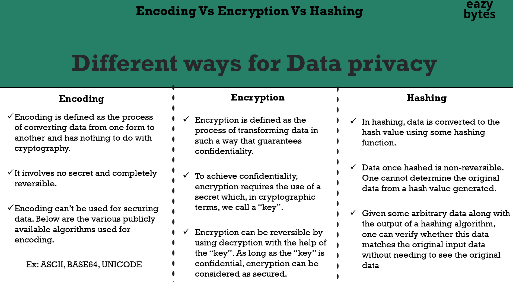

# 05 - Password Management with PasswordEncoders

- [05 - Password Management with PasswordEncoders](#05---password-management-with-passwordencoders)
  - [001 How our passwords validated with out PasswordEncoders](#001-how-our-passwords-validated-with-out-passwordencoders)
    - [1. **Overview of NoOpPasswordEncoder**](#1-overview-of-nooppasswordencoder)
      - [**Key Risk:**](#key-risk)
    - [2. **User Credentials Submission**](#2-user-credentials-submission)
    - [3. **Password Validation Process**](#3-password-validation-process)
    - [4. **NoOpPasswordEncoder is Not Recommended for Production**](#4-nooppasswordencoder-is-not-recommended-for-production)
      - [a) **Confidentiality Issues**:](#a-confidentiality-issues)
      - [b) **Integrity Issues**:](#b-integrity-issues)
    - [5. **Secure Alternatives to NoOpPasswordEncoder**](#5-secure-alternatives-to-nooppasswordencoder)
      - [a) **BCryptPasswordEncoder**](#a-bcryptpasswordencoder)
      - [b) **PBKDF2PasswordEncoder**](#b-pbkdf2passwordencoder)
    - [6. **How it Works with a Secure Encoder (Example)**](#6-how-it-works-with-a-secure-encoder-example)
      - [a) **User Registration (Secure Password Storage)**](#a-user-registration-secure-password-storage)
      - [b) **Login Process (Secure Password Validation)**](#b-login-process-secure-password-validation)
    - [7. **Conclusion: NoOpPasswordEncoder Use Case**](#7-conclusion-nooppasswordencoder-use-case)
  - [002 What is Encoding, Decoding \& why it is not suitable for passwords management](#002-what-is-encoding-decoding--why-it-is-not-suitable-for-passwords-management)
    - [1. **Encoding**](#1-encoding)
    - [2. **Encryption**](#2-encryption)
    - [3. **Hashing**](#3-hashing)
    - [Key Differences](#key-differences)
    - [Practical Example: Password Management in Applications](#practical-example-password-management-in-applications)
    - [Conclusion](#conclusion)
    - [1. **What is Encoding?**](#1-what-is-encoding)
    - [2. **The Encoding Process**](#2-the-encoding-process)
    - [3. **What is Decoding?**](#3-what-is-decoding)
    - [4. **The Decoding Process**](#4-the-decoding-process)
    - [5. **Real-World Examples**](#5-real-world-examples)
      - [a) **Base64 Encoding in Emails**](#a-base64-encoding-in-emails)
      - [b) **URL Encoding**](#b-url-encoding)
      - [c) **Encoding Data for Transmission**](#c-encoding-data-for-transmission)
    - [6. **Conclusion**](#6-conclusion)
  - [003 What is Encryption, Decryption \& why it is not suitable for passwords management](#003-what-is-encryption-decryption--why-it-is-not-suitable-for-passwords-management)
    - [1. **What is Encryption?**](#1-what-is-encryption)
    - [2. **Symmetric Encryption Overview**](#2-symmetric-encryption-overview)
      - [How Symmetric Encryption Works:](#how-symmetric-encryption-works)
    - [3. **Key Characteristics of Symmetric Encryption**](#3-key-characteristics-of-symmetric-encryption)
    - [4. **Famous Symmetric Encryption Algorithms**](#4-famous-symmetric-encryption-algorithms)
      - [a) **AES (Advanced Encryption Standard)**](#a-aes-advanced-encryption-standard)
      - [b) **Triple DES (3DES)**](#b-triple-des-3des)
      - [c) **Blowfish**](#c-blowfish)
    - [5. **Symmetric Encryption Use Cases**](#5-symmetric-encryption-use-cases)
      - [a) **File and Disk Encryption**](#a-file-and-disk-encryption)
      - [b) **Database Encryption**](#b-database-encryption)
      - [c) **Encrypting Network Communications**](#c-encrypting-network-communications)
    - [6. **Advantages and Disadvantages of Symmetric Encryption**](#6-advantages-and-disadvantages-of-symmetric-encryption)
      - [**Advantages**:](#advantages)
      - [**Disadvantages**:](#disadvantages)
    - [7. **Symmetric vs Asymmetric Encryption**](#7-symmetric-vs-asymmetric-encryption)
      - [Example of Combining Both:](#example-of-combining-both)
    - [8. **Conclusion**](#8-conclusion)
    - [1. **What is Asymmetric Encryption?**](#1-what-is-asymmetric-encryption)
      - [Key Concepts:](#key-concepts)
    - [2. **How Asymmetric Encryption Works**](#2-how-asymmetric-encryption-works)
    - [3. **Public and Private Key Pair**](#3-public-and-private-key-pair)
    - [4. **Examples of Asymmetric Encryption Algorithms**](#4-examples-of-asymmetric-encryption-algorithms)
      - [a) **RSA (Rivest-Shamir-Adleman)**](#a-rsa-rivest-shamir-adleman)
      - [b) **Diffie-Hellman Key Exchange**](#b-diffie-hellman-key-exchange)
      - [c) **Elliptic Curve Cryptography (ECC)**](#c-elliptic-curve-cryptography-ecc)
      - [d) **Pretty Good Privacy (PGP)**](#d-pretty-good-privacy-pgp)
    - [5. **Asymmetric Encryption Use Cases**](#5-asymmetric-encryption-use-cases)
      - [a) **Secure Web Traffic (HTTPS)**](#a-secure-web-traffic-https)
      - [b) **Email Encryption**](#b-email-encryption)
      - [c) **Digital Signatures**](#c-digital-signatures)
    - [6. **Advantages and Disadvantages of Asymmetric Encryption**](#6-advantages-and-disadvantages-of-asymmetric-encryption)
      - [**Advantages**:](#advantages-1)
      - [**Disadvantages**:](#disadvantages-1)
    - [7. **Combining Symmetric and Asymmetric Encryption (Hybrid Encryption)**](#7-combining-symmetric-and-asymmetric-encryption-hybrid-encryption)
    - [8. **Conclusion**](#8-conclusion-1)
  - [004 Demo of Encryption, Decryption](#004-demo-of-encryption-decryption)
    - [1. **Command Overview**](#1-command-overview)
    - [2. **How the Command Works**](#2-how-the-command-works)
    - [3. **Breaking Down the Process**](#3-breaking-down-the-process)
      - [a) **Encryption Algorithm (AES-256-CBC)**](#a-encryption-algorithm-aes-256-cbc)
      - [b) **Password-Based Key Derivation Function (PBKDF2)**](#b-password-based-key-derivation-function-pbkdf2)
      - [c) **Base64 Encoding**](#c-base64-encoding)
      - [d) **AES-256-CBC Encryption in Action**](#d-aes-256-cbc-encryption-in-action)
    - [4. **Example Workflow**](#4-example-workflow)
      - [a) **Input File (plain.txt)**:](#a-input-file-plaintxt)
      - [b) **Running the Command**:](#b-running-the-command)
      - [c) **Output File (encrypt.txt)**:](#c-output-file-encrypttxt)
    - [5. **Decrypting the File**](#5-decrypting-the-file)
    - [6. **Security Considerations**](#6-security-considerations)
    - [7. **Conclusion**](#7-conclusion)
    - [The Command](#the-command)
    - [Detailed Explanation of Each Part](#detailed-explanation-of-each-part)
      - [1. **`openssl`**](#1-openssl)
      - [2. **`enc`**](#2-enc)
      - [3. **`-aes-256-cbc`**](#3--aes-256-cbc)
      - [4. **`-base64`**](#4--base64)
      - [5. **`-pass pass:12345`**](#5--pass-pass12345)
      - [6. **`-d`**](#6--d)
      - [7. **`-pbkdf2`**](#7--pbkdf2)
      - [8. **`-in encrypt.txt`**](#8--in-encrypttxt)
      - [9. **`-out decrypt.txt`**](#9--out-decrypttxt)
    - [What Happens During Decryption?](#what-happens-during-decryption)
    - [Example Scenario](#example-scenario)
      - [a) **Encrypting a File**](#a-encrypting-a-file)
      - [b) **Decrypting the File**](#b-decrypting-the-file)
    - [Key Concepts in Encryption and Decryption](#key-concepts-in-encryption-and-decryption)
      - [1. **AES-256-CBC**:](#1-aes-256-cbc)
      - [2. **PBKDF2**:](#2-pbkdf2)
      - [3. **Base64 Encoding**:](#3-base64-encoding)
    - [Conclusion](#conclusion-1)
  - [005 Introduction to Hashing](#005-introduction-to-hashing)
    - [1. **What is Hashing?**](#1-what-is-hashing)
      - [Example of a Hashing Process:](#example-of-a-hashing-process)
      - [Key Characteristics of a Hash:](#key-characteristics-of-a-hash)
    - [2. **Irreversibility (One-Way Function)**](#2-irreversibility-one-way-function)
      - [Why Is Hashing One-Way?](#why-is-hashing-one-way)
    - [3. **Hash Functions and Their Use Cases**](#3-hash-functions-and-their-use-cases)
      - [a) **Data Integrity**](#a-data-integrity)
      - [b) **Password Hashing**](#b-password-hashing)
      - [c) **Digital Signatures and Certificates**](#c-digital-signatures-and-certificates)
    - [4. **Collision Resistance**](#4-collision-resistance)
      - [Why Is Collision Resistance Important?](#why-is-collision-resistance-important)
    - [5. **Popular Hash Functions**](#5-popular-hash-functions)
      - [a) **SHA-256 (Secure Hash Algorithm 256-bit)**](#a-sha-256-secure-hash-algorithm-256-bit)
      - [b) **MD5 (Message Digest Algorithm 5)**](#b-md5-message-digest-algorithm-5)
      - [c) **SHA-3 (Secure Hash Algorithm 3)**](#c-sha-3-secure-hash-algorithm-3)
    - [6. **Use Case: File Integrity Check**](#6-use-case-file-integrity-check)
    - [7. **Example of a Hashing Workflow**](#7-example-of-a-hashing-workflow)
      - [Input:](#input)
      - [Hash Function:](#hash-function)
      - [Output:](#output)
    - [8. **Irreversibility Example (Blender Analogy)**](#8-irreversibility-example-blender-analogy)
    - [9. **Conclusion**](#9-conclusion)
    - [Command:](#command)
    - [1. **`echo -n "EazyBytes@12345"`**](#1-echo--n-eazybytes12345)
    - [2. **`|` (Pipe Operator)**](#2--pipe-operator)
    - [3. **`openssl`**](#3-openssl)
    - [4. **`dgst`**](#4-dgst)
    - [5. **`-sha256`**](#5--sha256)
    - [How It Works:](#how-it-works)
    - [Example of Running the Command:](#example-of-running-the-command)
    - [6. **Understanding the Hash Output**](#6-understanding-the-hash-output)
    - [Why SHA-256 and Hashing Are Important:](#why-sha-256-and-hashing-are-important)
    - [Important Security Notes:](#important-security-notes)
    - [Conclusion:](#conclusion-2)
  - [006 Drawbacks of Hashing \& what are Brute force attacks, Dictionary or Rainbow tab](#006-drawbacks-of-hashing--what-are-brute-force-attacks-dictionary-or-rainbow-tab)
  - [007 How to overcome Hashing drawbacks, Brute force and Dictionary table attacks](#007-how-to-overcome-hashing-drawbacks-brute-force-and-dictionary-table-attacks)
  - [008 Introduction to PasswordEncoders in Spring Security](#008-introduction-to-passwordencoders-in-spring-security)
  - [009 Deep dive of PasswordEncoder implementation classes](#009-deep-dive-of-passwordencoder-implementation-classes)
  - [010 Demo of registration and login with Bcrypt password encoder](#010-demo-of-registration-and-login-with-bcrypt-password-encoder)


## 001 How our passwords validated with out PasswordEncoders
```java
    @Bean
    public PasswordEncoder passwordEncoder() {
        return PasswordEncoderFactories.createDelegatingPasswordEncoder();
    }
```
```java
/*
 * Copyright 2002-2022 the original author or authors.
 *
 * Licensed under the Apache License, Version 2.0 (the "License");
 * you may not use this file except in compliance with the License.
 * You may obtain a copy of the License at
 *
 *      https://www.apache.org/licenses/LICENSE-2.0
 *
 * Unless required by applicable law or agreed to in writing, software
 * distributed under the License is distributed on an "AS IS" BASIS,
 * WITHOUT WARRANTIES OR CONDITIONS OF ANY KIND, either express or implied.
 * See the License for the specific language governing permissions and
 * limitations under the License.
 */

package org.springframework.security.crypto.factory;

import java.util.HashMap;
import java.util.Map;

import org.springframework.security.crypto.argon2.Argon2PasswordEncoder;
import org.springframework.security.crypto.bcrypt.BCryptPasswordEncoder;
import org.springframework.security.crypto.password.DelegatingPasswordEncoder;
import org.springframework.security.crypto.password.PasswordEncoder;
import org.springframework.security.crypto.password.Pbkdf2PasswordEncoder;
import org.springframework.security.crypto.scrypt.SCryptPasswordEncoder;

/**
 * Used for creating {@link PasswordEncoder} instances
 *
 * @author Rob Winch
 * @since 5.0
 */
public final class PasswordEncoderFactories {

	private PasswordEncoderFactories() {
	}

	/**
	 * Creates a {@link DelegatingPasswordEncoder} with default mappings. Additional
	 * mappings may be added and the encoding will be updated to conform with best
	 * practices. However, due to the nature of {@link DelegatingPasswordEncoder} the
	 * updates should not impact users. The mappings current are:
	 *
	 * <ul>
	 * <li>bcrypt - {@link BCryptPasswordEncoder} (Also used for encoding)</li>
	 * <li>ldap -
	 * {@link org.springframework.security.crypto.password.LdapShaPasswordEncoder}</li>
	 * <li>MD4 -
	 * {@link org.springframework.security.crypto.password.Md4PasswordEncoder}</li>
	 * <li>MD5 - {@code new MessageDigestPasswordEncoder("MD5")}</li>
	 * <li>noop -
	 * {@link org.springframework.security.crypto.password.NoOpPasswordEncoder}</li>
	 * <li>pbkdf2 - {@link Pbkdf2PasswordEncoder#defaultsForSpringSecurity_v5_5()}</li>
	 * <li>pbkdf2@SpringSecurity_v5_8 -
	 * {@link Pbkdf2PasswordEncoder#defaultsForSpringSecurity_v5_8()}</li>
	 * <li>scrypt - {@link SCryptPasswordEncoder#defaultsForSpringSecurity_v4_1()}</li>
	 * <li>scrypt@SpringSecurity_v5_8 -
	 * {@link SCryptPasswordEncoder#defaultsForSpringSecurity_v5_8()}</li>
	 * <li>SHA-1 - {@code new MessageDigestPasswordEncoder("SHA-1")}</li>
	 * <li>SHA-256 - {@code new MessageDigestPasswordEncoder("SHA-256")}</li>
	 * <li>sha256 -
	 * {@link org.springframework.security.crypto.password.StandardPasswordEncoder}</li>
	 * <li>argon2 - {@link Argon2PasswordEncoder#defaultsForSpringSecurity_v5_2()}</li>
	 * <li>argon2@SpringSecurity_v5_8 -
	 * {@link Argon2PasswordEncoder#defaultsForSpringSecurity_v5_8()}</li>
	 * </ul>
	 * @return the {@link PasswordEncoder} to use
	 */
	@SuppressWarnings("deprecation")
	public static PasswordEncoder createDelegatingPasswordEncoder() {
		String encodingId = "bcrypt";
		Map<String, PasswordEncoder> encoders = new HashMap<>();
		encoders.put(encodingId, new BCryptPasswordEncoder());
		encoders.put("ldap", new org.springframework.security.crypto.password.LdapShaPasswordEncoder());
		encoders.put("MD4", new org.springframework.security.crypto.password.Md4PasswordEncoder());
		encoders.put("MD5", new org.springframework.security.crypto.password.MessageDigestPasswordEncoder("MD5"));
		encoders.put("noop", org.springframework.security.crypto.password.NoOpPasswordEncoder.getInstance());
		encoders.put("pbkdf2", Pbkdf2PasswordEncoder.defaultsForSpringSecurity_v5_5());
		encoders.put("pbkdf2@SpringSecurity_v5_8", Pbkdf2PasswordEncoder.defaultsForSpringSecurity_v5_8());
		encoders.put("scrypt", SCryptPasswordEncoder.defaultsForSpringSecurity_v4_1());
		encoders.put("scrypt@SpringSecurity_v5_8", SCryptPasswordEncoder.defaultsForSpringSecurity_v5_8());
		encoders.put("SHA-1", new org.springframework.security.crypto.password.MessageDigestPasswordEncoder("SHA-1"));
		encoders.put("SHA-256",
				new org.springframework.security.crypto.password.MessageDigestPasswordEncoder("SHA-256"));
		encoders.put("sha256", new org.springframework.security.crypto.password.StandardPasswordEncoder());
		encoders.put("argon2", Argon2PasswordEncoder.defaultsForSpringSecurity_v5_2());
		encoders.put("argon2@SpringSecurity_v5_8", Argon2PasswordEncoder.defaultsForSpringSecurity_v5_8());
		return new DelegatingPasswordEncoder(encodingId, encoders);
	}

}

```
```java
/*
 * Copyright 2011-2016 the original author or authors.
 *
 * Licensed under the Apache License, Version 2.0 (the "License");
 * you may not use this file except in compliance with the License.
 * You may obtain a copy of the License at
 *
 *      https://www.apache.org/licenses/LICENSE-2.0
 *
 * Unless required by applicable law or agreed to in writing, software
 * distributed under the License is distributed on an "AS IS" BASIS,
 * WITHOUT WARRANTIES OR CONDITIONS OF ANY KIND, either express or implied.
 * See the License for the specific language governing permissions and
 * limitations under the License.
 */

package org.springframework.security.crypto.password;

/**
 * Service interface for encoding passwords.
 *
 * The preferred implementation is {@code BCryptPasswordEncoder}.
 *
 * @author Keith Donald
 */
public interface PasswordEncoder {

	/**
	 * Encode the raw password. Generally, a good encoding algorithm applies a SHA-1 or
	 * greater hash combined with an 8-byte or greater randomly generated salt.
	 */
	String encode(CharSequence rawPassword);

	/**
	 * Verify the encoded password obtained from storage matches the submitted raw
	 * password after it too is encoded. Returns true if the passwords match, false if
	 * they do not. The stored password itself is never decoded.
	 * @param rawPassword the raw password to encode and match
	 * @param encodedPassword the encoded password from storage to compare with
	 * @return true if the raw password, after encoding, matches the encoded password from
	 * storage
	 */
	boolean matches(CharSequence rawPassword, String encodedPassword);

	/**
	 * Returns true if the encoded password should be encoded again for better security,
	 * else false. The default implementation always returns false.
	 * @param encodedPassword the encoded password to check
	 * @return true if the encoded password should be encoded again for better security,
	 * else false.
	 */
	default boolean upgradeEncoding(String encodedPassword) {
		return false;
	}

}

```


This diagram explains how password validation works using Spring Security's `NoOpPasswordEncoder`, which does not apply any encryption or hashing to passwords, meaning the passwords are stored and processed in plain text. Let's go through each part of the diagram and explain it in detail with practical examples.

### 1. **Overview of NoOpPasswordEncoder**

`NoOpPasswordEncoder` is a class in Spring Security that performs no encoding or encryption of passwords. It is primarily used in development or testing environments when you want to avoid the complexity of password hashing. However, the use of `NoOpPasswordEncoder` is **not recommended for production** environments because it leaves passwords exposed in plain text, which compromises both **integrity** and **confidentiality**.

#### **Key Risk:**
When passwords are stored in plain text in a database, anyone with access to the database (e.g., an attacker who compromises the system) can see and use these passwords, which can lead to unauthorized access to user accounts.

### 2. **User Credentials Submission**

In the diagram, the user submits the following credentials through a login form:

- **Username**: `admin`
- **Password**: `12345`

These credentials are sent to the server as plain text (assuming no encryption like HTTPS is used, which introduces further security risks).

### 3. **Password Validation Process**

When a user submits their credentials, the following sequence of events occurs:

1. **Credentials Submission**: The user inputs their username and password (`admin` and `12345`), and clicks the "LOGIN" button.
   
2. **Loading User Details from Database**: The application receives the submitted credentials and calls the `loadUserByUsername()` method from the `UserDetailsService` implementation. This method retrieves the user details from the database. The query fetches the following data for the user with the username `admin`:
   - **Username**: `admin`
   - **Password**: `12345` (stored in plain text in the database)
   
3. **Password Comparison (Matching Process)**:
   - After retrieving the user details, Spring Security compares the password entered by the user (`12345`) with the password stored in the database (`12345`).
   - Since `NoOpPasswordEncoder` is being used, no hashing or encryption is performed on either the stored password or the submitted password, meaning the comparison is done directly in plain text.

4. **Decision Point: Does the Password Match?**
   - **Match**: If the submitted password matches the password stored in the database (in this case, `12345` matches `12345`), the user is successfully authenticated and granted access to the system (login success).
   - **No Match**: If the password does not match (for example, if the user entered `123456` instead of `12345`), authentication fails, and the user is denied access (login failure).

### 4. **NoOpPasswordEncoder is Not Recommended for Production**

At the bottom of the diagram, it clearly states that using `NoOpPasswordEncoder` is **not recommended for production**. Here’s why:

#### a) **Confidentiality Issues**:
- **Plain-text Passwords**: If passwords are stored in plain text in the database, they can be easily read by anyone with access to the database. This includes database administrators, attackers who gain unauthorized access, or even backups where passwords are not properly encrypted.
- **No Encryption**: Unlike more secure password encoders (e.g., `BCryptPasswordEncoder`, `PBKDF2PasswordEncoder`), `NoOpPasswordEncoder` does not perform any encryption or hashing. This means that even during transmission, the password is exposed unless the connection is encrypted (e.g., via HTTPS).

#### b) **Integrity Issues**:
- **Database Compromise**: If an attacker gains access to the database, they can easily read and use all passwords because they are stored in an easily accessible format (plain text).
- **Reused Passwords**: Many users tend to reuse passwords across different platforms. If your database is compromised, attackers can use the exposed plain-text passwords to gain access to other services where users have reused the same password.

### 5. **Secure Alternatives to NoOpPasswordEncoder**

In a production environment, it’s crucial to use password encoding to protect sensitive user data. Instead of `NoOpPasswordEncoder`, secure alternatives should be used, such as:

#### a) **BCryptPasswordEncoder**
This is one of the most commonly used password encoders in Spring Security. It hashes the password using the BCrypt hashing function, which includes a built-in salt and is resistant to rainbow table attacks.

**Example**:
- When the user registers with the password `12345`, `BCryptPasswordEncoder` hashes the password into a string like this:
  ```
  $2a$10$0VVyXaMOX7FdMhFVyxLfEu.Vex8pXjGlwQmZzmU9uSeOE5XfXoUdS
  ```
- The hash is stored in the database. When the user logs in, the submitted password is hashed again, and the hashes are compared.

**Code Example**:
```java
@Bean
public PasswordEncoder passwordEncoder() {
    return new BCryptPasswordEncoder();
}
```

#### b) **PBKDF2PasswordEncoder**
This is another secure password encoder that uses the PBKDF2 (Password-Based Key Derivation Function 2) algorithm, which applies a hash function multiple times to create a secure password hash.

**Code Example**:
```java
@Bean
public PasswordEncoder passwordEncoder() {
    return new Pbkdf2PasswordEncoder();
}
```

### 6. **How it Works with a Secure Encoder (Example)**

Let’s see how the process differs when a secure password encoder (e.g., `BCryptPasswordEncoder`) is used:

#### a) **User Registration (Secure Password Storage)**
- When the user registers with the password `12345`, Spring Security will use `BCryptPasswordEncoder` to hash the password before storing it in the database.
- The stored password will look something like this: `$2a$10$0VVyXaMOX7FdMhFVyxLfEu.Vex8pXjGlwQmZzmU9uSeOE5XfXoUdS`.

#### b) **Login Process (Secure Password Validation)**
1. **Credentials Submission**: The user submits their credentials (`admin`, `12345`).
2. **Password Retrieval**: The system retrieves the hashed password from the database.
3. **Password Comparison**: Instead of comparing plain-text passwords, Spring Security hashes the submitted password (`12345`) using the same algorithm (`BCryptPasswordEncoder`) and compares it with the stored hash.
4. **Result**:
   - If the hashes match, the user is authenticated.
   - If the hashes do not match, the user is denied access.

### 7. **Conclusion: NoOpPasswordEncoder Use Case**

`NoOpPasswordEncoder` is typically used in **development or testing environments** where:
- Password security is not the primary concern.
- You want to avoid the complexity of hashing while quickly testing functionality.
  
However, in a **production environment**, using a secure password encoding mechanism like `BCryptPasswordEncoder` or `PBKDF2PasswordEncoder` is essential to ensure the integrity and confidentiality of user passwords.

By using `NoOpPasswordEncoder`, you expose sensitive data (passwords) to a variety of security risks, and this practice is explicitly discouraged in real-world applications.

## 002 What is Encoding, Decoding & why it is not suitable for passwords management



The diagram presents a comparison between **Encoding**, **Encryption**, and **Hashing**—three distinct methods of processing data, each serving a unique purpose in the context of data privacy and security. Below is a deep explanation of each method, along with real-world examples, highlighting when and why these processes are used.

### 1. **Encoding**

- **Definition**: Encoding is the process of converting data from one format to another for the purpose of interoperability, storage, or transmission. It is not designed for security purposes and does not involve cryptographic techniques.

- **Purpose**: Encoding ensures that data is transformed into a format that can be understood by different systems (computers, software, or devices). The key point is that encoding is **reversible**—anyone with the proper decoder can retrieve the original data.

- **How it Works**:
  - A set of rules (or algorithms) is applied to transform the original data into a specific format.
  - Since encoding is not a security measure, the encoded data can be easily converted back to its original form without any special key or secret.

- **Examples**:
  - **ASCII (American Standard Code for Information Interchange)**: Transforms characters into numeric codes. For example, the letter "A" is represented by the number 65.
  - **Base64 Encoding**: Commonly used to encode binary data, such as images, so they can be transmitted over text-based protocols like HTTP. For instance, an image file can be encoded as Base64 to be embedded in HTML or XML.
    - Example: The string `"hello"` becomes `"aGVsbG8="` in Base64 encoding.
  - **UNICODE**: A standardized system to encode text in different languages and symbols. It assigns a unique code point to every character in the world’s writing systems.

- **Reversibility**: Because encoding is meant for data transformation and not security, it is completely reversible. The original data can be retrieved as long as you have the correct decoding method.

- **Use Case**: Encoding is commonly used in data transmission or storage where data needs to be transformed into a format compatible with different systems. For example:
  - Encoding an image in Base64 for transmission over an HTTP request.
  - Encoding URL parameters to ensure they are safely transmitted in a URL (URL encoding).

### 2. **Encryption**

- **Definition**: Encryption is the process of transforming data (plaintext) into an unreadable form (ciphertext) to ensure **confidentiality**. It relies on cryptographic techniques and involves a **key**. The goal is to ensure that only authorized parties with the correct key can decrypt and read the original data.

- **Purpose**: Encryption guarantees that sensitive data remains confidential. Even if someone intercepts the encrypted data, they cannot understand it without the decryption key.

- **How it Works**:
  - Data (plaintext) is encrypted using an encryption algorithm (such as AES, RSA) and a **key** (a secret shared between the sender and receiver or known only to the data owner).
  - The encrypted data (ciphertext) can only be decrypted back into plaintext by someone who possesses the correct decryption key.

- **Examples**:
  - **AES (Advanced Encryption Standard)**: A symmetric encryption algorithm used for securing sensitive data. For example, encrypting the string `"hello"` with AES would produce a ciphertext such as `"8N3yZTxsXGhtDSYz="`.
  - **RSA Encryption**: An asymmetric encryption algorithm that uses a pair of keys (public and private). Data encrypted with a public key can only be decrypted by the corresponding private key.
    - Example: A website might encrypt sensitive data such as credit card numbers using RSA encryption before transmitting it over the internet.

- **Reversibility**: Encryption is **reversible** as long as the decryption key is available. The original data can be restored by decrypting the ciphertext with the appropriate key.

- **Use Case**: Encryption is widely used to protect sensitive data such as:
  - **Banking**: Encrypting transaction data so only authorized users can access it.
  - **Communication**: Encrypting messages sent through messaging apps (e.g., WhatsApp) to ensure only the intended recipient can read them.
  - **Storage**: Encrypting files on a hard drive to protect them in case the device is stolen.

- **Security Warning**: If the key is compromised, the encrypted data is no longer secure.

### 3. **Hashing**

- **Definition**: Hashing is a process that converts data into a fixed-size hash value (digest) using a hashing algorithm. Unlike encoding or encryption, **hashing is not reversible**—you cannot retrieve the original data from the hash value.

- **Purpose**: Hashing is used to ensure **data integrity**. It allows systems to verify that data has not been altered by comparing hash values, without needing to reveal the original data.

- **How it Works**:
  - A hashing algorithm (such as SHA-256, MD5) takes an input (of any length) and produces a fixed-length output (hash).
  - The same input will always produce the same hash, but even a small change in the input will result in a completely different hash.

- **Examples**:
  - **SHA-256 (Secure Hash Algorithm 256-bit)**: Often used in blockchain and digital certificates. It converts any input into a 256-bit hash value.
    - Example: The string `"hello"` might be hashed into something like `"2cf24dba5fb0a30e26e83b2ac5b9e29e1b161e5c1fa7425e73043362938b9824"`.
  - **MD5 (Message Digest Algorithm)**: Though it’s now considered insecure, it was commonly used for checksums to verify file integrity.
    - Example: An MD5 hash of a file can be compared before and after transmission to ensure it hasn’t been tampered with.

- **Reversibility**: Hashing is a **one-way** process—once data is hashed, it cannot be reversed to its original form. This makes it ideal for storing sensitive data like passwords. Instead of storing the password, you store the hash, and during login, you hash the entered password and compare it with the stored hash.

- **Use Case**:
  - **Password Storage**: Instead of storing plain-text passwords, systems store hashed passwords. When a user logs in, the entered password is hashed and compared with the stored hash.
    - Example: A user’s password `"password123"` might be hashed and stored as `"ef92b779c0001fc10f2de6058e4340a7"`. When the user logs in, the system hashes the entered password and compares it to this value.
  - **File Integrity Verification**: When downloading large files, the publisher might provide a hash value (checksum). After downloading, you can hash the file and compare it with the provided hash to ensure that the file hasn’t been corrupted.

### Key Differences

- **Reversibility**:
  - **Encoding** is reversible (e.g., decoding a Base64-encoded image).
  - **Encryption** is reversible (if you have the key).
  - **Hashing** is not reversible.

- **Use Case**:
  - **Encoding** is for interoperability, not security. Example: encoding data to be safely transmitted over HTTP.
  - **Encryption** is for confidentiality. Example: encrypting credit card data during online transactions.
  - **Hashing** is for data integrity. Example: ensuring that a downloaded file has not been tampered with by comparing hashes.

### Practical Example: Password Management in Applications

When managing user passwords, systems typically follow this workflow:

1. **Hashing (Security Best Practice)**: Instead of storing a password as plain text, the system hashes the password (e.g., using bcrypt or SHA-256) and stores the hash. When a user logs in, the system hashes the input and compares it with the stored hash.
   - If the hashes match, authentication succeeds.
   
2. **Encryption (Sensitive Data)**: If the application needs to store sensitive data (like user credit card numbers), it encrypts the data using a symmetric or asymmetric algorithm. Only authorized entities can decrypt and access the data using the encryption key.

3. **Encoding (Data Transmission)**: If the data needs to be transmitted over networks, it might be encoded (e.g., Base64 encoding) to ensure it is in a format that can be safely transmitted over protocols like HTTP.

### Conclusion

- **Encoding** is about data transformation for compatibility and transmission.
- **Encryption** ensures confidentiality by converting plaintext into ciphertext using a key.
- **Hashing** ensures integrity by creating a non-reversible fixed-length digest of the original data.

Each process has its own purpose in securing data, and understanding when to use each is critical for maintaining privacy and security in software systems.


The diagram illustrates the process of **Encoding** and **Decoding**, showing how data is transformed from **plain text** into an **encoded format** and then back into **plain text** through decoding. Encoding is used to ensure data is in a suitable format for transmission or storage. Let’s explore this concept in-depth with examples.

### 1. **What is Encoding?**

**Encoding** is the process of converting data from one form to another. It is not designed to be secure but is used for purposes like compatibility, transmission, or storage. The key characteristic of encoding is that it is **reversible**—you can always decode the data back to its original form.

- **Key Characteristics**:
  - **Reversible**: The original data can be retrieved with the appropriate decoding algorithm.
  - **Purpose**: Typically used to ensure that data is safely transmitted or stored without being altered. 
  - **Not for Security**: Encoding is not meant for encryption or securing sensitive data.
  
- **Examples of Encoding**:
  - **ASCII (American Standard Code for Information Interchange)**: Translates characters into numeric codes. For example, the letter "A" is represented by the number `65`.
  - **Base64**: Commonly used to encode binary data, such as images, into a text-based format for transmission over text-based protocols like HTTP. For example, the string `"hello"` would be encoded in Base64 as `"aGVsbG8="`.
  - **URL Encoding**: Used to encode URLs so they can be safely transmitted over the internet. Special characters (such as spaces or punctuation) are replaced by a percent sign followed by two hexadecimal digits. For example, a space is encoded as `%20`.

### 2. **The Encoding Process**

The diagram depicts the following flow:

1. **Plain Text (Original Data)**: 
   - This is the original form of the data before encoding. It could be a string of characters, binary data, or any form of raw data.
   
2. **Encoding**: 
   - This process converts the plain text into an encoded format (or encoded text). The type of encoding algorithm (e.g., Base64, ASCII) determines how the data is transformed. The purpose is to make the data suitable for specific purposes, such as transmission over text-based protocols or ensuring it is stored in a standardized format.

   **Example**:
   - If you have a binary image that needs to be transmitted as part of an HTTP message, encoding it in Base64 makes it readable in text form, like this:
     - Original Image Data: `Binary data`
     - Base64 Encoded: `iVBORw0KGgoAAAANSUhEUgAAAOEAA...`
     
3. **Encoded Text**: 
   - This is the result of the encoding process. It is a transformed representation of the original data but remains in a format that is reversible through decoding.
   
   **Example**: 
   - Base64 encoding of the word `hello` would give you the encoded output: `"aGVsbG8="`.

### 3. **What is Decoding?**

**Decoding** is the reverse process of encoding. It converts the encoded data back into its original form. As long as the same encoding algorithm is used, decoding will perfectly retrieve the original data.

- **Key Characteristics**:
  - **Reversible**: The data is returned to its original form after decoding.
  - **Requirements**: The same algorithm that was used for encoding must be used for decoding.

### 4. **The Decoding Process**

1. **Encoded Text**: 
   - This is the data in its encoded form. It cannot be interpreted in its original meaning until it is decoded back to plain text.

2. **Decoding**:
   - Decoding takes the encoded data and applies the reverse algorithm to return it to its original form. 

   **Example**:
   - The Base64 string `"aGVsbG8="` can be decoded back into the plain text `"hello"`.
   
3. **Plain Text (Original Data)**:
   - This is the output after decoding, which matches the original input before encoding.

### 5. **Real-World Examples**

#### a) **Base64 Encoding in Emails**

When sending attachments in emails, Base64 encoding is used to encode binary files (such as images) into text format. Email protocols like SMTP are text-based, so converting binary files into Base64 ensures that they can be safely transmitted.

- **Original Data**: A binary image file.
- **Encoding**: The image file is encoded into Base64 format.
- **Decoding**: The recipient's email client decodes the Base64 back into the original image so that it can be displayed.

#### b) **URL Encoding**

Web browsers use URL encoding to convert characters in a URL that may otherwise be misinterpreted by web servers. For example, spaces in URLs are encoded as `%20`.

- **Original URL**: `https://example.com/my file.html`
- **Encoded URL**: `https://example.com/my%20file.html`
- **Decoded URL**: A web server decodes the `%20` back to a space to process the URL correctly.

#### c) **Encoding Data for Transmission**

Data that includes special or binary characters may need to be encoded to ensure it can be transmitted safely over networks. For example, JSON Web Tokens (JWT) are encoded in Base64 to ensure they are safely transmitted over HTTP.

- **Original JWT**: `{"alg": "HS256", "typ": "JWT"}`
- **Encoded JWT**: `eyJhbGciOiAiSFMyNTYiLCAidHlwIjogIkpXVCJ9`
- **Decoded JWT**: The encoded JWT is decoded back into its original form when it's received on the server for validation.

### 6. **Conclusion**

The diagram summarizes the process of **encoding** and **decoding** by showing how plain text (or any raw data) is transformed into an encoded format and then back into its original form. While encoding ensures that data can be transmitted or stored in a suitable format, it does not provide security or confidentiality, unlike encryption or hashing. For secure data storage or transmission, encryption should be used instead of encoding. 

Encoding is purely for compatibility and data integrity, where the goal is to ensure that the data can be safely transmitted, displayed, or interpreted by various systems and devices.
## 003 What is Encryption, Decryption & why it is not suitable for passwords management


The diagram provides an in-depth look into **Symmetric Encryption**, one of the two major types of encryption used in securing data. Let's break down the concepts, how symmetric encryption works, the algorithms involved, and practical use cases to better understand its significance in data protection.

### 1. **What is Encryption?**

Encryption is the process of converting plain, readable data (**Plain Text**) into a coded form (**Cipher Text**) to protect it from unauthorized access. Only those who have the necessary decryption key can convert it back into its original form.

Encryption ensures **confidentiality** by safeguarding sensitive information, such as messages on platforms like WhatsApp, or data entered on websites during transactions.

### 2. **Symmetric Encryption Overview**

In **symmetric encryption**, the **same key** is used for both encryption (converting plaintext to ciphertext) and decryption (converting ciphertext back to plaintext). 

- **Key**: This is a secret value known to both the sender and receiver. If someone else gains access to the key, they can decrypt the data.
- **Algorithm**: The mathematical procedure used to encrypt and decrypt the data.

#### How Symmetric Encryption Works:
1. **Plain Text**: Data is in its original readable form.
2. **Encryption**: The plain text is encrypted using an encryption algorithm (e.g., AES) and a secret key, transforming it into ciphertext.
3. **Cipher Text**: The encrypted data is now unreadable without the decryption key.
4. **Decryption**: The ciphertext is decrypted using the same secret key and algorithm to return it to its original plain text form.

### 3. **Key Characteristics of Symmetric Encryption**

- **Same Key for Encryption and Decryption**: This is the defining feature. Both the sender and receiver must share the same key securely.
- **Fast and Efficient**: Symmetric encryption algorithms are computationally efficient, making them suitable for encrypting large amounts of data.
- **Key Management Challenge**: The security of symmetric encryption relies on the secrecy of the key. Secure key exchange between parties is a challenge, especially over the internet, as the key itself must be protected from interception.

### 4. **Famous Symmetric Encryption Algorithms**

Several symmetric encryption algorithms are commonly used today, each with its own strengths:

#### a) **AES (Advanced Encryption Standard)**
- **Overview**: AES is one of the most secure and widely used symmetric encryption algorithms. It supports key sizes of 128, 192, and 256 bits.
- **Use Case**: AES is used in secure file encryption, network communication, VPNs, and securing classified information.
  - **Example**: Encrypting a file with AES-256 would produce a strong ciphertext that can only be decrypted with the correct 256-bit key.

#### b) **Triple DES (3DES)**
- **Overview**: Triple DES is an extension of the original DES (Data Encryption Standard) algorithm. It applies the DES algorithm three times to each data block, enhancing its security.
- **Use Case**: Though largely replaced by AES, Triple DES is still used in some financial services and legacy systems.
  - **Example**: Encrypting bank transactions in an older system using Triple DES ensures the data is encrypted with additional layers of security.

#### c) **Blowfish**
- **Overview**: Blowfish is known for its speed and flexibility, with key sizes ranging from 32 bits to 448 bits. It is considered secure and is widely used in various encryption applications.
- **Use Case**: Blowfish is often used in securing passwords, file encryption, and software protection.
  - **Example**: Some password management systems use Blowfish to encrypt passwords before storing them in a database.

### 5. **Symmetric Encryption Use Cases**

Symmetric encryption is commonly used for **data at rest**, which refers to stored data, such as files on a disk, databases, or backup tapes. Here are some specific examples:

#### a) **File and Disk Encryption**
- **Explanation**: Symmetric encryption is used to encrypt files and disks to protect them from unauthorized access. If a device is lost or stolen, the data remains secure because it is encrypted.
- **Example**: Full-disk encryption software like **BitLocker** (on Windows) or **FileVault** (on macOS) uses AES encryption to secure data on the entire hard drive.

#### b) **Database Encryption**
- **Explanation**: Symmetric encryption is used to encrypt sensitive data stored in databases, such as customer information or financial records.
- **Example**: A healthcare organization encrypts patient records stored in a database using AES encryption to comply with HIPAA regulations, ensuring that sensitive medical information is protected.

#### c) **Encrypting Network Communications**
- **Explanation**: Symmetric encryption is used to protect communication channels, such as secure web traffic (HTTPS) or VPN connections. It ensures that data sent over the internet cannot be intercepted and read by attackers.
- **Example**: A company sets up a **VPN** to secure the connection between remote employees and the corporate network using AES encryption. This protects the transmitted data from being intercepted by third parties.

### 6. **Advantages and Disadvantages of Symmetric Encryption**

#### **Advantages**:
- **Speed**: Symmetric encryption algorithms are faster than asymmetric ones, making them ideal for encrypting large amounts of data.
- **Simplicity**: The process of encrypting and decrypting data is straightforward and does not require complex key management when working within trusted environments.

#### **Disadvantages**:
- **Key Distribution**: The biggest challenge is securely sharing the key between parties. If the key is intercepted during transmission, the data becomes vulnerable.
- **Scalability**: In a large system with many users, managing and securely exchanging keys between all parties can become difficult.

### 7. **Symmetric vs Asymmetric Encryption**

Symmetric encryption is different from **asymmetric encryption**, which uses two different keys (a public key and a private key). In asymmetric encryption, the public key is used to encrypt the data, and only the corresponding private key can decrypt it.

- **Symmetric Encryption**:
  - Uses the same key for both encryption and decryption.
  - Faster and suitable for encrypting large volumes of data.
  - Key exchange is challenging.

- **Asymmetric Encryption**:
  - Uses two different keys (public and private).
  - Slower but eliminates the need to share a private key, as the public key can be freely distributed.

#### Example of Combining Both:
In practice, many systems use a combination of symmetric and asymmetric encryption. For example, in **HTTPS (SSL/TLS)**, asymmetric encryption is used to securely exchange a symmetric encryption key, which is then used to encrypt the data for the rest of the session.

### 8. **Conclusion**

**Symmetric Encryption** plays a critical role in securing sensitive data, especially when it is stored or at rest. It uses the same key for both encryption and decryption, making it efficient and fast, especially for large volumes of data. However, the biggest challenge lies in securely sharing and managing the secret key. Algorithms like AES, Triple DES, and Blowfish provide strong security for various applications, from file encryption to protecting network traffic. Understanding when and how to use symmetric encryption is key to maintaining data privacy in today's digital world.


The diagram provides a detailed explanation of **Asymmetric Encryption**, which is a type of encryption that uses two distinct keys: a **public key** for encryption and a **private key** for decryption. Asymmetric encryption is widely used for secure communication over the internet. Let's break it down, explain the process, and look at examples of how it works.

### 1. **What is Asymmetric Encryption?**

Asymmetric encryption, also known as **public-key encryption**, involves a pair of cryptographic keys:
- **Public Key**: This key is used to encrypt the data. It can be shared openly with anyone who needs to send you a secure message.
- **Private Key**: This key is used to decrypt the data. It is kept secret by the owner and is never shared with anyone.

The fundamental difference between asymmetric and symmetric encryption is that asymmetric encryption uses two keys (one public and one private) rather than a single key.

#### Key Concepts:
- **Encryption**: The process of converting plain text into ciphertext using the **public key**.
- **Decryption**: The process of converting ciphertext back into plain text using the **private key**.
- **Security**: The system relies on the mathematical relationship between the public and private keys, where only the private key can decrypt messages encrypted by the corresponding public key.

### 2. **How Asymmetric Encryption Works**

The diagram shows the flow of asymmetric encryption, highlighting how the two keys are used in combination for encryption and decryption. Here's how it works:

1. **Plain Text**: The original readable data, often a message or file.
2. **Encryption (Using the Public Key)**:
   - The sender encrypts the plain text using the recipient's **public key**. This produces **ciphertext**, which is unreadable unless decrypted.
   - The public key can be distributed openly, and anyone can use it to encrypt messages intended for the owner of the corresponding private key.
   
3. **Cipher Text**: The result of the encryption process, which is scrambled and unreadable.
4. **Decryption (Using the Private Key)**:
   - The recipient decrypts the ciphertext using their **private key**, restoring the original plain text.
   - Only the recipient, who holds the private key, can decrypt the message. This ensures that even if someone intercepts the encrypted message, they cannot read it without the private key.

### 3. **Public and Private Key Pair**

- **Public Key**: This key is meant to be shared. It is used to encrypt data that is sent to the owner of the corresponding private key.
- **Private Key**: This key is kept secret. It is used to decrypt the data that was encrypted with the corresponding public key. Only the owner of the private key can decrypt and read the message.

### 4. **Examples of Asymmetric Encryption Algorithms**

Several well-known encryption algorithms use asymmetric encryption:

#### a) **RSA (Rivest-Shamir-Adleman)**
- **Overview**: RSA is one of the most widely used public-key encryption algorithms. It uses large prime numbers to generate the public and private key pair.
- **Use Case**: RSA is used in SSL/TLS certificates to secure web communications (e.g., HTTPS), encrypt email messages, and more.
  - **Example**: When you connect to a secure website (like `https://example.com`), the website sends its public key to your browser. Your browser uses this public key to encrypt any sensitive data (e.g., your credit card information) before sending it to the server. Only the server, which holds the corresponding private key, can decrypt and read the data.

#### b) **Diffie-Hellman Key Exchange**
- **Overview**: Diffie-Hellman is a method of securely exchanging cryptographic keys over a public channel. It's often used in combination with other encryption methods.
- **Use Case**: It's primarily used for establishing a shared secret key over an insecure network.
  - **Example**: Two parties (e.g., a client and server) can use Diffie-Hellman to securely agree on a shared encryption key over the internet, which they will then use for symmetric encryption.

#### c) **Elliptic Curve Cryptography (ECC)**
- **Overview**: ECC is a newer approach that provides the same level of security as RSA but with smaller key sizes, making it more efficient and faster.
- **Use Case**: ECC is used in mobile devices, IoT devices, and other environments where computational power is limited.
  - **Example**: ECC is commonly used in cryptocurrencies like Bitcoin, where it secures transactions by generating digital signatures.

#### d) **Pretty Good Privacy (PGP)**
- **Overview**: PGP is used for encrypting and signing emails. It uses both symmetric and asymmetric encryption (a hybrid approach) to ensure security.
- **Use Case**: PGP is widely used for secure email communication.
  - **Example**: A sender can use the recipient’s public key to encrypt an email message. The recipient will then use their private key to decrypt and read the message.

### 5. **Asymmetric Encryption Use Cases**

Asymmetric encryption is ideal for situations where data needs to be encrypted **in transit**, or when secure communication must occur between two parties who have never exchanged encryption keys before.

#### a) **Secure Web Traffic (HTTPS)**
- **Explanation**: When you visit a secure website (e.g., `https://www.example.com`), your browser and the web server use asymmetric encryption to securely exchange keys. The server sends a public key to your browser, which uses it to encrypt data. Only the server's private key can decrypt this data.
- **Example**: During an online purchase, your payment details are encrypted using the server's public key, and only the server with the corresponding private key can decrypt and process the transaction.

#### b) **Email Encryption**
- **Explanation**: Asymmetric encryption can be used to ensure secure email communication. The sender uses the recipient’s public key to encrypt the email message, ensuring that only the recipient can decrypt and read it using their private key.
- **Example**: A journalist can send sensitive information to a source by encrypting the email with the source’s public key. Only the source, who has the private key, can decrypt and read the message.

#### c) **Digital Signatures**
- **Explanation**: Asymmetric encryption is also used to create **digital signatures**, which provide authentication, integrity, and non-repudiation for electronic communications. The sender signs the document with their private key, and anyone with the corresponding public key can verify the signature.
- **Example**: When you download software, it may come with a digital signature to verify that it was created by the official developer and hasn’t been tampered with. The signature can be verified using the developer's public key.

### 6. **Advantages and Disadvantages of Asymmetric Encryption**

#### **Advantages**:
- **Key Distribution**: One of the primary benefits is that you don't need to share the private key. You can freely distribute the public key to anyone, solving the key distribution problem associated with symmetric encryption.
- **Scalability**: Asymmetric encryption scales well in environments where multiple parties need to communicate securely without having to pre-exchange secret keys.

#### **Disadvantages**:
- **Performance**: Asymmetric encryption is slower compared to symmetric encryption, making it less suitable for encrypting large amounts of data.
- **Computational Complexity**: Due to its complex mathematical algorithms, asymmetric encryption requires more computational power, which can be a challenge in resource-constrained environments.

### 7. **Combining Symmetric and Asymmetric Encryption (Hybrid Encryption)**

In many real-world applications, symmetric and asymmetric encryption are combined to benefit from the advantages of both:

- **Example**: In SSL/TLS (which secures web traffic), asymmetric encryption is used to exchange a session key between the client and server. Once the session key is exchanged, symmetric encryption (like AES) is used to encrypt the actual data exchanged during the session. This approach ensures secure key exchange (using asymmetric encryption) while benefiting from the speed of symmetric encryption for bulk data transfer.

### 8. **Conclusion**

Asymmetric encryption is a critical component of modern security protocols, providing secure communication over the internet. By using a pair of keys (public and private), it ensures that sensitive data can be transmitted safely, even over insecure channels. The public key can be shared widely, while the private key remains confidential, allowing secure encryption and decryption. Common algorithms such as RSA, Diffie-Hellman, and ECC are used in a variety of applications, from securing websites (HTTPS) to encrypting emails and verifying digital signatures. Understanding how asymmetric encryption works is essential for building secure systems that protect data in transit.
## 004 Demo of Encryption, Decryption
This command is using **OpenSSL** to perform encryption of a file (`plain.txt`) using **AES-256-CBC** encryption with a password and key derivation, and then outputs the encrypted content in **Base64** encoding. Let’s break it down in detail.

### 1. **Command Overview**

```bash
openssl enc -aes-256-cbc -pass pass:12345 -pbkdf2 -in plain.txt -out encrypt.txt -base64
```

Here’s what each part of the command does:

- **`openssl`**: This is the command-line tool from the OpenSSL project, widely used for implementing cryptographic functions such as encryption, decryption, certificate management, and more.

- **`enc`**: This subcommand is short for "encode" and is used for encryption and decryption.

- **`-aes-256-cbc`**: This specifies the encryption algorithm to be used.
  - **AES**: Advanced Encryption Standard (AES) is a symmetric encryption algorithm.
  - **256**: Refers to the key size of 256 bits, which is considered very strong encryption.
  - **CBC**: Cipher Block Chaining (CBC) mode is a block cipher mode where each block of plaintext is XOR-ed with the previous ciphertext block before being encrypted.

- **`-pass pass:12345`**: This specifies the password to derive the encryption key. In this case, `12345` is the password being used to generate the AES-256 encryption key.
  - **Note**: For production environments, using a more secure password is crucial.

- **`-pbkdf2`**: This specifies that the **Password-Based Key Derivation Function 2 (PBKDF2)** should be used to derive the encryption key from the password.
  - **PBKDF2**: A key derivation function that applies a cryptographic hash (like SHA-256) iteratively to the password. It adds additional security by introducing a salt and iterating the hash function multiple times, making brute force attacks more difficult.

- **`-in plain.txt`**: This specifies the input file, in this case, `plain.txt`. This is the file that will be encrypted.

- **`-out encrypt.txt`**: This specifies the output file, `encrypt.txt`. The encrypted data will be written to this file.

- **`-base64`**: This option encodes the output in **Base64** format. Base64 is a binary-to-text encoding scheme that allows binary data (like encrypted ciphertext) to be represented in a text format. This makes it easier to transmit and store the ciphertext in text-based formats (e.g., emails, JSON files).

### 2. **How the Command Works**

The command is encrypting the content of the `plain.txt` file using **AES-256-CBC** encryption, derived from the password `12345`. The encryption key is generated from the password using **PBKDF2**, ensuring that even if two different files are encrypted with the same password, the resulting ciphertext will be different due to the key derivation process. Finally, the encrypted output is written to `encrypt.txt` in **Base64** encoded format.

### 3. **Breaking Down the Process**

#### a) **Encryption Algorithm (AES-256-CBC)**

**AES (Advanced Encryption Standard)** is a symmetric encryption algorithm widely used for securing data. The number `256` refers to the key size, and `CBC (Cipher Block Chaining)` is a mode of operation where each plaintext block is XOR-ed with the previous ciphertext block before being encrypted, adding an extra layer of security by making each block dependent on the previous one.

#### b) **Password-Based Key Derivation Function (PBKDF2)**

Instead of directly using the password `12345` as the encryption key, the command uses **PBKDF2** to derive a secure key from the password. PBKDF2 applies a cryptographic hash function (like SHA-256) multiple times to the password, making brute force attacks harder.

- **Why PBKDF2 is important**: 
  - Directly using a password as an encryption key can be insecure because many people use weak passwords. PBKDF2 applies a "stretching" technique by hashing the password with salt many times, making it computationally expensive to guess the key through brute-force or dictionary attacks.
  - In this command, the default parameters for PBKDF2 (like iterations and salt length) are used unless specified.

#### c) **Base64 Encoding**

The `-base64` option tells OpenSSL to encode the encrypted output in Base64. This is useful when you need to store or transmit the ciphertext in text-based formats (like JSON or XML) that don't support binary data.

- **Why Base64**: 
  - Binary data can contain non-printable characters that might not work well in text-based systems (e.g., emails or text files). Base64 converts this binary data into printable ASCII characters, making it easier to share or store the encrypted content.

#### d) **AES-256-CBC Encryption in Action**

When you run this command, here’s what happens:

1. **Key Derivation**: OpenSSL takes the password `12345` and applies the PBKDF2 algorithm to derive a 256-bit key, using default parameters (which usually involve a salt and multiple iterations).
  
2. **Encryption**: The plain text from `plain.txt` is encrypted using the derived 256-bit key and the AES-256-CBC algorithm. The encryption process will transform the plain text into ciphertext, which is unreadable without the correct key.

3. **Base64 Encoding**: After the file is encrypted, the resulting binary ciphertext is converted into Base64 format to make it readable and easier to store or share in environments that expect text.

4. **Output**: The encrypted data is written to `encrypt.txt` in Base64 format.

### 4. **Example Workflow**

#### a) **Input File (plain.txt)**:

Let's say the `plain.txt` file contains the following plain text:

```
This is a secret message.
```

#### b) **Running the Command**:

```bash
openssl enc -aes-256-cbc -pass pass:12345 -pbkdf2 -in plain.txt -out encrypt.txt -base64
```

- OpenSSL uses **AES-256-CBC** to encrypt the content.
- **PBKDF2** derives a strong encryption key from the password `12345`.
- The result is encoded in **Base64** and saved to `encrypt.txt`.

#### c) **Output File (encrypt.txt)**:

The contents of the `encrypt.txt` file will look something like this (Base64-encoded ciphertext):

```
U2FsdGVkX1+tK7vnTkO6l/JM0v4DIXxFyBOkh/fXNQqJmrjqbGv5pqyYZ/ZZFbQ=
```

This is the encrypted form of the original message, encoded in Base64. Without the correct password (`12345`) and the same parameters, it is impossible to decrypt this content back to the original message.

### 5. **Decrypting the File**

To decrypt the file and recover the original plain text, you can use the following command:

```bash
openssl enc -d -aes-256-cbc -pass pass:12345 -pbkdf2 -in encrypt.txt -out decrypt.txt -base64
```

- **`-d`**: This specifies that the operation is decryption.
- **`-aes-256-cbc`**: Specifies the algorithm used (AES-256-CBC).
- **`-pass pass:12345`**: Uses the same password (`12345`) to derive the key.
- **`-pbkdf2`**: Uses the same PBKDF2 key derivation method.
- **`-base64`**: Decodes the Base64 content before decryption.
- **`-in encrypt.txt`**: Specifies the input file (encrypted content).
- **`-out decrypt.txt`**: The decrypted message will be written to `decrypt.txt`.

The decrypted file (`decrypt.txt`) will contain the original message:

```
This is a secret message.
```

### 6. **Security Considerations**

- **Password Security**: The password `12345` is weak and should not be used in practice. A strong password, along with PBKDF2’s key derivation, would make the encryption much harder to break.
  
- **PBKDF2 Strength**: PBKDF2 is a strong key derivation function, but parameters like the number of iterations and salt length should be configured appropriately to balance security and performance. More iterations make brute-force attacks significantly harder.

- **Base64 Encoding**: Base64 is not encryption. It simply encodes binary data into a text format for compatibility. Always use encryption (like AES) to secure data, and apply Base64 only for convenience when necessary.

### 7. **Conclusion**

This command shows a powerful way to encrypt files using **AES-256-CBC** with a password and key derivation. The use of **PBKDF2** ensures that the password is not directly used as the encryption key, which adds a layer of security. **Base64 encoding** makes the encrypted content easier to handle in text-based systems. However, always use strong passwords and consider tweaking PBKDF2 parameters for maximum security in real-world applications.

The image you provided shows a command that decrypts a file using **OpenSSL**, leveraging the AES-256-CBC algorithm and base64 decoding, along with a password-based key derivation function (PBKDF2). Let’s break down the command in detail and understand each part of it.

### The Command

```bash
openssl enc -aes-256-cbc -base64 -pass pass:12345 -d -pbkdf2 -in encrypt.txt -out decrypt.txt
```

### Detailed Explanation of Each Part

#### 1. **`openssl`** 
This is the OpenSSL command-line tool, which provides a wide range of cryptographic functions. It is used here to perform decryption with symmetric key encryption.

#### 2. **`enc`**
This subcommand is short for "encode" or "encrypt." It allows for encoding, encryption, and decryption processes using various supported algorithms. 

#### 3. **`-aes-256-cbc`**
This specifies the encryption algorithm being used:
- **AES-256**: Refers to the **Advanced Encryption Standard (AES)** with a key size of 256 bits, which is a widely accepted and secure encryption standard.
- **CBC (Cipher Block Chaining)**: This is a mode of operation for the AES algorithm. In CBC mode, each block of plaintext is XOR-ed with the previous ciphertext block before being encrypted. This chaining adds an additional layer of security because it makes each block of ciphertext dependent on the previous one.

In this case, the command is **decrypting** data that was encrypted using the AES-256-CBC algorithm.

#### 4. **`-base64`**
This flag indicates that the data being decrypted is **Base64 encoded**. Base64 is a binary-to-text encoding scheme that ensures binary data (such as ciphertext) can be represented in text form. 

- **In Decryption**: The data in `encrypt.txt` is first base64-decoded back into its binary form before the AES decryption takes place.

#### 5. **`-pass pass:12345`**
This specifies the password used for encryption and decryption. The password `12345` is used here to derive the encryption key through a key derivation function (PBKDF2).

- **Key Derivation**: Instead of using the password `12345` directly as the encryption key, OpenSSL will apply the **PBKDF2 (Password-Based Key Derivation Function 2)** algorithm to convert the password into a strong key.
- **Security Note**: In practice, using a weak password like `12345` is insecure. For real applications, it's crucial to use strong passwords that are harder to brute force.

#### 6. **`-d`**
This flag indicates that **decryption** is being performed. Without this flag, OpenSSL assumes the command is for encryption.

#### 7. **`-pbkdf2`**
This flag specifies that the key derivation function **PBKDF2** (Password-Based Key Derivation Function 2) should be used to derive the encryption key from the password. PBKDF2 uses hashing algorithms (typically SHA-256) along with salts and iterations to generate a cryptographically secure key from a password.

- **PBKDF2** adds an extra layer of security, making brute-force attacks much harder by introducing computational cost (repeated hashing).
- Without this flag, OpenSSL would use an older, less secure key derivation mechanism.

#### 8. **`-in encrypt.txt`**
This specifies the **input file** containing the encrypted data. In this case, the file `encrypt.txt` holds the AES-256-CBC encrypted data, which is also encoded in Base64.

#### 9. **`-out decrypt.txt`**
This specifies the **output file** where the decrypted plaintext will be written. After successfully decrypting the content, the plaintext will be saved in `decrypt.txt`.

### What Happens During Decryption?

When this command is run, the following steps occur:

1. **Base64 Decoding**: 
   - The contents of `encrypt.txt` are first decoded from Base64 back into their original binary form, as Base64 is used to ensure that the binary ciphertext can be safely stored in a text format.

2. **Key Derivation**:
   - OpenSSL takes the password `12345` and applies **PBKDF2** to derive a strong encryption key. This key will be used to decrypt the ciphertext. PBKDF2 ensures that even if two people use the same password, the derived keys will be different due to the inclusion of salt and the number of iterations used in the process.

3. **Decryption (AES-256-CBC)**:
   - After decoding the Base64 content and deriving the key, OpenSSL applies the AES-256-CBC decryption algorithm. Using the derived key, it decrypts the binary ciphertext and converts it back into the original plaintext form.

4. **Output**:
   - The decrypted plaintext is written to `decrypt.txt`. This file will contain the original message or data that was encrypted.

### Example Scenario

Let’s walk through an example of encrypting and then decrypting a file.

#### a) **Encrypting a File**

Assume we have a file named `plain.txt` that contains the following content:

```
This is a confidential message.
```

We encrypt this file using the following command:

```bash
openssl enc -aes-256-cbc -pass pass:12345 -pbkdf2 -in plain.txt -out encrypt.txt -base64
```

This command encrypts the file using AES-256-CBC, the password `12345`, PBKDF2 key derivation, and outputs the Base64-encoded ciphertext to `encrypt.txt`.

#### b) **Decrypting the File**

Now, to decrypt the file and retrieve the original message, we use the following command (the same as in the image you provided):

```bash
openssl enc -aes-256-cbc -base64 -pass pass:12345 -d -pbkdf2 -in encrypt.txt -out decrypt.txt
```

This command:
1. Base64-decodes the content in `encrypt.txt`.
2. Uses PBKDF2 to derive the decryption key from the password `12345`.
3. Decrypts the AES-256-CBC ciphertext.
4. Writes the decrypted data to `decrypt.txt`.

The file `decrypt.txt` will contain the original message:

```
This is a confidential message.
```

### Key Concepts in Encryption and Decryption

#### 1. **AES-256-CBC**:
- AES (Advanced Encryption Standard) is a widely used symmetric encryption algorithm. The "256" refers to the key size in bits, which is very secure.
- CBC (Cipher Block Chaining) is a mode of AES where each block of plaintext is XOR-ed with the previous ciphertext block before encryption, making each block dependent on the previous one.

#### 2. **PBKDF2**:
- PBKDF2 adds security by stretching weak passwords, making it harder for attackers to guess or brute-force the encryption key.
- By hashing the password multiple times and using a salt, PBKDF2 makes it computationally expensive to guess passwords, increasing the security of password-based encryption.

#### 3. **Base64 Encoding**:
- Base64 is not encryption. It is an encoding scheme that converts binary data into a text-based format. This makes it easier to handle ciphertext in text-based systems (like emails or text files).
- During decryption, Base64 encoding is reversed to retrieve the original binary ciphertext before decryption.

### Conclusion

This OpenSSL command is designed to securely decrypt a file that was previously encrypted using AES-256-CBC with Base64 encoding. The use of **PBKDF2** ensures that the password is transformed into a secure key, adding protection against brute-force attacks. The Base64 option allows the ciphertext to be represented in a human-readable format for easier storage and transmission, while AES-256-CBC provides strong symmetric encryption to protect the content.

Always remember to use strong passwords and secure key derivation functions like PBKDF2 in production environments to maintain the confidentiality of your encrypted data.


## 005 Introduction to Hashing


The image explains the concept of **hashing**, a fundamental technique in cryptography and data integrity. Let's dive into the explanation step by step, using practical examples to better understand the process and characteristics of hashing.

### 1. **What is Hashing?**

**Hashing** is the process of transforming any input data (like a file, message, or password) into a fixed-size string of bytes, which is called a **hash**, **digest**, or **hash value**. The function that performs this transformation is called a **hash function**. Hashing is deterministic, meaning that for the same input, it always produces the same output.

#### Example of a Hashing Process:
- **Input**: The input can be a number, a message, or a file. Let’s consider the number `12345`.
- **Hash Function**: A hash function like **SHA-256** takes this input and transforms it into a fixed-size output.
  - **Example Hash Output** (SHA-256 of `12345`):
    ```
    5994471abb01112afcc18159f6cc74b4f511b99806da59b3caf5a9c173cacfc5
    ```
  The input is transformed into a 256-bit (64-character hexadecimal) string, which is the hash.

#### Key Characteristics of a Hash:
- **Fixed Size**: Regardless of the input length, the output size remains fixed. For example, with the SHA-256 algorithm, the output is always 256 bits, whether you hash a single word or a large document.
- **Deterministic**: For any given input, the hash function will always produce the same output. If you hash `12345` multiple times, you will get the same hash every time.

### 2. **Irreversibility (One-Way Function)**

A fundamental characteristic of hashing is that it is **irreversible**, meaning it is computationally infeasible to reverse the process and recover the original input from the hash. This is often compared to a blender:
- **Blender Analogy**: Just like how you can't un-blend ingredients to recover the original whole pieces, you cannot "un-hash" a hash to retrieve the original input. Once the input has been hashed, there’s no practical way to reverse the process.

#### Why Is Hashing One-Way?
- **Security**: The irreversibility ensures that even if someone has the hash value, they cannot determine the original input. This is crucial for storing sensitive information like passwords.
- **Computationally Hard**: Modern hash functions, like **SHA-256** or **SHA-512**, use complex mathematical operations that make it computationally infeasible to reverse the hash or find two different inputs that produce the same hash (a property known as collision resistance).

### 3. **Hash Functions and Their Use Cases**

Hash functions are widely used in various fields for different purposes, such as:

#### a) **Data Integrity**
- Hashing is often used to verify the integrity of data. By hashing a file and comparing its hash with the expected hash, we can verify whether the file has been altered.
- **Example**: When downloading software, the publisher might provide a hash (e.g., SHA-256) of the software. After downloading, you can hash the file and compare it with the provided hash to ensure the file hasn't been tampered with.

#### b) **Password Hashing**
- When users create passwords, systems don’t store the password in plain text. Instead, they hash the password and store the hash value. During login, the system hashes the entered password and compares it with the stored hash.
- **Example**: Let’s say the password is `password123`. The system hashes this password:
  - **Password Hash** (SHA-256):
    ```
    ef92b779c0001fc10f2de6058e4340a7
    ```
  The system stores this hash in its database. During login, if the user enters `password123`, the system hashes the entered password and checks whether the resulting hash matches the stored hash. If they match, the user is authenticated.

#### c) **Digital Signatures and Certificates**
- Hashing is used in digital signatures to ensure that a message or document has not been altered. The hash of the document is encrypted with the sender’s private key to create a digital signature, and the recipient can decrypt it to verify the integrity of the document.

### 4. **Collision Resistance**

One important property of a good hash function is **collision resistance**, which means that it should be extremely difficult to find two different inputs that produce the same hash output.

#### Why Is Collision Resistance Important?
- If a hash function allows two different inputs to produce the same hash (a collision), it compromises the security of systems that rely on hashing.
- **Example**: If two different passwords (say `password123` and `abc123`) produce the same hash, then someone could use the wrong password to gain access, which violates the integrity of the system.

### 5. **Popular Hash Functions**

#### a) **SHA-256 (Secure Hash Algorithm 256-bit)**
- **Overview**: One of the most widely used cryptographic hash functions. It outputs a 256-bit (64-character hexadecimal) hash value.
- **Use Cases**: SHA-256 is used in blockchain technologies (like Bitcoin), digital certificates, and password hashing.
- **Example**:
  - Input: `hello`
  - SHA-256 Hash Output:
    ```
    2cf24dba5fb0a30e26e83b2ac5b9e29e1b161e5c1fa7425e73043362938b9824
    ```

#### b) **MD5 (Message Digest Algorithm 5)**
- **Overview**: MD5 was once a popular hash function but is now considered insecure due to its vulnerability to collisions. It produces a 128-bit hash value.
- **Use Cases**: MD5 is still used for non-cryptographic purposes like checksums for files.
- **Example**:
  - Input: `hello`
  - MD5 Hash Output:
    ```
    5d41402abc4b2a76b9719d911017c592
    ```

#### c) **SHA-3 (Secure Hash Algorithm 3)**
- **Overview**: SHA-3 is the latest member of the SHA family, designed to provide higher security compared to its predecessors. It produces variable-length output (e.g., SHA3-256 produces a 256-bit hash).
- **Use Cases**: SHA-3 is used in digital signatures, cryptography, and blockchain.

### 6. **Use Case: File Integrity Check**

One of the most common uses of hashing is verifying the integrity of downloaded files. Here’s how it works:

1. **Publisher Hashes the File**: Before making a file available for download, the publisher hashes the file using a hash function (e.g., SHA-256) and provides the hash value alongside the file.
   - **Example**: If a file `software.zip` is hashed using SHA-256, the publisher might provide the following hash:
     ```
     9c56cc51b2c072b58d03702b7ab60e36e9063a34c3c852f64153f92f3e14c9c0
     ```

2. **User Downloads and Hashes the File**: After downloading the file, the user can run the same hash function on the downloaded file to generate a hash value.

3. **Comparison**: If the generated hash matches the provided hash, it confirms that the file has not been tampered with. If the hashes differ, it indicates that the file may have been corrupted or altered.

### 7. **Example of a Hashing Workflow**

#### Input:
Let’s take the input message:

```
"Hello, World!"
```

#### Hash Function:
We apply the **SHA-256** hash function to the input:

#### Output:
The resulting hash output is:

```
a591a6d40bf420404a011733cfb7b190d62c65bf0bcda32b56ccf6a78fddf5f9
```

This output is the 256-bit (64-character hexadecimal) representation of the original message. Every time you hash `"Hello, World!"` using SHA-256, you will always get this exact hash.

### 8. **Irreversibility Example (Blender Analogy)**

To understand why hashes are one-way, let’s consider the blender analogy in the diagram. Hashing an input is like blending fruits into a smoothie:

- **Input**: Imagine you put fruits (input data) into a blender.
- **Blending (Hashing)**: The blender processes the fruits, turning them into a smoothie (hash).
- **Output**: The smoothie is the final product (hash value). You cannot reverse the process and recover the original fruits from the smoothie.

This is why hashes are **irreversible**: once the data is processed by the hash function, it is practically impossible to reconstruct the original input from the hash value.

### 9. **Conclusion**

Hashing is a crucial process in cryptography, data integrity, and security. By transforming input data into a fixed-size, unique output, hashing ensures that data can be verified for integrity and stored securely (e.g., for passwords). The irreversibility of hash functions makes them ideal for scenarios where data verification is important but recovering the original input is unnecessary or undesired.

Hashes are also widely used in digital signatures, secure communication, and file integrity checks. Understanding how hashing works and its real-world applications can help secure systems and ensure data remains protected from tampering or unauthorized access

The command shown in the image is using **OpenSSL** to generate a **SHA-256** hash for a given input string (`EazyBytes@12345`). Let’s break down the command in detail and explain each component:

### Command:
```bash
echo -n "EazyBytes@12345" | openssl dgst -sha256
```

### 1. **`echo -n "EazyBytes@12345"`**

The `echo` command is used to print the string `"EazyBytes@12345"` to the standard output (or pipe it to another command in this case). The `-n` flag prevents `echo` from adding a newline character at the end of the string. Without the `-n` flag, a newline would be appended to the string, which could change the resulting hash.

- **Example**:
    - **With `-n`**: `"EazyBytes@12345"`
    - **Without `-n`**: `"EazyBytes@12345\n"` (This includes a newline at the end, which would generate a different hash.)

### 2. **`|` (Pipe Operator)**

The pipe (`|`) operator passes the output of one command as the input to another. In this case, the string `"EazyBytes@12345"` is passed as input to the `openssl` command.

### 3. **`openssl`**

`openssl` is the command-line tool used for various cryptographic operations, including encryption, decryption, hashing, and certificate management. In this case, it's being used to compute a hash.

### 4. **`dgst`**

The `dgst` command in OpenSSL is short for **digest**, and it is used to compute a message digest (hash). It supports various algorithms like MD5, SHA-1, SHA-256, and others. In this example, the digest command is used with the SHA-256 algorithm.

### 5. **`-sha256`**

This option specifies the hash algorithm to be used, in this case, **SHA-256 (Secure Hash Algorithm 256-bit)**. SHA-256 is part of the SHA-2 family of cryptographic hash functions and is widely used for generating secure hash values.

### How It Works:

1. **Input**: The input string `"EazyBytes@12345"` is passed from the `echo` command via the pipe to the `openssl dgst` command.
   
2. **Hashing**: The `openssl dgst -sha256` command takes this input string and computes its SHA-256 hash. SHA-256 is a one-way cryptographic function that transforms input data into a fixed-length (256-bit) output.

3. **Output**: The result is the SHA-256 hash of the string `"EazyBytes@12345"`, which will look something like this (the actual hash output will be a 64-character hexadecimal string):

```
SHA256(stdin)= 0e2b6a9c9cfe92a56405bb7f4e7e51eabf77c9a9c8bfa17e591987e4b2f5d198
```

### Example of Running the Command:

1. **Input**:
   - String: `"EazyBytes@12345"`

2. **Command**:
   ```bash
   echo -n "EazyBytes@12345" | openssl dgst -sha256
   ```

3. **Output**:
   ```bash
   SHA256(stdin)= 0e2b6a9c9cfe92a56405bb7f4e7e51eabf77c9a9c8bfa17e591987e4b2f5d198
   ```

### 6. **Understanding the Hash Output**

- The hash is a **64-character hexadecimal string** representing the 256-bit (32-byte) SHA-256 digest of the input.
- The output is deterministic, meaning the same input (`"EazyBytes@12345"`) will always produce the same hash value (`0e2b6a...`), but even a tiny change in the input would result in a completely different hash.

### Why SHA-256 and Hashing Are Important:

1. **Data Integrity**: Hash functions like SHA-256 are often used to verify data integrity. For example, when downloading software, a hash is provided by the source to ensure the file hasn’t been altered. You can hash the downloaded file and compare the result with the given hash.
   
2. **Password Storage**: Systems use hash functions to store passwords securely. When users create an account, the system hashes the password and stores the hash rather than the plain-text password. During login, the entered password is hashed, and the result is compared to the stored hash.
   
3. **Digital Signatures and Certificates**: Hashing is also used in digital signatures and SSL certificates to ensure that documents or transactions have not been tampered with.

### Important Security Notes:

- **Irreversibility**: SHA-256, like other cryptographic hash functions, is a **one-way function**, meaning you cannot reverse the hash to retrieve the original input.
- **Collisions**: A good hash function like SHA-256 minimizes the chances of collisions, where two different inputs produce the same hash. SHA-256 is resistant to collisions, making it secure for most practical purposes.

### Conclusion:

This command is an example of how to compute a **SHA-256 hash** for a string (`"EazyBytes@12345"`) using OpenSSL. The resulting hash is a 64-character hexadecimal value, which is commonly used in cryptographic applications for ensuring data integrity, password storage, and more. By using SHA-256, we ensure that even small changes to the input string would produce a vastly different hash, while the original input cannot be easily retrieved from the hash.


## 006 Drawbacks of Hashing & what are Brute force attacks, Dictionary or Rainbow tab
## 007 How to overcome Hashing drawbacks, Brute force and Dictionary table attacks
## 008 Introduction to PasswordEncoders in Spring Security
## 009 Deep dive of PasswordEncoder implementation classes
## 010 Demo of registration and login with Bcrypt password encoder
